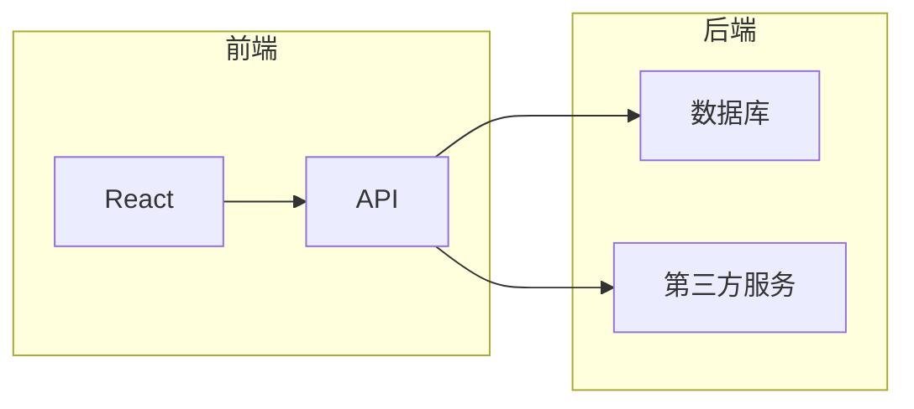

## 1. 背景介绍

### 1.1 城市公交系统的重要性

城市公交系统是城市公共交通的重要组成部分，它承担着城市居民日常出行的主要责任。随着城市化进程的加速，城市人口不断增长，交通压力日益增大，高效、便捷、舒适的城市公交系统对于缓解交通拥堵、改善城市环境、提高居民生活质量具有重要意义。

### 1.2 公交查询系统的现状与不足

传统的公交查询方式主要依靠站牌、公交线路图、电话咨询等方式，存在着信息不及时、查询效率低、用户体验差等问题。随着移动互联网和智能手机的普及，基于移动端的公交查询系统应运而生，但现有的公交查询系统仍存在一些不足：

* **数据更新不及时：**公交线路、站点信息变更后，系统未能及时更新，导致用户查询结果不准确。
* **功能单一：**仅提供简单的线路查询、站点查询等功能，缺乏个性化、智能化的服务。
* **用户体验不佳：**界面设计不够友好，操作流程复杂，用户难以快速找到所需信息。

### 1.3 本文研究目的

为了解决上述问题，本文设计并实现了一款功能完善、用户体验良好的城市公交查询系统。该系统旨在为用户提供实时、准确、便捷的公交信息查询服务，提升用户出行效率和体验。

## 2. 核心概念与联系

### 2.1 核心概念

* **公交线路：**连接多个公交站点的路线，具有方向性。
* **公交站点：**公交线路上的停靠点，供乘客上下车。
* **换乘：**在不同公交线路之间进行转换，以到达目的地。
* **实时数据：**公交车辆的实时位置、到站时间等信息。
* **路径规划：**根据用户指定的起点和终点，计算出最佳乘车路线。

### 2.2 概念之间的联系

* 公交线路由多个公交站点组成，公交站点是公交线路的节点。
* 换乘需要在两个或多个公交线路之间进行，通过换乘可以到达更多目的地。
* 实时数据是实现公交查询系统核心功能的基础，可以为用户提供准确、及时的公交信息。
* 路径规划算法依赖于公交线路、站点、换乘等信息，以及实时数据，才能计算出最佳乘车路线。

## 3. 核心算法原理具体操作步骤

### 3.1 数据获取与处理

#### 3.1.1 数据来源

* **公交公司官方数据：**包括公交线路、站点、时刻表等静态数据，以及公交车辆实时位置、到站时间等动态数据。
* **第三方地图服务：**获取地图数据、POI数据等，用于辅助公交查询和路径规划。

#### 3.1.2 数据处理

* **数据清洗：**去除数据中的错误、冗余信息，保证数据准确性。
* **数据格式转换：**将不同来源的数据转换为统一的格式，方便系统处理和使用。
* **数据存储：**将处理后的数据存储到数据库中，以便快速查询和更新。

### 3.2 路径规划算法

#### 3.2.1 Dijkstra算法

Dijkstra算法是一种经典的最短路径算法，可以用于计算公交网络中任意两点之间的最短路径。

**算法步骤：**

1. 将起点加入到已访问节点集合中。
2. 从起点出发，遍历所有未访问的邻接节点，计算起点到每个邻接节点的距离。
3. 选择距离最短的邻接节点，将其加入到已访问节点集合中。
4. 重复步骤2和3，直到找到终点为止。

#### 3.2.2 A*算法

A*算法是一种启发式搜索算法，它在Dijkstra算法的基础上引入了启发函数，可以更快地找到最优解。

**算法步骤：**

1. 将起点加入到开放列表中。
2. 从开放列表中选择代价最小的节点，将其加入到关闭列表中。
3. 遍历当前节点的所有邻接节点，计算每个邻接节点的代价。
4. 将未访问过的邻接节点加入到开放列表中。
5. 重复步骤2到4，直到找到终点为止。

### 3.3 实时数据更新

#### 3.3.1 定时更新

定期从公交公司官方数据接口获取最新数据，更新数据库中的实时数据。

#### 3.3.2 增量更新

只更新发生变化的数据，减少数据传输量和更新时间。

#### 3.3.3 消息推送

当公交车辆到站、线路变更等事件发生时，通过消息推送的方式及时通知用户。

## 4. 数学模型和公式详细讲解举例说明

### 4.1 公交网络模型

公交网络可以抽象成一个图，其中：

* 节点表示公交站点。
* 边表示公交线路，边的权重表示该线路的距离或时间成本。

### 4.2 Dijkstra算法公式

$$
d[v] = min{d[u] + w(u, v)}
$$

其中：

* $d[v]$ 表示起点到节点 $v$ 的最短距离。
* $d[u]$ 表示起点到节点 $u$ 的最短距离。
* $w(u, v)$ 表示节点 $u$ 到节点 $v$ 的边的权重。

### 4.3 A*算法公式

$$
f(n) = g(n) + h(n)
$$

其中：

* $f(n)$ 表示节点 $n$ 的总代价。
* $g(n)$ 表示起点到节点 $n$ 的实际代价。
* $h(n)$ 表示节点 $n$ 到终点的估计代价（启发函数）。

### 4.4 举例说明

假设公交网络如下：

```
graph LR
A((A)) -->|5| B((B))
A -->|3| C((C))
B -->|2| D((D))
C -->|4| D
```

**Dijkstra算法：**

计算起点A到终点D的最短路径：

1. 初始化 $d[A] = 0$，其他节点的距离为无穷大。
2. 从A出发，遍历邻接节点B和C，计算 $d[B] = 5$，$d[C] = 3$。
3. 选择距离最短的节点C，将其加入到已访问节点集合中。
4. 从C出发，遍历邻接节点D，计算 $d[D] = 7$。
5. 选择距离最短的节点D，将其加入到已访问节点集合中。
6. 找到终点D，最短路径为A -> C -> D，距离为7。

**A*算法：**

假设启发函数 $h(n)$ 为节点 $n$ 到终点D的直线距离：

```
h(A) = 5
h(B) = 3
h(C) = 2
h(D) = 0
```

计算起点A到终点D的最短路径：

1. 初始化开放列表为 {A}，关闭列表为空。
2. 从开放列表中选择代价最小的节点A，将其加入到关闭列表中。
3. 遍历A的邻接节点B和C，计算 $f(B) = 5 + 3 = 8$，$f(C) = 3 + 2 = 5$。
4. 将B和C加入到开放列表中。
5. 从开放列表中选择代价最小的节点C，将其加入到关闭列表中。
6. 遍历C的邻接节点D，计算 $f(D) = 7 + 0 = 7$。
7. 将D加入到开放列表中。
8. 从开放列表中选择代价最小的节点D，将其加入到关闭列表中。
9. 找到终点D，最短路径为A -> C -> D，距离为7。

## 5. 项目实践：代码实例和详细解释说明

### 5.1 系统架构

本系统采用前后端分离的架构，前端使用 React 框架，后端使用 Python 的 Flask 框架。



### 5.2 代码实例

#### 5.2.1 后端代码

```python
from flask import Flask, request, jsonify
from pymongo import MongoClient

app = Flask(__name__)

# 连接MongoDB数据库
client = MongoClient('mongodb://localhost:27017/')
db = client['bus_system']

@app.route('/api/search', methods=['GET'])
def search():
    """
    公交线路查询接口
    """
    start = request.args.get('start')
    end = request.args.get('end')

    # 查询数据库，获取匹配的公交线路
    # ...

    return jsonify(result)

if __name__ == '__main__':
    app.run(debug=True)
```

#### 5.2.2 前端代码

```javascript
import React, { useState } from 'react';

function App() {
  const [start, setStart] = useState('');
  const [end, setEnd] = useState('');
  const [results, setResults] = useState([]);

  const handleSubmit = async (event) => {
    event.preventDefault();

    const response = await fetch(`/api/search?start=${start}&end=${end}`);
    const data = await response.json();

    setResults(data);
  };

  return (
    <div>
      <h1>城市公交查询系统</h1>
      <form onSubmit={handleSubmit}>
        <div>
          <label htmlFor="start">起点：</label>
          <input type="text" id="start" value={start} onChange={(e) => setStart(e.target.value)} />
        </div>
        <div>
          <label htmlFor="end">终点：</label>
          <input type="text" id="end" value={end} onChange={(e) => setEnd(e.target.value)} />
        </div>
        <button type="submit">查询</button>
      </form>
      <ul>
        {results.map((result) => (
          <li key={result.id}>{result.name}</li>
        ))}
      </ul>
    </div>
  );
}

export default App;
```

### 5.3 代码解释

* 后端代码使用 Flask 框架创建了一个 RESTful API，用于处理前端的查询请求。
* 前端代码使用 React 框架构建用户界面，通过调用后端 API 获取查询结果并展示给用户。

## 6. 实际应用场景

### 6.1 日常出行

用户可以使用该系统查询公交线路、站点信息、实时公交位置、到站时间等，方便用户规划出行路线，节省出行时间。

### 6.2 旅游出行

游客可以使用该系统查询景点附近的公交线路、站点信息，方便游客乘坐公交车前往景点游览。

### 6.3 城市管理

城市管理部门可以使用该系统监控公交车运行情况、客流量等数据，为城市交通规划提供数据支持。

## 7. 工具和资源推荐

### 7.1 开发工具

* **Python:** 后端开发语言
* **Flask:** Python Web框架
* **React:** 前端开发框架
* **MongoDB:** NoSQL数据库

### 7.2 数据资源

* **公交公司官方数据:** 公交线路、站点、时刻表等数据
* **高德地图API:** 地图数据、POI数据等

## 8. 总结：未来发展趋势与挑战

### 8.1 未来发展趋势

* **智能化:** 结合人工智能技术，提供更加个性化、智能化的公交查询服务，例如：智能推荐换乘方案、预测公交到站时间等。
* **多模式融合:** 将公交查询与其他出行方式（如地铁、出租车、共享单车等）进行融合，为用户提供一站式出行服务。
* **数据可视化:** 利用数据可视化技术，将公交运行数据、客流量等信息直观地展示出来，为城市交通管理提供决策支持。

### 8.2 面临的挑战

* **数据实时性:** 如何保证公交实时数据的准确性和及时性，是公交查询系统面临的一大挑战。
* **算法优化:** 随着城市规模的扩大和公交线路的增多，路径规划算法的效率和准确性需要不断优化。
* **用户体验:** 如何提升用户体验，提供更加便捷、易用、人性化的公交查询服务，也是需要不断探索和改进的方向。

## 9. 附录：常见问题与解答

### 9.1 查询结果不准确怎么办？

* 检查输入的起点和终点是否正确。
* 检查网络连接是否正常。
* 联系公交公司或系统管理员，反馈问题。

### 9.2 如何获取实时公交位置？

* 打开公交查询系统，输入要查询的公交线路。
* 在线路详情页面，可以查看该线路所有车辆的实时位置。

### 9.3 如何反馈问题或建议？

* 联系公交公司或系统管理员，反馈问题或建议。
* 在公交查询系统中查找反馈入口，提交问题或建议。
