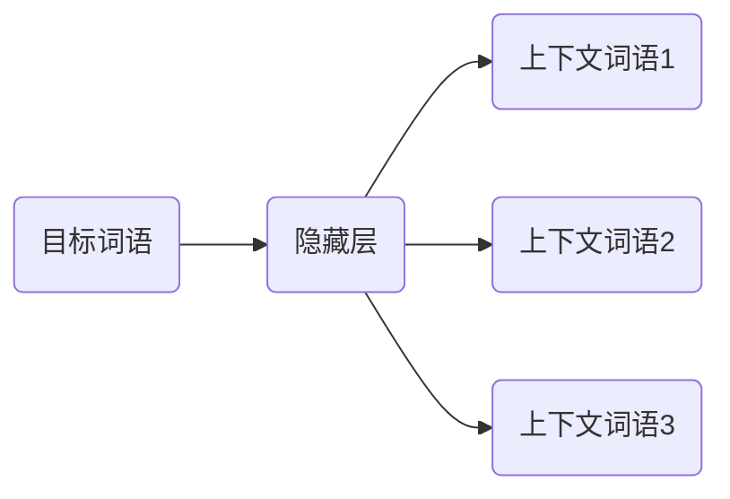

# 基于NPL的自然语言处理访问接口设计与实现

作者：禅与计算机程序设计艺术

## 1. 背景介绍

### 1.1 自然语言处理技术的兴起

近年来，随着互联网和移动互联网的快速发展，海量文本数据不断涌现，如何高效地处理和理解这些文本数据成为了一个重要的研究方向。自然语言处理（Natural Language Processing，NLP）技术作为人工智能领域的一个重要分支，旨在让计算机能够理解和处理人类语言，从而实现人机交互的智能化。

### 1.2 自然语言处理访问接口的需求

随着NLP技术的不断发展，越来越多的应用程序需要使用NLP功能，例如：

* **智能客服：**自动回答用户问题，提供在线咨询服务。
* **机器翻译：**将一种语言的文本翻译成另一种语言。
* **文本摘要：**从一篇长文本中提取出关键信息。
* **情感分析：**分析文本中表达的情感倾向。

为了方便开发者使用NLP功能，需要设计和实现通用的自然语言处理访问接口，将复杂的NLP技术封装起来，提供简单易用的API供开发者调用。

## 2. 核心概念与联系

### 2.1 自然语言处理流程

自然语言处理一般包括以下几个步骤：

1. **文本预处理：**对原始文本数据进行清洗、分词、词性标注等操作，为后续处理做准备。
2. **特征提取：**从文本数据中提取出能够表征文本语义的特征，例如词袋模型、TF-IDF、Word2Vec等。
3. **模型训练：**使用标注好的数据训练NLP模型，例如分类模型、序列标注模型等。
4. **模型预测：**使用训练好的模型对新的文本数据进行预测，例如文本分类、情感分析等。

### 2.2 自然语言处理访问接口的功能

自然语言处理访问接口需要提供以下功能：

1. **文本预处理：**提供分词、词性标注、命名实体识别等功能。
2. **特征提取：**提供词袋模型、TF-IDF、Word2Vec等特征提取方法。
3. **模型训练：**提供多种NLP模型的训练接口，例如分类模型、序列标注模型等。
4. **模型预测：**提供训练好的模型的预测接口，例如文本分类、情感分析等。

### 2.3 核心概念之间的联系

自然语言处理访问接口将自然语言处理流程中的各个步骤封装成API，开发者可以通过调用API实现不同的NLP功能，而不需要关心底层的技术细节。

## 3. 核心算法原理具体操作步骤

### 3.1 分词算法

分词是自然语言处理的第一步，将连续的文本序列切分成一个个独立的词语。常用的分词算法包括：

* **基于词典的分词：**根据预先构建好的词典进行匹配，将文本切分成词语。
* **基于统计的分词：**根据词语出现的频率、上下文信息等统计特征进行分词。
* **基于机器学习的分词：**使用机器学习模型进行分词，例如隐马尔可夫模型（HMM）、条件随机场（CRF）等。

#### 3.1.1 基于词典的分词算法

基于词典的分词算法的原理是：

1. 构建一个词典，包含常用的词语。
2. 从文本的开头开始，依次匹配词典中的词语。
3. 如果匹配成功，则将匹配到的词语作为一个词语。
4. 如果匹配失败，则将当前字符作为一个词语。

#### 3.1.2 基于统计的分词算法

基于统计的分词算法的原理是：

1. 统计文本中词语出现的频率、上下文信息等统计特征。
2. 根据统计特征计算词语之间的关联程度。
3. 将关联程度高的词语合并成一个词语。

#### 3.1.3 基于机器学习的分词算法

基于机器学习的分词算法的原理是：

1. 使用标注好的语料库训练机器学习模型，例如隐马尔可夫模型（HMM）、条件随机场（CRF）等。
2. 使用训练好的模型对新的文本进行分词。

### 3.2 词性标注算法

词性标注是为每个词语标注上对应的词性，例如名词、动词、形容词等。常用的词性标注算法包括：

* **基于规则的词性标注：**根据预先定义的规则进行词性标注。
* **基于统计的词性标注：**根据词语出现的频率、上下文信息等统计特征进行词性标注。
* **基于机器学习的词性标注：**使用机器学习模型进行词性标注，例如隐马尔可夫模型（HMM）、条件随机场（CRF）等。

#### 3.2.1 基于规则的词性标注算法

基于规则的词性标注算法的原理是：

1. 预先定义一组规则，例如“以'ly'结尾的词语是副词”。
2. 根据规则对词语进行词性标注。

#### 3.2.2 基于统计的词性标注算法

基于统计的词性标注算法的原理是：

1. 统计文本中词语出现的频率、上下文信息等统计特征。
2. 根据统计特征计算词语的词性概率。
3. 选择词性概率最高的词性作为词语的词性。

#### 3.2.3 基于机器学习的词性标注算法

基于机器学习的词性标注算法的原理是：

1. 使用标注好的语料库训练机器学习模型，例如隐马尔可夫模型（HMM）、条件随机场（CRF）等。
2. 使用训练好的模型对新的文本进行词性标注。

## 4. 数学模型和公式详细讲解举例说明

### 4.1 TF-IDF算法

TF-IDF（Term Frequency-Inverse Document Frequency）是一种用于信息检索与数据挖掘的常用加权技术。它是一种统计方法，用以评估一字词对于一个文件集或一个语料库中的其中一份文件的重要程度。字词的重要性随着它在文件中出现的次数成正比增加，但同时会随着它在语料库中出现的频率成反比下降。

#### 4.1.1 TF-IDF公式

$$
\text{TF-IDF}(t, d, D) = \text{TF}(t, d) \cdot \text{IDF}(t, D)
$$

其中：

* $t$ 表示词语。
* $d$ 表示文档。
* $D$ 表示文档集。

#### 4.1.2 词频（TF）

词频（Term Frequency，TF）是指词语 $t$ 在文档 $d$ 中出现的频率。

$$
\text{TF}(t, d) = \frac{f_{t, d}}{\sum_{t' \in d} f_{t', d}}
$$

其中：

* $f_{t, d}$ 表示词语 $t$ 在文档 $d$ 中出现的次数。

#### 4.1.3 逆文档频率（IDF）

逆文档频率（Inverse Document Frequency，IDF）衡量一个词语在文档集中普遍程度。

$$
\text{IDF}(t, D) = \log \frac{|D|}{|\{d \in D : t \in d\}|}
$$

其中：

* $|D|$ 表示文档集 $D$ 中的文档总数。
* $|\{d \in D : t \in d\}|$ 表示包含词语 $t$ 的文档数量。

#### 4.1.4 TF-IDF举例说明

假设我们有一个包含以下三篇文档的文档集：

* 文档1：我喜欢自然语言处理。
* 文档2：我喜欢机器学习。
* 文档3：我喜欢深度学习。

现在我们想要计算词语“自然语言处理”在文档1中的TF-IDF值。

首先计算词频：

$$
\text{TF}("自然语言处理", 文档1) = \frac{1}{4} = 0.25
$$

然后计算逆文档频率：

$$
\text{IDF}("自然语言处理", 文档集) = \log \frac{3}{1} = 1.0986
$$

最后计算TF-IDF值：

$$
\text{TF-IDF}("自然语言处理", 文档1, 文档集) = 0.25 \times 1.0986 = 0.2747
$$

### 4.2 Word2Vec算法

Word2Vec是一种用于学习词嵌入的模型。它将词语映射到向量空间中，使得语义相似的词语在向量空间中距离更近。

#### 4.2.1 Word2Vec模型结构

Word2Vec模型有两种结构：

* **CBOW（Continuous Bag-of-Words）：**使用上下文词语预测目标词语。
* **Skip-gram：**使用目标词语预测上下文词语。

#### 4.2.2 CBOW模型

CBOW模型的结构如下图所示：


CBOW模型的输入是目标词语的上下文词语，输出是目标词语的概率分布。

#### 4.2.3 Skip-gram模型

Skip-gram模型的结构如下图所示：



Skip-gram模型的输入是目标词语，输出是目标词语的上下文词语的概率分布。

## 5. 项目实践：代码实例和详细解释说明

### 5.1 Python代码实现

```python
import jieba
from sklearn.feature_extraction.text import TfidfVectorizer
from gensim.models import Word2Vec

# 分词
text = "我喜欢自然语言处理。"
words = jieba.lcut(text)
print(words)

# TF-IDF
corpus = [
    "我喜欢自然语言处理。",
    "我喜欢机器学习。",
    "我喜欢深度学习。",
]
vectorizer = TfidfVectorizer()
tfidf = vectorizer.fit_transform(corpus)
print(tfidf)

# Word2Vec
sentences = [
    ["我", "喜欢", "自然语言处理"],
    ["我", "喜欢", "机器学习"],
    ["我", "喜欢", "深度学习"],
]
model = Word2Vec(sentences, min_count=1)
print(model.wv["自然语言处理"])
```

### 5.2 代码解释说明

#### 5.2.1 分词代码

```python
import jieba

# 分词
text = "我喜欢自然语言处理。"
words = jieba.lcut(text)
print(words)
```

这段代码使用jieba库对文本进行分词，并将分词结果打印出来。

#### 5.2.2 TF-IDF代码

```python
from sklearn.feature_extraction.text import TfidfVectorizer

# TF-IDF
corpus = [
    "我喜欢自然语言处理。",
    "我喜欢机器学习。",
    "我喜欢深度学习。",
]
vectorizer = TfidfVectorizer()
tfidf = vectorizer.fit_transform(corpus)
print(tfidf)
```

这段代码使用sklearn库中的TfidfVectorizer类计算语料库中每个词语的TF-IDF值，并将结果打印出来。

#### 5.2.3 Word2Vec代码

```python
from gensim.models import Word2Vec

# Word2Vec
sentences = [
    ["我", "喜欢", "自然语言处理"],
    ["我", "喜欢", "机器学习"],
    ["我", "喜欢", "深度学习"],
]
model = Word2Vec(sentences, min_count=1)
print(model.wv["自然语言处理"])
```

这段代码使用gensim库中的Word2Vec类训练词向量模型，并打印词语“自然语言处理”对应的词向量。

## 6. 实际应用场景

自然语言处理访问接口可以应用于各种实际场景，例如：

* **智能客服：**自动回答用户问题，提供在线咨询服务。
* **机器翻译：**将一种语言的文本翻译成另一种语言。
* **文本摘要：**从一篇长文本中提取出关键信息。
* **情感分析：**分析文本中表达的情感倾向。
* **舆情监测：**监测网络舆情，识别负面信息。
* **推荐系统：**根据用户的兴趣爱好推荐相关的内容。

## 7. 工具和资源推荐

* **jieba：**一款优秀的中文分词工具。
* **Stanford CoreNLP：**斯坦福大学开发的一款自然语言处理工具包，提供了分词、词性标注、命名实体识别等功能。
* **NLTK：**一款Python自然语言处理工具包，提供了分词、词性标注、命名实体识别等功能。
* **SpaCy：**一款快速、高效的自然语言处理工具包，提供了分词、词性标注、命名实体识别等功能。
* **Gensim：**一款Python主题模型和词嵌入工具包，提供了Word2Vec、Doc2Vec等模型。

## 8. 总结：未来发展趋势与挑战

### 8.1 未来发展趋势

* **深度学习与自然语言处理的结合：**深度学习技术在自然语言处理领域取得了显著成果，未来将继续推动自然语言处理技术的发展。
* **跨语言自然语言处理：**随着全球化的发展，跨语言自然语言处理技术将变得越来越重要。
* **自然语言处理与其他技术的融合：**自然语言处理技术将与其他技术，例如图像识别、语音识别等技术融合，创造出更加智能的应用。

### 8.2 面临的挑战

* **数据稀疏性：**自然语言处理任务通常需要大量的标注数据，而标注数据的获取成本很高。
* **模型可解释性：**深度学习模型通常是一个黑盒，难以解释其预测结果。
* **伦理问题：**自然语言处理技术的发展也带来了一些伦理问题，例如隐私保护、算法歧视等。

## 9. 附录：常见问题与解答

### 9.1 如何选择合适的自然语言处理工具？

选择合适的自然语言处理工具需要考虑以下因素：

* **功能需求：**不同的工具包提供不同的功能，需要根据实际需求选择合适的工具包。
* **性能要求：**不同的工具包性能差异较大，需要根据实际需求选择性能满足要求的工具包。
* **易用性：**不同的工具包易用性不同，需要根据自身的技术水平选择易于使用的工具包。

### 9.2 如何评估自然语言处理模型的性能？

评估自然语言处理模型的性能可以使用以下指标：

* **准确率：**模型预测正确的样本数占总样本数的比例。
* **召回率：**模型预测正确的正样本数占所有正样本数的比例。
* **F1值：**准确率和召回率的调和平均数。

### 9.3 如何解决数据稀疏性问题？

解决数据稀疏性问题可以采用以下方法：

* **数据增强：**通过对现有数据进行变换，例如同义词替换、句子改写等，增加训练数据的规模。
* **迁移学习：**使用预先训练好的模型，例如BERT、GPT-3等，对目标任务进行微调。
* **半监督学习：**使用少量标注数据和大量未标注数据进行模型训练。