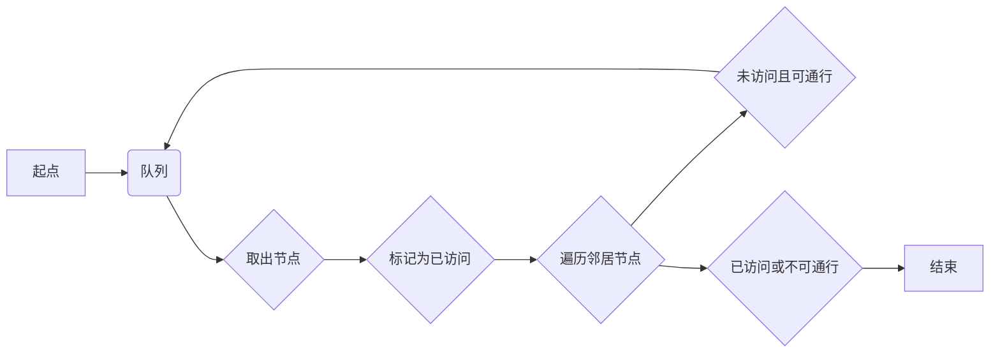
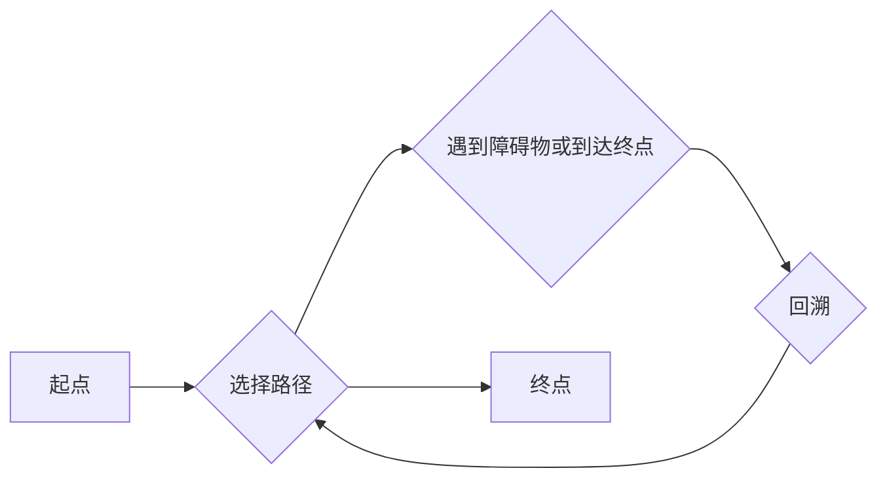

# 基于STM32的全尺寸智能电脑鼠设计与实现

作者：禅与计算机程序设计艺术

## 1. 背景介绍

### 1.1 微型迷宫探索机器人的发展历程

微型迷宫探索机器人，俗称“电脑鼠”，是一种能够自主地在迷宫中寻找路径并完成特定任务的智能机器人。自20世纪70年代末诞生以来，电脑鼠技术经历了从简单到复杂、从单一功能到多功能的快速发展。早期的电脑鼠主要依靠机械结构和简单的逻辑电路实现迷宫探索，而现代电脑鼠则集成了先进的传感器、嵌入式系统、人工智能算法等技术，具备了更高的智能化水平和更强的环境适应能力。

### 1.2 全尺寸电脑鼠的优势与挑战

全尺寸电脑鼠是指尺寸较大、功能更强大的电脑鼠，相比于传统的微型电脑鼠，全尺寸电脑鼠拥有更宽广的视野、更高的承载能力和更丰富的扩展接口，能够完成更复杂的任务，例如：

* **更精准的迷宫建模：**全尺寸电脑鼠可以搭载更高精度的传感器，例如激光雷达、深度摄像头等，实现更精准的迷宫环境感知和建模。
* **更灵活的运动控制：**更大的尺寸和更强的电机驱动能力使得全尺寸电脑鼠能够实现更灵活的运动控制，例如高速转弯、爬坡等。
* **更丰富的功能扩展：**全尺寸电脑鼠拥有更多的扩展接口，可以集成更多的传感器和执行器，例如机械臂、摄像头云台等，实现更丰富的功能扩展。

然而，全尺寸电脑鼠的设计和实现也面临着更大的挑战，例如：

* **更高的功耗：**更大的尺寸和更强的电机驱动能力会导致更高的功耗，需要采用更高效的电源管理方案。
* **更复杂的算法：**更丰富的功能和更灵活的运动控制需要更复杂的算法支持，例如路径规划、运动控制、传感器融合等。
* **更高的成本：**更大的尺寸和更强的硬件配置会导致更高的成本。

### 1.3 本文研究内容概述

本文将介绍基于STM32微控制器的全尺寸智能电脑鼠的设计与实现，重点阐述以下内容：

* **硬件平台搭建：**介绍全尺寸电脑鼠的硬件平台，包括STM32微控制器、电机驱动模块、传感器模块、电源管理模块等。
* **软件系统设计：**介绍全尺寸电脑鼠的软件系统，包括迷宫探索算法、运动控制算法、传感器数据处理算法等。
* **系统集成与测试：**介绍全尺寸电脑鼠的系统集成和测试方法，以及实验结果分析。

## 2. 核心概念与联系

### 2.1 电脑鼠的基本组成

电脑鼠通常由以下几个核心部分组成：

* **微控制器：**电脑鼠的大脑，负责控制整个系统的运行。
* **传感器：**用于感知迷宫环境信息，例如距离、颜色、光线等。
* **电机驱动模块：**控制电机转动，驱动电脑鼠移动。
* **电源管理模块：**为电脑鼠提供稳定的电源。

### 2.2 迷宫探索算法

迷宫探索算法是电脑鼠的核心算法，其目的是让电脑鼠能够自主地在迷宫中找到最短路径。常见的迷宫探索算法包括：

* **洪水填充算法：**从起点开始，逐层向外扩展，直到找到终点。
* **深度优先搜索算法：**沿着一条路径一直走，直到遇到障碍物或到达终点，然后回溯到上一个岔路口，选择另一条路径继续探索。
* **广度优先搜索算法：**从起点开始，逐层扩展，每次扩展一层，直到找到终点。

### 2.3 运动控制算法

运动控制算法负责控制电脑鼠的移动，使其能够按照预定的路径行驶。常见的运动控制算法包括：

* **PID控制算法：**通过不断调整电机转速，使电脑鼠能够沿着预定的路径行驶。
* **模糊控制算法：**根据传感器数据和预设的规则，控制电脑鼠的移动方向和速度。

### 2.4 核心概念之间的联系

电脑鼠的各个核心部分之间相互联系，共同完成迷宫探索任务。微控制器通过传感器获取迷宫环境信息，并根据迷宫探索算法计算出最短路径，然后通过运动控制算法控制电机驱动模块，驱动电脑鼠按照预定的路径行驶。

## 3. 核心算法原理具体操作步骤

### 3.1 洪水填充算法

#### 3.1.1 算法原理

洪水填充算法是一种基于图论的搜索算法，其基本思想是从起点开始，逐层向外扩展，直到找到终点。

#### 3.1.2 具体操作步骤

1. 将起点加入队列。
2. 从队列中取出一个节点，将其标记为已访问。
3. 遍历该节点的所有邻居节点，如果邻居节点未被访问且可通行，则将其加入队列。
4. 重复步骤2和3，直到队列为空或找到终点。

#### 3.1.3 算法流程图



### 3.2 深度优先搜索算法

#### 3.2.1 算法原理

深度优先搜索算法是一种基于递归的搜索算法，其基本思想是沿着一条路径一直走，直到遇到障碍物或到达终点，然后回溯到上一个岔路口，选择另一条路径继续探索。

#### 3.2.2 具体操作步骤

1. 从起点开始，选择一条路径前进。
2. 如果遇到障碍物或到达终点，则回溯到上一个岔路口。
3. 选择另一条路径继续前进。
4. 重复步骤2和3，直到找到终点。

#### 3.2.3 算法流程图



### 3.3 广度优先搜索算法

#### 3.3.1 算法原理

广度优先搜索算法是一种基于队列的搜索算法，其基本思想是从起点开始，逐层扩展，每次扩展一层，直到找到终点。

#### 3.3.2 具体操作步骤

1. 将起点加入队列。
2. 从队列中取出一个节点，将其标记为已访问。
3. 遍历该节点的所有邻居节点，如果邻居节点未被访问且可通行，则将其加入队列。
4. 重复步骤2和3，直到队列为空或找到终点。

#### 3.3.3 算法流程图


## 4. 数学模型和公式详细讲解举例说明

### 4.1 迷宫建模

迷宫可以用一个二维数组来表示，数组中的每个元素代表迷宫中的一个单元格。单元格的值可以表示该单元格的状态，例如：

* 0：空地
* 1：墙壁
* 2：起点
* 3：终点

例如，一个 5x5 的迷宫可以表示为：

```
int maze[5][5] = {
    {1, 1, 1, 1, 1},
    {1, 0, 0, 0, 1},
    {1, 0, 1, 0, 1},
    {1, 0, 0, 0, 1},
    {1, 1, 1, 1, 1}
};
```

其中，`maze[0][0]` 表示迷宫左上角的单元格，`maze[4][4]` 表示迷宫右下角的单元格。

### 4.2 路径规划

路径规划是指根据迷宫地图和起点、终点，计算出电脑鼠从起点到终点的最短路径。路径规划算法可以采用前面介绍的迷宫探索算法。

### 4.3 运动控制

#### 4.3.1 PID控制算法

PID控制算法是一种经典的控制算法，其基本思想是根据误差信号，不断调整控制量，使系统输出达到预期值。

PID控制算法的公式如下：

$$
u(t) = K_p e(t) + K_i \int_0^t e(\tau) d\tau + K_d \frac{de(t)}{dt}
$$

其中：

* $u(t)$ 为控制量
* $e(t)$ 为误差信号
* $K_p$ 为比例系数
* $K_i$ 为积分系数
* $K_d$ 为微分系数

#### 4.3.2 模糊控制算法

模糊控制算法是一种基于模糊逻辑的控制算法，其基本思想是根据传感器数据和预设的规则，控制电脑鼠的移动方向和速度。

模糊控制算法的步骤如下：

1. 将传感器数据转换为模糊语言变量。
2. 根据模糊规则，计算出控制量。
3. 将控制量转换为电机控制信号。

## 5. 项目实践：代码实例和详细解释说明

### 5.1 硬件平台

本项目采用STM32F103C8T6微控制器作为主控芯片，电机驱动模块采用L298N，传感器模块包括超声波传感器、红外传感器、编码器等，电源管理模块采用LM2596。

### 5.2 软件系统

软件系统采用C语言开发，主要包括以下模块：

* **主程序模块：**负责初始化硬件、调用其他模块、控制程序流程等。
* **迷宫探索模块：**实现迷宫探索算法，计算出电脑鼠的最短路径。
* **运动控制模块：**实现运动控制算法，控制电脑鼠的移动。
* **传感器数据处理模块：**处理传感器数据，为迷宫探索和运动控制提供信息。

### 5.3 代码实例

#### 5.3.1 主程序模块

```c
#include "stm32f10x.h"

int main(void)
{
    // 初始化硬件
    init_hardware();

    // 进入主循环
    while (1)
    {
        // 获取传感器数据
        get_sensor_data();

        // 迷宫探索
        maze_exploration();

        // 运动控制
        motion_control();
    }
}
```

#### 5.3.2 迷宫探索模块

```c
#include "maze_exploration.h"

void maze_exploration(void)
{
    // 采用洪水填充算法进行迷宫探索
    flood_fill();

    // 计算最短路径
    calculate_shortest_path();
}
```

#### 5.3.3 运动控制模块

```c
#include "motion_control.h"

void motion_control(void)
{
    // 采用PID控制算法控制电机转速
    pid_control();
}
```

## 6. 实际应用场景

全尺寸智能电脑鼠可以应用于以下场景：

* **教育科研：**用于机器人教学、算法研究、竞赛等。
* **物流仓储：**用于货物搬运、仓库巡检等。
* **安防巡逻：**用于安防巡逻、区域监控等。

## 7. 工具和资源推荐

* **STM32CubeMX：**STM32微控制器配置工具。
* **Keil MDK：**STM32微控制器开发环境。
* **Arduino IDE：**开源硬件开发平台。
* **ROS：**机器人操作系统。

## 8. 总结：未来发展趋势与挑战

全尺寸智能电脑鼠技术发展迅速，未来将朝着以下方向发展：

* **更高的智能化水平：**集成更先进的人工智能算法，实现更自主的迷宫探索和任务执行。
* **更丰富的功能扩展：**集成更多的传感器和执行器，实现更复杂的任务。
* **更低的成本：**采用更低成本的硬件平台和更优化的算法，降低电脑鼠的成本。

全尺寸智能电脑鼠的设计和实现仍然面临着一些挑战：

* **更高的功耗：**需要采用更高效的电源管理方案。
* **更复杂的算法：**需要更复杂的算法支持。
* **更高的成本：**需要降低硬件成本和算法复杂度。

## 9. 附录：常见问题与解答

### 9.1 电脑鼠无法启动

* 检查电源是否正常连接。
* 检查电机驱动模块是否正常工作。
* 检查程序是否正确烧录。

### 9.2 电脑鼠无法正常行驶

* 检查传感器是否正常工作。
* 检查电机驱动模块是否正常工作。
* 检查运动控制算法参数是否设置正确。

### 9.3 电脑鼠无法找到最短路径

* 检查迷宫地图是否正确。
* 检查迷宫探索算法参数是否设置正确。
* 检查传感器数据是否准确。
