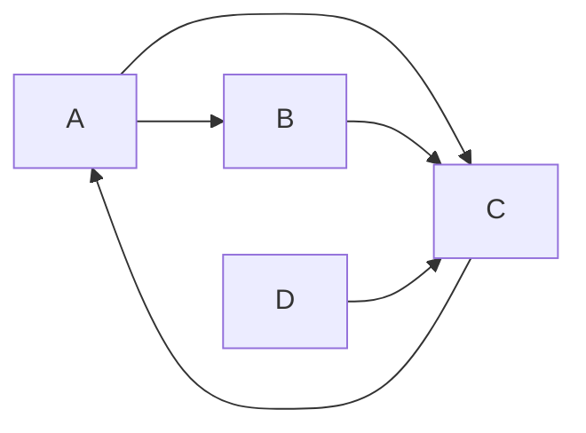

## 1. 背景介绍

### 1.1.  推荐系统的意义

在信息爆炸的时代，人们面对海量的数据往往无所适从。推荐系统应运而生，它能够根据用户的历史行为、兴趣偏好等信息，主动为用户推荐其可能感兴趣的内容，从而帮助用户快速找到所需信息，提升用户体验。

### 1.2.  实时推荐系统的挑战

传统的推荐系统通常采用离线批处理的方式进行推荐，即根据用户过去一段时间内的行为数据进行模型训练，然后将训练好的模型应用于线上环境进行推荐。这种方式存在以下缺点：

* **实时性不足**: 无法及时捕捉用户的最新兴趣变化，导致推荐结果滞后。
* **数据稀疏**: 新用户和冷启动物品缺乏历史数据，难以进行有效的推荐。
* **可扩展性差**: 随着用户和物品数量的增加，计算量和存储空间急剧膨胀。

为了克服这些问题，实时推荐系统逐渐成为研究热点。实时推荐系统能够实时捕捉用户的行为，并根据用户的最新兴趣变化进行推荐，从而提高推荐的及时性和准确性。

### 1.3.  TinkerPop图数据库的优势

TinkerPop是一个用于访问、存储和管理图数据的开源框架，它提供了一套标准的API和查询语言，可以方便地进行图数据的操作。相比于关系型数据库，图数据库更加适合处理关系型数据，例如社交网络、知识图谱、推荐系统等。

在实时推荐系统中，TinkerPop图数据库具有以下优势：

* **高性能**: 图数据库能够高效地存储和查询图数据，满足实时推荐系统对性能的要求。
* **灵活性**: 图数据库可以灵活地建模各种复杂的关系，例如用户-物品关系、用户-用户关系等，从而支持更加个性化的推荐。
* **可扩展性**: 图数据库可以方便地进行水平扩展，以应对不断增长的数据量和用户请求。

## 2. 核心概念与联系

### 2.1.  图数据库基本概念

* **顶点（Vertex）**: 表示现实世界中的实体，例如用户、物品、标签等。
* **边（Edge）**: 表示顶点之间的关系，例如用户购买了物品、用户关注了用户等。
* **属性（Property）**: 用于描述顶点或边的特征，例如用户的年龄、物品的价格等。

### 2.2.  推荐系统核心概念

* **用户画像**: 描述用户的特征和偏好，例如用户的年龄、性别、兴趣标签等。
* **物品画像**: 描述物品的特征，例如物品的类别、标签、描述等。
* **推荐算法**: 根据用户画像和物品画像，计算用户对物品的兴趣度，并进行排序推荐。

### 2.3.  概念联系

在基于TinkerPop的实时推荐系统中，我们可以将用户和物品作为图数据库中的顶点，将用户与物品之间的交互行为（例如浏览、购买、收藏等）作为边，将用户的特征和物品的特征作为属性。通过对图数据的分析和挖掘，我们可以构建用户画像和物品画像，并利用推荐算法进行实时推荐。

## 3. 核心算法原理具体操作步骤

### 3.1.  数据预处理

* **数据清洗**: 对原始数据进行清洗，去除无效数据和重复数据。
* **数据转换**: 将原始数据转换为图数据库可以处理的格式，例如将用户和物品转换为顶点，将用户行为转换为边。
* **特征提取**: 从用户和物品的数据中提取特征，例如用户的年龄、性别、兴趣标签，物品的类别、标签、描述等。

### 3.2.  图谱构建

* **创建顶点**: 将用户和物品创建为图数据库中的顶点。
* **创建边**: 根据用户与物品之间的交互行为，创建相应的边。
* **设置属性**: 为顶点和边设置相应的属性。

### 3.3.  实时推荐

* **实时数据采集**: 实时采集用户的行为数据，例如用户的浏览、购买、收藏等行为。
* **图谱更新**: 根据用户的实时行为，更新图数据库中的边和属性。
* **推荐算法**: 利用推荐算法，根据用户的最新兴趣变化进行实时推荐。

## 4. 数学模型和公式详细讲解举例说明

### 4.1.  协同过滤算法

协同过滤算法是一种常用的推荐算法，它基于用户之间的相似度或物品之间的相似度进行推荐。

* **基于用户的协同过滤**: 根据用户对物品的评分，计算用户之间的相似度，然后将相似用户喜欢的物品推荐给目标用户。
* **基于物品的协同过滤**: 根据用户对物品的评分，计算物品之间的相似度，然后将相似物品推荐给喜欢目标物品的用户。

#### 4.1.1.  余弦相似度

余弦相似度是一种常用的计算相似度的方法，它计算两个向量之间的夹角余弦值，夹角越小，余弦值越大，表示两个向量越相似。

$$
\cos(\theta) = \frac{\mathbf{a} \cdot \mathbf{b}}{\|\mathbf{a}\| \|\mathbf{b}\|}
$$

其中，$\mathbf{a}$ 和 $\mathbf{b}$ 表示两个向量。

#### 4.1.2.  举例说明

假设有两个用户 A 和 B，他们对三个物品的评分如下表所示：

| 用户 | 物品1 | 物品2 | 物品3 |
|---|---|---|---|
| A | 5 | 3 | 4 |
| B | 4 | 2 | 3 |

我们可以将用户 A 和 B 的评分表示为向量：

$$
\mathbf{a} = (5, 3, 4)
$$

$$
\mathbf{b} = (4, 2, 3)
$$

则用户 A 和 B 之间的余弦相似度为：

$$
\cos(\theta) = \frac{5 \times 4 + 3 \times 2 + 4 \times 3}{\sqrt{5^2 + 3^2 + 4^2} \sqrt{4^2 + 2^2 + 3^2}} \approx 0.98
$$

### 4.2.  PageRank算法

PageRank算法是一种用于评估网页重要性的算法，它可以用于推荐系统中计算用户的兴趣度。

#### 4.2.1.  算法原理

PageRank算法基于以下两个假设：

* **数量假设**: 指向一个网页的入链越多，则该网页越重要。
* **质量假设**: 指向一个网页的网页越重要，则该网页越重要。

PageRank算法通过迭代计算每个网页的 PageRank 值，直到收敛为止。

#### 4.2.2.  公式

$$
PR(A) = (1 - d) + d \sum_{i=1}^{n} \frac{PR(T_i)}{C(T_i)}
$$

其中：

* $PR(A)$ 表示网页 A 的 PageRank 值。
* $d$ 表示阻尼系数，通常设置为 0.85。
* $T_i$ 表示指向网页 A 的网页。
* $C(T_i)$ 表示网页 $T_i$ 的出链数量。

#### 4.2.3.  举例说明

假设有四个网页 A、B、C、D，它们之间的链接关系如下图所示：



则网页 A 的 PageRank 值为：

$$
PR(A) = (1 - 0.85) + 0.85 \times (\frac{PR(C)}{1} + \frac{PR(D)}{1}) = 0.15 + 0.85 \times (PR(C) + PR(D))
$$

## 5. 项目实践：代码实例和详细解释说明

```python
from gremlin_python.structure.graph import Graph
from gremlin_python.process.graph_traversal import __
from gremlin_python.process.strategies import *
from gremlin_python.driver.driver_remote_connection import DriverRemoteConnection

# 连接到图数据库
graph = Graph()
connection = DriverRemoteConnection('ws://localhost:8182/gremlin', 'g')
g = graph.traversal().withRemote(connection)

# 创建用户顶点
g.addV('user').property('id', 1).property('name', 'Alice').next()
g.addV('user').property('id', 2).property('name', 'Bob').next()

# 创建物品顶点
g.addV('item').property('id', 101).property('name', 'Java编程思想').next()
g.addV('item').property('id', 102).property('name', 'Effective Java').next()

# 创建用户-物品边
g.V(1).addE('rated').to(g.V(101)).property('rating', 5).next()
g.V(1).addE('rated').to(g.V(102)).property('rating', 4).next()
g.V(2).addE('rated').to(g.V(101)).property('rating', 4).next()

# 查询用户推荐
recommendations = g.V(1).outE('rated').inV().dedup().values('name').toList()
print(recommendations)
```

**代码解释:**

1. 首先，我们使用 `gremlin_python` 库连接到图数据库。
2. 然后，我们创建用户顶点和物品顶点，并为它们设置属性。
3. 接着，我们根据用户对物品的评分，创建用户-物品边。
4. 最后，我们使用 `outE('rated').inV().dedup().values('name').toList()` 查询用户推荐。

## 6. 实际应用场景

* **电商平台**: 为用户推荐其可能感兴趣的商品。
* **社交网络**: 为用户推荐其可能感兴趣的好友或内容。
* **新闻网站**: 为用户推荐其可能感兴趣的新闻。
* **在线教育**: 为学生推荐其可能感兴趣的课程。

## 7. 总结：未来发展趋势与挑战

### 7.1.  未来发展趋势

* **更加个性化的推荐**: 随着人工智能技术的不断发展，未来的推荐系统将会更加智能化和个性化，能够根据用户的实时行为和上下文信息进行更加精准的推荐。
* **多模态推荐**: 未来的推荐系统将会融合多种数据源，例如文本、图片、视频等，进行多模态推荐，从而提高推荐的全面性和准确性。
* **跨平台推荐**: 未来的推荐系统将会打破平台之间的壁垒，进行跨平台推荐，从而为用户提供更加便捷的服务。

### 7.2.  挑战

* **数据安全和隐私保护**: 随着推荐系统收集的用户数据越来越多，数据安全和隐私保护问题日益突出。
* **冷启动问题**: 对于新用户和冷启动物品，如何进行有效的推荐仍然是一个挑战。
* **可解释性**: 如何解释推荐系统的推荐结果，提高用户的信任度，也是一个需要解决的问题。

## 8. 附录：常见问题与解答

### 8.1.  TinkerPop 支持哪些图数据库？

TinkerPop 支持多种图数据库，例如：

* **Neo4j**
* **JanusGraph**
* **Amazon Neptune**
* **OrientDB**
* **ArangoDB**

### 8.2.  如何选择合适的推荐算法？

选择合适的推荐算法需要考虑多个因素，例如：

* **数据集大小和特征**
* **推荐目标**
* **实时性要求**
* **可解释性要求**

### 8.3.  如何评估推荐系统的性能？

常用的推荐系统评估指标包括：

* **准确率**: 推荐列表中用户真正感兴趣的物品所占的比例。
* **召回率**: 用户真正感兴趣的物品中被推荐出来的比例.
* **F1 值**: 准确率和召回率的调和平均数.
* **NDCG**:  衡量推荐列表排序质量的指标。