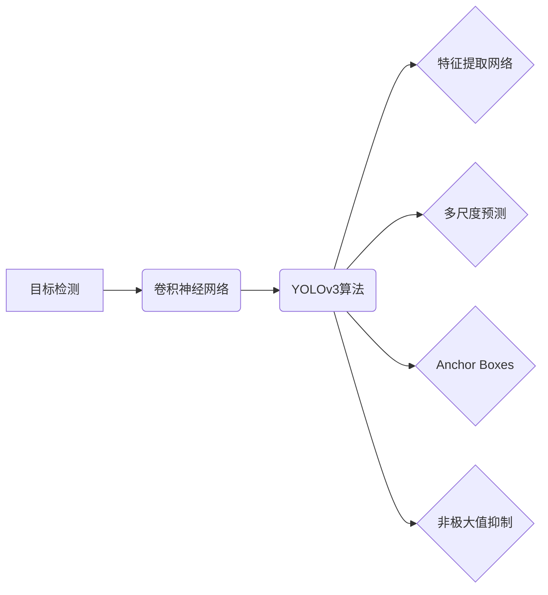

## 1. 背景介绍

### 1.1 施工安全事故频发，安全帽佩戴至关重要

近年来，随着我国建筑行业的快速发展，施工现场安全事故频发，其中高处坠落事故占比较大，而安全帽作为一种重要的个体防护装备，能够有效降低高处坠落事故造成的伤害。然而，在实际施工现场中，由于工人安全意识淡薄、监管不到位等原因，安全帽佩戴率普遍较低，安全隐患突出。

### 1.2 图像识别技术为安全帽佩戴检测提供新思路

传统的安全帽佩戴检测方法主要依靠人工巡检，效率低下且容易漏检。随着人工智能和计算机视觉技术的快速发展，基于图像识别的安全帽佩戴检测技术应运而生，为解决这一难题提供了新的思路。

### 1.3 YOLOv3算法简介

YOLOv3（You Only Look Once version 3）是一种快速、准确的目标检测算法，其在目标检测领域取得了显著的成果。与其他目标检测算法相比，YOLOv3具有以下优势：

* **速度快：** YOLOv3采用单阶段检测方法，能够实现实时目标检测。
* **精度高：** YOLOv3在保证速度的同时，检测精度也得到了很大提升。
* **泛化能力强：** YOLOv3对不同场景、不同目标的适应性较强。

基于以上优势，本文选择YOLOv3算法作为安全帽图像检测的核心算法。

## 2. 核心概念与联系

### 2.1 目标检测

目标检测是计算机视觉领域的一个重要研究方向，其目的是识别图像或视频中所有感兴趣的目标，并确定它们的位置和类别。目标检测是许多其他计算机视觉任务的基础，例如图像分类、目标跟踪、图像分割等。

### 2.2 卷积神经网络

卷积神经网络（Convolutional Neural Network，CNN）是一种专门用于处理图像数据的深度学习模型。CNN通过卷积层、池化层、全连接层等结构，能够自动提取图像的特征，并进行分类或回归等任务。

### 2.3 YOLOv3算法

YOLOv3算法是一种基于深度学习的目标检测算法，其核心思想是将目标检测问题转化为一个回归问题，直接预测目标的位置和类别。YOLOv3算法主要包含以下几个部分：

* **Darknet-53特征提取网络：** 用于提取图像的特征信息。
* **多尺度预测：** 在不同尺度的特征图上进行目标预测，以提高对不同大小目标的检测精度。
* **Anchor Boxes：** 预先定义一些不同形状和大小的边界框，用于辅助目标位置的预测。
* **非极大值抑制：** 用于去除重复的检测结果。

### 2.4 核心概念联系图



## 3. 核心算法原理具体操作步骤

### 3.1 数据集准备

#### 3.1.1 数据集收集

收集包含安全帽和人员的图像数据，可以使用公开数据集或自行采集。

#### 3.1.2 数据集标注

使用标注工具对数据集进行标注，标注出图像中安全帽的位置和类别。

#### 3.1.3 数据集划分

将数据集划分为训练集、验证集和测试集，比例一般为8:1:1。

### 3.2 模型训练

#### 3.2.1 模型选择

选择预训练的YOLOv3模型作为基础模型，可以使用Darknet框架进行训练。

#### 3.2.2 参数设置

设置训练参数，例如学习率、迭代次数、批大小等。

#### 3.2.3 模型训练

使用训练集对模型进行训练，并使用验证集进行评估。

### 3.3 模型评估

#### 3.3.1 评估指标

使用精确率、召回率、F1值等指标对模型进行评估。

#### 3.3.2 模型优化

根据评估结果对模型进行优化，例如调整参数、增加训练数据等。

### 3.4 模型部署

#### 3.4.1 模型转换

将训练好的模型转换为可部署的格式，例如ONNX、TensorRT等。

#### 3.4.2 部署平台

选择合适的部署平台，例如服务器、嵌入式设备等。

#### 3.4.3 模型部署

将模型部署到目标平台上，并进行测试。

## 4. 数学模型和公式详细讲解举例说明

### 4.1  YOLOv3网络结构

YOLOv3的网络结构主要由Darknet-53特征提取网络、多尺度预测模块和输出层组成。

#### 4.1.1 Darknet-53特征提取网络

Darknet-53网络结构借鉴了ResNet的残差结构，共包含53个卷积层，其结构如下图所示：

```
[图片：Darknet-53网络结构图]
```

Darknet-53网络的特点是：

* 采用残差结构，解决了深层网络梯度消失的问题，使得网络更容易训练。
* 采用大量的 $3\times3$ 卷积核，减少了参数量，提高了计算效率。
* 采用步长为2的卷积代替池化层，避免了池化操作带来的信息损失。

#### 4.1.2 多尺度预测模块

YOLOv3在三个不同尺度的特征图上进行目标预测，分别对应 $13\times13$、$26\times26$、$52\times52$ 的网格，以提高对不同大小目标的检测精度。

#### 4.1.3 输出层

YOLOv3的输出层是一个 $N\times N\times [3*(4+1+C)]$ 的张量，其中 $N$ 为网格大小，$3$ 表示每个网格预测 $3$ 个边界框，$4$ 表示边界框的坐标信息（中心点坐标 $x$、$y$，宽度 $w$，高度 $h$），$1$ 表示目标置信度，$C$ 表示目标类别数。

### 4.2  损失函数

YOLOv3的损失函数由三部分组成：边界框损失、置信度损失和类别损失。

#### 4.2.1 边界框损失

边界框损失使用平方误差损失函数，计算预测边界框与真实边界框之间的误差。

$$
L_{box} = \sum_{i=0}^{S^2} \sum_{j=0}^B \mathbb{1}_{ij}^{obj} [(x_i - \hat{x}_i)^2 + (y_i - \hat{y}_i)^2 + (w_i - \hat{w}_i)^2 + (h_i - \hat{h}_i)^2]
$$

其中，$\mathbb{1}_{ij}^{obj}$ 表示第 $i$ 个网格的第 $j$ 个边界框是否负责预测目标。

#### 4.2.2 置信度损失

置信度损失使用二元交叉熵损失函数，计算预测置信度与真实置信度之间的误差。

$$
L_{conf} = -\sum_{i=0}^{S^2} \sum_{j=0}^B [\mathbb{1}_{ij}^{obj} log(\hat{c}_i) + (1 - \mathbb{1}_{ij}^{obj}) log(1 - \hat{c}_i)]
$$

#### 4.2.3 类别损失

类别损失使用多类别交叉熵损失函数，计算预测类别与真实类别之间的误差。

$$
L_{class} = -\sum_{i=0}^{S^2} \sum_{j=0}^B \mathbb{1}_{ij}^{obj} \sum_{c=1}^C p_i(c) log(\hat{p}_i(c))
$$

其中，$p_i(c)$ 表示真实类别，$\hat{p}_i(c)$ 表示预测类别。

### 4.3  非极大值抑制

YOLOv3使用非极大值抑制（Non-Maximum Suppression，NMS）算法来去除重复的检测结果。NMS算法的步骤如下：

1. 按照置信度得分对所有边界框进行排序。
2. 选择置信度得分最高的边界框作为基准框。
3. 计算其他边界框与基准框的交并比（Intersection over Union，IoU）。
4. 如果 IoU 大于预设阈值，则认为该边界框与基准框重复，将其删除。
5. 重复步骤2-4，直到所有边界框都被处理完毕。

## 5. 项目实践：代码实例和详细解释说明

### 5.1 环境搭建

#### 5.1.1 安装依赖库

```
pip install tensorflow-gpu==1.15.0
pip install opencv-python
pip install numpy
```

#### 5.1.2 下载预训练模型

从 Darknet 官网下载 YOLOv3 预训练模型。

### 5.2 代码实现

```python
import cv2
import numpy as np
import tensorflow as tf

# 加载 YOLOv3 模型
model = tf.keras.models.load_model('yolov3.h5')

# 加载类别名称
class_names = ['hat', 'person']

# 加载图像
image = cv2.imread('test.jpg')
image_height, image_width, _ = image.shape

# 图像预处理
image = cv2.resize(image, (416, 416))
image = image / 255.0
image = np.expand_dims(image, axis=0)

# 模型预测
predictions = model.predict(image)

# 解析预测结果
boxes = predictions[:, :, :4]
confidence = predictions[:, :, 4]
class_probs = predictions[:, :, 5:]

# 非极大值抑制
nms_boxes, nms_confidence, nms_classes = [], [], []
for i in range(len(class_names)):
    class_boxes = boxes[:, :, i]
    class_confidence = confidence[:, i]
    nms_indices = tf.image.non_max_suppression(
        class_boxes, class_confidence, max_output_size=100, iou_threshold=0.5
    )
    nms_boxes.append(tf.gather(class_boxes, nms_indices))
    nms_confidence.append(tf.gather(class_confidence, nms_indices))
    nms_classes.append(tf.ones_like(nms_confidence[-1]) * i)

nms_boxes = tf.concat(nms_boxes, axis=0)
nms_confidence = tf.concat(nms_confidence, axis=0)
nms_classes = tf.concat(nms_classes, axis=0)

# 绘制边界框
for i in range(len(nms_boxes)):
    box = nms_boxes[i]
    ymin, xmin, ymax, xmax = box
    ymin = int(ymin * image_height)
    xmin = int(xmin * image_width)
    ymax = int(ymax * image_height)
    xmax = int(xmax * image_width)

    cv2.rectangle(image, (xmin, ymin), (xmax, ymax), (0, 255, 0), 2)
    cv2.putText(
        image,
        class_names[int(nms_classes[i])] + ': ' + str(nms_confidence[i]),
        (xmin, ymin - 10),
        cv2.FONT_HERSHEY_SIMPLEX,
        0.5,
        (0, 255, 0),
        2,
    )

# 显示结果
cv2.imshow('Image', image)
cv2.waitKey(0)
cv2.destroyAllWindows()
```

### 5.3 代码解释

1. **加载 YOLOv3 模型和类别名称：** 使用 `tf.keras.models.load_model()` 函数加载预训练的 YOLOv3 模型，并定义类别名称列表。
2. **加载图像并进行预处理：** 使用 `cv2.imread()` 函数加载图像，并进行缩放、归一化等预处理操作。
3. **模型预测：** 使用 `model.predict()` 函数对预处理后的图像进行预测，得到边界框、置信度和类别概率等信息。
4. **非极大值抑制：** 使用 `tf.image.non_max_suppression()` 函数对预测结果进行非极大值抑制，去除重复的边界框。
5. **绘制边界框：** 遍历所有边界框，使用 `cv2.rectangle()` 函数绘制边界框，并使用 `cv2.putText()` 函数标注类别名称和置信度。
6. **显示结果：** 使用 `cv2.imshow()` 函数显示检测结果。

## 6. 实际应用场景

### 6.1 施工现场安全帽佩戴检测

* **实时监控：** 将摄像头安装在施工现场，实时检测工人是否佩戴安全帽，并对未佩戴安全帽的工人进行预警。
* **事后追溯：** 记录施工现场的视频数据，对发生安全事故时的情况进行回放，分析事故原因。

### 6.2 其他应用场景

* **交通安全：** 检测行人和骑车人是否佩戴头盔。
* **工业生产：** 检测工人是否佩戴安全帽、防护眼镜等防护用品。
* **公共场所安全：** 检测人员是否携带危险物品。

## 7. 工具和资源推荐

### 7.1 框架和工具

* **Darknet：** YOLOv3 算法的开源实现框架。
* **TensorFlow：** 开源机器学习平台，提供丰富的深度学习模型和工具。
* **OpenCV：** 开源计算机视觉库，提供图像处理和计算机视觉算法。
* **LabelImg：** 开源图像标注工具，用于制作目标检测数据集。

### 7.2 数据集

* **COCO 数据集：** 大规模目标检测、分割和字幕数据集。
* **Pascal VOC 数据集：** 常用的目标检测数据集。
* **ImageNet 数据集：** 大规模图像分类数据集。

## 8. 总结：未来发展趋势与挑战

### 8.1 未来发展趋势

* **更高精度、更快速度：** 随着深度学习技术的不断发展，未来将会出现更加精确、快速的安
全帽检测算法。
* **多模态融合：** 将图像、视频、传感器等多模态数据融合，提高安全帽检测的准确性和鲁棒性。
* **边缘计算：** 将安全帽检测算法部署到边缘设备上，实现实时、低延迟的检测。

### 8.2 面临挑战

* **复杂场景下的检测精度：** 光照变化、遮挡、姿态变化等复杂场景会影响安全帽检测的精度。
* **小目标检测：** 远距离、小尺寸的安全帽检测仍然是一个挑战。
* **模型轻量化：** 如何将安全帽检测模型部署到资源受限的设备上，是一个需要解决的问题。

## 9. 附录：常见问题与解答

### 9.1  YOLOv3算法的优缺点？

**优点：**

* 速度快，可以实现实时目标检测。
* 精度高，可以达到较高的检测精度。
* 泛化能力强，对不同场景、不同目标的适应性较强。

**缺点：**

* 对小目标的检测效果不如 Faster R-CNN 等算法。
* 对密集目标的检测效果不如 SSD 等算法。

### 9.2 如何提高安全帽检测的精度？

* **增加训练数据：** 使用更多、更丰富的训练数据可以提高模型的泛化能力。
* **数据增强：** 对训练数据进行旋转、缩放、裁剪等操作，可以扩充数据集，提高模型的鲁棒性。
* **模型优化：** 调整模型参数、使用更深的网络结构等，可以提高模型的精度。
* **多模型融合：** 将多个模型的预测结果进行融合，可以提高检测精度。

### 9.3 如何将安全帽检测算法部署到实际应用中？

* **选择合适的硬件平台：** 根据应用场景选择合适的硬件平台，例如服务器、嵌入式设备等。
* **模型转换和优化：** 将训练好的模型转换为可部署的格式，并进行优化，例如量化、剪枝等。
* **系统集成：** 将安全帽检测算法集成到现有的监控系统中。
