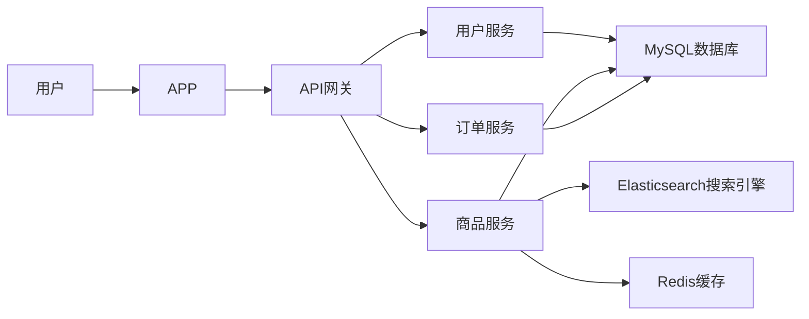

## 基于springboot的二手闲置交易平台系统

作者：禅与计算机程序设计艺术

## 1. 背景介绍

### 1.1 互联网+时代下的共享经济

随着互联网技术的快速发展和普及，共享经济模式蓬勃发展。从共享单车到共享充电宝，从共享办公空间到共享住宿，共享经济已经渗透到我们生活的方方面面。这种模式不仅提高了资源利用率，也为用户提供了更加便捷、经济的生活方式。

### 1.2 二手闲置交易市场的兴起

在共享经济浪潮的推动下，二手闲置交易市场也迎来了新的发展机遇。越来越多人意识到，家中闲置的物品不仅占据空间，也代表着资源的浪费。通过二手交易平台，这些物品可以重新流通起来，物尽其用，同时也为买卖双方创造了价值。

### 1.3 本文研究目的及意义

本文旨在探讨如何利用 Spring Boot 框架构建一个功能完善、性能优越的二手闲置交易平台系统。通过该平台，用户可以方便地发布闲置物品信息、浏览商品、在线交易等。本研究对于促进闲置资源的有效利用、推动共享经济发展具有一定的理论意义和现实意义。

## 2. 核心概念与联系

### 2.1 Spring Boot 框架

#### 2.1.1 Spring Boot 简介

Spring Boot 是一个基于 Spring 框架的快速开发框架，它简化了 Spring 应用的初始搭建和开发过程。其核心特点是“约定大于配置”，通过自动配置和起步依赖，开发者可以快速构建独立的、生产级别的 Spring 应用。

#### 2.1.2 Spring Boot 核心组件

* **自动配置:** Spring Boot 可以根据项目依赖自动配置 Spring 应用，例如数据源、Web 服务器等。
* **起步依赖:** Spring Boot 提供了一系列起步依赖，包含了构建特定类型应用所需的常用依赖，例如 Web 开发、数据访问等。
* **Actuator:** Spring Boot Actuator 提供了对应用运行状态的监控和管理功能，例如健康检查、指标收集等。

### 2.2 二手闲置交易平台核心功能

#### 2.2.1 用户管理

* 用户注册与登录
* 用户信息管理（昵称、头像、地址等）
* 实名认证

#### 2.2.2 商品管理

* 商品发布（图片上传、描述、价格等）
* 商品分类管理
* 商品搜索与浏览
* 商品收藏

#### 2.2.3 交易管理

* 在线聊天
* 订单生成与支付
* 物流跟踪
* 评价系统

### 2.3 核心概念联系

Spring Boot 框架为构建二手闲置交易平台提供了技术基础，其核心组件可以简化开发流程，提高开发效率。平台的核心功能模块之间相互关联，共同构成了一个完整的交易闭环。

## 3. 核心算法原理具体操作步骤

### 3.1 商品推荐算法

#### 3.1.1 基于内容的推荐算法

* **原理：** 根据用户历史浏览、收藏、购买等行为，分析用户的兴趣偏好，推荐与其兴趣相似的商品。
* **操作步骤：**
    1. 收集用户行为数据，例如浏览历史、收藏记录、购买记录等。
    2. 对商品进行特征提取，例如商品类别、品牌、价格等。
    3. 计算用户兴趣向量和商品特征向量之间的相似度。
    4. 根据相似度排序，推荐相似度高的商品。

#### 3.1.2 协同过滤推荐算法

* **原理：**  根据具有相似兴趣的用户行为数据，推荐用户可能感兴趣的商品。
* **操作步骤：**
    1. 收集用户行为数据，构建用户-商品评分矩阵。
    2. 计算用户之间的相似度，例如皮尔逊相关系数、余弦相似度等。
    3. 根据用户相似度，预测用户对未评分商品的评分。
    4. 推荐预测评分高的商品。

### 3.2 商品搜索算法

#### 3.2.1 Elasticsearch 全文搜索引擎

* **原理：** 基于倒排索引技术，实现快速、高效的全文检索。
* **操作步骤：**
    1. 将商品数据索引到 Elasticsearch 中。
    2. 用户输入搜索关键词后，Elasticsearch 根据倒排索引快速找到匹配的商品。
    3. 根据相关性排序，返回搜索结果。

### 3.3 支付流程

#### 3.3.1 第三方支付平台集成

* **原理：**  集成支付宝、微信支付等第三方支付平台，为用户提供便捷的支付方式。
* **操作步骤：**
    1. 在支付平台申请商户号和密钥。
    2. 集成支付平台提供的 SDK，实现支付接口调用。
    3. 处理支付结果通知，更新订单状态。

## 4. 数学模型和公式详细讲解举例说明

### 4.1 余弦相似度计算

**公式：**

$$
similarity(u,v) = \frac{u \cdot v}{||u|| \times ||v||} =  \frac{\sum_{i=1}^{n}u_i \times v_i}{\sqrt{\sum_{i=1}^{n}u_i^2} \times \sqrt{\sum_{i=1}^{n}v_i^2}}
$$

**解释：**

* $u$ 和 $v$ 分别表示用户 $u$ 和用户 $v$ 的评分向量。
* $u_i$ 表示用户 $u$ 对商品 $i$ 的评分。
* $||u||$ 表示用户 $u$ 评分向量的模长。

**举例：**

假设用户 A 对商品 1、2、3 的评分分别为 5、4、3，用户 B 对商品 1、2、3 的评分分别为 4、3、2。则用户 A 和用户 B 的余弦相似度为：

$$
similarity(A,B) = \frac{5 \times 4 + 4 \times 3 + 3 \times 2}{\sqrt{5^2 + 4^2 + 3^2} \times \sqrt{4^2 + 3^2 + 2^2}} = 0.98
$$

### 4.2 倒排索引

**概念：**

倒排索引是一种数据结构，它存储了每个单词在哪些文档中出现过。

**举例：**

假设有以下三个文档：

* 文档 1：苹果手机
* 文档 2：华为手机
* 文档 3：苹果电脑

则倒排索引为：

| 单词 | 文档列表 |
|---|---|
| 苹果 | 1, 3 |
| 手机 | 1, 2 |
| 华为 | 2 |
| 电脑 | 3 |

当用户搜索“苹果”时，倒排索引可以快速找到包含“苹果”的文档 1 和文档 3。

## 5. 项目实践：代码实例和详细解释说明

### 5.1 用户注册功能实现

```java
@RestController
@RequestMapping("/users")
public class UserController {

    @Autowired
    private UserService userService;

    @PostMapping("/register")
    public Result register(@RequestBody User user) {
        // 校验用户信息
        if (StringUtils.isBlank(user.getUsername()) || StringUtils.isBlank(user.getPassword())) {
            return Result.error("用户名或密码不能为空");
        }

        // 调用 Service 层注册用户
        try {
            userService.register(user);
            return Result.success("注册成功");
        } catch (DuplicateKeyException e) {
            return Result.error("用户名已存在");
        } catch (Exception e) {
            log.error("注册用户失败", e);
            return Result.error("注册失败");
        }
    }
}
```

**代码解释：**

* 使用 `@RestController` 注解标注控制器类，表示该类处理 RESTful 请求。
* 使用 `@RequestMapping("/users")` 注解指定该控制器的请求路径为 `/users`。
* 使用 `@Autowired` 注解注入 `UserService` 对象。
* 使用 `@PostMapping("/register")` 注解指定该方法处理 POST 请求，路径为 `/users/register`。
* 使用 `@RequestBody` 注解将请求体中的 JSON 数据绑定到 `User` 对象。
* 在方法内部，首先校验用户信息是否完整。
* 然后调用 `UserService` 的 `register()` 方法注册用户。
* 根据注册结果返回不同的响应信息。

### 5.2 商品发布功能实现

```java
@RestController
@RequestMapping("/products")
public class ProductController {

    @Autowired
    private ProductService productService;

    @PostMapping("/publish")
    public Result publish(@RequestBody Product product) {
        // 校验商品信息
        if (product.getName() == null || product.getPrice() == null) {
            return Result.error("商品名称和价格不能为空");
        }

        // 调用 Service 层发布商品
        try {
            productService.publish(product);
            return Result.success("发布成功");
        } catch (Exception e) {
            log.error("发布商品失败", e);
            return Result.error("发布失败");
        }
    }
}
```

**代码解释：**

* 与用户注册功能类似，使用 `@RestController`、`@RequestMapping`、`@Autowired` 等注解进行配置。
* 使用 `@PostMapping("/publish")` 注解指定该方法处理 POST 请求，路径为 `/products/publish`。
* 使用 `@RequestBody` 注解将请求体中的 JSON 数据绑定到 `Product` 对象。
* 在方法内部，首先校验商品信息是否完整。
* 然后调用 `ProductService` 的 `publish()` 方法发布商品。
* 根据发布结果返回不同的响应信息。

## 6. 实际应用场景

### 6.1 校园二手交易平台

* **目标用户：** 在校大学生
* **主要功能：**
    * 二手教材交易
    * 寝室用品交易
    * 电子产品交易
    * 校园活动门票转让

### 6.2 社区二手交易平台

* **目标用户：** 社区居民
* **主要功能：**
    * 家具家电交易
    * 母婴用品交易
    * 服装鞋帽交易
    * 生活服务交易

### 6.3 企业内部二手交易平台

* **目标用户：** 企业员工
* **主要功能：**
    * 公司资产处置
    * 员工闲置物品交易
    * 内部福利发放

## 7. 工具和资源推荐

### 7.1 开发工具

* **IntelliJ IDEA:** 功能强大的 Java 集成开发环境。
* **Postman:**  API 测试工具，方便进行接口调试。
* **Navicat:** 数据库管理工具，方便进行数据库操作。

### 7.2 技术文档

* **Spring Boot 官方文档:** https://spring.io/projects/spring-boot
* **Elasticsearch 官方文档:** https://www.elastic.co/guide/en/elasticsearch/reference/current/index.html

## 8. 总结：未来发展趋势与挑战

### 8.1 未来发展趋势

* **移动化：**  随着移动互联网的普及，二手闲置交易平台将更加注重移动端的体验。
* **社交化：**  平台将更加注重用户之间的互动和交流，例如引入社交元素、建立用户社区等。
* **智能化：**  人工智能技术将被广泛应用于商品推荐、搜索、客服等方面，提升用户体验。

### 8.2 面临的挑战

* **用户信任问题：**  二手交易平台需要解决用户之间的信任问题，例如商品质量、交易安全等。
* **物流配送问题：**  二手商品的物流配送是一个难点，需要平台提供便捷、可靠的物流服务。
* **市场竞争激烈：**  二手闲置交易市场竞争激烈，平台需要不断创新，提升自身竞争力。

## 9. 附录：常见问题与解答

### 9.1 如何保证商品质量？

* 平台可以引入第三方鉴定机构，对商品进行质量认证。
* 建立完善的评价体系，鼓励用户对交易进行评价。
* 对商家进行信用评级，引导用户选择信誉高的商家。

### 9.2 如何保障交易安全？

* 平台可以提供担保交易服务，保障买卖双方的资金安全。
* 建立完善的交易规则，规范交易行为。
* 加强平台安全措施，防止恶意攻击和数据泄露。


## 10.  架构设计

### 10.1  系统架构图



### 10.2  架构说明

* **用户层:** 用户可以通过 APP 访问系统。
* **网关层:** API 网关负责请求路由、身份认证、限流等功能。
* **服务层:** 用户服务、商品服务、订单服务分别负责用户管理、商品管理、订单管理等业务逻辑。
* **数据层:** MySQL 数据库用于存储用户信息、商品信息、订单信息等数据。Elasticsearch 搜索引擎用于商品搜索功能。Redis 缓存用于缓存热点数据，提高系统性能。

### 10.3  技术选型

* **后端框架:** Spring Boot
* **数据库:** MySQL
* **搜索引擎:** Elasticsearch
* **缓存:** Redis
* **消息队列:** Kafka
* **API 网关:** Spring Cloud Gateway
* **移动端:** Flutter

### 10.4  设计原则

* **高可用性:**  采用集群部署，保证系统的高可用性。
* **高性能:**  使用缓存、消息队列等技术，提高系统性能。
* **可扩展性:**  采用微服务架构，方便系统扩展。
* **安全性:**  采用 HTTPS 协议、身份认证等措施，保障系统安全。
