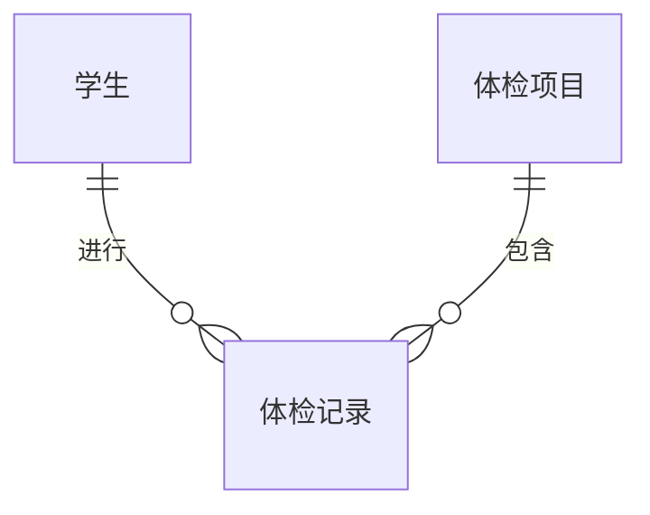

# 基于springboot的前后端分离学生健康体检管理系统

作者：禅与计算机程序设计艺术

## 1. 背景介绍

### 1.1 体检管理现状与挑战

传统的学生健康体检管理模式主要依赖于纸质档案和手工记录，存在着效率低下、信息不准确、数据难以统计分析等问题。随着信息技术的快速发展，利用计算机技术构建数字化、智能化的学生健康体检管理系统已成为必然趋势。

### 1.2 前后端分离架构的优势

传统的Web应用程序通常采用前后端耦合的架构，这种架构存在着开发效率低、维护成本高、可扩展性差等问题。而前后端分离架构则将前端和后端开发完全分离，前端负责用户界面和用户体验，后端负责业务逻辑和数据处理，通过API接口进行数据交互。这种架构具有以下优势：

* **提高开发效率：** 前后端开发人员可以并行工作，互不干扰，缩短开发周期。
* **降低维护成本：** 前后端代码分离，便于维护和升级，降低维护成本。
* **提高可扩展性：** 前后端分离后，可以独立扩展前端或后端，提高系统的可扩展性。

### 1.3 Spring Boot框架的优势

Spring Boot 是由 Pivotal 团队提供的全新框架，其设计目的是用来简化新 Spring 应用的初始搭建以及开发过程。该框架使用了特定的方式来进行配置，从而使开发人员不再需要定义样板化的配置。Spring Boot 具有以下优势：

* **简化配置：** Spring Boot 可以自动配置 Spring 和第三方库，简化了配置过程。
* **快速开发：** Spring Boot 提供了内嵌的 Servlet 容器，可以快速启动和运行应用程序。
* **易于部署：** Spring Boot 可以打包成可执行的 JAR 或 WAR 文件，方便部署。

### 1.4 本系统的目标和意义

本系统旨在利用 Spring Boot 框架和前后端分离架构，构建一个功能完善、性能优越、易于维护的学生健康体检管理系统，实现以下目标：

* **提高体检效率：** 通过数字化流程，简化体检流程，提高体检效率。
* **提高数据准确性：** 通过电子化数据记录，减少人工录入错误，提高数据准确性。
* **方便数据统计分析：** 通过数据可视化工具，方便管理人员进行数据统计分析。

本系统的开发对于提高学生健康管理水平、促进学校卫生工作的发展具有重要意义。

## 2. 核心概念与联系

### 2.1 领域模型

#### 2.1.1 学生

* 学生ID
* 姓名
* 性别
* 出生日期
* 班级
* 联系方式

#### 2.1.2 体检项目

* 项目ID
* 项目名称
* 项目描述
* 参考值范围

#### 2.1.3 体检记录

* 记录ID
* 学生ID
* 体检日期
* 体检项目
* 体检结果

### 2.2 技术架构

#### 2.2.1 前端

* 技术选型：Vue.js + Element UI
* 功能模块：
    * 登录注册
    * 学生信息管理
    * 体检项目管理
    * 体检记录管理
    * 数据统计分析

#### 2.2.2 后端

* 技术选型：Spring Boot + MyBatis + MySQL
* 功能模块：
    * 用户认证和授权
    * 学生信息管理接口
    * 体检项目管理接口
    * 体检记录管理接口
    * 数据统计分析接口

#### 2.2.3 数据库

* 数据库选型：MySQL
* 数据表设计：
    * 学生信息表
    * 体检项目表
    * 体检记录表

### 2.3 概念关系图



## 3. 核心算法原理具体操作步骤

### 3.1 用户认证和授权

#### 3.1.1 原理

本系统采用基于 JWT (JSON Web Token) 的用户认证和授权机制。JWT 是一个开放标准 (RFC 7519)，它定义了一种紧凑且自包含的方式，用于在各方之间安全地将信息作为 JSON 对象传输。

#### 3.1.2 操作步骤

1. 用户登录时，后端验证用户名和密码。
2. 如果验证通过，后端生成一个 JWT，其中包含用户的身份信息和权限信息。
3. 后端将 JWT 返回给前端。
4. 前端将 JWT 保存到本地存储中。
5. 后续请求中，前端在请求头中携带 JWT。
6. 后端拦截请求，验证 JWT 的有效性。
7. 如果 JWT 有效，后端从 JWT 中获取用户的身份信息和权限信息，并允许访问相应的资源。

### 3.2 数据分页查询

#### 3.2.1 原理

本系统采用基于 MyBatis 分页插件的分页查询机制。MyBatis 分页插件可以拦截 SQL 查询语句，自动添加分页参数，实现分页查询功能。

#### 3.2.2 操作步骤

1. 前端发送分页查询请求，携带页码和每页记录数参数。
2. 后端接收请求，调用 MyBatis 分页插件进行分页查询。
3. MyBatis 分页插件拦截 SQL 查询语句，自动添加分页参数。
4. 数据库执行分页查询，返回指定页码的数据。
5. 后端将查询结果封装成 JSON 格式返回给前端。

## 4. 数学模型和公式详细讲解举例说明

本系统不涉及复杂的数学模型和公式。

## 5. 项目实践：代码实例和详细解释说明

### 5.1 后端代码示例

#### 5.1.1 学生信息管理接口

```java
@RestController
@RequestMapping("/api/students")
public class StudentController {

    @Autowired
    private StudentService studentService;

    @GetMapping
    public PageInfo<Student> listStudents(
            @RequestParam(defaultValue = "1") int pageNum,
            @RequestParam(defaultValue = "10") int pageSize) {
        return studentService.listStudents(pageNum, pageSize);
    }

    @PostMapping
    public Student createStudent(@RequestBody Student student) {
        return studentService.createStudent(student);
    }

    @PutMapping("/{id}")
    public Student updateStudent(@PathVariable Long id, @RequestBody Student student) {
        return studentService.updateStudent(id, student);
    }

    @DeleteMapping("/{id}")
    public void deleteStudent(@PathVariable Long id) {
        studentService.deleteStudent(id);
    }
}
```

#### 5.1.2 学生信息服务层代码

```java
@Service
public class StudentServiceImpl implements StudentService {

    @Autowired
    private StudentMapper studentMapper;

    @Override
    public PageInfo<Student> listStudents(int pageNum, int pageSize) {
        PageHelper.startPage(pageNum, pageSize);
        List<Student> students = studentMapper.selectAll();
        return new PageInfo<>(students);
    }

    @Override
    public Student createStudent(Student student) {
        studentMapper.insert(student);
        return student;
    }

    @Override
    public Student updateStudent(Long id, Student student) {
        student.setId(id);
        studentMapper.updateByPrimaryKey(student);
        return student;
    }

    @Override
    public void deleteStudent(Long id) {
        studentMapper.deleteByPrimaryKey(id);
    }
}
```

### 5.2 前端代码示例

#### 5.2.1 学生信息列表页面

```vue
<template>
  <div>
    <el-table :data="tableData" stripe>
      <el-table-column prop="id" label="ID" width="180"></el-table-column>
      <el-table-column prop="name" label="姓名"></el-table-column>
      <el-table-column prop="gender" label="性别"></el-table-column>
      <el-table-column prop="birthday" label="出生日期"></el-table-column>
      <el-table-column prop="className" label="班级"></el-table-column>
      <el-table-column prop="phone" label="联系方式"></el-table-column>
      <el-table-column label="操作">
        <template slot-scope="scope">
          <el-button size="mini" @click="handleEdit(scope.row)">编辑</el-button>
          <el-button size="mini" type="danger" @click="handleDelete(scope.row)">删除</el-button>
        </template>
      </el-table-column>
    </el-table>

    <el-pagination
      @size-change="handleSizeChange"
      @current-change="handleCurrentChange"
      :current-page="currentPage"
      :page-sizes="[10, 20, 50, 100]"
      :page-size="pageSize"
      layout="total, sizes, prev, pager, next, jumper"
      :total="total">
    </el-pagination>
  </div>
</template>

<script>
export default {
  data() {
    return {
      tableData: [],
      currentPage: 1,
      pageSize: 10,
      total: 0
    }
  },
  mounted() {
    this.getStudents()
  },
  methods: {
    handleSizeChange(val) {
      this.pageSize = val
      this.getStudents()
    },
    handleCurrentChange(val) {
      this.currentPage = val
      this.getStudents()
    },
    getStudents() {
      this.$axios.get('/api/students', {
        params: {
          pageNum: this.currentPage,
          pageSize: this.pageSize
        }
      }).then(res => {
        this.tableData = res.data.list
        this.total = res.data.total
      })
    },
    handleEdit(row) {
      // 处理编辑逻辑
    },
    handleDelete(row) {
      // 处理删除逻辑
    }
  }
}
</script>
```

## 6. 实际应用场景

### 6.1 学校

* 学生健康体检
* 教职工健康体检
* 健康数据统计分析
* 健康状况预警

### 6.2 医院

* 体检预约挂号
* 体检报告查询
* 健康档案管理

### 6.3 其他机构

* 企业员工体检
* 保险公司体检
* 运动健身机构体检

## 7. 工具和资源推荐

### 7.1 后端

* Spring Boot：https://spring.io/projects/spring-boot
* MyBatis：https://mybatis.org/mybatis-3/zh/index.html
* MySQL：https://www.mysql.com/

### 7.2 前端

* Vue.js：https://vuejs.org/
* Element UI：https://element.eleme.cn/#/zh-CN

## 8. 总结：未来发展趋势与挑战

### 8.1 未来发展趋势

* **智能化：** 利用人工智能技术，实现体检结果的智能分析和预警。
* **个性化：** 根据学生的个体差异，制定个性化的体检方案。
* **移动化：** 通过移动设备，方便学生随时随地查看体检结果和健康信息。

### 8.2 挑战

* **数据安全和隐私保护：** 如何保障学生健康数据的安全和隐私。
* **系统性能和稳定性：** 如何保证系统在高并发访问下的性能和稳定性。
* **技术更新迭代：** 如何应对技术更新迭代带来的挑战。

## 9. 附录：常见问题与解答

### 9.1 如何解决跨域问题？

#### 问题描述

前后端分离架构下，前端和后端分别部署在不同的域名下，会导致跨域问题。

#### 解决方法

在 Spring Boot 后端代码中添加跨域配置：

```java
@Configuration
public class CorsConfig implements WebMvcConfigurer {

    @Override
    public void addCorsMappings(CorsRegistry registry) {
        registry.addMapping("/**")
                .allowedOrigins("*")
                .allowedMethods("GET", "POST", "PUT", "DELETE")
                .allowCredentials(true)
                .maxAge(3600);
    }
}
```

### 9.2 如何提高系统性能？

#### 问题描述

随着用户数量的增加，系统性能可能会下降。

#### 解决方法

* 使用缓存技术，减少数据库访问次数。
* 使用消息队列，异步处理耗时操作。
* 对数据库进行优化，例如添加索引、分库分表等。
