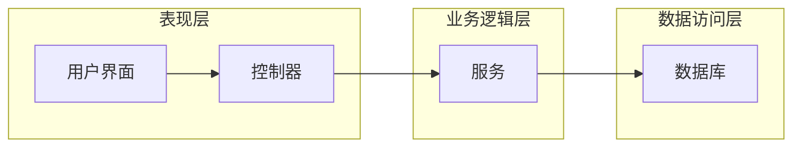

## 1. 背景介绍

### 1.1 学术交流的现状与挑战

在信息爆炸的时代，学术交流的重要性日益凸显。传统的学术交流方式，如线下会议、期刊发表等，存在着效率低下、传播范围有限、互动性不足等问题。随着互联网技术的快速发展，线上学术互动平台应运而生，为学术交流提供了新的可能性。

### 1.2 SSM框架的优势与适用性

SSM框架（Spring+SpringMVC+MyBatis）是Java Web开发领域应用广泛的轻量级框架，具有以下优势：

* **模块化设计**: SSM框架采用模块化设计，各模块之间分工明确，易于维护和扩展。
* **易于学习和使用**: SSM框架提供了丰富的文档和示例，开发者可以快速上手。
* **良好的性能**: SSM框架性能优越，能够满足高并发、高性能的应用需求。
* **强大的整合能力**: SSM框架可以与其他框架和技术无缝整合，例如Shiro安全框架、Redis缓存等。

基于以上优势，SSM框架非常适合用于构建学术互动系统。

## 2. 核心概念与联系

### 2.1 系统架构

本系统采用经典的三层架构：

* **表现层**: 负责用户界面展示和交互逻辑，使用SpringMVC框架实现。
* **业务逻辑层**: 负责处理业务逻辑，使用Spring框架管理业务对象和服务。
* **数据访问层**: 负责与数据库交互，使用MyBatis框架实现ORM映射。

### 2.2 功能模块

本系统主要包括以下功能模块：

* **用户管理**: 实现用户注册、登录、信息管理等功能。
* **学术论文**: 实现论文上传、下载、浏览、评论等功能。
* **学术论坛**: 实现论坛主题发布、回复、点赞等功能。
* **学术活动**: 实现学术会议、讲座、研讨会等活动的发布、报名、管理等功能。
* **消息通知**: 实现系统消息、评论回复、私信等消息的发送和接收。

### 2.3 核心概念联系

**用户** 是系统的核心，通过 **用户管理** 模块进行身份验证和信息管理。用户可以发布 **学术论文**、参与 **学术论坛** 讨论、参加 **学术活动**。系统通过 **消息通知** 模块向用户推送相关信息。

## 3. 核心算法原理具体操作步骤

### 3.1 用户注册流程

1. 用户填写注册信息，包括用户名、密码、邮箱等。
2. 系统验证用户信息，例如用户名是否重复、邮箱格式是否正确。
3. 系统将用户信息加密存储到数据库。
4. 系统发送激活邮件到用户邮箱。
5. 用户点击激活链接，完成注册。

### 3.2 论文推荐算法

本系统采用基于内容的推荐算法，根据用户的历史浏览记录和兴趣标签，推荐相关的学术论文。

1. 收集用户的历史浏览数据，包括论文标题、关键词、作者等。
2. 对论文内容进行分词和关键词提取。
3. 计算用户兴趣标签和论文关键词之间的相似度。
4. 根据相似度排序，推荐相关度最高的论文。

### 3.3 论坛主题排序算法

本系统采用基于用户活跃度的排序算法，根据主题的回复数量、点赞数量、发布时间等指标，对论坛主题进行排序。

1. 统计每个主题的回复数量、点赞数量、发布时间。
2. 根据预设的权重，计算每个主题的综合得分。
3. 根据综合得分排序，展示最热门的主题。

## 4. 数学模型和公式详细讲解举例说明

### 4.1 用户兴趣标签计算公式

$$
UserInterest(u, t) = \frac{\sum_{i=1}^{n}w_i \cdot Similarity(t, k_i)}{\sum_{i=1}^{n}w_i}
$$

其中：

* $UserInterest(u, t)$ 表示用户 $u$ 对标签 $t$ 的兴趣度。
* $w_i$ 表示关键词 $k_i$ 的权重。
* $Similarity(t, k_i)$ 表示标签 $t$ 和关键词 $k_i$ 之间的相似度。

### 4.2 论坛主题综合得分计算公式

$$
TopicScore(t) = w_1 \cdot ReplyCount(t) + w_2 \cdot LikeCount(t) + w_3 \cdot TimeDecay(t)
$$

其中：

* $TopicScore(t)$ 表示主题 $t$ 的综合得分。
* $w_1$, $w_2$, $w_3$ 分别表示回复数量、点赞数量、发布时间的权重。
* $ReplyCount(t)$ 表示主题 $t$ 的回复数量。
* $LikeCount(t)$ 表示主题 $t$ 的点赞数量。
* $TimeDecay(t)$ 表示主题 $t$ 的时间衰减因子，例如可以使用指数衰减函数。

## 5. 项目实践：代码实例和详细解释说明

### 5.1 用户注册功能代码示例

```java
@Controller
public class UserController {

    @Autowired
    private UserService userService;

    @RequestMapping("/register")
    public String register(User user) {
        userService.register(user);
        return "redirect:/login";
    }
}
```

代码解释：

* `@Controller` 注解表示这是一个控制器类。
* `@Autowired` 注解用于自动注入 UserService 对象。
* `@RequestMapping("/register")` 注解指定处理 `/register` 请求的方法。
* `userService.register(user)` 调用 UserService 的 register 方法进行用户注册。
* `return "redirect:/login"` 重定向到登录页面。

### 5.2 论文推荐功能代码示例

```java
@Service
public class PaperService {

    @Autowired
    private PaperDao paperDao;

    public List<Paper> recommendPapers(User user) {
        // 获取用户的历史浏览记录
        List<Paper> historyPapers = paperDao.getHistoryPapers(user.getId());

        // 计算用户兴趣标签
        Set<String> userInterests = calculateUserInterests(historyPapers);

        // 查询相关论文
        List<Paper> recommendedPapers = paperDao.getRelatedPapers(userInterests);

        // 返回推荐结果
        return recommendedPapers;
    }

    private Set<String> calculateUserInterests(List<Paper> historyPapers) {
        // TODO: 实现用户兴趣标签计算逻辑
    }
}
```

代码解释：

* `@Service` 注解表示这是一个服务类。
* `@Autowired` 注解用于自动注入 PaperDao 对象。
* `recommendPapers(User user)` 方法用于推荐论文。
* `getHistoryPapers(user.getId())` 方法从数据库查询用户的历史浏览记录。
* `calculateUserInterests(historyPapers)` 方法计算用户兴趣标签。
* `getRelatedPapers(userInterests)` 方法从数据库查询相关论文。

## 6. 实际应用场景

### 6.1 高校学术交流平台

高校可以利用本系统构建学术交流平台，方便师生之间进行学术探讨、论文分享、活动组织等。

### 6.2 科研机构学术合作平台

科研机构可以利用本系统构建学术合作平台，促进科研人员之间的交流与合作，推动科研成果的转化。

### 6.3 学术期刊在线投稿平台

学术期刊可以利用本系统构建在线投稿平台，方便作者投稿、编辑审稿、读者阅读等。

## 7. 工具和资源推荐

### 7.1 开发工具

* IntelliJ IDEA：Java 集成开发环境。
* Eclipse：Java 集成开发环境。
* Maven：项目构建工具。
* Git：版本控制工具。

### 7.2 学习资源

* Spring官方文档：https://spring.io/projects/spring-framework
* SpringMVC官方文档：https://docs.spring.io/spring-framework/docs/current/reference/html/web.html
* MyBatis官方文档：https://mybatis.org/mybatis-3/

## 8. 总结：未来发展趋势与挑战

### 8.1 未来发展趋势

* **个性化推荐**: 利用人工智能技术，为用户提供更加个性化的论文推荐、论坛主题推荐等服务。
* **智能问答**: 利用自然语言处理技术，实现智能问答功能，帮助用户快速获取学术信息。
* **虚拟学术社区**: 利用虚拟现实技术，构建虚拟学术社区，提供更加沉浸式的学术交流体验。

### 8.2 面临的挑战

* **数据安全与隐私保护**: 如何保障用户数据安全和隐私保护，是一个重要的挑战。
* **学术内容质量控制**: 如何有效控制学术内容的质量，防止低质量内容的传播，是一个需要解决的问题。
* **技术更新迭代**: 随着技术的不断发展，系统需要不断更新迭代，以适应新的技术环境。

## 9. 附录：常见问题与解答

### 9.1 如何解决用户注册时邮箱无法收到激活邮件的问题？

* 检查邮箱地址是否正确。
* 检查垃圾邮件箱。
* 联系系统管理员寻求帮助。

### 9.2 如何提高论文推荐的准确率？

* 收集更多用户的历史浏览数据。
* 优化用户兴趣标签计算算法。
* 完善论文内容的关键词提取。

### 9.3 如何防止论坛主题灌水和恶意攻击？

* 设置主题发布频率限制。
* 设置敏感词过滤机制。
* 引入用户举报机制。

## 10. 系统架构图

