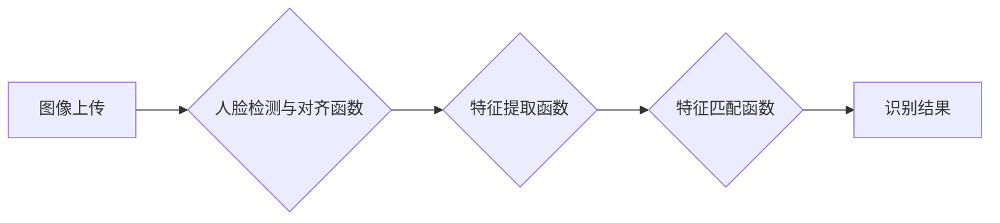

## 1. 背景介绍

### 1.1 人脸识别技术的发展历程

人脸识别作为一种基于生物特征的身份识别技术，近年来取得了长足的进步。从早期的几何特征提取到如今的深度学习算法，人脸识别的准确率和效率都得到了显著提升，并在安防、金融、交通等领域得到了广泛应用。

### 1.2 无服务器架构的兴起

随着云计算技术的快速发展，无服务器架构（Serverless Architecture）逐渐成为了一种新兴的软件架构风格。与传统的服务器架构相比，无服务器架构具有以下优势：

* **弹性伸缩**: 无服务器架构可以根据实际需求自动调整计算资源，无需手动干预。
* **降低成本**: 用户只需为实际使用的计算资源付费，无需承担服务器维护和管理成本。
* **简化运维**: 无服务器平台提供底层基础设施的管理和维护，开发者可以专注于业务逻辑的实现。

### 1.3 本文研究目的及意义

本文旨在探讨如何利用无服务器架构实现高效、可靠的人脸识别系统。通过将人脸识别算法部署到无服务器平台，可以充分发挥无服务器架构的优势，降低系统开发和运维成本，提高系统的可扩展性和可靠性。

## 2. 核心概念与联系

### 2.1 人脸识别基本流程

人脸识别的一般流程包括以下步骤：

1. **人脸检测**: 从图像或视频中定位人脸区域。
2. **人脸对齐**: 对检测到的人脸进行姿态校正，使其处于正面或接近正面的姿态。
3. **特征提取**: 从对齐后的人脸图像中提取特征向量，用于表征人脸的独特性。
4. **特征匹配**: 将提取到的特征向量与数据库中已知人脸的特征向量进行比对，判断是否匹配。

### 2.2 无服务器架构核心组件

无服务器架构通常包含以下核心组件：

* **函数即服务 (FaaS)**:  允许开发者将代码部署为函数，并由云平台按需执行。
* **后端即服务 (BaaS)**: 提供数据库、存储、消息队列等云服务，供函数调用。
* **事件驱动**:  无服务器平台通过事件触发函数的执行，例如 HTTP 请求、文件上传等。

### 2.3  人脸识别与无服务器架构的结合

将人脸识别与无服务器架构相结合，可以将人脸识别的各个步骤封装为独立的函数，并部署到无服务器平台。例如：

* 人脸检测和对齐函数可以响应图像上传事件，对上传的图像进行处理。
* 特征提取函数可以接收处理后的图像，提取特征向量。
* 特征匹配函数可以接收特征向量，与数据库进行比对。

## 3. 核心算法原理具体操作步骤

### 3.1 人脸检测算法

本实验采用基于深度学习的人脸检测算法 MTCNN (Multi-task Cascaded Convolutional Networks)。MTCNN 算法通过三个级联的卷积神经网络，逐步提高人脸检测的精度。

**操作步骤:**

1. 首先将输入图像缩放至不同尺度，构建图像金字塔。
2. 将不同尺度的图像输入到 P-Net (Proposal Network) 中，生成候选人脸区域。
3. 对候选人脸区域进行非极大值抑制 (NMS)，去除重叠区域。
4. 将剩余的候选人脸区域输入到 R-Net (Refine Network) 中，进一步优化人脸边界框和置信度。
5. 最后将 R-Net 的输出输入到 O-Net (Output Network) 中，进行更精确的人脸边界框回归和人脸关键点定位。

### 3.2 人脸对齐算法

本实验采用基于人脸关键点的对齐算法。该算法首先利用 MTCNN 算法检测人脸关键点，然后根据关键点坐标计算人脸姿态参数，最后利用仿射变换将人脸校正至正面姿态。

**操作步骤:**

1. 利用 MTCNN 算法检测人脸关键点，包括眼睛、鼻子、嘴角等。
2. 根据关键点坐标计算人脸姿态参数，包括旋转角度、平移量和缩放比例。
3. 利用仿射变换将人脸校正至正面姿态。

### 3.3 特征提取算法

本实验采用基于深度学习的人脸识别模型 FaceNet 进行特征提取。FaceNet 模型通过训练一个深度卷积神经网络，将人脸图像映射到一个 128 维的特征向量空间，使得同一个人的不同照片在该空间中的距离尽可能近，不同人的照片在该空间中的距离尽可能远。

**操作步骤:**

1. 将对齐后的人脸图像输入到 FaceNet 模型中。
2. 获取 FaceNet 模型倒数第二层的输出，该输出即为人脸的 128 维特征向量。

### 3.4 特征匹配算法

本实验采用欧式距离计算特征向量之间的相似度。

**操作步骤:**

1. 计算待识别的人脸特征向量与数据库中所有已知人脸特征向量之间的欧式距离。
2. 根据距离排序，选择距离最近的人脸作为识别结果。

## 4. 数学模型和公式详细讲解举例说明

### 4.1 MTCNN 损失函数

MTCNN 算法的损失函数由三部分组成：人脸分类损失、边界框回归损失和关键点定位损失。

**人脸分类损失**: 采用交叉熵损失函数，用于判断候选区域是否为人脸。

$$
L_{cls} = -\frac{1}{N} \sum_{i=1}^{N} (y_i \log(p_i) + (1-y_i) \log(1-p_i))
$$

其中，$N$ 表示候选区域数量，$y_i$ 表示第 $i$ 个候选区域的真实标签 (1 表示人脸，0 表示非人脸)，$p_i$ 表示模型预测的第 $i$ 个候选区域为人脸的概率。

**边界框回归损失**: 采用平方差损失函数，用于回归人脸边界框的坐标。

$$
L_{box} = \frac{1}{N} \sum_{i=1}^{N} ||\hat{b}_i - b_i||^2
$$

其中，$\hat{b}_i$ 表示模型预测的第 $i$ 个候选区域的人脸边界框坐标，$b_i$ 表示第 $i$ 个候选区域的真实人脸边界框坐标。

**关键点定位损失**: 采用平方差损失函数，用于回归人脸关键点的坐标。

$$
L_{landmark} = \frac{1}{N} \sum_{i=1}^{N} ||\hat{l}_i - l_i||^2
$$

其中，$\hat{l}_i$ 表示模型预测的第 $i$ 个候选区域的人脸关键点坐标，$l_i$ 表示第 $i$ 个候选区域的真实人脸关键点坐标。

**总损失函数**:

$$
L = \lambda_1 L_{cls} + \lambda_2 L_{box} + \lambda_3 L_{landmark}
$$

其中，$\lambda_1$、$\lambda_2$ 和 $\lambda_3$ 为权重系数，用于平衡不同损失函数的重要性。

### 4.2  FaceNet  损失函数

FaceNet 模型的损失函数采用三元组损失函数 (Triplet Loss)。三元组损失函数的目标是使得同一个人的不同照片在特征空间中的距离尽可能近，不同人的照片在特征空间中的距离尽可能远。

**三元组损失函数**:

$$
L = \sum_{i=1}^{N} [\text{max}(0, d(a_i, p_i) - d(a_i, n_i) + \alpha)]
$$

其中，$N$ 表示三元组数量，$a_i$ 表示第 $i$ 个三元组的锚点 (anchor)，$p_i$ 表示第 $i$ 个三元组的正样本 (positive)，$n_i$ 表示第 $i$ 个三元组的负样本 (negative)，$d(x, y)$ 表示特征向量 $x$ 和 $y$ 之间的欧式距离，$\alpha$ 为边界值。

### 4.3 欧式距离

欧式距离用于计算两个向量之间的距离。

**欧式距离公式**:

$$
d(x, y) = \sqrt{\sum_{i=1}^{n} (x_i - y_i)^2}
$$

其中，$x$ 和 $y$ 为 $n$ 维向量，$x_i$ 和 $y_i$ 分别表示向量 $x$ 和 $y$ 的第 $i$ 个元素。

## 4. 项目实践：代码实例和详细解释说明

### 4.1 项目架构

本实验采用无服务器架构实现人脸识别系统。系统架构如下图所示：



* **图像上传**: 用户上传待识别的人脸图像。
* **人脸检测与对齐函数**: 接收上传的图像，利用 MTCNN 算法检测人脸并进行对齐。
* **特征提取函数**: 接收对齐后的人脸图像，利用 FaceNet 模型提取人脸特征向量。
* **特征匹配函数**: 接收人脸特征向量，与数据库中已知人脸特征向量进行比对，返回识别结果。

### 4.2 代码实例

以下代码示例演示了如何使用 Python 和 AWS Lambda 函数实现人脸识别系统。

**人脸检测与对齐函数**:

```python
import boto3
import cv2
import mtcnn

# 创建 MTCNN 人脸检测器
detector = mtcnn.MTCNN()

def lambda_handler(event, context):
    # 从 S3 存储桶中获取上传的图像
    s3 = boto3.client('s3')
    bucket_name = event['bucket_name']
    object_key = event['object_key']
    image_object = s3.get_object(Bucket=bucket_name, Key=object_key)
    image_bytes = image_object['Body'].read()

    # 将图像解码为 OpenCV 格式
    image = cv2.imdecode(np.frombuffer(image_bytes, np.uint8), -1)

    # 人脸检测和对齐
    faces = detector.detect_faces(image)
    if len(faces) > 0:
        face = faces[0]
        x, y, w, h = face['box']
        aligned_face = image[y:y+h, x:x+w]

        # 将对齐后的人脸图像上传至 S3 存储桶
        aligned_object_key = f'{object_key}_aligned.jpg'
        s3.put_object(Bucket=bucket_name, Key=aligned_object_key, Body=cv2.imencode('.jpg', aligned_face)[1].tostring())

        return {
            'statusCode': 200,
            'aligned_object_key': aligned_object_key
        }
    else:
        return {
            'statusCode': 400,
            'error': 'No face detected'
        }
```

**特征提取函数**:

```python
import boto3
import cv2
import face_recognition

# 加载 FaceNet 模型
model = face_recognition.face_encodings.FaceNet()

def lambda_handler(event, context):
    # 从 S3 存储桶中获取对齐后的人脸图像
    s3 = boto3.client('s3')
    bucket_name = event['bucket_name']
    object_key = event['object_key']
    image_object = s3.get_object(Bucket=bucket_name, Key=object_key)
    image_bytes = image_object['Body'].read()

    # 将图像解码为 OpenCV 格式
    image = cv2.imdecode(np.frombuffer(image_bytes, np.uint8), -1)

    # 特征提取
    face_encoding = face_recognition.face_encodings(image)[0]

    # 将特征向量存储到 DynamoDB 表中
    dynamodb = boto3.resource('dynamodb')
    table = dynamodb.Table('face_encodings')
    table.put_item(
        Item={
            'face_id': object_key,
            'face_encoding': face_encoding.tolist()
        }
    )

    return {
        'statusCode': 200
    }
```

**特征匹配函数**:

```python
import boto3
import face_recognition

# 加载 DynamoDB 表中的特征向量
dynamodb = boto3.resource('dynamodb')
table = dynamodb.Table('face_encodings')
response = table.scan()
face_encodings = [np.array(item['face_encoding']) for item in response['Items']]
face_ids = [item['face_id'] for item in response['Items']]

def lambda_handler(event, context):
    # 从 S3 存储桶中获取待识别的人脸图像
    s3 = boto3.client('s3')
    bucket_name = event['bucket_name']
    object_key = event['object_key']
    image_object = s3.get_object(Bucket=bucket_name, Key=object_key)
    image_bytes = image_object['Body'].read()

    # 将图像解码为 OpenCV 格式
    image = cv2.imdecode(np.frombuffer(image_bytes, np.uint8), -1)

    # 特征提取
    unknown_face_encoding = face_recognition.face_encodings(image)[0]

    # 特征匹配
    results = face_recognition.compare_faces(face_encodings, unknown_face_encoding)

    # 返回识别结果
    if True in results:
        match_index = results.index(True)
        match_face_id = face_ids[match_index]
        return {
            'statusCode': 200,
            'match_face_id': match_face_id
        }
    else:
        return {
            'statusCode': 400,
            'error': 'No match found'
        }
```

### 4.3 部署与测试

1. 将以上代码分别部署到 AWS Lambda 函数中。
2. 创建一个 S3 存储桶，用于存储图像文件。
3. 创建一个 DynamoDB 表，用于存储特征向量。
4. 上传待识别的人脸图像到 S3 存储桶。
5. 调用人脸检测与对齐函数、特征提取函数和特征匹配函数，测试系统功能。

## 5. 实际应用场景

### 5.1 安防监控

* **人脸识别门禁系统**: 利用人脸识别技术实现门禁系统的自动化管理，提高安全性。
* **视频监控**: 在视频监控系统中集成人脸识别功能，实现实时的人脸识别和报警。

### 5.2 金融支付

* **人脸支付**: 利用人脸识别技术实现无感支付，提升用户体验。
* **身份验证**: 在金融交易中使用人脸识别进行身份验证，提高安全性。

### 5.3 交通出行

* **人脸识别闸机**: 在地铁、高铁等场所使用人脸识别闸机，实现快速通行。
* **疲劳驾驶检测**: 利用人脸识别技术检测驾驶员的疲劳状态，提高驾驶安全性。

## 6. 工具和资源推荐

### 6.1 无服务器平台

* **AWS Lambda**: 亚马逊云提供的无服务器计算服务。
* **Google Cloud Functions**: 谷歌云提供的无服务器计算服务。
* **Azure Functions**: 微软云提供的无服务器计算服务。

### 6.2 人脸识别库

* **face_recognition**: 基于 dlib 开发的人脸识别库，提供人脸检测、人脸对齐、特征提取和特征匹配等功能。
* **mtcnn**: 基于深度学习的人脸检测库。
* **facenet**: 基于深度学习的人脸识别模型。

### 6.3 数据库

* **DynamoDB**: 亚马逊云提供的 NoSQL 数据库服务。
* **MongoDB**: 开源的文档型数据库。

## 7. 总结：未来发展趋势与挑战

### 7.1 未来发展趋势

* **更加精准、高效的人脸识别算法**: 随着深度学习技术的不断发展，未来将会出现更加精准、高效的人脸识别算法。
* **更广泛的应用场景**: 随着人脸识别技术的普及，未来人脸识别将会应用到更多的场景中。
* **与其他技术的融合**: 人脸识别技术将会与其他技术，例如语音识别、自然语言处理等技术相融合，创造出更加智能的应用。

### 7.2 面临挑战

* **数据安全和隐私保护**: 人脸识别技术涉及到用户的生物特征信息，因此数据安全和隐私保护是一个重要的挑战。
* **算法的鲁棒性**: 人脸识别算法容易受到光照、姿态、遮挡等因素的影响，因此提高算法的鲁棒性是一个重要的挑战。
* **伦理和社会问题**: 人脸识别技术的应用引发了一些伦理和社会问题，例如歧视、监控等，需要引起重视。

## 8. 附录：常见问题与解答

### 8.1 如何提高人脸识别的准确率？

* **使用高质量的训练数据**: 训练数据质量越高，模型的泛化能力越强，识别准确率也越高。
* **选择合适的算法**: 不同的算法适用于不同的场景，需要根据实际情况选择合适的算法。
* **对图像进行预处理**: 对图像进行预处理，例如光照归一化、人脸对齐等，可以提高算法的鲁棒性。

### 8.2 如何保护用户隐私？

