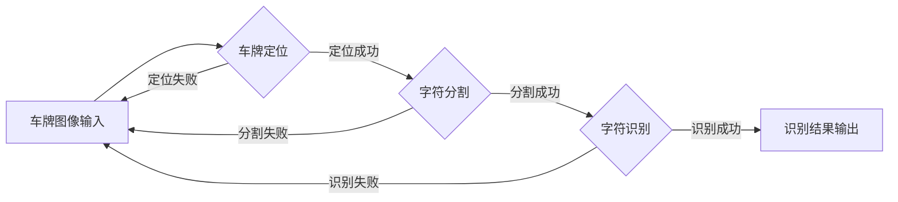

# 基于深度学习的车牌识别系统设计与实现

作者：禅与计算机程序设计艺术

## 1. 背景介绍

随着车辆数量的快速增长和交通管理的日益智能化,传统的人工车牌识别已经无法满足实际需求。因此,利用计算机视觉和深度学习技术实现高效、准确的车牌自动识别系统具有重要的现实意义。本文将详细介绍一套基于深度学习的车牌识别系统的设计与实现。

### 1.1 车牌识别的重要性
#### 1.1.1 智能交通管理的需求
#### 1.1.2 减轻人力成本
#### 1.1.3 提高识别效率和准确性

### 1.2 传统车牌识别方法的局限性
#### 1.2.1 基于模板匹配的方法
#### 1.2.2 基于特征提取的方法 
#### 1.2.3 存在的问题与挑战

### 1.3 深度学习在车牌识别中的优势
#### 1.3.1 强大的特征学习能力
#### 1.3.2 端到端的训练方式
#### 1.3.3 识别精度的提升

## 2. 核心概念与联系

本节将介绍车牌识别系统中涉及的核心概念,并阐明它们之间的联系。

### 2.1 车牌定位
#### 2.1.1 车牌定位的定义与作用
#### 2.1.2 常用的车牌定位算法

### 2.2 车牌字符分割
#### 2.2.1 字符分割的必要性
#### 2.2.2 分割算法概述

### 2.3 车牌字符识别
#### 2.3.1 字符识别的任务定义
#### 2.3.2 基于深度学习的识别方法

### 2.4 深度学习模型
#### 2.4.1 卷积神经网络(CNN)
#### 2.4.2 循环神经网络(RNN)
#### 2.4.3 端到端的车牌识别网络

## 3. 核心算法原理与步骤

本节将详细阐述基于深度学习的车牌识别系统的核心算法原理,并给出具体的操作步骤。

### 3.1 基于YOLO的车牌定位算法
#### 3.1.1 YOLO算法原理
#### 3.1.2 应用于车牌定位的调整
#### 3.1.3 车牌定位的具体步骤

### 3.2 车牌字符分割算法
#### 3.2.1 传统分割算法的局限性
#### 3.2.2 基于深度学习的分割方法
#### 3.2.3 分割算法的具体步骤

### 3.3 基于CNN的车牌字符识别算法
#### 3.3.1 CNN在字符识别中的应用
#### 3.3.2 CNN网络结构设计
#### 3.3.3 字符识别的具体步骤

### 3.4 端到端的车牌识别算法
#### 3.4.1 端到端识别的优势
#### 3.4.2 基于CNN+RNN的网络结构
#### 3.4.3 CTC损失函数的应用
#### 3.4.4 端到端识别的具体步骤

## 4. 数学模型与公式推导

为了让读者更深入地理解算法原理,本节将对涉及的关键数学模型和公式进行详细的讲解和推导。

### 4.1 YOLO中的边界框回归
#### 4.1.1 边界框回归的数学表示
#### 4.1.2 损失函数的设计
#### 4.1.3 anchor box的作用与计算

### 4.2 字符分割中的连通域分析
#### 4.2.1 连通域分析的数学基础
#### 4.2.2 连通域标记算法
#### 4.2.3 基于连通域的字符分割

### 4.3 CNN中的卷积与池化
#### 4.3.1 卷积操作的数学定义
$$ h(i,j)=\sum_{m,n}f(m,n)g(i-m,j-n) $$
#### 4.3.2 池化操作的数学描述
#### 4.3.3 卷积和池化在特征提取中的作用

### 4.4 CTC损失函数
#### 4.4.1 CTC的概率定义
#### 4.4.2 前向-后向算法求解
$$ p(l|x)=\sum_{\pi \in B^{-1}(l)}\prod_{t=1}^{T}y^t_{\pi_t} $$
#### 4.4.3 CTC在端到端识别中的优势

## 5. 项目实践与代码实现

为了帮助读者将理论知识应用到实践中,本节将给出车牌识别系统的代码实例,并对关键部分进行详细的解释说明。

### 5.1 开发环境与工具
#### 5.1.1 深度学习框架的选择
#### 5.1.2 开发语言和IDE
#### 5.1.3 数据集的准备

### 5.2 车牌定位模块
#### 5.2.1 YOLO网络的搭建
#### 5.2.2 训练数据的准备与标注
#### 5.2.3 模型训练与测试

### 5.3 车牌字符分割模块 
#### 5.3.1 字符分割网络的设计
#### 5.3.2 分割数据集的构建
#### 5.3.3 分割模型的训练与评估

### 5.4 车牌字符识别模块
#### 5.4.1 CNN识别网络的搭建
#### 5.4.2 字符样本的采集与处理
#### 5.4.3 识别模型的训练与测试

### 5.5 端到端识别模块
#### 5.5.1 CNN+RNN网络的实现
#### 5.5.2 CTC损失函数的集成
#### 5.5.3 端到端模型的训练与评估

## 6. 实际应用场景

车牌识别系统可以应用于多种实际场景,本节将列举几个典型的应用案例。

### 6.1 停车场管理
#### 6.1.1 车辆出入管理
#### 6.1.2 车位占用检测
#### 6.1.3 停车费用计算

### 6.2 交通违章检测
#### 6.2.1 闯红灯检测
#### 6.2.2 超速行驶检测
#### 6.2.3 违法停车检测

### 6.3 高速公路收费
#### 6.3.1 ETC车道自动识别
#### 6.3.2 通行费用计算
#### 6.3.3 异常车辆报警

## 7. 工具与资源推荐

为方便读者进一步学习和实践,本节推荐了一些有用的工具和资源。

### 7.1 深度学习框架
#### 7.1.1 TensorFlow
#### 7.1.2 PyTorch
#### 7.1.3 Keras

### 7.2 车牌识别数据集
#### 7.2.1 CCPD中文车牌数据集
#### 7.2.2 AOLP车牌数据集
#### 7.2.3 Plate_Detector车牌定位数据集

### 7.3 开源代码库
#### 7.3.1 HyperLPR
#### 7.3.2 OpenALPR
#### 7.3.3 PlateNet

### 7.4 论文与教程
#### 7.4.1 Plate Detection and Recognition
#### 7.4.2 End-to-End Plate Recognition with CNN
#### 7.4.3 CTC for Sequence Labelling

## 8. 总结与展望

本文详细介绍了基于深度学习的车牌识别系统的设计与实现。通过对核心概念、算法原理、数学模型以及代码实践的系统阐述,让读者对车牌识别这一热门课题有了全面深入的认识。未来,车牌识别技术还将不断发展,在智慧交通领域发挥更大作用。

### 8.1 深度学习的优势与挑战
#### 8.1.1 大幅提升识别精度
#### 8.1.2 端到端学习的便利性
#### 8.1.3 模型设计与优化的难度

### 8.2 车牌识别系统的改进方向
#### 8.2.1 针对复杂场景的鲁棒性增强
#### 8.2.2 多角度、多车型的适应性
#### 8.2.3 识别速度的进一步提高

### 8.3 智慧交通的发展趋势
#### 8.3.1 车路协同与自动驾驶
#### 8.3.2 大数据与云计算的应用
#### 8.3.3 交通系统的智能化与网联化

## 附录：常见问题与解答

### Q1: 车牌识别的难点有哪些?
- 车牌图像的多样性,如光照、角度、遮挡等因素
- 车牌字符的个体差异性
- 复杂背景对定位和分割的干扰

### Q2: 端到端识别相比传统方法有何优势? 
- 无需中间步骤,直接从图像到识别结果
- 特征提取和识别任务的联合优化
- 更好地利用上下文信息

### Q3: 如何提高车牌识别系统的精度?
- 扩大数据集,增加数据的多样性
- 加强车牌定位和字符分割环节
- 优化网络结构,进行参数调优

### Q4: 车牌识别系统在实际应用中需要注意哪些问题?
- 车牌图像的采集与预处理质量
- 适应不同场景下的环境变化
- 处理识别异常情况,提供人工干预机制

## Mermaid流程图:

