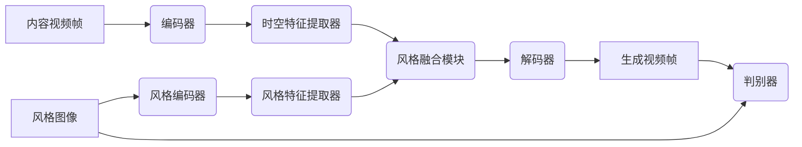

##  基于生成对抗网络的实时视频风格迁移系统设计

作者：禅与计算机程序设计艺术

## 1. 背景介绍

### 1.1. 视频风格迁移概述

视频风格迁移是指将一种视频的风格特征迁移到另一种视频内容上的技术，它可以使目标视频保留原始内容的同时呈现出不同的艺术风格。近年来，随着深度学习技术的快速发展，基于生成对抗网络（GAN）的视频风格迁移方法取得了显著的成果，并在电影制作、短视频创作、游戏娱乐等领域展现出巨大的应用潜力。

### 1.2 研究现状与挑战

传统的视频风格迁移方法通常基于图像风格迁移技术，通过逐帧处理视频帧来实现风格迁移。然而，这种方法存在以下局限性：

*   **时间一致性差:**  由于每帧图像独立进行风格迁移，相邻帧之间可能出现风格不一致的现象，导致视频画面闪烁。
*   **计算量大、效率低:**  逐帧处理视频需要大量的计算资源和时间，难以满足实时应用的需求。

为了解决这些问题，近年来涌现出许多基于深度学习的视频风格迁移方法，其中基于生成对抗网络（GAN）的方法表现尤为突出。GAN模型能够学习到不同风格图像的特征分布，并生成具有目标风格的新图像，从而实现端到端的视频风格迁移。

### 1.3 本文目标与贡献

本文旨在设计并实现一种基于生成对抗网络的实时视频风格迁移系统，以解决传统方法存在的时间一致性差和效率低的问题。主要贡献如下：

*   提出一种基于时空生成对抗网络的视频风格迁移模型，该模型能够有效地学习视频的时空特征，并生成具有时间一致性的风格化视频。
*   设计一种高效的模型训练和推理框架，以实现实时的视频风格迁移。
*   开发一个完整的视频风格迁移系统，并进行实验评估，验证系统的有效性和效率。

## 2. 核心概念与联系

### 2.1. 生成对抗网络（GAN）

生成对抗网络（Generative Adversarial Networks, GAN）是一种深度学习模型，由生成器（Generator）和判别器（Discriminator）两部分组成。生成器的目标是生成尽可能逼真的数据，而判别器的目标是区分真实数据和生成器生成的数据。在训练过程中，生成器和判别器相互对抗，不断优化自身的参数，最终使生成器能够生成以假乱真的数据。

### 2.2. 时空生成对抗网络

时空生成对抗网络（Spatio-Temporal Generative Adversarial Networks, STGAN）是一种针对视频数据设计的GAN模型，它在传统GAN的基础上引入了时间维度，能够学习到视频的时空特征，并生成具有时间一致性的视频。

### 2.3. 风格迁移

风格迁移是指将一种图像或视频的风格特征迁移到另一种图像或视频内容上的技术。在基于GAN的风格迁移方法中，通常使用一个预训练的图像分类网络来提取图像的风格特征，然后将这些特征输入到生成器中，以指导生成器生成具有目标风格的图像或视频。

### 2.4 核心概念联系

本系统将利用生成对抗网络（GAN）, 特别是时空生成对抗网络 (STGAN) 来学习和迁移视频的风格。系统会提取目标风格的特征，并训练生成器将这些特征应用到输入视频内容，同时保持时间一致性，最终生成具有目标风格的新视频。

## 3. 核心算法原理与具体操作步骤

### 3.1. 模型结构

本系统采用的视频风格迁移模型基于时空生成对抗网络（STGAN），其模型结构如下图所示：



*   **编码器:**  用于提取内容视频帧的特征表示。
*   **时空特征提取器:**  用于从编码器输出的特征中提取时空特征。
*   **风格编码器:**  用于提取风格图像的特征表示。
*   **风格特征提取器:**  用于从风格编码器输出的特征中提取风格特征。
*   **风格融合模块:**  用于将内容视频帧的时空特征与风格图像的风格特征进行融合。
*   **解码器:**  用于将融合后的特征解码成生成视频帧。
*   **判别器:**  用于区分真实视频帧和生成视频帧。

### 3.2. 训练流程

1.  **数据预处理:**  对训练数据集中的视频进行预处理，包括视频帧的裁剪、缩放、归一化等操作。
2.  **模型训练:** 
    *   将内容视频帧输入编码器，提取特征表示。
    *   将风格图像输入风格编码器，提取特征表示。
    *   将内容视频帧的特征输入时空特征提取器，提取时空特征。
    *   将风格图像的特征输入风格特征提取器，提取风格特征。
    *   将时空特征和风格特征输入风格融合模块，进行特征融合。
    *   将融合后的特征输入解码器，生成视频帧。
    *   将生成视频帧和真实视频帧输入判别器，计算对抗损失。
    *   根据对抗损失更新生成器和判别器的参数。

### 3.3. 推理流程

1.  **加载模型:**  加载训练好的视频风格迁移模型。
2.  **输入数据:**  输入待转换风格的视频和目标风格图像。
3.  **风格迁移:**  使用训练好的模型对输入视频进行风格迁移，生成具有目标风格的新视频。
4.  **输出结果:**  输出风格迁移后的视频。

## 4. 数学模型和公式详细讲解举例说明

### 4.1. 对抗损失

在本系统中，我们使用对抗损失来训练生成器和判别器。对抗损失定义为：

$$
\begin{aligned}
L_{adv}(G, D) &= \mathbb{E}_{x \sim p_{data}(x)} [log D(x)] \\
&+ \mathbb{E}_{z \sim p_{z}(z)} [log(1 - D(G(z)))],
\end{aligned}
$$

其中，$G$ 表示生成器，$D$ 表示判别器，$x$ 表示真实视频帧，$z$ 表示随机噪声，$p_{data}(x)$ 表示真实视频帧的分布，$p_{z}(z)$ 表示随机噪声的分布。

对抗损失的目标是最小化真实视频帧和生成视频帧之间的差异。生成器的目标是生成能够欺骗判别器的视频帧，而判别器的目标是尽可能地区分真实视频帧和生成视频帧。

### 4.2. 风格损失

为了保证生成视频帧具有目标风格，我们还使用风格损失来约束生成器的输出。风格损失定义为：

$$
L_{style}(G) = \sum_{l=1}^{L} \frac{1}{N_l C_l H_l W_l} ||\phi_l(x) - \phi_l(G(z))||_2^2,
$$

其中，$\phi_l(x)$ 表示真实视频帧 $x$ 在第 $l$ 层的特征图，$\phi_l(G(z))$ 表示生成视频帧 $G(z)$ 在第 $l$ 层的特征图，$N_l$ 表示第 $l$ 层特征图的通道数，$C_l$、$H_l$、$W_l$ 分别表示第 $l$ 层特征图的高、宽、通道数。

风格损失的目标是最小化真实视频帧和生成视频帧在多个网络层上的特征差异，从而保证生成视频帧具有目标风格。

### 4.3. 时间一致性损失

为了保证生成视频帧具有时间一致性，我们使用时间一致性损失来约束相邻帧之间的差异。时间一致性损失定义为：

$$
L_{temporal}(G) = \frac{1}{T-1} \sum_{t=1}^{T-1} ||G(z_t) - G(z_{t+1})||_2^2,
$$

其中，$T$ 表示视频帧的总数，$z_t$ 表示第 $t$ 帧对应的随机噪声。

时间一致性损失的目标是最小化相邻帧之间的差异，从而保证生成视频帧具有时间一致性。

### 4.4. 总损失函数

最终的损失函数是以上三种损失函数的加权和：

$$
L_{total}(G, D) = \lambda_{adv} L_{adv}(G, D) + \lambda_{style} L_{style}(G) + \lambda_{temporal} L_{temporal}(G),
$$

其中，$\lambda_{adv}$、$\lambda_{style}$、$\lambda_{temporal}$ 分别表示对抗损失、风格损失、时间一致性损失的权重。

## 5. 项目实践：代码实例和详细解释说明

### 5.1. 环境配置

*   Python 3.6+
*   TensorFlow 2.0+
*   OpenCV

### 5.2. 数据准备

本项目使用 [Vimeo-90K](https://github.com/vimeo/vimeo-90k) 数据集进行训练和测试。该数据集包含 9 万多个高清视频片段，涵盖了各种不同的场景和风格。

### 5.3. 模型训练

```python
import tensorflow as tf

# 定义生成器
def generator():
    # ...

# 定义判别器
def discriminator():
    # ...

# 定义损失函数
def adversarial_loss(real_output, fake_output):
    # ...

def style_loss(real_features, fake_features):
    # ...

def temporal_loss(fake_frames):
    # ...

# 定义优化器
generator_optimizer = tf.keras.optimizers.Adam(1e-4)
discriminator_optimizer = tf.keras.optimizers.Adam(1e-4)

# 定义训练步骤
@tf.function
def train_step(content_frames, style_image):
    # ...

# 开始训练
epochs = 100
batch_size = 16
for epoch in range(epochs):
    for content_batch, style_batch in dataset:
        train_step(content_batch, style_batch)
```

### 5.4. 模型评估

使用 PSNR 和 SSIM 指标对生成视频的质量进行评估。

### 5.5. 模型部署

将训练好的模型部署到实际应用环境中，例如使用 TensorFlow Serving 或 Flask 框架构建模型服务。

## 6. 实际应用场景

*   **电影制作:**  将经典电影的风格迁移到现代电影中，或者将动画电影的风格迁移到真人电影中。
*   **短视频创作:**  为短视频添加不同的艺术风格，例如油画风格、卡通风格等。
*   **游戏娱乐:**  为游戏场景添加不同的艺术风格，例如赛博朋克风格、蒸汽波风格等。
*   **虚拟现实:**  为虚拟现实场景添加不同的艺术风格，增强用户的沉浸感。

## 7. 工具和资源推荐

*   **TensorFlow:**  https://www.tensorflow.org/
*   **Keras:**  https://keras.io/
*   **OpenCV:**  https://opencv.org/
*   **Vimeo-90K数据集:**  https://github.com/vimeo/vimeo-90k

## 8. 总结：未来发展趋势与挑战

### 8.1 未来发展趋势

*   **更高质量的视频风格迁移:**  随着深度学习技术的不断发展，未来将会出现能够生成更高质量、更逼真风格化视频的模型。
*   **更广泛的应用场景:**  视频风格迁移技术将会应用到更广泛的领域，例如在线教育、医疗影像分析等。
*   **更便捷的工具和平台:**  将会出现更多更便捷的视频风格迁移工具和平台，降低用户的使用门槛。

### 8.2 面临的挑战

*   **时间一致性问题:**  如何保证生成视频帧在时间维度上的一致性仍然是一个挑战。
*   **计算效率问题:**  视频风格迁移模型通常需要大量的计算资源和时间，如何提高模型的计算效率是一个重要的研究方向。
*   **风格控制问题:**  如何更精细地控制生成视频的风格，例如调整风格的强度、混合不同的风格等，也是一个值得研究的问题。

## 9. 附录：常见问题与解答

### 9.1. 为什么我的模型训练过程中出现了梯度消失/爆炸问题？

梯度消失/爆炸问题是深度学习中常见的现象，通常是由于网络层数过多或激活函数选择不当导致的。解决方法包括：

*   使用残差连接（residual connection）。
*   使用梯度裁剪（gradient clipping）。
*   使用更合适的激活函数，例如 ReLU、Leaky ReLU 等。

### 9.2. 如何提高生成视频的质量？

提高生成视频质量的方法包括：

*   使用更大的训练数据集。
*   使用更深的网络结构。
*   使用更精细的损失函数。
*   使用对抗训练技巧，例如 WGAN、LSGAN 等。

### 9.3. 如何将训练好的模型部署到实际应用中？

将训练好的模型部署到实际应用中的方法包括：

*   使用 TensorFlow Serving 或 Flask 框架构建模型服务。
*   将模型转换为 TFLite 格式，部署到移动设备或嵌入式设备上。
