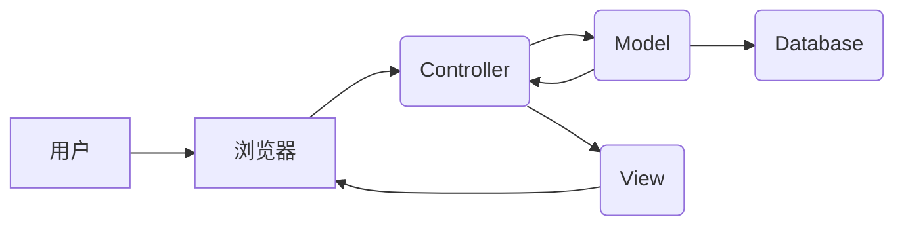

##  基于电子商务的网上购物系统详细设计与具体代码实现

作者：禅与计算机程序设计艺术

## 1. 背景介绍

### 1.1 电子商务的兴起与发展

近年来，随着互联网技术的快速发展和普及，电子商务已经成为人们生活中不可或缺的一部分。从最初的简单的在线交易平台，到如今功能完善、体验丰富的综合性电商平台，电子商务经历了翻天覆地的变化。电子商务的兴起不仅改变了人们的消费习惯，也为传统企业带来了新的发展机遇。

### 1.2 网上购物系统的需求分析

网上购物系统作为电子商务的核心组成部分，其功能的完善性和用户体验的友好性直接影响着电商平台的竞争力。一个成功的网上购物系统需要满足以下几方面的需求：

*   **功能全面**: 包括商品展示、购物车、订单管理、支付、物流、售后服务等功能模块，能够满足用户完整的购物流程需求。
*   **用户体验**: 界面简洁美观、操作方便快捷、信息清晰易懂，能够为用户提供舒适便捷的购物体验。
*   **安全可靠**: 能够保障用户信息和交易数据的安全，防止恶意攻击和数据泄露。
*   **高性能**: 能够应对高并发访问、大数据量处理等挑战，保证系统的稳定性和响应速度。
*   **可扩展**: 能够根据业务需求灵活扩展系统功能，适应不断变化的市场环境。

### 1.3 本文研究内容概述

本文将以构建一个基于电子商务的网上购物系统为例，详细介绍系统的设计思路、技术架构、功能模块以及代码实现。文章将从需求分析、系统设计、数据库设计、代码实现、系统测试等方面进行全面的阐述，旨在为读者提供一个完整的网上购物系统开发指南。

## 2. 核心概念与联系

### 2.1 系统架构设计

#### 2.1.1 架构模式选择

本系统采用经典的MVC（Model-View-Controller）架构模式进行设计，将系统划分为模型层、视图层和控制层，各层之间相互独立，职责分明，有利于提高系统的可维护性和可扩展性。

#### 2.1.2 架构图解



### 2.2 核心模块划分

本系统主要包括以下几个核心模块：

*   **用户模块**: 处理用户注册、登录、个人信息管理等功能。
*   **商品模块**: 处理商品信息的添加、修改、删除、查询等功能。
*   **购物车模块**: 处理用户添加商品到购物车、修改商品数量、删除商品等功能。
*   **订单模块**: 处理用户下单、支付、查看订单状态、取消订单等功能。
*   **支付模块**: 对接第三方支付平台，实现在线支付功能。
*   **物流模块**: 对接物流公司接口，实现订单物流信息查询功能。
*   **后台管理模块**: 提供管理员对系统进行管理的功能，包括商品管理、用户管理、订单管理等。

### 2.3 模块间联系

各模块之间通过接口进行交互，例如：

*   用户模块提供用户登录接口，供其他模块调用验证用户身份。
*   商品模块提供商品查询接口，供用户模块和购物车模块调用获取商品信息。
*   购物车模块提供购物车信息接口，供订单模块调用生成订单。
*   订单模块提供订单支付接口，供支付模块调用完成支付操作。

## 3. 核心算法原理具体操作步骤

### 3.1 商品推荐算法

#### 3.1.1 协同过滤算法

协同过滤算法是一种常用的商品推荐算法，其基本原理是根据用户的历史行为数据，找到与目标用户兴趣相似的其他用户，然后将这些相似用户购买过的商品推荐给目标用户。

#### 3.1.2 算法步骤

1.  收集用户历史行为数据，例如用户的浏览记录、购买记录、收藏记录等。
2.  根据用户行为数据，计算用户之间的相似度，例如可以使用余弦相似度、皮尔逊相关系数等指标。
3.  找到与目标用户兴趣最相似的 K 个用户，构成目标用户的邻居集合。
4.  统计邻居集合中用户购买过的商品，并按照一定的规则进行排序，例如可以按照商品的购买次数、评分等指标进行排序。
5.  将排序靠前的 N 个商品推荐给目标用户。

### 3.2 订单生成算法

#### 3.2.1 分布式锁

在高并发场景下，为了避免多个用户同时操作同一订单数据导致数据不一致的问题，需要使用分布式锁来保证订单生成过程的原子性。

#### 3.2.2 算法步骤

1.  用户提交订单请求。
2.  系统获取分布式锁，锁定该用户的订单数据。
3.  从购物车中获取用户选择的商品信息。
4.  生成订单号，创建订单记录。
5.  扣减商品库存。
6.  更新用户账户余额。
7.  释放分布式锁。

## 4. 数学模型和公式详细讲解举例说明

### 4.1 用户相似度计算

#### 4.1.1 余弦相似度

余弦相似度是一种常用的计算两个向量之间相似度的指标，其取值范围为 \[-1, 1]，值越大表示两个向量越相似。

假设用户 A 和用户 B 的行为向量分别为：

$$
\vec{A} = (a_1, a_2, ..., a_n)
$$

$$
\vec{B} = (b_1, b_2, ..., b_n)
$$

则用户 A 和用户 B 之间的余弦相似度计算公式为：

$$
\cos(\theta) = \frac{\vec{A} \cdot \vec{B}}{||\vec{A}|| \times ||\vec{B}||} = \frac{\sum_{i=1}^{n} a_i b_i}{\sqrt{\sum_{i=1}^{n} a_i^2} \times \sqrt{\sum_{i=1}^{n} b_i^2}}
$$

#### 4.1.2 举例说明

假设用户 A 购买了商品 1、商品 2、商品 3，用户 B 购买了商品 2、商品 3、商品 4，则用户 A 和用户 B 的行为向量分别为：

$$
\vec{A} = (1, 1, 1, 0)
$$

$$
\vec{B} = (0, 1, 1, 1)
$$

则用户 A 和用户 B 之间的余弦相似度为：

$$
\cos(\theta) = \frac{1 \times 0 + 1 \times 1 + 1 \times 1 + 0 \times 1}{\sqrt{1^2 + 1^2 + 1^2 + 0^2} \times \sqrt{0^2 + 1^2 + 1^2 + 1^2}} = \frac{2}{\sqrt{3} \times \sqrt{3}} = \frac{2}{3}
$$

### 4.2 库存扣减

#### 4.2.1 乐观锁

乐观锁是一种 optimistic 的并发控制机制，它假设数据在一般情况下不会发生冲突，因此在读取数据时不进行加锁，而是在更新数据时判断数据是否被其他线程修改过，如果被修改过则更新失败，否则更新成功。

#### 4.2.2 算法步骤

1.  读取商品库存信息。
2.  判断商品库存是否充足。
3.  如果库存充足，则将商品库存减去购买数量。
4.  更新商品库存信息，并判断更新是否成功。
5.  如果更新成功，则扣减库存成功，否则扣减库存失败。

## 5. 项目实践：代码实例和详细解释说明

### 5.1 技术选型

本项目采用以下技术栈进行开发：

*   后端框架：Spring Boot
*   数据库：MySQL
*   缓存：Redis
*   消息队列：RabbitMQ
*   搜索引擎：Elasticsearch
*   前端框架：Vue.js

### 5.2 代码示例

#### 5.2.1 用户登录接口

```java
@RestController
@RequestMapping("/user")
public class UserController {

    @Autowired
    private UserService userService;

    @PostMapping("/login")
    public Result login(@RequestBody UserLoginRequest request) {
        // 参数校验
        if (StringUtils.isEmpty(request.getUsername()) || StringUtils.isEmpty(request.getPassword())) {
            return Result.fail("用户名或密码不能为空");
        }

        // 调用 Service 层进行登录校验
        User user = userService.login(request.getUsername(), request.getPassword());
        if (user == null) {
            return Result.fail("用户名或密码错误");
        }

        // 生成 token
        String token = JwtUtil.createToken(user.getId());

        // 返回登录成功结果
        return Result.success(token);
    }
}
```

#### 5.2.2 商品详情页

```html
<template>
  <div class="product-detail">
    <div class="product-image">
      
    </div>
    <div class="product-info">
      <h1>{{ product.name }}</h1>
      <p>价格：￥{{ product.price }}</p>
      <p>库存：{{ product.stock }}</p>
      <button @click="addToCart">加入购物车</button>
    </div>
  </div>
</template>

<script>
export default {
  data() {
    return {
      productId: this.$route.params.id,
      product: {}
    };
  },
  mounted() {
    this.getProductDetail();
  },
  methods: {
    getProductDetail() {
      // 调用 API 获取商品详情
      this.$axios.get(`/product/${this.productId}`)
        .then(response => {
          this.product = response.data;
        })
        .catch(error => {
          console.error(error);
        });
    },
    addToCart() {
      // 调用 API 将商品添加到购物车
      this.$axios.post('/cart', {
        productId: this.productId,
        quantity: 1
      })
        .then(response => {
          // 添加成功，提示用户
          this.$message.success('已加入购物车');
        })
        .catch(error => {
          console.error(error);
        });
    }
  }
};
</script>
```

## 6. 实际应用场景

### 6.1 电商平台

网上购物系统是电商平台的核心组成部分，例如淘宝、京东、亚马逊等电商平台都离不开网上购物系统。

### 6.2 企业官网

越来越多的企业开始搭建自己的官网，并在官网上开设在线商城，为用户提供在线购物服务。

### 6.3 线下门店

随着 O2O 模式的发展，越来越多的线下门店开始搭建自己的网上购物系统，为用户提供线上线下融合的购物体验。

## 7. 总结：未来发展趋势与挑战

### 7.1 未来发展趋势

*   **个性化推荐**: 随着人工智能技术的不断发展，个性化推荐将成为网上购物系统的重要发展趋势，系统将能够根据用户的兴趣爱好、购买习惯等信息，为用户推荐更加精准的商品。
*   **智能客服**: 智能客服机器人将逐渐取代人工客服，为用户提供更加高效、便捷的咨询服务。
*   **虚拟现实/增强现实**: 虚拟现实/增强现实技术将为用户带来更加沉浸式的购物体验，例如用户可以在虚拟的试衣间中试穿衣服，或者在现实场景中查看商品的 3D 模型。

### 7.2 面临挑战

*   **数据安全**: 随着网上购物系统处理的数据量越来越大，数据安全问题也越来越突出，如何保障用户信息和交易数据的安全将是系统开发过程中需要重点关注的问题。
*   **高并发**: 在促销活动等高峰期，网上购物系统需要应对高并发的访问请求，如何保证系统的稳定性和响应速度将是一项巨大的挑战。
*   **用户体验**: 随着用户对购物体验的要求越来越高，如何提升系统的易用性、便捷性和趣味性将是系统开发过程中需要不断探索和创新的问题。

## 8. 附录：常见问题与解答

### 8.1 如何防止恶意刷单？

为了防止恶意刷单，可以采取以下措施：

*   **加强账号注册审核**: 对新注册账号进行严格的审核，例如可以通过手机号码验证、邮箱验证等方式来验证用户的真实身份。
*   **限制单个账号的操作频率**: 限制单个账号在短时间内的下单次数、支付次数等操作频率，防止恶意用户利用程序进行刷单。
*   **使用风控系统**: 接入第三方风控系统，对用户的行为进行实时监控和分析，识别并拦截异常行为。

### 8.2 如何保证支付安全？

为了保证支付安全，可以采取以下措施：

*   **使用 HTTPS 协议**: 对网站进行 HTTPS 加密，保障用户在网站上输入的支付信息不被窃取。
*   **对接安全可靠的第三方支付平台**: 选择安全可靠的第三方支付平台，例如支付宝、微信支付等，将支付环节交给专业的第三方平台来处理。
*   **对支付密码进行加密存储**: 不要将用户的支付密码明文存储在数据库中，而是使用安全的加密算法对支付密码进行加密存储。
