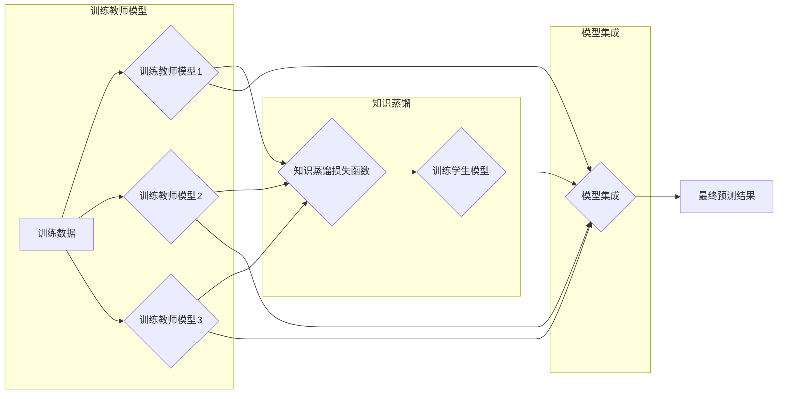

## 基于知识蒸馏的模型集成新方法

作者：禅与计算机程序设计艺术

## 1. 背景介绍

### 1.1 模型集成的意义

在机器学习领域，模型集成是一种有效的提升模型性能的方法。其核心思想是训练多个不同的模型，并将其预测结果进行组合，以获得比单个模型更准确、更鲁棒的预测结果。模型集成的有效性已经被广泛证明，并在各种机器学习任务中取得了显著成果。

### 1.2 知识蒸馏的引入

然而，传统的模型集成方法通常需要训练和维护多个模型，这会带来巨大的计算和存储开销，尤其是在处理大规模数据集和复杂模型时。为了解决这个问题，知识蒸馏技术应运而生。知识蒸馏旨在将一个或多个复杂模型（教师模型）的知识压缩到一个更小、更快的模型（学生模型）中，从而在保持模型性能的同时降低计算和存储成本。

### 1.3 本文目标

本文将介绍一种基于知识蒸馏的模型集成新方法，该方法结合了模型集成和知识蒸馏的优势，能够在保证模型性能的同时，有效降低模型的复杂度和计算成本。

## 2. 核心概念与联系

### 2.1 模型集成

模型集成是指训练多个不同的模型，并将它们的预测结果进行组合，以获得比单个模型更准确、更鲁棒的预测结果。常见的模型集成方法包括：

* **Bagging（Bootstrap Aggregating）**: 通过对训练集进行 Bootstrap 抽样，训练多个相同的模型，并通过投票或平均的方式组合其预测结果。
* **Boosting**:  按照顺序训练多个模型，每个模型都试图修正之前模型的错误。常见的 Boosting 算法包括 AdaBoost、Gradient Boosting 等。
* **Stacking**:  将多个模型的预测结果作为新的特征，输入到一个新的模型（元学习器）中进行训练，以获得最终的预测结果。

### 2.2 知识蒸馏

知识蒸馏是指将一个或多个复杂模型（教师模型）的知识压缩到一个更小、更快的模型（学生模型）中。常见的知识蒸馏方法包括：

* **基于 logits 的蒸馏**:  将教师模型输出层的 logits（未经 softmax 处理的预测结果）作为软标签，用于训练学生模型。
* **基于特征的蒸馏**: 将教师模型中间层的特征作为额外的监督信息，用于训练学生模型。
* **基于关系的蒸馏**:  将教师模型不同样本之间的关系作为额外的监督信息，用于训练学生模型。

### 2.3 模型集成与知识蒸馏的联系

模型集成和知识蒸馏都是为了提升模型性能的技术，它们之间存在着密切的联系。模型集成可以看作是一种特殊的知识蒸馏，其中每个个体模型都是一个教师模型，而集成模型则是学生模型。知识蒸馏可以用于改进模型集成，例如通过将多个教师模型的知识蒸馏到一个学生模型中，可以有效降低模型集成的复杂度和计算成本。

## 3. 核心算法原理具体操作步骤

### 3.1 算法概述

本文提出的基于知识蒸馏的模型集成新方法主要包括以下步骤：

1. **训练多个不同的教师模型**:  使用不同的模型结构、超参数或训练数据，训练多个不同的教师模型。
2. **构建知识蒸馏损失函数**:  定义一个知识蒸馏损失函数，用于衡量学生模型与教师模型之间的差异。
3. **训练学生模型**:  使用训练数据和知识蒸馏损失函数，训练一个学生模型。
4. **模型集成**:  将学生模型与教师模型进行集成，以获得最终的预测结果。

### 3.2 知识蒸馏损失函数

知识蒸馏损失函数的设计是该方法的关键。一个有效的知识蒸馏损失函数应该能够有效地将教师模型的知识迁移到学生模型中。在本方法中，我们采用以下知识蒸馏损失函数：

```
L = α * L_CE(y, y_s) + β * L_KL(p_t, p_s)
```

其中：

* $L_CE$ 表示交叉熵损失函数，用于衡量学生模型预测结果 $y_s$ 与真实标签 $y$ 之间的差异。
* $L_KL$ 表示 Kullback-Leibler 散度，用于衡量教师模型预测概率分布 $p_t$ 与学生模型预测概率分布 $p_s$ 之间的差异。
* $\alpha$ 和 $\beta$ 是权重系数，用于平衡两个损失函数的贡献。

### 3.3 模型集成方法

在本方法中，我们采用简单的平均法进行模型集成，即将学生模型和所有教师模型的预测结果进行平均，作为最终的预测结果。

### 3.4 算法流程图



## 4. 数学模型和公式详细讲解举例说明

### 4.1 交叉熵损失函数

交叉熵损失函数是分类问题中常用的损失函数，用于衡量模型预测概率分布与真实标签之间的差异。其公式如下：

```
L_CE(y, y') = - \sum_{i=1}^{C} y_i * log(y'_i)
```

其中：

* $y$ 表示真实标签，是一个 one-hot 向量，其中只有一个元素为 1，表示样本所属的类别，其他元素均为 0。
* $y'$ 表示模型预测的概率分布，是一个长度为类别数 $C$ 的向量，每个元素表示样本属于对应类别的概率。

### 4.2 Kullback-Leibler 散度

Kullback-Leibler 散度用于衡量两个概率分布之间的差异。其公式如下：

```
L_KL(p, q) = \sum_{i=1}^{N} p_i * log(\frac{p_i}{q_i})
```

其中：

* $p$ 和 $q$ 表示两个概率分布，长度均为 $N$。

### 4.3 知识蒸馏损失函数举例说明

假设我们有一个二分类问题，真实标签为 $y = [0, 1]$，教师模型预测的概率分布为 $p_t = [0.2, 0.8]$，学生模型预测的概率分布为 $p_s = [0.3, 0.7]$。则知识蒸馏损失函数的计算过程如下：

```
L_CE(y, p_s) = - (0 * log(0.3) + 1 * log(0.7)) = 0.357
L_KL(p_t, p_s) = 0.2 * log(0.2 / 0.3) + 0.8 * log(0.8 / 0.7) = 0.045
L = α * 0.357 + β * 0.045
```

其中，$\alpha$ 和 $\beta$ 是权重系数，需要根据具体问题进行调整。

## 5. 项目实践：代码实例和详细解释说明

### 5.1 代码实例

```python
import tensorflow as tf

# 定义教师模型
teacher_model = tf.keras.models.Sequential([
  tf.keras.layers.Dense(128, activation='relu'),
  tf.keras.layers.Dense(10, activation='softmax')
])

# 定义学生模型
student_model = tf.keras.models.Sequential([
  tf.keras.layers.Dense(64, activation='relu'),
  tf.keras.layers.Dense(10, activation='softmax')
])

# 定义知识蒸馏损失函数
def distillation_loss(teacher_logits, student_logits, labels, alpha=0.5, temperature=5.0):
  # 计算交叉熵损失
  ce_loss = tf.keras.losses.CategoricalCrossentropy()(labels, student_logits)
  # 计算 KL 散度
  teacher_probs = tf.nn.softmax(teacher_logits / temperature)
  student_probs = tf.nn.softmax(student_logits / temperature)
  kl_loss = tf.keras.losses.KLDivergence()(teacher_probs, student_probs)
  # 返回总损失
  return alpha * ce_loss + (1 - alpha) * kl_loss

# 编译学生模型
student_model.compile(
    optimizer='adam',
    loss=distillation_loss,
    metrics=['accuracy']
)

# 训练学生模型
student_model.fit(
    x_train,
    y_train,
    epochs=10,
    validation_data=(x_val, y_val),
)

# 模型集成
teacher_predictions = teacher_model.predict(x_test)
student_predictions = student_model.predict(x_test)
ensemble_predictions = (teacher_predictions + student_predictions) / 2

# 评估模型性能
ensemble_accuracy = tf.keras.metrics.CategoricalAccuracy()(y_test, ensemble_predictions)
print('Ensemble Accuracy:', ensemble_accuracy.numpy())
```

### 5.2 代码解释

* 首先，我们定义了教师模型和学生模型。
* 然后，我们定义了知识蒸馏损失函数 `distillation_loss`，该函数接收教师模型的 logits、学生模型的 logits、真实标签、权重系数 $\alpha$ 和温度参数 $T$ 作为输入，并返回总损失。
* 接着，我们使用 `distillation_loss` 作为损失函数，编译学生模型。
* 然后，我们使用训练数据训练学生模型。
* 最后，我们使用教师模型和学生模型分别对测试集进行预测，并将两者的预测结果进行平均，作为最终的预测结果。

## 6. 实际应用场景

基于知识蒸馏的模型集成新方法可以应用于各种机器学习任务，例如：

* **图像分类**:  可以使用多个预训练的图像分类模型作为教师模型，训练一个更小、更快的学生模型，用于移动设备或嵌入式系统。
* **自然语言处理**:  可以使用多个预训练的语言模型作为教师模型，训练一个更小、更快的学生模型，用于文本分类、情感分析等任务。
* **语音识别**:  可以使用多个预训练的语音识别模型作为教师模型，训练一个更小、更快的学生模型，用于语音助手、智能家居等场景。

## 7. 总结：未来发展趋势与挑战

基于知识蒸馏的模型集成方法是一种有效的提升模型性能和降低模型复杂度的方法，具有广泛的应用前景。未来，该方法的发展趋势和挑战包括：

* **探索更有效的知识蒸馏方法**:  现有的知识蒸馏方法还存在一些局限性，例如对噪声数据的鲁棒性较差，需要探索更有效的知识蒸馏方法。
* **研究面向特定任务的知识蒸馏方法**:  不同任务对模型的要求不同，需要研究面向特定任务的知识蒸馏方法，以获得更好的性能。
* **结合其他模型压缩技术**:  知识蒸馏可以与其他模型压缩技术（如剪枝、量化）相结合，以进一步降低模型的复杂度和计算成本。

## 8. 附录：常见问题与解答

### 8.1 为什么需要进行模型集成？

模型集成可以有效提升模型的泛化能力和鲁棒性。这是因为不同的模型通常会学习到数据的不同方面，通过将多个模型的预测结果进行组合，可以获得比单个模型更全面、更准确的预测结果。

### 8.2 为什么需要进行知识蒸馏？

知识蒸馏可以将复杂模型的知识压缩到更小、更快的模型中，从而在保持模型性能的同时降低计算和存储成本。这对于资源受限的场景（如移动设备、嵌入式系统）尤为重要。

### 8.3 如何选择合适的知识蒸馏方法？

选择合适的知识蒸馏方法需要考虑多个因素，例如任务类型、数据集大小、模型复杂度等。一般来说，对于分类问题，可以使用基于 logits 的蒸馏或基于特征的蒸馏；对于回归问题，可以使用基于特征的蒸馏或基于关系的蒸馏。

### 8.4 如何评估模型集成的性能？

评估模型集成的性能可以使用与评估单个模型相同的指标，例如准确率、精确率、召回率等。此外，还可以使用集成模型的预测结果与真实标签之间的差异（如均方误差、交叉熵等）来评估模型集成的性能。
