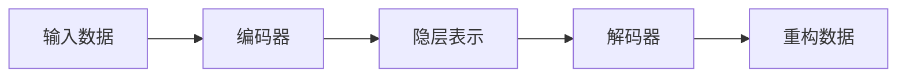

# 基于自编码器的无监督特征学习方法与实践

作者：禅与计算机程序设计艺术

## 1. 背景介绍

### 1.1 无监督学习的兴起

在机器学习领域，传统的监督学习方法依赖于大量的标注数据进行模型训练。然而，在现实世界中，获取大量的标注数据往往代价高昂且耗时费力。为了克服这一难题，无监督学习应运而生，它旨在从无标签数据中学习数据的内在结构和模式，从而实现对数据的有效表示和分析。

### 1.2 特征学习的重要性

特征学习是机器学习中的一个重要研究方向，其目标是从原始数据中自动学习出有效的特征表示，以提高机器学习模型的性能。传统的特征工程方法通常依赖于人工经验和领域知识，存在着主观性强、泛化能力差等问题。而无监督特征学习方法则可以自动地从数据中学习特征，避免了人工干预，具有更好的泛化能力。

### 1.3 自编码器：强大的无监督特征学习工具

自编码器（Autoencoder，AE）是一种强大的无监督特征学习工具，它可以学习到数据的低维表示，并通过这种低维表示重构原始数据。自编码器由编码器和解码器两部分组成，编码器将高维数据映射到低维空间，解码器则将低维表示映射回高维空间。通过最小化重构误差，自编码器可以学习到数据的有效特征表示。

## 2. 核心概念与联系

### 2.1 自编码器的基本结构



如上图所示，自编码器由编码器和解码器两部分组成：

- **编码器（Encoder）：** 将输入数据 x 映射到低维的隐层表示 z，通常用一个神经网络来实现。
- **解码器（Decoder）：** 将隐层表示 z 映射回原始数据空间，也通常用一个神经网络来实现。

### 2.2 自编码器的训练目标

自编码器的训练目标是最小化重构误差，即最小化重构数据与原始数据之间的差异。常用的重构误差函数包括均方误差（MSE）、交叉熵等。

### 2.3 自编码器的变种

除了基本的自编码器结构外，还有许多变种，例如：

- **欠完备自编码器（Undercomplete Autoencoder）：** 隐层节点数小于输入数据的维度，迫使模型学习数据的压缩表示。
- **稀疏自编码器（Sparse Autoencoder）：** 对隐层节点的激活值进行稀疏性约束，使得只有少数隐层节点被激活，从而学习到数据的稀疏表示。
- **变分自编码器（Variational Autoencoder，VAE）：** 将隐层表示建模为概率分布，可以用于生成新的数据。

## 3. 核心算法原理具体操作步骤

### 3.1 构建自编码器模型

首先，需要根据具体的数据集和任务需求，选择合适的自编码器结构，并确定编码器和解码器的网络结构、激活函数等参数。

### 3.2 训练自编码器模型

使用训练数据集对自编码器模型进行训练，最小化重构误差。常用的优化算法包括随机梯度下降（SGD）、Adam等。

### 3.3 获取特征表示

训练完成后，可以使用编码器将新的数据映射到低维空间，得到数据的特征表示。

### 3.4 应用特征表示

将学习到的特征表示应用于下游任务，例如分类、聚类、回归等。

## 4. 数学模型和公式详细讲解举例说明

### 4.1 均方误差（MSE）

均方误差是常用的重构误差函数，其计算公式如下：

$$
MSE = \frac{1}{n} \sum_{i=1}^{n} (x_i - \hat{x_i})^2
$$

其中，$n$ 表示样本数量，$x_i$ 表示第 $i$ 个样本的原始数据，$\hat{x_i}$ 表示第 $i$ 个样本的重构数据。

### 4.2 稀疏自编码器

稀疏自编码器对隐层节点的激活值进行稀疏性约束，常用的方法是在损失函数中加入 KL 散度项，其计算公式如下：

$$
L = MSE + \beta \sum_{j=1}^{m} KL(\rho || \hat{\rho_j})
$$

其中，$\beta$ 是控制稀疏性强度的超参数，$m$ 表示隐层节点数量，$\rho$ 是预先设定的稀疏度参数，$\hat{\rho_j}$ 表示第 $j$ 个隐层节点的平均激活值，$KL(\cdot || \cdot)$ 表示 KL 散度。

## 5. 项目实践：代码实例和详细解释说明

```python
import tensorflow as tf

# 构建自编码器模型
def build_autoencoder(input_dim, encoding_dim):
    # 编码器
    inputs = tf.keras.Input(shape=(input_dim,))
    encoded = tf.keras.layers.Dense(encoding_dim, activation='relu')(inputs)
    
    # 解码器
    decoded = tf.keras.layers.Dense(input_dim, activation='sigmoid')(encoded)
    
    # 构建自编码器模型
    autoencoder = tf.keras.Model(inputs=inputs, outputs=decoded)
    
    # 编译模型
    autoencoder.compile(optimizer='adam', loss='mse')
    
    return autoencoder

# 训练自编码器模型
def train_autoencoder(autoencoder, x_train, epochs=50, batch_size=32):
    autoencoder.fit(x_train, x_train, epochs=epochs, batch_size=batch_size)
    
# 获取特征表示
def get_encoded_representation(autoencoder, x):
    encoder = tf.keras.Model(inputs=autoencoder.input, outputs=autoencoder.layers[1].output)
    return encoder.predict(x)

# 示例：使用 MNIST 数据集训练自编码器
(x_train, _), (x_test, _) = tf.keras.datasets.mnist.load_data()
x_train = x_train.astype('float32') / 255.0
x_test = x_test.astype('float32') / 255.0
x_train = x_train.reshape((len(x_train), 28 * 28))
x_test = x_test.reshape((len(x_test), 28 * 28))

# 构建自编码器模型
autoencoder = build_autoencoder(input_dim=784, encoding_dim=32)

# 训练自编码器模型
train_autoencoder(autoencoder, x_train)

# 获取特征表示
encoded_imgs = get_encoded_representation(autoencoder, x_test)

# 打印特征维度
print(encoded_imgs.shape)
```

## 6. 实际应用场景

### 6.1 图像处理

- **图像去噪：** 使用自编码器学习图像的干净表示，去除噪声。
- **图像压缩：** 使用自编码器学习图像的压缩表示，减少存储空间和传输带宽。
- **图像生成：** 使用变分自编码器生成新的图像。

### 6.2 自然语言处理

- **文本表示：** 使用自编码器学习文本的低维表示，用于文本分类、情感分析等任务。
- **机器翻译：** 使用自编码器学习源语言和目标语言的共同表示，提高翻译质量。

### 6.3 其他领域

- **异常检测：** 使用自编码器学习正常数据的表示，识别异常数据。
- **推荐系统：** 使用自编码器学习用户和物品的特征表示，提高推荐精度。

## 7. 工具和资源推荐

### 7.1 深度学习框架

- TensorFlow
- PyTorch
- Keras

### 7.2 数据集

- MNIST
- CIFAR-10
- ImageNet

### 7.3 学习资源

- Deep Learning by Ian Goodfellow, Yoshua Bengio, and Aaron Courville
- Stanford CS231n: Convolutional Neural Networks for Visual Recognition

## 8. 总结：未来发展趋势与挑战

### 8.1 未来发展趋势

- **更强大的自编码器结构：** 研究更深、更复杂的 tự động hóa cấu trúc，以学习更复杂的數據表示。
- **与其他机器学习方法的结合：** 将自编码器与其他机器学习方法（例如强化学习、对抗生成网络）相结合，以解决更具挑战性的问题。
- **应用于更广泛的领域：** 将自编码器应用于更多领域，例如医疗、金融、交通等。

### 8.2 面临的挑战

- **模型的可解释性：** 自编码器学习到的特征表示通常难以解释，需要开发新的方法来提高模型的可解释性。
- **数据的复杂性：** 现实世界中的数据往往非常复杂，需要开发更强大的自编码器模型来处理这些数据。
- **计算资源的需求：** 训练大型自编码器模型需要大量的计算资源，需要开发更高效的训练算法和硬件加速技术。

## 9. 附录：常见问题与解答

### 9.1 什么是自编码器？

自编码器是一种无监督学习算法，它可以学习到数据的低维表示，并通过这种低维表示重构原始数据。

### 9.2 自编码器有哪些应用？

自编码器可以应用于图像处理、自然语言处理、异常检测、推荐系统等多个领域。

### 9.3 如何选择合适的自编码器结构？

选择合适的自编码器结构需要考虑数据集的大小、数据的维度、任务需求等因素。

### 9.4 如何评估自编码器的性能？

可以使用重构误差、下游任务性能等指标来评估自编码器的性能。
