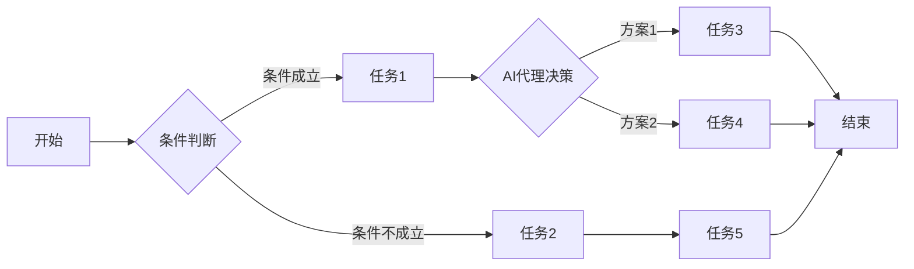

## 1. 背景介绍

### 1.1.  数字化转型浪潮下的工作流自动化

随着信息技术的飞速发展，企业数字化转型已成为不可逆转的趋势。在数字化转型浪潮中，工作流自动化作为提高效率、降低成本、优化流程的重要手段，正被越来越多的企业所采用。传统的基于人工操作的工作方式效率低下、易出错且难以追溯，而工作流自动化可以将这些重复、繁琐的任务交由计算机系统自动执行，从而释放人力资源，使其专注于更有价值的工作。

### 1.2. 基于规则的工作流引擎的优势与局限性

在众多工作流自动化技术中，基于规则的工作流引擎以其灵活、易用、易扩展等优点，成为众多企业构建自动化流程的首选。基于规则的工作流引擎允许用户使用预定义的规则集来定义和管理业务流程，而无需编写复杂的代码。这使得业务人员也能够参与到流程的定义和维护中，从而提高了流程的灵活性和可维护性。

然而，传统的基于规则的工作流引擎也存在一些局限性。例如：

* **难以处理复杂场景:**  当业务流程过于复杂，涉及大量条件判断和分支路径时，基于规则的配置会变得异常繁琐，甚至难以实现。
* **缺乏学习和适应能力:**  传统的基于规则的工作流引擎只能按照预先定义的规则执行，无法根据实际情况进行动态调整，缺乏学习和适应能力。
* **对人工干预依赖性强:**  当出现异常情况或需要进行流程变更时，往往需要人工介入进行处理，效率低下且容易出错。

### 1.3. AI代理：赋能工作流引擎的新思路

为了克服传统基于规则的工作流引擎的局限性，将人工智能(AI)技术引入工作流引擎已成为当前研究的热点。AI代理作为一种能够感知环境、自主决策和执行动作的智能体，可以为工作流引擎带来以下优势:

* **智能决策:**  AI代理可以利用机器学习、深度学习等技术，从历史数据中学习和优化决策模型，从而实现更智能的流程路由和任务分配。
* **自适应学习:**  AI代理可以根据流程执行过程中的实时数据和反馈信息，动态调整自身的行为，从而适应不断变化的业务环境。
* **异常处理和预测:**  AI代理可以识别流程执行过程中的异常情况，并采取相应的措施进行处理，甚至可以预测潜在的风险，提前采取预防措施。

## 2. 核心概念与联系

### 2.1. 工作流 (Workflow)

工作流是指一系列相互连接、自动执行的任务，这些任务按照一定的规则和顺序进行，以完成特定的业务目标。

### 2.2. 基于规则的工作流引擎 (Rule-based Workflow Engine)

基于规则的工作流引擎是一种使用预定义的规则集来定义和管理业务流程的软件系统。用户可以使用图形化界面或脚本语言来定义规则，并将其部署到引擎中执行。

### 2.3. AI代理 (AI Agent)

AI代理是一种能够感知环境、自主决策和执行动作的智能体。它可以利用机器学习、深度学习等技术，从数据中学习和优化自身的决策模型。

### 2.4. 集成应用 (Integration)

集成应用是指将不同的软件系统或组件组合在一起，以实现更强大的功能或自动化更复杂的业务流程。

### 2.5. 核心概念之间的联系

* 工作流定义了业务流程的步骤和顺序。
* 基于规则的工作流引擎提供了一个执行工作流的平台。
* AI代理可以作为工作流引擎中的一个组件，为其提供智能决策、自适应学习和异常处理等能力。
* 集成应用可以将工作流引擎与其他系统连接起来，实现更广泛的自动化。

## 3. 核心算法原理具体操作步骤

### 3.1. 基于规则的工作流引擎工作原理

基于规则的工作流引擎通常采用以下步骤来执行工作流：

1. **流程定义:** 使用图形化界面或脚本语言定义工作流的各个步骤、规则和路径。
2. **规则配置:** 为每个步骤配置相应的规则，例如条件判断、数据处理、任务分配等。
3. **流程实例化:** 当需要执行工作流时，引擎会创建一个流程实例，并将初始数据传递给第一个步骤。
4. **规则匹配:** 引擎会根据当前步骤的规则，匹配符合条件的分支路径。
5. **任务执行:** 引擎会将匹配到的任务分配给相应的执行者，并等待任务完成。
6. **状态更新:** 当任务完成后，引擎会更新流程实例的状态，并根据规则跳转到下一个步骤。
7. **流程结束:** 当所有步骤都执行完毕后，流程实例结束。

### 3.2. AI代理集成到工作流引擎的步骤

1. **确定AI代理的角色:** 首先需要明确AI代理在工作流中的角色，例如决策者、执行者、监控者等。
2. **选择合适的AI算法:** 根据AI代理的角色和要解决的问题，选择合适的机器学习、深度学习或其他AI算法。
3. **数据准备:** 收集和准备训练AI模型所需的数据，例如历史流程数据、业务规则、用户行为等。
4. **模型训练:** 使用准备好的数据训练AI模型，并评估其性能。
5. **代理部署:** 将训练好的AI模型部署到工作流引擎中，并将其与相应的步骤或任务关联起来。
6. **代理调用:** 在工作流执行过程中，当需要AI代理进行决策或执行任务时，引擎会调用相应的代理。
7. **反馈学习:** AI代理可以根据流程执行过程中的实时数据和反馈信息，动态调整自身的行为，不断优化决策模型。

### 3.3.  流程图示例



## 4. 数学模型和公式详细讲解举例说明

### 4.1.  决策树模型

决策树是一种常用的分类和回归算法，可以用于构建AI代理的决策模型。

**举例说明:**

假设我们正在构建一个用于审批贷款申请的AI代理。我们可以使用决策树模型来根据申请人的信用评分、收入、负债率等特征，预测其是否会违约。

**数学公式:**

决策树模型的数学公式可以使用信息熵和信息增益来表示。

**信息熵:**

$$
H(X) = -\sum_{i=1}^{n} p_i \log_2 p_i
$$

其中，$X$ 是一个随机变量，$p_i$ 是 $X$ 取值为 $x_i$ 的概率。

**信息增益:**

$$
IG(S, A) = H(S) - \sum_{v \in Values(A)} \frac{|S_v|}{|S|} H(S_v)
$$

其中，$S$ 是数据集，$A$ 是一个特征，$Values(A)$ 是 $A$ 所有可能的取值，$S_v$ 是 $S$ 中特征 $A$ 取值为 $v$ 的子集。

**决策树构建:**

决策树的构建过程是一个递归的过程，从根节点开始，每次选择信息增益最大的特征作为当前节点的划分依据，直到所有叶子节点都是纯净的（即所有样本属于同一类别）。

### 4.2.  马尔可夫决策过程 (MDP)

马尔可夫决策过程是一种用于建模序列决策问题的数学框架，可以用于构建AI代理在动态环境中的决策模型。

**举例说明:**

假设我们正在构建一个用于控制机器人在仓库中搬运货物的AI代理。我们可以使用马尔可夫决策过程来建模机器人的状态、动作和奖励，并找到最优的行动策略。

**数学公式:**

马尔可夫决策过程可以用一个五元组 $(S, A, P, R, \gamma)$ 来表示，其中：

* $S$ 是状态空间，表示所有可能的状态。
* $A$ 是动作空间，表示所有可能的动作。
* $P$ 是状态转移概率函数，表示在状态 $s$ 下采取动作 $a$ 后转移到状态 $s'$ 的概率。
* $R$ 是奖励函数，表示在状态 $s$ 下采取动作 $a$ 后获得的奖励。
* $\gamma$ 是折扣因子，表示未来奖励的价值。

**求解方法:**

马尔可夫决策过程的求解方法主要有两种：值迭代和策略迭代。

### 4.3.  深度强化学习 (DRL)

深度强化学习是近年来发展起来的一种结合了深度学习和强化学习的机器学习方法，可以用于构建能够自主学习和适应环境的AI代理。

**举例说明:**

假设我们正在构建一个用于玩游戏的AI代理。我们可以使用深度强化学习来训练一个神经网络，使其能够根据游戏画面做出最佳的操作决策。

**算法原理:**

深度强化学习的基本原理是利用深度神经网络来逼近值函数或策略函数，并使用强化学习算法来优化神经网络的参数。

## 5. 项目实践：代码实例和详细解释说明

### 5.1.  使用 Python 和 SpiffWorkflow 实现基于规则的工作流引擎

```python
from spiffworkflow import Workflow, Task, WorkflowException
from spiffworkflow.specs import Simple, Conditional, Parallel

class ApplyForLoan(Workflow):
    def __init__(self, loan_application):
        self.loan_application = loan_application
        super().__init__("Loan Application Workflow")

    def create_flow(self):
        self.add_task(
            Simple(
                "Submit Application",
                lambda task: self.loan_application.submit(),
            )
        )
        self.add_task(
            Conditional(
                "Credit Check",
                lambda task: self.loan_application.credit_score >= 700,
                True: Simple("Approved", lambda task: self.loan_application.approve()),
                False: Simple("Rejected", lambda task: self.loan_application.reject()),
            )
        )

# 创建贷款申请对象
loan_application = LoanApplication(credit_score=750)

# 创建工作流对象
workflow = ApplyForLoan(loan_application)

# 启动工作流
workflow.complete_all()

# 打印结果
print(loan_application.status)  # 输出：Approved
```

### 5.2.  使用 TensorFlow 和 Keras 构建 AI 代理

```python
import tensorflow as tf
from tensorflow import keras

# 定义 AI 代理模型
model = keras.Sequential(
    [
        keras.layers.Dense(64, activation="relu", input_shape=(10,)),
        keras.layers.Dense(64, activation="relu"),
        keras.layers.Dense(1, activation="sigmoid"),
    ]
)

# 编译模型
model.compile(loss="binary_crossentropy", optimizer="adam", metrics=["accuracy"])

# 训练模型
model.fit(X_train, y_train, epochs=10)

# 使用模型进行预测
predictions = model.predict(X_test)
```

## 6. 实际应用场景

### 6.1.  自动化业务流程

* **OA 系统:**  自动化办公审批流程，例如请假申请、报销申请、合同审批等。
* **CRM 系统:**  自动化客户关系管理流程，例如客户线索跟进、商机管理、订单处理等。
* **ERP 系统:**  自动化企业资源计划流程，例如采购申请、生产计划、库存管理等。

### 6.2.  智能决策支持

* **风险控制:**  利用 AI 代理识别潜在的风险，例如欺诈交易、信用违约等。
* **资源优化:**  利用 AI 代理优化资源配置，例如任务调度、路径规划等。
* **个性化推荐:**  利用 AI 代理为用户提供个性化的产品或服务推荐。

### 6.3.  人机协同

* **智能客服:**  利用 AI 代理与人工客服协同工作，为客户提供更高效、更优质的服务。
* **智能助手:**  利用 AI 代理辅助用户完成各种任务，例如信息查询、日程安排等。
* **智能监控:**  利用 AI 代理辅助人工进行监控和预警，例如网络安全监控、设备故障预警等。

## 7. 总结：未来发展趋势与挑战

### 7.1.  未来发展趋势

* **超自动化:**  将 AI、RPA 等技术与工作流引擎深度融合，实现端到端的流程自动化。
* **低代码/无代码:**  降低工作流引擎的使用门槛，让业务人员也能够轻松构建和管理自动化流程。
* **云原生:**  将工作流引擎部署到云平台，实现弹性伸缩、按需付费等优势。

### 7.2.  挑战

* **数据安全和隐私保护:**  随着 AI 代理在工作流中的应用越来越广泛，数据安全和隐私保护问题也日益突出。
* **模型可解释性和可信度:**  AI 代理的决策过程往往是一个黑盒，如何提高其可解释性和可信度是一个重要的研究方向。
* **人机协同机制:**  如何设计高效的人机协同机制，让 AI 代理与人工更好地协同工作，是一个值得深入探讨的问题。

## 8. 附录：常见问题与解答

### 8.1.  什么是 BPMN？

BPMN（Business Process Model and Notation，业务流程模型和符号）是一种用于建模业务流程的图形化标准。

### 8.2.  什么是 RPA？

RPA（Robotic Process Automation，机器人流程自动化）是一种使用软件机器人来自动执行重复性任务的技术。

### 8.3.  如何选择合适的工作流引擎？

选择工作流引擎需要考虑以下因素：

* 功能需求
* 集成能力
* 易用性
* 成本
* 社区活跃度

### 8.4.  如何学习 AI 代理？

学习 AI 代理可以参考以下资源：

* **书籍:**  《人工智能：一种现代方法》、《深度学习》
* **课程:**  Coursera、Udacity、edX 等平台上的相关课程
* **开源项目:**  TensorFlow、PyTorch、OpenAI Gym 等开源项目