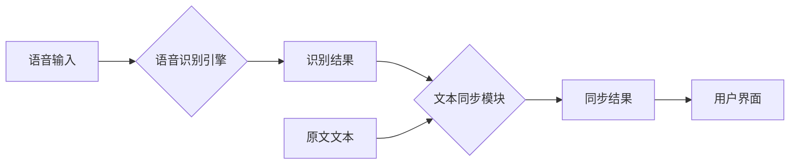

# 基于语音识别的对照阅读器

## 1. 背景介绍

### 1.1 对照阅读的意义

对照阅读是指将两种或多种语言的文本并排放置，方便读者对比阅读，加深理解的一种学习方法。它可以帮助学习者：

* **提高阅读理解能力:** 通过对比不同语言的表达方式，读者可以更准确地理解原文的意思。
* **学习新的语言知识:**  对照阅读可以帮助学习者学习新的词汇、语法和表达方式。
* **提高翻译水平:**  对于翻译学习者来说，对照阅读是提高翻译水平的有效方法。

### 1.2 语音识别技术的应用

语音识别技术 (Automatic Speech Recognition, ASR) 是将人类语音转换为文本的技术。近年来，随着深度学习技术的发展，语音识别技术的准确率和效率都得到了显著提高，并在各个领域得到了广泛应用。

### 1.3 基于语音识别的对照阅读器的优势

传统的对照阅读需要读者手动翻页或切换窗口，效率较低。而基于语音识别的对照阅读器可以通过语音识别技术自动识别读者朗读的文本内容，并与目标语言文本进行同步，从而实现更加便捷、高效的对照阅读体验。

## 2. 核心概念与联系

### 2.1 语音识别

语音识别是将语音信号转换为文本的过程。其基本原理是将语音信号进行特征提取，然后使用声学模型和语言模型对特征进行解码，最终得到文本结果。

#### 2.1.1 声学模型

声学模型用于将语音特征映射到音素序列。常用的声学模型有隐马尔可夫模型 (Hidden Markov Model, HMM) 和深度神经网络 (Deep Neural Network, DNN)。

#### 2.1.2 语言模型

语言模型用于评估一个词序列出现的概率。常用的语言模型有 N-gram 模型和神经网络语言模型。

### 2.2 文本同步

文本同步是指将两种或多种语言的文本按照语义进行对齐的过程。常用的文本同步算法有动态规划算法和基于统计机器翻译的算法。

#### 2.2.1 动态规划算法

动态规划算法是一种基于递归的算法，它将问题分解成若干个子问题，通过求解子问题的解来得到原问题的解。在文本同步中，动态规划算法可以用于计算两个文本之间的编辑距离，从而找到最优的同步路径。

#### 2.2.2 基于统计机器翻译的算法

基于统计机器翻译的算法将文本同步问题看作是一个翻译问题，通过训练一个统计机器翻译模型来实现文本同步。

## 3. 核心算法原理具体操作步骤

### 3.1 系统架构

基于语音识别的对照阅读器系统架构如下图所示：



### 3.2 具体操作步骤

1. **语音输入:** 用户通过麦克风朗读原文文本。
2. **语音识别:** 语音识别引擎将用户的语音信号转换为文本。
3. **文本同步:** 文本同步模块将识别结果与原文文本进行同步，找到对应的目标语言文本片段。
4. **结果展示:** 用户界面将同步结果展示给用户，用户可以方便地进行对照阅读。

## 4. 数学模型和公式详细讲解举例说明

### 4.1 语音识别中的隐马尔可夫模型

隐马尔可夫模型 (HMM) 是一种统计模型，用于描述一个系统在不同状态之间转换的概率，以及在每个状态下观测到不同观测值的概率。

#### 4.1.1 HMM 的基本要素

* **状态集合:**  $S = \{s_1, s_2, ..., s_N\}$
* **观测值集合:**  $O = \{o_1, o_2, ..., o_M\}$
* **状态转移概率矩阵:**  $A = \{a_{ij}\}$, 其中 $a_{ij}$ 表示从状态 $s_i$ 转移到状态 $s_j$ 的概率。
* **观测值概率矩阵:**  $B = \{b_j(k)\}$, 其中 $b_j(k)$ 表示在状态 $s_j$ 下观测到观测值 $o_k$ 的概率。
* **初始状态概率分布:**  $\pi = \{\pi_i\}$, 其中 $\pi_i$ 表示初始状态为 $s_i$ 的概率。

#### 4.1.2 HMM 的三个基本问题

* **评估问题:**  给定一个 HMM 模型 $\lambda = (A, B, \pi)$ 和一个观测值序列 $O$，计算在该模型下观测到该序列的概率 $P(O|\lambda)$。
* **解码问题:**  给定一个 HMM 模型 $\lambda = (A, B, \pi)$ 和一个观测值序列 $O$，找到最有可能产生该观测值序列的状态序列 $S$。
* **学习问题:**  给定一个观测值序列 $O$，找到最优的 HMM 模型参数 $\lambda = (A, B, \pi)$。

### 4.2 文本同步中的编辑距离

编辑距离 (Edit Distance) 是指将一个字符串转换成另一个字符串所需的最少编辑操作次数。常用的编辑操作包括插入、删除和替换。

#### 4.2.1 编辑距离的计算

编辑距离可以使用动态规划算法来计算。假设有两个字符串 $str1$ 和 $str2$，它们的长度分别为 $m$ 和 $n$，则可以使用一个 $m+1$ 行 $n+1$ 列的矩阵来存储计算过程中的中间结果。矩阵的第 $i$ 行第 $j$ 列元素表示将 $str1$ 的前 $i$ 个字符转换成 $str2$ 的前 $j$ 个字符所需的最小编辑距离。

#### 4.2.2 编辑距离的应用

编辑距离可以用于衡量两个字符串之间的相似度。在文本同步中，可以使用编辑距离来找到两个文本之间最相似的片段，从而实现文本同步。

## 5. 项目实践：代码实例和详细解释说明

### 5.1 语音识别模块

可以使用 Python 的 SpeechRecognition 库来实现语音识别功能。

```python
import speech_recognition as sr

# 初始化识别器
r = sr.Recognizer()

# 使用麦克风录制音频
with sr.Microphone() as source:
    print("请说话...")
    audio = r.listen(source)

# 识别语音
try:
    text = r.recognize_google(audio, language="zh-CN")
    print("识别结果:", text)
except sr.UnknownValueError:
    print("无法识别语音")
except sr.RequestError as e:
    print("请求出错:", e)
```

### 5.2 文本同步模块

可以使用 Python 的 difflib 库来计算两个文本之间的差异，并使用动态规划算法找到最优的同步路径。

```python
import difflib

def align_text(text1, text2):
    """
    使用 difflib 库对齐两个文本

    Args:
        text1: 文本 1
        text2: 文本 2

    Returns:
        同步结果
    """

    # 计算两个文本之间的差异
    diff = difflib.ndiff(text1.splitlines(), text2.splitlines())

    # 找到最优的同步路径
    alignment = []
    for line in diff:
        if line.startswith("  "):
            # 相同的行
            alignment.append((line[2:], line[2:]))
        elif line.startswith("+ "):
            # 文本 2 中新增的行
            alignment.append(("", line[2:]))
        elif line.startswith("- "):
            # 文本 1 中删除的行
            alignment.append((line[2:], ""))

    return alignment
```

## 6. 实际应用场景

基于语音识别的对照阅读器可以应用于多种场景，例如：

* **语言学习:**  帮助学习者进行更加高效的对照阅读，提高语言学习效率。
* **翻译:**  帮助译者进行对照翻译，提高翻译质量和效率。
* **字幕生成:**  可以用于自动生成视频或音频的字幕，方便听障人士观看。

## 7. 总结：未来发展趋势与挑战

### 7.1 未来发展趋势

* **更高的识别准确率:** 随着深度学习技术的发展，语音识别技术的准确率将会进一步提高。
* **更多的语言支持:**  未来将会出现支持更多语言的语音识别和文本同步技术。
* **更智能化的功能:**  未来基于语音识别的对照阅读器将会更加智能化，例如可以根据用户的阅读习惯自动调整阅读速度、提供更加个性化的学习建议等。

### 7.2 面临的挑战

* **噪音环境下的语音识别:** 在噪音环境下，语音识别的准确率会受到影响。
* **不同口音的语音识别:** 不同地区、不同人的口音差异较大，这对语音识别技术提出了挑战。
* **文本同步的准确性:**  文本同步的准确性直接影响到对照阅读的效果，需要不断优化算法来提高同步精度。

## 8. 附录：常见问题与解答

### 8.1  问：如何提高语音识别的准确率？

**答：** 

*  使用高质量的麦克风。
*  选择安静的环境进行录音。
*  尽量使用标准的普通话进行朗读。
*  可以使用一些语音识别软件提供的训练功能，对自己的声音进行训练，提高识别率。

### 8.2 问：如何解决文本同步不准确的问题？

**答：** 

*  可以使用更加精确的文本同步算法。
*  可以手动调整同步结果，使其更加准确。
*  可以尝试使用其他语言的文本进行对照阅读。


