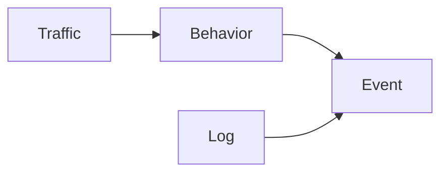

# 基于贝叶斯网络和支持向量机的网络安全态势评估和预测方法研究

作者：禅与计算机程序设计艺术

## 1. 背景介绍

### 1.1 网络安全态势评估的意义

随着互联网的快速发展和普及，网络安全问题日益突出，网络攻击手段层出不穷，攻击目标也从个人扩展到企业、政府等重要机构。网络安全态势评估作为网络安全防御体系中的重要组成部分，能够帮助用户全面了解当前网络安全状况，识别潜在威胁，预测未来发展趋势，为制定有效的安全策略提供依据。

### 1.2 传统网络安全态势评估方法的局限性

传统的网络安全态势评估方法主要依赖于专家经验和规则库，例如基于规则的入侵检测系统（IDS）、基于签名的防病毒软件等。然而，这些方法存在一些局限性：

* **难以应对未知威胁：** 传统的安全设备主要依赖于已知的攻击特征进行检测，对于新型攻击方式和未知漏洞的防御能力有限。
* **误报率高：** 基于规则的系统容易产生误报，导致安全人员疲于应对，难以有效识别真正的威胁。
* **缺乏对安全态势的整体感知：** 传统方法通常孤立地分析单个安全事件，难以从全局角度评估网络安全状况。

### 1.3 基于机器学习的网络安全态势评估方法

为了克服传统方法的局限性，近年来，基于机器学习的网络安全态势评估方法得到了广泛关注和研究。机器学习算法可以通过学习历史数据中的规律，自动识别网络攻击行为，并预测未来可能发生的攻击，从而提高安全态势感知和预测能力。

## 2. 核心概念与联系

### 2.1 贝叶斯网络

贝叶斯网络（Bayesian Network）是一种概率图模型，用于表示随机变量之间的依赖关系。在网络安全态势评估中，贝叶斯网络可以用于构建网络安全指标之间的因果关系模型，并根据观测到的指标值推断网络安全状态的概率分布。

### 2.2 支持向量机

支持向量机（Support Vector Machine，SVM）是一种监督学习算法，可以用于分类和回归分析。在网络安全态势评估中，支持向量机可以用于构建网络安全状态分类模型，根据网络安全指标的特征向量判断当前网络安全状态属于哪一类。

### 2.3 贝叶斯网络与支持向量机的联系

贝叶斯网络和支持向量机可以结合使用，构建更加准确和可靠的网络安全态势评估模型。例如，可以使用贝叶斯网络对网络安全指标进行特征提取，然后将提取的特征向量输入到支持向量机中进行分类。

## 3. 核心算法原理具体操作步骤

### 3.1 基于贝叶斯网络的网络安全态势评估方法

#### 3.1.1 构建贝叶斯网络模型

* **确定网络安全指标：** 根据网络安全需求和实际情况，选择能够反映网络安全状况的关键指标，例如网络流量、用户行为、系统日志等。
* **建立指标之间的因果关系：** 分析指标之间的相互影响关系，构建贝叶斯网络模型，表示指标之间的依赖关系。
* **确定指标的先验概率分布：** 根据历史数据或专家经验，确定每个指标的先验概率分布。

#### 3.1.2 网络安全态势推理

* **收集网络安全数据：** 实时采集网络安全指标的观测值。
* **使用贝叶斯网络进行推理：** 根据观测到的指标值和贝叶斯网络模型，推断网络安全状态的后验概率分布，例如网络受到攻击的概率。

### 3.2 基于支持向量机的网络安全态势预测方法

#### 3.2.1 数据预处理

* **数据清洗：** 对原始数据进行清洗，去除噪声数据和异常值。
* **特征提取：** 从原始数据中提取能够反映网络安全状况的特征，例如网络流量统计特征、用户行为模式等。
* **数据标准化：** 对特征数据进行标准化处理，消除不同特征之间量纲的影响。

#### 3.2.2 训练支持向量机模型

* **选择合适的核函数：** 根据数据的特点选择合适的核函数，例如线性核函数、径向基核函数等。
* **优化模型参数：** 使用训练数据对支持向量机模型进行训练，优化模型参数，例如惩罚系数、核函数参数等。

#### 3.2.3 网络安全态势预测

* **收集网络安全数据：** 实时采集网络安全指标的观测值。
* **使用支持向量机模型进行预测：** 将采集到的数据输入到训练好的支持向量机模型中，预测未来的网络安全状态，例如网络是否会受到攻击。

## 4. 数学模型和公式详细讲解举例说明

### 4.1 贝叶斯网络

#### 4.1.1 贝叶斯定理

贝叶斯网络的基础是贝叶斯定理，其公式如下：

$$P(A|B) = \frac{P(B|A)P(A)}{P(B)}$$

其中：

* $P(A|B)$ 表示在已知事件 B 发生的情况下，事件 A 发生的概率，称为 A 的后验概率。
* $P(B|A)$ 表示在已知事件 A 发生的情况下，事件 B 发生的概率。
* $P(A)$ 表示事件 A 发生的概率，称为 A 的先验概率。
* $P(B)$ 表示事件 B 发生的概率。

#### 4.1.2 贝叶斯网络的联合概率分布

假设一个贝叶斯网络包含 n 个随机变量 $X_1, X_2, ..., X_n$，则其联合概率分布可以表示为：

$$P(X_1, X_2, ..., X_n) = \prod_{i=1}^n P(X_i | Pa(X_i))$$

其中：

* $Pa(X_i)$ 表示 $X_i$ 的父节点集合。
* $P(X_i | Pa(X_i))$ 表示在已知 $X_i$ 的父节点取值的情况下，$X_i$ 的条件概率分布。

#### 4.1.3 举例说明

假设一个简单的网络安全态势评估场景，包含三个指标：网络流量（Traffic）、用户行为（Behavior）和系统日志（Log）。其中，网络流量异常可能导致用户行为异常，用户行为异常和系统日志异常都可能导致网络安全事件（Event）。

根据上述描述，可以构建如下贝叶斯网络模型：



假设网络流量异常的概率为 0.1，用户行为异常的概率为 0.05，系统日志异常的概率为 0.02，网络流量异常导致用户行为异常的概率为 0.8，用户行为异常导致网络安全事件的概率为 0.9，系统日志异常导致网络安全事件的概率为 0.7。

根据贝叶斯网络模型，可以计算网络安全事件发生的概率：

```
P(Event) = P(Event | Behavior, Log) * P(Behavior, Log) 
         = P(Event | Behavior, Log) * P(Behavior) * P(Log)
         = (P(Event | Behavior) * P(Event | Log)) * P(Behavior) * P(Log)
         = (0.9 * 0.7) * 0.05 * 0.02
         = 0.00063
```

### 4.2 支持向量机

#### 4.2.1 线性可分情况

假设有一组训练数据 $(x_1, y_1), (x_2, y_2), ..., (x_n, y_n)$，其中 $x_i \in R^d$ 表示样本的特征向量，$y_i \in {-1, 1}$ 表示样本的类别标签。如果存在一个超平面 $w^Tx + b = 0$ 能够将所有正负样本完全分开，则称该数据集线性可分。

支持向量机的目标是找到一个最优的超平面，使得间隔最大化。间隔定义为超平面到最近的样本点的距离。

#### 4.2.2 线性不可分情况

对于线性不可分的情况，可以使用核函数将样本映射到高维空间，使其在高维空间线性可分。常用的核函数包括：

* **线性核函数：** $K(x_i, x_j) = x_i^Tx_j$
* **多项式核函数：** $K(x_i, x_j) = (x_i^Tx_j + c)^d$
* **径向基核函数（RBF）：** $K(x_i, x_j) = exp(-\gamma||x_i - x_j||^2)$

#### 4.2.3 举例说明

假设有一组网络安全数据，包含两个特征：网络流量和用户行为。根据历史数据，可以将网络安全状态分为两类：正常和攻击。

使用支持向量机构建网络安全状态分类模型的步骤如下：

1. 将网络流量和用户行为作为特征，构建特征向量。
2. 将历史数据分为训练集和测试集。
3. 使用训练集训练支持向量机模型，选择合适的核函数和参数。
4. 使用测试集评估模型的分类性能，例如准确率、召回率等。

## 5. 项目实践：代码实例和详细解释说明

### 5.1 使用 Python 实现基于贝叶斯网络的网络安全态势评估

```python
import pandas as pd
from pgmpy.models import BayesianModel
from pgmpy.estimators import MaximumLikelihoodEstimator
from pgmpy.inference import VariableElimination

# 加载数据
data = pd.read_csv('network_security_data.csv')

# 定义贝叶斯网络结构
model = BayesianModel([('Traffic', 'Behavior'), ('Behavior', 'Event'), ('Log', 'Event')])

# 使用最大似然估计学习模型参数
estimator = MaximumLikelihoodEstimator(model, data)
model.fit(data, estimator=estimator)

# 创建推理引擎
inference = VariableElimination(model)

# 设置观测值
evidence = {'Traffic': 'High', 'Log': 'Normal'}

# 推断网络安全事件发生的概率
event_prob = inference.query(variables=['Event'], evidence=evidence)
print(event_prob)
```

**代码解释：**

* 首先，使用 `pgmpy` 库创建贝叶斯网络模型，并定义节点之间的依赖关系。
* 然后，使用 `MaximumLikelihoodEstimator` 类学习模型参数。
* 接着，创建推理引擎 `VariableElimination`，用于进行概率推理。
* 最后，设置观测值，并使用 `query` 方法计算网络安全事件发生的概率。

### 5.2 使用 Python 实现基于支持向量机的网络安全态势预测

```python
import pandas as pd
from sklearn.model_selection import train_test_split
from sklearn.svm import SVC
from sklearn.metrics import accuracy_score

# 加载数据
data = pd.read_csv('network_security_data.csv')

# 将数据分为特征和标签
X = data[['Traffic', 'Behavior']]
y = data['Status']

# 将数据分为训练集和测试集
X_train, X_test, y_train, y_test = train_test_split(X, y, test_size=0.2)

# 创建支持向量机分类器
clf = SVC(kernel='rbf')

# 使用训练集训练模型
clf.fit(X_train, y_train)

# 使用测试集评估模型
y_pred = clf.predict(X_test)
accuracy = accuracy_score(y_test, y_pred)
print(f'Accuracy: {accuracy}')
```

**代码解释：**

* 首先，使用 `pandas` 库加载数据，并将数据分为特征和标签。
* 然后，使用 `train_test_split` 函数将数据分为训练集和测试集。
* 接着，创建支持向量机分类器 `SVC`，并选择径向基核函数。
* 然后，使用训练集训练模型。
* 最后，使用测试集评估模型的准确率。

## 6. 实际应用场景

### 6.1 入侵检测

基于贝叶斯网络和支持向量机的网络安全态势评估和预测方法可以用于入侵检测，例如：

* **构建网络入侵行为模型：** 使用贝叶斯网络构建网络入侵行为模型，根据网络流量、用户行为等指标推断网络是否受到入侵。
* **识别未知入侵行为：** 使用支持向量机训练入侵检测模型，可以识别未知的入侵行为。

### 6.2 风险评估

基于贝叶斯网络和支持向量机的网络安全态势评估和预测方法可以用于风险评估，例如：

* **评估网络安全风险等级：** 使用贝叶斯网络构建网络安全风险评估模型，根据网络安全指标的观测值推断网络安全风险等级。
* **预测未来风险趋势：** 使用支持向量机训练风险预测模型，可以预测未来网络安全风险趋势。

## 7. 工具和资源推荐

### 7.1 贝叶斯网络工具

* **pgmpy:** Python 库，用于概率图模型的构建、推理和学习。
* **GeNIe:** 图形化贝叶斯网络建模工具。
* **Hugin:** 商业贝叶斯网络软件。

### 7.2 支持向量机工具

* **scikit-learn:** Python 库，包含各种机器学习算法，包括支持向量机。
* **LIBSVM:** 高效的支持向量机库。
* **SVMlight:** 支持向量机工具包，包含各种核函数和优化算法。

## 8. 总结：未来发展趋势与挑战

### 8.1 未来发展趋势

* **深度学习与贝叶斯网络的结合：** 将深度学习强大的特征提取能力与贝叶斯网络的概率推理能力相结合，构建更加准确和鲁棒的网络安全态势评估模型。
* **强化学习在网络安全态势评估中的应用：** 利用强化学习与环境交互学习最优安全策略的能力，提高网络安全防御的自动化水平。
* **大数据分析与网络安全态势评估的融合：** 利用大数据分析技术挖掘网络安全数据中的潜在规律，为网络安全态势评估提供更加全面和准确的信息。

### 8.2 面临的挑战

* **数据质量问题：** 网络安全数据通常存在噪声、缺失和不一致等问题，影响模型的准确性和可靠性。
* **模型解释性问题：** 基于机器学习的网络安全态势评估模型通常是黑盒模型，难以解释其预测结果，影响用户对模型的信任度。
* **实时性要求高：** 网络安全态势评估需要实时响应网络攻击，对模型的计算效率和实时性要求较高。

## 9. 附录：常见问题与解答

### 9.1 如何选择合适的贝叶斯网络结构？

贝叶斯网络结构的构建需要根据实际问题和数据特点进行，可以参考以下方法：

* **专家知识：** 咨询领域专家，了解指标之间的因果关系。
* **数据驱动：** 使用结构学习算法，从数据中学习贝叶斯网络结构。

### 9.2 如何选择合适的支持向量机核函数？

核函数的选择取决于数据的特点，可以参考以下经验：

* **线性核函数：** 适用于线性可分的数据。
* **多项式核函数：** 适用于非线性可分的数据，但容易过拟合。
* **径向基核函数（RBF）：** 适用于大多数情况，具有较好的泛化能力。

### 9.3 如何评估网络安全态势评估模型的性能？

可以使用以下指标评估网络安全态势评估模型的性能：

* **准确率：** 正确分类的样本数占总样本数的比例。
* **召回率：** 实际为正例的样本中被正确分类的比例。
* **F1 值：** 准确率和召回率的调和平均值。