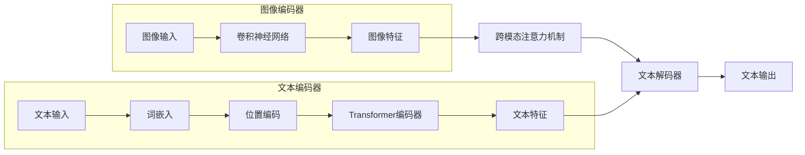

# 多模态大模型：技术原理与实战 自然语言处理的里程碑

作者：禅与计算机程序设计艺术

## 1. 背景介绍

### 1.1  从单模态到多模态：人工智能的新纪元

传统的人工智能模型往往专注于处理单一模态的数据，例如图像识别模型只能处理图像数据，语音识别模型只能处理音频数据。然而，现实世界的信息往往是多模态的，例如一张图片可以包含图像信息、文字描述、甚至声音信息。为了让人工智能更好地理解和处理现实世界的信息，多模态学习应运而生。

多模态学习旨在通过整合多种模态的信息来提升模型的理解能力和泛化能力。近年来，随着深度学习技术的快速发展以及大数据的积累，多模态学习取得了突破性进展，并在多个领域展现出巨大的应用潜力。

### 1.2 多模态大模型：迈向通用人工智能的重要一步

多模态大模型是多模态学习领域的最新成果，它将深度学习技术与大规模多模态数据结合起来，构建出能够处理多种模态信息的巨型神经网络模型。这些模型通常拥有数十亿甚至数千亿的参数量，能够学习到不同模态数据之间的复杂关系，并在各种任务上取得超越传统模型的性能。

多模态大模型的出现被认为是迈向通用人工智能的重要一步。通用人工智能是指能够像人类一样理解和处理各种信息的人工智能系统。多模态大模型通过整合多种模态的信息，能够更全面地理解世界，并完成更加复杂的任务，这为实现通用人工智能提供了新的思路和方法。

### 1.3 本文目标和结构

本文旨在深入浅出地介绍多模态大模型的技术原理、实战应用以及未来发展趋势。文章结构如下：

- 第一章：背景介绍，介绍多模态学习和多模态大模型的背景和意义；
- 第二章：核心概念与联系，介绍多模态大模型的核心概念和技术，例如Transformer、自监督学习、跨模态注意力机制等；
- 第三章：核心算法原理具体操作步骤，以具体的例子讲解多模态大模型的训练和推理过程；
- 第四章：数学模型和公式详细讲解举例说明，深入剖析多模态大模型背后的数学原理；
- 第五章：项目实践：代码实例和详细解释说明，以实际项目为例，展示如何使用多模态大模型解决实际问题；
- 第六章：实际应用场景，介绍多模态大模型在各个领域的应用案例；
- 第七章：工具和资源推荐，推荐一些常用的多模态大模型工具和资源；
- 第八章：总结：未来发展趋势与挑战，总结多模态大模型的未来发展趋势和面临的挑战；
- 第九章：附录：常见问题与解答，解答一些常见问题。

## 2. 核心概念与联系

### 2.1 Transformer：多模态大模型的基石

Transformer是一种基于自注意力机制的神经网络架构，最初应用于自然语言处理领域，并取得了突破性成果。近年来，Transformer也被广泛应用于多模态学习领域，成为构建多模态大模型的基石。

#### 2.1.1 自注意力机制：捕捉长距离依赖关系

传统的循环神经网络（RNN）在处理序列数据时，难以捕捉长距离的依赖关系。而Transformer中的自注意力机制能够捕捉句子中任意两个单词之间的关系，无论它们之间的距离有多远。

自注意力机制的核心思想是计算每个单词与句子中其他所有单词之间的相关性，并根据相关性对每个单词进行加权求和。这样，每个单词的表示都包含了句子中其他所有单词的信息，从而能够捕捉长距离的依赖关系。

#### 2.1.2 多头注意力机制：增强模型表达能力

为了进一步增强模型的表达能力，Transformer引入了多头注意力机制。多头注意力机制使用多个自注意力模块并行计算，每个自注意力模块关注句子中不同的方面。最后，将所有自注意力模块的输出进行拼接，得到最终的句子表示。

#### 2.1.3 位置编码：保留序列信息

由于自注意力机制不考虑单词在句子中的顺序，因此需要引入位置编码来保留序列信息。位置编码是一种将单词位置信息融入到词向量中的方法，常用的位置编码方法包括正弦函数编码和学习型编码。

### 2.2  自监督学习：利用海量无标注数据

传统的深度学习模型通常需要大量的标注数据进行训练。然而，标注数据的获取成本高昂且耗时。为了解决这个问题，自监督学习应运而生。

自监督学习是一种利用无标注数据进行模型训练的方法。它通过设计一些辅助任务，例如预测下一个单词、判断两个句子是否相似等，来让模型从无标注数据中学习到数据的内在规律和表示。

近年来，自监督学习在自然语言处理领域取得了巨大成功，例如BERT、GPT等预训练语言模型都是利用自监督学习方法进行训练的。这些预训练语言模型能够学习到丰富的语言知识，并在各种下游任务上取得显著提升。

### 2.3 跨模态注意力机制：融合多模态信息

跨模态注意力机制是多模态大模型中用于融合多模态信息的关键技术。它能够捕捉不同模态数据之间的关联性，并根据关联性对不同模态的信息进行加权融合。

常见的跨模态注意力机制包括：

- **单向跨模态注意力机制:**  例如，在图像描述生成任务中，可以使用单向跨模态注意力机制将图像信息融入到文本生成过程中。
- **双向跨模态注意力机制:**  例如，在视频问答任务中，可以使用双向跨模态注意力机制同时捕捉视频信息和文本信息之间的关联性。
- **协同注意力机制:**  例如，在情感分析任务中，可以使用协同注意力机制同时捕捉文本信息和语音信息之间的关联性。

### 2.4  多模态预训练：提升模型泛化能力

与自然语言处理领域的预训练语言模型类似，多模态预训练旨在利用大规模多模态数据对模型进行预训练，从而提升模型的泛化能力。

多模态预训练通常采用自监督学习方法，例如：

- **掩码语言建模:**  随机遮蔽掉部分文本信息，然后让模型预测被遮蔽的文本信息。
- **图像-文本匹配:**  判断给定的图像和文本是否匹配。
- **视频-文本描述生成:**  根据给定的视频生成相应的文本描述。

通过多模态预训练，模型能够学习到不同模态数据之间的复杂关系，并在各种下游任务上取得更好的性能。


## 3. 核心算法原理具体操作步骤

### 3.1  以图像描述生成任务为例

图像描述生成任务是指给定一张图片，生成一段描述图片内容的文本。这是一个典型的多模态学习任务，需要模型同时理解图像信息和文本信息。

#### 3.1.1  模型结构

以基于Transformer的图像描述生成模型为例，其模型结构如下图所示：



- **图像编码器:**  用于提取图像的特征表示。常用的图像编码器包括卷积神经网络（CNN）等。
- **文本编码器:**  用于将文本序列编码成特征向量。常用的文本编码器包括循环神经网络（RNN）、Transformer等。
- **跨模态注意力机制:**  用于捕捉图像特征和文本特征之间的关联性。
- **文本解码器:**  用于根据图像特征和文本特征生成最终的文本描述。

#### 3.1.2  训练过程

1. **数据准备:**  准备大量的图像-文本对数据，例如MSCOCO、Flickr8k等数据集。
2. **模型初始化:**  随机初始化模型参数。
3. **迭代训练:**  
    - 将图像输入图像编码器，得到图像特征。
    - 将文本输入文本编码器，得到文本特征。
    - 使用跨模态注意力机制捕捉图像特征和文本特征之间的关联性。
    - 将图像特征和文本特征输入文本解码器，生成文本描述。
    - 计算生成文本描述与真实文本描述之间的损失函数。
    - 使用梯度下降算法更新模型参数。
4. **模型评估:**  使用测试集评估模型性能，常用的评估指标包括BLEU、METEOR等。

#### 3.1.3  推理过程

1. 将图像输入图像编码器，得到图像特征。
2. 将图像特征输入文本解码器，生成文本描述。

### 3.2  其他多模态任务

除了图像描述生成任务，多模态大模型还可以应用于其他各种多模态任务，例如：

- **视频问答:**  给定一段视频和一个问题，模型需要理解视频内容并回答问题。
- **视觉常识推理:**  给定一张图片和一个问题，模型需要根据图片内容和常识进行推理并回答问题。
- **跨模态检索:**  给定一个查询，模型需要从数据库中检索出与查询相关的多模态数据，例如图像、视频、文本等。


## 4. 数学模型和公式详细讲解举例说明

### 4.1  Transformer中的自注意力机制

#### 4.1.1  缩放点积注意力

自注意力机制的核心是计算每个单词与句子中其他所有单词之间的相关性。Transformer使用缩放点积注意力来计算相关性：

$$
Attention(Q, K, V) = softmax(\frac{QK^T}{\sqrt{d_k}})V
$$

其中：

- $Q$ 是查询矩阵，表示当前单词的特征向量。
- $K$ 是键矩阵，表示句子中所有单词的特征向量。
- $V$ 是值矩阵，表示句子中所有单词的特征向量。
- $d_k$ 是键矩阵的维度。
- $softmax$ 函数用于将相关性归一化到0到1之间。

#### 4.1.2  多头注意力机制

多头注意力机制使用多个自注意力模块并行计算，每个自注意力模块关注句子中不同的方面。假设使用 $h$ 个自注意力模块，则多头注意力机制的计算公式为：

$$
MultiHead(Q, K, V) = Concat(head_1, ..., head_h)W^O
$$

其中：

- $head_i = Attention(QW_i^Q, KW_i^K, VW_i^V)$ 是第 $i$ 个自注意力模块的输出。
- $W_i^Q$, $W_i^K$, $W_i^V$ 是第 $i$ 个自注意力模块的参数矩阵。
- $W^O$ 是用于将所有自注意力模块的输出进行线性变换的参数矩阵。

### 4.2  跨模态注意力机制

#### 4.2.1  单向跨模态注意力机制

以图像描述生成任务中的单向跨模态注意力机制为例，其计算公式为：

$$
Attention(Q, K, V) = softmax(\frac{QK^T}{\sqrt{d_k}})V
$$

其中：

- $Q$ 是查询矩阵，表示当前要生成的单词的特征向量。
- $K$ 是键矩阵，表示图像特征。
- $V$ 是值矩阵，表示图像特征。

#### 4.2.2  双向跨模态注意力机制

以视频问答任务中的双向跨模态注意力机制为例，其计算公式为：

$$
\begin{aligned}
Attention_{v2t}(Q, K, V) &= softmax(\frac{QK^T}{\sqrt{d_k}})V \\
Attention_{t2v}(Q, K, V) &= softmax(\frac{QK^T}{\sqrt{d_k}})V
\end{aligned}
$$

其中：

- $Q$ 分别表示视频特征和文本特征。
- $K$ 分别表示文本特征和视频特征。
- $V$ 分别表示文本特征和视频特征。

## 5. 项目实践：代码实例和详细解释说明

### 5.1  使用Hugging Face Transformers库实现图像描述生成

```python
from transformers import VisionEncoderDecoderModel, ViTImageProcessor, AutoTokenizer

# 加载预训练模型
model_name = "nlpconnect/vit-gpt2-image-captioning"
model = VisionEncoderDecoderModel.from_pretrained(model_name)
image_processor = ViTImageProcessor.from_pretrained(model_name)
tokenizer = AutoTokenizer.from_pretrained(model_name)

# 加载图片
image = Image.open("path/to/image.jpg")

# 图像预处理
pixel_values = image_processor(image, return_tensors="pt").pixel_values

# 生成文本描述
generated_ids = model.generate(pixel_values=pixel_values)
generated_text = tokenizer.batch_decode(generated_ids, skip_special_tokens=True)[0]

# 打印结果
print(generated_text)
```

**代码解释:**

1. 首先，使用 `transformers` 库加载预训练的图像描述生成模型、图像处理器和文本分词器。
2. 然后，加载要进行描述的图片，并使用图像处理器进行预处理。
3. 接着，使用模型的 `generate()` 方法生成文本描述。
4. 最后，使用文本分词器将生成的文本 ID 转换成文本，并打印结果。

### 5.2  使用TensorFlow实现简单的跨模态检索系统

```python
import tensorflow as tf

# 定义图像编码器
image_encoder = tf.keras.applications.ResNet50(
    include_top=False, weights="imagenet", pooling="avg"
)

# 定义文本编码器
text_encoder = tf.keras.layers.TextVectorization(
    max_tokens=10000, output_mode="int", output_sequence_length=100
)
text_encoder.adapt(text_data)

# 定义跨模态检索模型
class CrossModalRetrievalModel(tf.keras.Model):
    def __init__(self, image_encoder, text_encoder):
        super().__init__()
        self.image_encoder = image_encoder
        self.text_encoder = text_encoder

    def call(self, inputs):
        image_features = self.image_encoder(inputs[0])
        text_features = self.text_encoder(inputs[1])
        similarity = tf.keras.layers.Dot(axes=(1, 1))([image_features, text_features])
        return similarity

# 创建模型实例
model = CrossModalRetrievalModel(image_encoder, text_encoder)

# 编译模型
model.compile(
    optimizer="adam",
    loss=tf.keras.losses.CategoricalCrossentropy(from_logits=True),
    metrics=["accuracy"],
)

# 训练模型
model.fit(
    x=[image_data, text_data], y=labels, epochs=10, batch_size=32
)

# 使用模型进行检索
query_image = tf.keras.preprocessing.image.load_img(
    "path/to/query_image.jpg", target_size=(224, 224)
)
query_image = tf.keras.preprocessing.image.img_to_array(query_image)
query_image = tf.expand_dims(query_image, axis=0)
query_features = image_encoder(query_image)
similarity_scores = model.predict([query_features, text_data])
top_k_indices = tf.math.top_k(similarity_scores, k=5).indices
retrieved_texts = [text_data[i] for i in top_k_indices]

# 打印结果
print(retrieved_texts)
```

**代码解释:**

1. 首先，定义图像编码器和文本编码器。这里使用预训练的 ResNet50 模型作为图像编码器，使用 `TextVectorization` 层作为文本编码器。
2. 然后，定义跨模态检索模型。该模型将图像特征和文本特征输入到点积层计算相似度得分。
3. 接着，创建模型实例，并使用训练数据进行训练。
4. 最后，使用训练好的模型对查询图片进行检索，并返回相似度得分最高的5个文本。

## 6. 实际应用场景

### 6.1  图像理解与描述

- **图像搜索:**  用户可以使用自然语言描述来搜索图片，例如“一只在草地上奔跑的狗”。
- **图像问答:**  用户可以向系统询问图片相关的问题，例如“图中的人在做什么？”。
- **图像生成:**  用户可以使用自然语言描述来生成图片，例如“一只红色的鸟站在树枝上”。

### 6.2  视频分析与理解

- **视频摘要:**  自动生成视频的简短描述，例如新闻摘要、体育比赛集锦等。
- **视频搜索:**  用户可以使用自然语言描述来搜索视频，例如“一场篮球比赛的精彩片段”。
- **视频问答:**  用户可以向系统询问视频相关的问题，例如“这段视频中发生了什么？”。

### 6.3  人机交互

- **聊天机器人:**  多模态大模型可以用于构建更加智能的聊天机器人，例如可以理解用户发送的图片和视频。
- **虚拟助手:**  多模态大模型可以用于构建更加智能的虚拟助手，例如可以根据用户的语音指令和手势操作来完成任务。
- **情感分析:**  多模态大模型可以用于分析用户的情感，例如可以根据用户的语音语调和面部表情来判断用户的情绪。

##