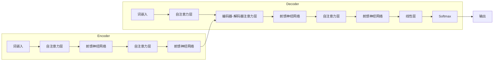

##  大规模语言模型从理论到实践：大语言模型基础

作者：禅与计算机程序设计艺术

## 1. 背景介绍

### 1.1 人工智能与自然语言处理的融合

人工智能 (AI) 的终极目标是让机器能够像人类一样思考和行动。自然语言处理 (NLP) 作为 AI 的一个重要分支，致力于让机器理解和生成人类语言。近年来，随着深度学习技术的飞速发展，NLP 领域取得了突破性进展，其中最引人注目的便是大规模语言模型 (LLM) 的出现。

### 1.2 大规模语言模型的兴起

LLM 是指参数量巨大、训练数据规模庞大的神经网络模型，例如 GPT-3、BERT、LaMDA 等。这些模型在各种 NLP 任务上都取得了超越传统方法的性能，例如：

* **文本生成**:  自动生成高质量的文章、对话、代码等。
* **机器翻译**: 在不同语言之间进行准确流畅的翻译。
* **问答系统**:  理解用户问题并给出精准答案。
* **情感分析**: 分析文本的情感倾向，例如正面、负面或中性。

### 1.3 本文目标

本文旨在深入浅出地介绍 LLM 的基础知识，包括其核心概念、算法原理、应用场景、未来发展趋势等，帮助读者快速了解和掌握这一前沿技术。

## 2. 核心概念与联系

### 2.1  语言模型

语言模型是 NLP 的基础，用于计算一个句子出现的概率。简单来说，语言模型的目标是预测下一个词出现的可能性，例如：

> 我 爱 ___

一个好的语言模型会预测出 "你" 的概率最高。

### 2.2 神经网络与深度学习

神经网络是一种模拟人脑神经元结构的计算模型，可以用于学习复杂的模式和关系。深度学习则是指使用多层神经网络进行学习的方法。

### 2.3  大规模语言模型的架构

LLM 通常采用 Transformer 架构，这是一种基于自注意力机制的神经网络结构。Transformer 相比于传统的循环神经网络 (RNN)，能够更好地捕捉长距离依赖关系，并且更容易进行并行计算，从而可以训练更大规模的模型。



### 2.4 预训练与微调

LLM 通常采用两阶段训练策略：

* **预训练**:  使用海量无标注文本数据训练模型，学习通用的语言表示。
* **微调**:  使用特定任务的标注数据对预训练模型进行微调，使其适应特定任务。

## 3. 核心算法原理具体操作步骤

### 3.1 Transformer 架构详解

#### 3.1.1 自注意力机制

自注意力机制允许模型在处理一个词时，关注句子中其他词的信息，从而捕捉词之间的关系。

#### 3.1.2 多头注意力机制

多头注意力机制使用多个自注意力头，每个头关注不同的方面，从而提高模型的表达能力。

#### 3.1.3 位置编码

由于 Transformer  没有循环结构，无法捕捉词序信息，因此需要加入位置编码来表示词在句子中的位置。

### 3.2 预训练任务

#### 3.2.1 掩码语言模型 (MLM)

MLM  随机掩盖句子中的一些词，然后让模型预测被掩盖的词。

#### 3.2.2 下一句预测 (NSP)

NSP  让模型判断两个句子是否是连续的。

### 3.3 微调方法

#### 3.3.1 特征提取

将预训练模型作为特征提取器，提取文本的特征表示，然后用于下游任务。

#### 3.3.2  模型微调

使用特定任务的标注数据对预训练模型进行微调，更新模型参数。

## 4. 数学模型和公式详细讲解举例说明

### 4.1  自注意力机制

$$
\text{Attention}(Q, K, V) = \text{softmax}(\frac{QK^T}{\sqrt{d_k}})V
$$

其中：

* $Q$：查询矩阵
* $K$：键矩阵
* $V$：值矩阵
* $d_k$：键的维度

### 4.2  多头注意力机制

$$
\text{MultiHead}(Q, K, V) = \text{Concat}(\text{head}_1, ..., \text{head}_h)W^O
$$

其中：

* $\text{head}_i = \text{Attention}(QW_i^Q, KW_i^K, VW_i^V)$
* $W_i^Q, W_i^K, W_i^V$：线性变换矩阵
* $W^O$：输出线性变换矩阵

## 5. 项目实践：代码实例和详细解释说明

### 5.1 使用 Hugging Face Transformers 库微调 BERT 模型进行文本分类

```python
from transformers import AutoModelForSequenceClassification, Trainer, TrainingArguments

# 加载预训练模型
model_name = "bert-base-uncased"
model = AutoModelForSequenceClassification.from_pretrained(model_name, num_labels=2)

# 定义训练参数
training_args = TrainingArguments(
    output_dir="./results",
    num_train_epochs=3,
    per_device_train_batch_size=8,
    per_device_eval_batch_size=8,
    learning_rate=2e-5,
)

# 创建 Trainer 对象
trainer = Trainer(
    model=model,
    args=training_args,
    train_dataset=train_dataset,  # 训练数据集
    eval_dataset=eval_dataset,  # 验证数据集
)

# 开始训练
trainer.train()
```

### 5.2  使用 TensorFlow 实现简单的 Transformer 模型

```python
import tensorflow as tf

# 定义 Transformer 层
class TransformerBlock(tf.keras.layers.Layer):
    def __init__(self, embed_dim, num_heads, ff_dim, rate=0.1):
        super(TransformerBlock, self).__init__()
        # ...

    def call(self, inputs, training):
        # ...

# 定义编码器
class Encoder(tf.keras.layers.Layer):
    def __init__(self, num_layers, embed_dim, num_heads, ff_dim, input_vocab_size, rate=0.1):
        super(Encoder, self).__init__()
        # ...

    def call(self, inputs, training):
        # ...

# 定义解码器
class Decoder(tf.keras.layers.Layer):
    def __init__(self, num_layers, embed_dim, num_heads, ff_dim, target_vocab_size, rate=0.1):
        super(Decoder, self).__init__()
        # ...

    def call(self, inputs, training):
        # ...

# 创建 Transformer 模型
encoder = Encoder(...)
decoder = Decoder(...)
outputs = decoder(..., training=True)

# 定义损失函数和优化器
# ...

# 训练模型
# ...
```


## 6. 实际应用场景

### 6.1 自然语言生成

* **文本摘要**:  自动生成文章的摘要。
* **对话生成**:  构建聊天机器人、虚拟助手等。
* **代码生成**:  根据自然语言描述生成代码。

### 6.2  自然语言理解

* **机器翻译**:  在不同语言之间进行翻译。
* **情感分析**:  分析文本的情感倾向。
* **问答系统**:  回答用户提出的问题。

### 6.3  其他应用

* **搜索引擎**:  提高搜索结果的准确性和相关性。
* **推荐系统**:  根据用户兴趣推荐相关内容。
* **医疗诊断**:  辅助医生进行疾病诊断。


## 7. 工具和资源推荐

### 7.1  Hugging Face Transformers

Hugging Face Transformers 是一个开源的 NLP 库，提供了预训练的 LLM 模型和用于微调的 API。

### 7.2  Google Colab

Google Colab  是一个免费的云端机器学习平台，提供了 GPU 资源，可以方便地运行 LLM 相关的代码。

### 7.3  OpenAI API

OpenAI API  提供了 GPT-3  模型的访问接口，可以用于各种 NLP 任务。


## 8. 总结：未来发展趋势与挑战

### 8.1  模型规模化

未来的 LLM 模型将会更大、更复杂，参数量和训练数据规模将持续增长。

### 8.2  多模态学习

LLM 将会融合多种模态的信息，例如文本、图像、视频等，实现更强大的能力。

### 8.3  可解释性和可控性

提高 LLM 的可解释性和可控性是未来研究的重要方向，以确保其安全可靠地应用。

## 9. 附录：常见问题与解答

### 9.1  什么是 LLM 的上下文窗口？

上下文窗口是指 LLM 能够一次处理的最大文本长度。

### 9.2  如何选择合适的 LLM 模型？

选择 LLM 模型需要考虑任务需求、计算资源、模型性能等因素。

### 9.3  如何评估 LLM 模型的性能？

可以使用 BLEU、ROUGE 等指标评估 LLM 模型在文本生成任务上的性能，使用准确率、召回率等指标评估其在分类任务上的性能。


## 10. 后记

本文简要介绍了大规模语言模型的基础知识，希望能帮助读者快速入门这一领域。LLM 作为一项前沿技术，拥有巨大的应用潜力，未来将会在各个领域发挥越来越重要的作用。