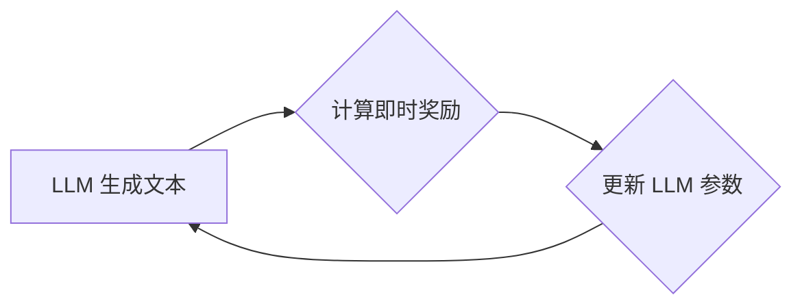

## 1. 背景介绍

### 1.1 大语言模型的崛起

近年来，随着深度学习技术的飞速发展，大语言模型（Large Language Model, LLM）逐渐成为人工智能领域的研究热点。LLM通常拥有数十亿甚至数万亿的参数，能够在海量文本数据上进行训练，并展现出惊人的语言理解和生成能力。例如，OpenAI 的 GPT-3、Google 的 BERT 和 Facebook 的 BART 等模型，都在自然语言处理任务中取得了突破性的进展，并在机器翻译、文本摘要、问答系统等领域得到广泛应用。

### 1.2 即时奖励的重要性

传统的 LLM 训练方法通常采用监督学习，即使用人工标注的数据集进行训练。然而，这种方法存在着效率低下、成本高昂、泛化能力不足等问题。为了克服这些问题，研究人员开始探索基于强化学习的 LLM 训练方法，其中即时奖励（Immediate Reward）扮演着至关重要的角色。

即时奖励是指在 LLM 生成文本的过程中，根据生成的文本质量实时给予的奖励信号。通过引入即时奖励机制，可以引导 LLM 生成更加符合人类预期的高质量文本，从而提高模型的性能和泛化能力。

## 2. 核心概念与联系

### 2.1 强化学习与 LLM 训练

强化学习（Reinforcement Learning, RL）是一种机器学习范式，其目标是让智能体（Agent）通过与环境交互学习最优策略。在 LLM 训练中，LLM 可以被视为智能体，其生成的文本可以被视为智能体采取的行动，而环境则可以被视为用户或其他外部系统。

### 2.2 即时奖励的定义与作用

即时奖励是指在 LLM 生成文本的过程中，根据生成的文本质量实时给予的奖励信号。即时奖励可以来自多个方面，例如：

* **人工评估:** 由人类专家对生成的文本进行评估，并给出相应的奖励分数。
* **基于规则的奖励:** 根据预先定义的规则，对生成的文本进行评分，例如语法正确性、流畅度、信息含量等。
* **基于模型的奖励:** 使用其他 LLM 或机器学习模型对生成的文本进行评估，并给出相应的奖励分数。

即时奖励的作用在于引导 LLM 生成更加符合人类预期的高质量文本。通过不断优化生成策略以最大化累积奖励，LLM 可以逐渐提高其语言理解和生成能力。

### 2.3 即时奖励与监督学习的区别

即时奖励与传统的监督学习方法相比，具有以下几个优势:

* **更具灵活性:** 即时奖励可以根据实际需求进行灵活调整，而监督学习则需要预先定义好所有可能的标签和类别。
* **更高效:** 即时奖励可以实时反馈给 LLM，从而加速模型的学习过程，而监督学习则需要等待整个数据集训练完成后才能进行评估。
* **更泛化:** 即时奖励可以引导 LLM 学习更通用的语言模式，而监督学习则容易局限于特定任务或数据集。

## 3. 核心算法原理具体操作步骤

### 3.1 基于策略梯度的强化学习算法

在 LLM 训练中，常用的强化学习算法是基于策略梯度的算法，例如 REINFORCE 和 PPO 等。这类算法的基本原理是通过梯度上升的方式优化 LLM 的生成策略，以最大化累积奖励。

### 3.2 即时奖励的计算与应用

在基于策略梯度的强化学习算法中，即时奖励的计算和应用是至关重要的环节。具体操作步骤如下:

1. **定义奖励函数:** 首先需要定义一个奖励函数，用于评估 LLM 生成文本的质量。奖励函数可以根据实际需求进行灵活设计，例如考虑文本的流畅度、信息含量、情感倾向等因素。
2. **计算即时奖励:** 在 LLM 生成文本的过程中，根据定义的奖励函数计算每个生成步骤的即时奖励。
3. **更新 LLM 参数:** 利用计算得到的即时奖励，通过梯度上升的方式更新 LLM 的参数，以最大化累积奖励。

### 3.3 算法流程图



## 4. 数学模型和公式详细讲解举例说明

### 4.1 策略梯度定理

策略梯度定理是强化学习中一个重要的定理，它描述了如何通过梯度上升的方式优化策略以最大化累积奖励。策略梯度定理的数学公式如下:

$$
\nabla_{\theta} J(\theta) = \mathbb{E}_{\tau \sim p_{\theta}(\tau)} \left[ \sum_{t=0}^{T-1} \nabla_{\theta} \log \pi_{\theta}(a_t | s_t) R(\tau) \right]
$$

其中:

* $\theta$ 表示 LLM 的参数
* $J(\theta)$ 表示累积奖励
* $\tau$ 表示一个完整的文本生成轨迹，包括状态 $s_t$、行动 $a_t$ 和奖励 $r_t$
* $p_{\theta}(\tau)$ 表示在参数 $\theta$ 下生成轨迹 $\tau$ 的概率
* $\pi_{\theta}(a_t | s_t)$ 表示在状态 $s_t$ 下采取行动 $a_t$ 的概率
* $R(\tau)$ 表示轨迹 $\tau$ 的累积奖励

### 4.2 REINFORCE 算法

REINFORCE 算法是一种常用的基于策略梯度的强化学习算法，其更新规则如下:

$$
\theta \leftarrow \theta + \alpha \nabla_{\theta} \log \pi_{\theta}(a_t | s_t) R(\tau)
$$

其中:

* $\alpha$ 表示学习率

### 4.3 举例说明

假设我们希望训练一个 LLM 生成关于“人工智能”的文本，并使用即时奖励引导模型生成信息含量更高的文本。我们可以定义一个奖励函数，用于评估文本中包含的关键词数量，例如“深度学习”、“机器学习”、“自然语言处理”等。在 LLM 生成文本的过程中，根据定义的奖励函数计算每个生成步骤的即时奖励，并利用 REINFORCE 算法更新 LLM 的参数。通过不断优化生成策略以最大化累积奖励，LLM 可以逐渐提高其生成关于“人工智能”的信息含量更高的文本的能力。

## 5. 项目实践：代码实例和详细解释说明

### 5.1 使用 Transformers 库实现 REINFORCE 算法

```python
import transformers
import torch

# 定义 LLM 模型
model = transformers.AutoModelForCausalLM.from_pretrained("gpt2")

# 定义奖励函数
def reward_function(text):
  # 计算文本中包含的关键词数量
  keywords = ["深度学习", "机器学习", "自然语言处理"]
  count = sum([1 for keyword in keywords if keyword in text])
  return count

# 定义优化器
optimizer = torch.optim.Adam(model.parameters(), lr=1e-5)

# 训练循环
for epoch in range(10):
  # 生成文本
  text = model.generate(max_length=100)

  # 计算奖励
  reward = reward_function(text)

  # 计算损失
  loss = -torch.log(torch.tensor(reward))

  # 反向传播
  optimizer.zero_grad()
  loss.backward()

  # 更新参数
  optimizer.step()

  # 打印日志
  print(f"Epoch {epoch}, Reward: {reward}")
```

### 5.2 代码解释

* **定义 LLM 模型:** 使用 `transformers.AutoModelForCausalLM.from_pretrained("gpt2")` 加载预训练的 GPT-2 模型。
* **定义奖励函数:** `reward_function` 函数用于计算文本中包含的关键词数量。
* **定义优化器:** 使用 `torch.optim.Adam` 定义 Adam 优化器。
* **训练循环:** 
    * **生成文本:** 使用 `model.generate` 生成长度为 100 的文本。
    * **计算奖励:** 使用 `reward_function` 计算文本的奖励。
    * **计算损失:** 使用 `-torch.log(torch.tensor(reward))` 计算损失。
    * **反向传播:** 使用 `loss.backward()` 进行反向传播。
    * **更新参数:** 使用 `optimizer.step()` 更新模型参数。
    * **打印日志:** 打印每个 epoch 的奖励值。

## 6. 实际应用场景

### 6.1 对话系统

在对话系统中，即时奖励可以用于引导 LLM 生成更加自然、流畅、信息丰富的回复。例如，可以根据用户的反馈、对话历史、情感分析等因素设计奖励函数，并使用强化学习算法优化 LLM 的回复生成策略。

### 6.2 文本摘要

在文本摘要任务中，即时奖励可以用于引导 LLM 生成更加简洁、准确、全面的摘要。例如，可以根据摘要的长度、信息覆盖率、语法正确性等因素设计奖励函数，并使用强化学习算法优化 LLM 的摘要生成策略。

### 6.3 机器翻译

在机器翻译任务中，即时奖励可以用于引导 LLM 生成更加准确、流畅、自然的翻译结果。例如，可以根据翻译的语义相似度、语法正确性、流畅度等因素设计奖励函数，并使用强化学习算法优化 LLM 的翻译生成策略。

## 7. 总结：未来发展趋势与挑战

### 7.1 未来发展趋势

* **更精细的奖励函数设计:** 未来，研究人员将致力于设计更加精细的奖励函数，以捕捉更全面、更细粒度的文本质量指标。
* **更先进的强化学习算法:** 随着强化学习技术的不断发展，将会有更多先进的算法应用于 LLM 训练，例如多步强化学习、模仿学习等。
* **更广泛的应用领域:** 随着 LLM 技术的不断成熟，其应用领域将会不断扩展，例如代码生成、创意写作、游戏设计等。

### 7.2 面临的挑战

* **奖励函数设计困难:** 设计一个有效的奖励函数是一项具有挑战性的任务，需要考虑多个因素，并进行大量的实验和调整。
* **训练效率问题:** 由于 LLM 通常拥有数十亿甚至数万亿的参数，其训练过程需要消耗大量的计算资源和时间。
* **安全性问题:** LLM 可能会生成一些有害或不安全的内容，需要采取措施确保其安全性。

## 8. 附录：常见问题与解答

### 8.1 如何选择合适的奖励函数？

选择合适的奖励函数需要考虑多个因素，例如任务目标、数据特点、模型结构等。建议参考相关文献和最佳实践，并进行大量的实验和调整。

### 8.2 如何提高 LLM 训练效率？

提高 LLM 训练效率可以采取多种措施，例如使用更高效的硬件设备、优化算法实现、并行训练等。

### 8.3 如何确保 LLM 的安全性？

确保 LLM 的安全性可以采取多种措施，例如过滤有害内容、限制模型生成能力、进行人工审核等。