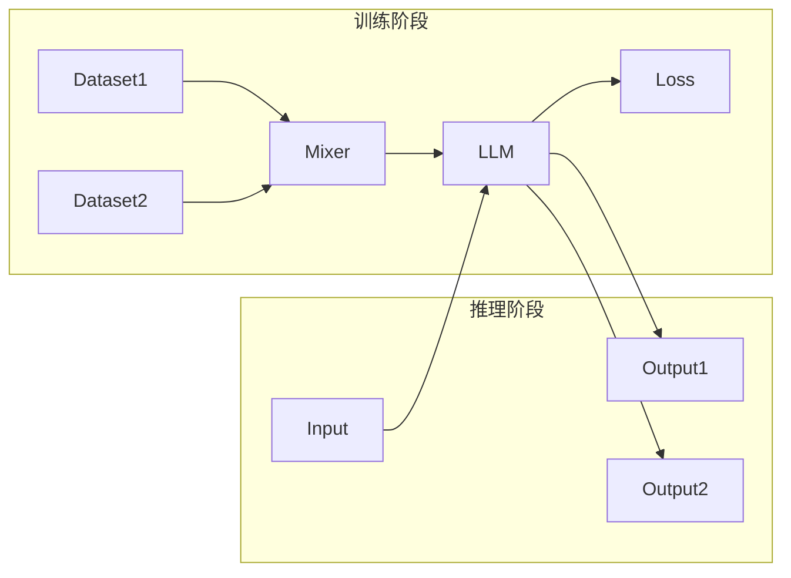
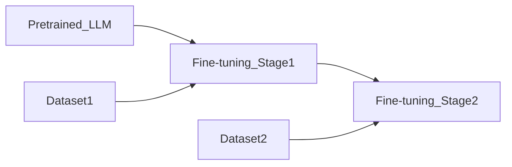
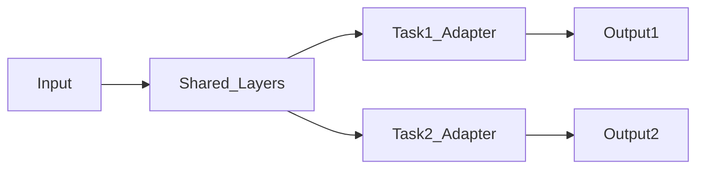

# 大语言模型原理与工程实践：混合微调策略

作者：禅与计算机程序设计艺术

## 1. 背景介绍

### 1.1 大语言模型的兴起

近年来，随着深度学习技术的飞速发展，大语言模型（Large Language Models，LLMs）逐渐走进大众视野。从早期的 BERT、GPT-2，到如今的 GPT-3、PaLM 等，LLMs 在自然语言处理领域取得了令人瞩目的成就，展现出强大的文本生成、理解、翻译等能力。

### 1.2 微调的必要性

然而，预训练的 LLMs 通常只能提供通用的语言能力，无法满足特定领域或任务的需求。为了使 LLMs 能够更好地应用于实际场景，微调（Fine-tuning）成为了一种必不可少的技术手段。

### 1.3 混合微调策略的优势

传统的微调方法通常只关注单一任务或数据集，难以兼顾模型的泛化能力和特定任务的性能。混合微调策略通过结合多种数据源和训练目标，旨在提升 LLMs 的综合性能，使其在不同领域和任务中都能表现出色。

## 2. 核心概念与联系

### 2.1 预训练与微调

* **预训练（Pre-training）**: 使用大规模无标注文本数据训练 LLMs，使其学习通用的语言表示和知识。
* **微调（Fine-tuning）**: 在预训练模型的基础上，使用特定任务的标注数据进行训练，调整模型参数以适应目标任务。

### 2.2 数据集

* **预训练数据集**: 通常包含海量的文本数据，例如维基百科、书籍、网页等。
* **微调数据集**:  针对特定任务进行标注，例如情感分类数据集、问答数据集等。

### 2.3 训练目标

* **预训练目标**:  通常采用自监督学习方法，例如掩码语言模型（MLM）、下一个句子预测（NSP）等。
* **微调目标**: 根据具体任务设定，例如分类任务使用交叉熵损失函数，回归任务使用均方误差损失函数等。

### 2.4 混合微调策略

混合微调策略是指结合多种数据源和训练目标，对预训练的 LLMs 进行微调。常见的混合微调策略包括：

* **多任务微调**:  同时使用多个任务的标注数据进行训练，例如同时进行情感分类和问答任务的微调。
* **多阶段微调**:  将微调过程分为多个阶段，每个阶段使用不同的数据和训练目标，例如先进行通用领域的微调，再进行特定领域的微调。
* **参数共享与适配**:  在微调过程中，可以选择性地共享预训练模型的参数，或者为不同任务添加适配器层。

## 3. 核心算法原理具体操作步骤

### 3.1 多任务微调

1. 准备多个任务的标注数据集。
2. 将多个数据集混合，并为每个样本添加任务标识符。
3. 使用混合数据集对预训练的 LLMs 进行训练，损失函数为所有任务损失函数的加权平均。
4. 在推理阶段，根据输入样本的任务标识符选择对应的输出层。



### 3.2 多阶段微调

1. 准备通用领域和特定领域的标注数据集。
2. 使用通用领域数据集对预训练的 LLMs 进行微调。
3. 使用特定领域数据集对微调后的 LLMs 继续进行微调。



### 3.3 参数共享与适配

1. 在微调过程中，可以选择冻结预训练模型的部分参数，只训练特定任务相关的参数。
2. 也可以为不同任务添加适配器层，例如在预训练模型的最后一层添加一个全连接层，用于输出特定任务的预测结果。




## 4. 数学模型和公式详细讲解举例说明

### 4.1 损失函数

多任务微调的损失函数通常为所有任务损失函数的加权平均：

$$
L = \sum_{i=1}^{N} w_i L_i
$$

其中：

* $L$ 为总的损失函数。
* $N$ 为任务数量。
* $w_i$ 为第 $i$ 个任务的权重。
* $L_i$ 为第 $i$ 个任务的损失函数。

### 4.2 参数更新

参数更新采用梯度下降法：

$$
\theta_{t+1} = \theta_t - \alpha \nabla L(\theta_t)
$$

其中：

* $\theta_t$ 为第 $t$ 次迭代的参数。
* $\alpha$ 为学习率。
* $\nabla L(\theta_t)$ 为损失函数关于参数的梯度。

## 5. 项目实践：代码实例和详细解释说明

```python
# 加载预训练模型
from transformers import AutoModelForSequenceClassification

model_name = "bert-base-uncased"
model = AutoModelForSequenceClassification.from_pretrained(model_name)

# 准备数据集
from datasets import load_dataset

dataset1 = load_dataset("imdb", split="train")
dataset2 = load_dataset("glue", "sst2", split="train")

# 定义损失函数
from torch.nn import CrossEntropyLoss

loss_fn = CrossEntropyLoss()

# 定义优化器
from torch.optim import AdamW

optimizer = AdamW(model.parameters(), lr=1e-5)

# 训练模型
for epoch in range(num_epochs):
    # 遍历数据集
    for batch in train_dataloader:
        # 前向传播
        outputs = model(**batch)
        # 计算损失函数
        loss = loss_fn(outputs.logits, batch["labels"])
        # 反向传播
        loss.backward()
        # 更新参数
        optimizer.step()
        # 清空梯度
        optimizer.zero_grad()
```

## 6. 实际应用场景

* **智能客服**:  使用混合微调策略可以训练一个能够同时处理多种客服场景的聊天机器人，例如售前咨询、售后服务、投诉建议等。
* **文本摘要**:  可以结合新闻摘要和科技文献摘要等多个数据集，训练一个能够生成不同领域文本摘要的模型。
* **机器翻译**:  可以结合多个语种的翻译数据集，训练一个能够进行多语言翻译的模型。

## 7. 总结：未来发展趋势与挑战

混合微调策略是提升 LLMs 性能的重要方向，未来将朝着以下方向发展：

* **更丰富的混合策略**:  探索更多的数据源和训练目标组合，例如结合强化学习、元学习等方法。
* **更高效的训练方法**:  研究更高效的混合微调算法，例如多任务学习、迁移学习等。
* **更广泛的应用场景**:  将混合微调策略应用于更多领域和任务，例如自然语言生成、代码生成、图像理解等。


## 8. 附录：常见问题与解答

### 8.1  问：混合微调和多任务学习的区别是什么？

答：混合微调侧重于利用多种数据源和训练目标提升 LLMs 的综合性能，而多任务学习更侧重于同时学习多个相关任务，并利用任务之间的相关性提升模型的泛化能力。

### 8.2  问：如何选择合适的混合微调策略？

答：选择合适的混合微调策略需要考虑具体的任务需求、数据特点、模型结构等因素。一般来说，可以先尝试简单的混合策略，例如多任务微调，然后根据实验结果逐步调整策略。