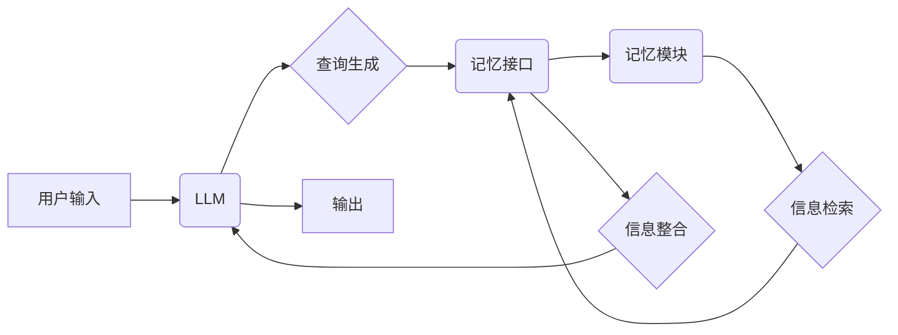

## 大语言模型应用指南：MemGPT

作者：禅与计算机程序设计艺术

## 1. 背景介绍

### 1.1 大语言模型的兴起

近年来，随着深度学习技术的快速发展，大语言模型（LLM）逐渐成为人工智能领域的研究热点。LLM是指参数量巨大、训练数据规模庞大的神经网络模型，例如 GPT-3、BERT、LaMDA 等。这些模型在自然语言处理任务中表现出色，例如：

* **文本生成**: 写诗、写故事、生成代码
* **机器翻译**: 将一种语言翻译成另一种语言
* **问答系统**: 回答用户提出的问题
* **情感分析**: 分析文本的情感倾向

### 1.2  LLM的局限性：记忆与上下文

尽管LLM取得了巨大的成功，但它们仍然存在一些局限性，其中最主要的是记忆和上下文处理能力的不足。

* **有限的上下文窗口**: LLM通常只能处理有限长度的文本，无法记住较长的对话历史或文档内容。
* **静态知识**: LLM的知识是静态的，无法根据新的信息进行更新或修改。

### 1.3 MemGPT: 增强记忆能力的解决方案

为了解决LLM的记忆和上下文问题，研究人员提出了MemGPT，一种将外部记忆模块与LLM相结合的新型架构。MemGPT能够利用外部存储器来存储和检索信息，从而增强LLM的记忆和上下文处理能力。

## 2. 核心概念与联系

### 2.1 MemGPT 架构

MemGPT 的核心架构包含以下三个部分：

* **大语言模型 (LLM)**：负责理解和生成文本。
* **记忆模块**: 存储大量的结构化或非结构化信息。
* **记忆接口**: 连接 LLM 和记忆模块，负责信息的读写操作。

### 2.2 记忆模块

MemGPT 的记忆模块可以采用多种形式，例如：

* **数据库**: 存储结构化数据，例如表格、关系型数据库。
* **知识图谱**:  存储实体和关系的语义信息。
* **文档库**: 存储非结构化文本数据，例如文章、网页。

### 2.3 记忆接口

记忆接口负责将LLM的输入转换为记忆模块可以理解的查询语句，并将查询结果返回给LLM。常见的记忆接口操作包括：

* **读取**: 根据LLM的输入查询记忆模块，返回相关信息。
* **写入**: 将LLM生成的信息写入记忆模块。
* **更新**: 修改记忆模块中已有的信息。
* **删除**: 从记忆模块中删除信息。

## 3. 核心算法原理具体操作步骤

### 3.1 信息读取

MemGPT 的信息读取过程可以分为以下步骤：

1. **查询生成**: LLM根据当前的输入和上下文生成查询语句。
2. **记忆检索**: 记忆接口将查询语句转换为记忆模块可以理解的格式，并在记忆模块中检索相关信息。
3. **信息整合**: 记忆接口将检索到的信息整合到LLM的输入中，帮助LLM更好地理解上下文。

### 3.2 信息写入

MemGPT 的信息写入过程可以分为以下步骤：

1. **信息提取**: LLM从当前的输入和上下文中提取需要写入记忆模块的信息。
2. **信息转换**: 记忆接口将提取的信息转换为记忆模块可以存储的格式。
3. **信息存储**: 记忆接口将转换后的信息写入记忆模块。

### 3.3  MemGPT 工作流程

下图展示了 MemGPT 的工作流程：



## 4. 数学模型和公式详细讲解举例说明

### 4.1  注意力机制

MemGPT 中的信息读取和写入操作通常基于注意力机制实现。注意力机制可以帮助 LLM 关注输入中的关键信息，并与记忆模块中的相关信息建立联系。

假设 LLM 的输入为 $X = [x_1, x_2, ..., x_n]$，记忆模块中的信息为 $M = [m_1, m_2, ..., m_k]$。注意力机制计算 LLM 输入与记忆模块信息之间的相关性分数：

$$
\alpha_{ij} = \frac{exp(e_{ij})}{\sum_{k=1}^{k} exp(e_{ik})}
$$

其中，$e_{ij}$ 表示 $x_i$ 和 $m_j$ 之间的相关性分数，可以使用点积或其他相似度度量方法计算。

注意力权重 $\alpha_{ij}$ 表示 LLM 输入 $x_i$ 应该分配多少注意力给记忆模块信息 $m_j$。

### 4.2  记忆读取

记忆读取操作可以使用注意力权重来计算记忆模块信息的加权平均值：

$$
r_i = \sum_{j=1}^{k} \alpha_{ij} m_j
$$

其中，$r_i$ 表示 LLM 输入 $x_i$ 对应的记忆读取结果。

### 4.3  记忆写入

记忆写入操作可以将 LLM 生成的信息添加到记忆模块中。例如，可以将 LLM 生成的句子表示为向量，并将其添加到记忆模块的向量空间中。

## 5. 项目实践：代码实例和详细解释说明

### 5.1  使用 FAISS 实现记忆模块

FAISS (Facebook AI Similarity Search) 是一个用于高效相似性搜索和聚类的库。可以使用 FAISS 来实现 MemGPT 的记忆模块。

以下代码展示了如何使用 FAISS 创建记忆模块，并进行信息写入和读取操作：

```python
import faiss

# 创建记忆模块
index = faiss.IndexFlatL2(dimension)

# 添加信息到记忆模块
index.add(vectors)

# 查询记忆模块
distances, indices = index.search(query_vector, k=10)

# 获取检索结果
retrieved_vectors = vectors[indices[0]]
```

### 5.2 使用 Transformers 实现 MemGPT

Transformers 是一个用于自然语言处理的库，提供了预训练的 LLM 模型，例如 GPT-2、BERT。可以使用 Transformers 库来实现 MemGPT。

以下代码展示了如何使用 Transformers 库实现 MemGPT：

```python
from transformers import GPT2LMHeadModel, GPT2Tokenizer

# 加载 LLM 模型和分词器
model = GPT2LMHeadModel.from_pretrained('gpt2')
tokenizer = GPT2Tokenizer.from_pretrained('gpt2')

# 定义记忆模块和记忆接口
memory = ...
memory_interface = ...

# 处理用户输入
input_text = "你好！"
input_ids = tokenizer.encode(input_text, add_special_tokens=True)

# 查询记忆模块
retrieved_information = memory_interface.read(input_ids, memory)

# 将检索到的信息整合到 LLM 输入中
input_ids = input_ids + retrieved_information

# 使用 LLM 生成文本
output = model.generate(input_ids)

# 解码输出文本
output_text = tokenizer.decode(output[0], skip_special_tokens=True)

# 打印输出结果
print(output_text)
```

## 6. 实际应用场景

### 6.1  对话系统

MemGPT 可以用于构建更智能的对话系统，例如：

* **客服机器人**:  记住用户的历史对话，提供更个性化的服务。
* **虚拟助手**: 记住用户的偏好设置，提供更精准的推荐。

### 6.2  文本摘要

MemGPT 可以用于生成更准确的文本摘要，例如：

* **新闻摘要**:  提取关键信息，生成简洁的新闻摘要。
* **科技论文摘要**:  概括论文的主要内容，方便读者快速了解论文的核心思想。

### 6.3  代码生成

MemGPT 可以用于生成更复杂的代码，例如：

* **代码补全**:  根据上下文提示，补全代码片段。
* **代码生成**:  根据用户需求，生成完整的代码程序。

## 7. 总结：未来发展趋势与挑战

### 7.1  更大的记忆容量

未来，MemGPT 的记忆容量将会进一步提升，以存储和处理更大量的信息。

### 7.2  更复杂的记忆结构

未来，MemGPT 的记忆模块将会采用更复杂的结构，例如多模态记忆、动态记忆，以更好地模拟人类的记忆机制。

### 7.3  更智能的记忆接口

未来，MemGPT 的记忆接口将会更加智能，能够自动学习如何有效地读取和写入记忆模块。

### 7.4  伦理和安全问题

随着 MemGPT 的发展，伦理和安全问题也需要得到重视，例如：

* **隐私保护**: 如何保护记忆模块中存储的个人信息？
* **信息安全**: 如何防止恶意攻击者篡改记忆模块中的信息？
* **偏见和歧视**: 如何避免 MemGPT 产生偏见或歧视性的输出？

## 8. 附录：常见问题与解答

### 8.1  MemGPT 与传统 LLM 的区别是什么？

MemGPT 与传统 LLM 的主要区别在于记忆能力。MemGPT 能够利用外部记忆模块来存储和检索信息，从而增强记忆和上下文处理能力。传统 LLM 只能处理有限长度的文本，无法记住较长的对话历史或文档内容。

### 8.2  MemGPT 的应用场景有哪些？

MemGPT 的应用场景非常广泛，包括对话系统、文本摘要、代码生成等。

### 8.3  MemGPT 的未来发展趋势是什么？

MemGPT 的未来发展趋势包括更大的记忆容量、更复杂的记忆结构、更智能的记忆接口等。