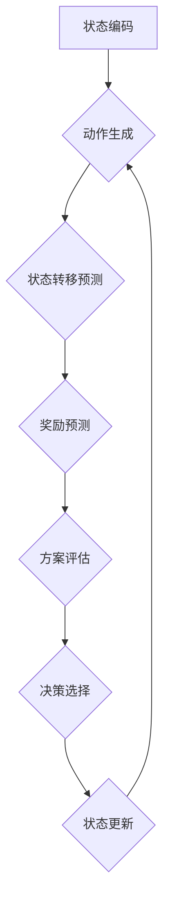

# 大语言模型应用指南：多步优化中的预测

作者：禅与计算机程序设计艺术

## 1. 背景介绍

### 1.1 多步优化问题概述

在现实世界中，许多问题需要进行多步决策以达到最终目标。例如，在物流配送中，需要规划路线、分配车辆、安排配送顺序等一系列步骤。这类问题通常被称为**多步优化问题**。

### 1.2 大语言模型的优势

近年来，大语言模型（LLM）在自然语言处理领域取得了显著的进展。LLM 具备强大的文本理解和生成能力，可以用于处理各种复杂的语言任务。在多步优化问题中，LLM 可以用于：

* **预测未来状态:** 基于当前状态和历史信息，LLM 可以预测未来可能出现的状态，为决策提供依据。
* **生成候选方案:** LLM 可以生成多种可能的行动方案，供决策者选择。
* **评估方案优劣:** LLM 可以评估不同方案的优劣，帮助决策者选择最佳方案。

### 1.3 本文目标

本文旨在探讨如何利用大语言模型进行多步优化中的预测，并提供实际应用案例和代码示例。

## 2. 核心概念与联系

### 2.1 马尔可夫决策过程 (MDP)

马尔可夫决策过程 (MDP) 是描述多步优化问题的一种常用框架。MDP 包括以下核心要素：

* **状态 (State):** 描述系统当前所处的状态。
* **动作 (Action):**  决策者可以采取的行动。
* **状态转移函数 (Transition Function):** 描述在当前状态下采取某个动作后，系统转移到下一个状态的概率。
* **奖励函数 (Reward Function):**  描述在某个状态下采取某个动作后，系统获得的奖励。

### 2.2 大语言模型与 MDP 的联系

LLM 可以用于模拟 MDP 中的各个要素：

* **状态:** LLM 可以将当前状态编码为文本表示。
* **动作:** LLM 可以生成可能的行动方案，并将其编码为文本表示。
* **状态转移函数:** LLM 可以根据当前状态和动作，预测下一个状态的文本表示。
* **奖励函数:** LLM 可以根据当前状态和动作，预测获得的奖励。

## 3. 核心算法原理具体操作步骤

### 3.1 基于 LLM 的多步预测算法

以下是基于 LLM 的多步预测算法的基本流程：

1. **状态编码:** 将当前状态编码为文本表示。
2. **动作生成:**  利用 LLM 生成可能的行动方案，并将其编码为文本表示。
3. **状态转移预测:** 利用 LLM 根据当前状态和动作，预测下一个状态的文本表示。
4. **奖励预测:** 利用 LLM 根据当前状态和动作，预测获得的奖励。
5. **方案评估:** 根据预测的状态和奖励，评估不同方案的优劣。
6. **决策选择:** 选择最佳方案，并执行相应的动作。
7. **状态更新:** 更新系统状态，进入下一轮决策。

### 3.2 算法流程图



## 4. 数学模型和公式详细讲解举例说明

### 4.1 状态转移概率

假设当前状态为 $s_t$，动作 $a_t$，下一个状态为 $s_{t+1}$，则状态转移概率可以表示为：

$$
P(s_{t+1} | s_t, a_t)
$$

LLM 可以通过学习大量数据，来估计状态转移概率。

### 4.2 奖励函数

奖励函数 $R(s_t, a_t)$ 描述在状态 $s_t$ 下采取动作 $a_t$ 获得的奖励。LLM 可以通过学习数据，来估计奖励函数。

### 4.3 举例说明

假设有一个物流配送问题，需要规划车辆路线。

* **状态:**  车辆当前位置、货物信息、配送时间窗口等。
* **动作:**  选择下一个配送地点。
* **状态转移概率:**  车辆从当前位置到达下一个配送地点的概率，受交通状况、道路网络等因素影响。
* **奖励函数:**  完成配送任务获得的收益，以及配送延迟带来的损失。

LLM 可以学习历史配送数据，并预测车辆在不同状态下采取不同动作后的状态转移概率和奖励函数，从而帮助规划最佳配送路线。

## 5. 项目实践：代码实例和详细解释说明

### 5.1 代码实例

```python
import transformers

# 加载预训练的 LLM 模型
model_name = "gpt2"
model = transformers.AutoModelForCausalLM.from_pretrained(model_name)
tokenizer = transformers.AutoTokenizer.from_pretrained(model_name)

# 定义状态编码函数
def encode_state(state):
  """将状态编码为文本表示"""
  # TODO: 实现状态编码逻辑
  pass

# 定义动作生成函数
def generate_actions(state):
  """生成可能的行动方案"""
  # TODO: 实现动作生成逻辑
  pass

# 定义状态转移预测函数
def predict_next_state(state, action):
  """预测下一个状态"""
  # TODO: 实现状态转移预测逻辑
  pass

# 定义奖励预测函数
def predict_reward(state, action):
  """预测奖励"""
  # TODO: 实现奖励预测逻辑
  pass

# 定义多步预测函数
def multi_step_prediction(initial_state, num_steps):
  """进行多步预测"""
  state = initial_state
  for step in range(num_steps):
    # 1. 状态编码
    encoded_state = encode_state(state)

    # 2. 动作生成
    actions = generate_actions(state)

    # 3. 状态转移预测和奖励预测
    next_states = []
    rewards = []
    for action in actions:
      next_state = predict_next_state(encoded_state, action)
      reward = predict_reward(encoded_state, action)
      next_states.append(next_state)
      rewards.append(reward)

    # 4. 方案评估和决策选择
    # TODO: 实现方案评估和决策选择逻辑

    # 5. 状态更新
    state = # TODO: 根据选择的方案更新状态
```

### 5.2 代码解释

*  `transformers` 库用于加载和使用预训练的 LLM 模型。
*  `encode_state` 函数将状态编码为文本表示。
*  `generate_actions` 函数生成可能的行动方案。
*  `predict_next_state` 函数预测下一个状态。
*  `predict_reward` 函数预测奖励。
*  `multi_step_prediction` 函数进行多步预测，并根据预测结果进行决策选择。

## 6. 实际应用场景

### 6.1 游戏 AI

LLM 可以用于开发游戏 AI，例如预测对手行动、规划游戏策略等。

### 6.2 机器人控制

LLM 可以用于控制机器人，例如预测机器人下一步的动作、规划机器人路径等。

### 6.3 自动驾驶

LLM 可以用于自动驾驶系统，例如预测道路状况、规划行驶路线等。

### 6.4 金融预测

LLM 可以用于金融预测，例如预测股票价格、评估投资风险等。

## 7. 工具和资源推荐

### 7.1 Hugging Face Transformers

Hugging Face Transformers 提供了丰富的预训练 LLM 模型和工具，方便用户使用和开发 LLM 应用。

### 7.2 OpenAI API

OpenAI API 提供了访问 GPT-3 等强大 LLM 模型的接口，用户可以通过 API 调用使用 LLM 进行各种任务。

### 7.3 Google AI Platform

Google AI Platform 提供了云端机器学习平台，用户可以在平台上训练和部署 LLM 模型。

## 8. 总结：未来发展趋势与挑战

### 8.1 未来发展趋势

* **更强大的 LLM 模型:** 随着技术的进步，LLM 模型的规模和能力将不断提升。
* **更广泛的应用领域:** LLM 将应用于更多领域，例如医疗、教育、法律等。
* **更智能的决策:** LLM 将与其他 AI 技术结合，实现更智能的决策。

### 8.2 挑战

* **数据质量:** LLM 的性能依赖于训练数据的质量，如何获取高质量的训练数据是一个挑战。
* **模型解释性:** LLM 的决策过程难以解释，如何提高模型的可解释性是一个挑战。
* **伦理和社会影响:** LLM 的应用可能带来伦理和社会影响，如何应对这些挑战是一个重要问题。

## 9. 附录：常见问题与解答

### 9.1 LLM 如何处理不确定性？

LLM 可以通过概率分布来表示不确定性，例如预测状态转移概率和奖励函数时，可以输出概率分布而不是确定值。

### 9.2 如何评估 LLM 的预测效果？

可以使用标准的机器学习评估指标，例如准确率、召回率、F1 值等，来评估 LLM 的预测效果。

### 9.3 如何提高 LLM 的预测精度？

可以通过以下方式提高 LLM 的预测精度：

* 使用更大的数据集进行训练。
* 使用更复杂的模型架构。
* 使用更有效的训练算法。
* 对模型进行微调，使其适应特定任务。 
