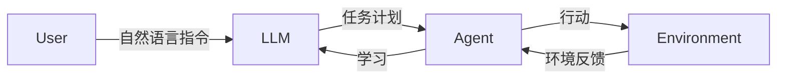

##  1. 背景介绍

### 1.1 人工智能发展历程与自主Agent

人工智能(AI) 的发展经历了从符号主义到连接主义的转变，近年来，随着深度学习技术的突破，人工智能迎来了新的发展浪潮。深度学习模型在图像识别、语音识别、自然语言处理等领域取得了显著成果，为人工智能的应用打开了更广阔的空间。

在人工智能发展的历程中，自主Agent（Autonomous Agent）一直是研究者们关注的焦点。自主Agent是指能够感知环境、进行决策、并自主执行任务的智能系统。早期的自主Agent系统主要基于规则和逻辑推理，例如专家系统。随着机器学习技术的发展，基于学习的自主Agent系统逐渐成为主流，这些系统能够从数据中学习并改进自身的行为。

### 1.2 大语言模型(LLM)的崛起

近年来，大语言模型（Large Language Model, LLM）的崛起为自主Agent系统的发展带来了新的机遇。LLM是基于深度学习的自然语言处理模型，能够理解和生成人类语言，并在各种自然语言处理任务中表现出色。LLM的强大能力为构建更加智能、灵活和强大的自主Agent系统提供了基础。

### 1.3 LLM赋能自主Agent系统

LLM为自主Agent系统带来了以下优势：

* **强大的语言理解和生成能力：** LLM能够理解用户的自然语言指令，并将指令转化为可执行的计划。
* **丰富的知识储备：** LLM在训练过程中学习了海量的文本数据，拥有丰富的知识储备，能够为自主Agent提供决策支持。
* **强大的推理和规划能力：** LLM能够根据当前环境和目标进行推理和规划，并生成一系列行动方案。
* **可解释性和可控性：** LLM能够解释其决策过程，并允许用户进行干预和控制。


## 2. 核心概念与联系

### 2.1 自主Agent系统的基本要素

自主Agent系统通常包含以下基本要素：

* **感知(Perception)：** Agent通过传感器感知周围环境，获取环境信息。
* **决策(Decision-Making)：** Agent根据感知到的环境信息和自身目标，进行决策，选择最佳行动方案。
* **行动(Action)：** Agent执行决策结果，与环境进行交互。
* **学习(Learning)：** Agent根据环境反馈，不断学习和改进自身的行为策略。

### 2.2 LLM在自主Agent系统中的角色

LLM在自主Agent系统中扮演着重要的角色，主要体现在以下几个方面：

* **自然语言接口：** LLM作为用户与自主Agent系统之间的桥梁，使用户能够使用自然语言与Agent进行交互。
* **任务规划：** LLM能够将用户的自然语言指令转化为可执行的任务计划，指导Agent的行动。
* **知识推理：** LLM能够利用其丰富的知识储备，为Agent的决策提供支持。
* **行为解释：** LLM能够解释Agent的决策过程，提高系统的透明度和可控性。

### 2.3 LLM与其他Agent技术的联系

LLM与其他Agent技术，例如强化学习(Reinforcement Learning)、多Agent系统(Multi-Agent System)等，存在着密切的联系。LLM可以作为强化学习的策略网络，指导Agent在环境中进行探索和学习。LLM还可以用于构建多Agent系统中的Agent之间的通信和协作机制。

## 3. 核心算法原理具体操作步骤

### 3.1 基于LLM的自主Agent系统架构

基于LLM的自主Agent系统通常采用以下架构：



* 用户向LLM发送自然语言指令。
* LLM将指令转化为可执行的任务计划。
* Agent根据任务计划执行行动，与环境进行交互。
* 环境反馈Agent的行动结果。
* Agent根据环境反馈进行学习，并将学习结果反馈给LLM。

### 3.2 LLM进行任务规划的步骤

LLM进行任务规划的步骤如下：

1. **指令解析：** LLM首先解析用户的自然语言指令，提取关键信息，例如任务目标、约束条件等。
2. **计划生成：** LLM根据指令信息和自身知识储备，生成可执行的任务计划，计划通常包含一系列步骤和操作。
3. **计划评估：** LLM评估生成的计划，确保计划的可行性和有效性。
4. **计划优化：** LLM根据评估结果对计划进行优化，提高计划的效率和成功率。

### 3.3 Agent执行任务计划的步骤

Agent执行任务计划的步骤如下：

1. **步骤解析：** Agent解析LLM生成的计划，提取每个步骤的具体操作。
2. **行动执行：** Agent根据步骤指示执行相应的行动，与环境进行交互。
3. **状态更新：** Agent根据环境反馈更新自身状态，例如位置、资源等。
4. **结果反馈：** Agent将行动结果反馈给LLM，用于计划评估和优化。

## 4. 数学模型和公式详细讲解举例说明

### 4.1 LLM的语言模型

LLM通常基于Transformer架构，其核心是自注意力机制(Self-Attention Mechanism)。自注意力机制允许模型关注输入序列中不同位置的信息，从而捕捉句子中的长距离依赖关系。

$$
Attention(Q, K, V) = softmax(\frac{QK^T}{\sqrt{d_k}})V
$$

其中，Q、K、V分别表示查询矩阵、键矩阵和值矩阵，$d_k$表示键矩阵的维度。

### 4.2 强化学习

强化学习是一种机器学习方法，Agent通过与环境进行交互，学习最佳的行为策略。强化学习的核心是奖励函数(Reward Function)，奖励函数定义了Agent在不同状态下采取不同行动所获得的奖励。

$$
Q(s, a) = R(s, a) + \gamma \max_{a'} Q(s', a')
$$

其中，Q(s, a)表示在状态s下采取行动a的价值，R(s, a)表示在状态s下采取行动a获得的奖励，$\gamma$表示折扣因子，s'表示下一个状态，a'表示下一个行动。

### 4.3 举例说明

假设我们构建一个基于LLM的自主Agent系统，用于控制智能家居。用户可以通过自然语言指令控制家中的电器设备，例如“打开客厅的灯”。

1. **指令解析：** LLM解析指令“打开客厅的灯”，提取任务目标“打开灯”和目标位置“客厅”。
2. **计划生成：** LLM生成任务计划，例如：
    * 找到客厅的灯的开关。
    * 打开开关。
3. **计划评估：** LLM评估计划的可行性，例如：
    * 客厅是否有灯？
    * 灯的开关是否正常工作？
4. **计划优化：** LLM根据评估结果优化计划，例如：
    * 如果客厅没有灯，则提示用户添加灯。
    * 如果灯的开关损坏，则提示用户维修开关。
5. **行动执行：** Agent根据计划执行行动，找到客厅的灯的开关并打开开关。
6. **状态更新：** Agent更新自身状态，例如记录灯的开关状态。
7. **结果反馈：** Agent将行动结果反馈给LLM，例如“客厅的灯已打开”。

## 5. 项目实践：代码实例和详细解释说明

### 5.1 LangChain框架

LangChain是一个用于开发基于LLM的应用程序的框架，提供了丰富的工具和组件，例如：

* **模型集成：** 支持集成各种LLM，例如OpenAI的GPT-3、Google的PaLM等。
* **提示模板：** 提供各种提示模板，用于引导LLM生成特定类型的文本。
* **链式调用：** 支持将多个LLM或其他工具链式调用，构建复杂的应用程序。

### 5.2 代码实例

```python
from langchain.llms import OpenAI
from langchain.agents import load_tools
from langchain.agents import initialize_agent

# 初始化LLM
llm = OpenAI(temperature=0)

# 加载工具
tools = load_tools(["wikipedia", "llm_math"])

# 初始化Agent
agent = initialize_agent(
    tools, 
    llm, 
    agent="zero-shot-react-description", 
    verbose=True
)

# 用户指令
user_input = "What is the capital of France?"

# Agent执行任务
agent.run(user_input)
```

### 5.3 代码解释

* 首先，我们初始化LLM，这里使用OpenAI的GPT-3模型。
* 然后，我们加载工具，这里加载了Wikipedia和llm_math工具，用于查询信息和进行数学计算。
* 接着，我们初始化Agent，指定使用的工具、LLM和Agent类型。
* 最后，我们定义用户指令，并调用Agent的run方法执行任务。

## 6. 实际应用场景

### 6.1 智能助手

基于LLM的自主Agent系统可以用于构建智能助手，例如：

* **个人助理：** 帮助用户管理日程、安排行程、发送邮件等。
* **客服机器人：** 自动回答用户问题，提供产品支持和服务。
* **智能家居控制：** 通过语音或文本指令控制家中的电器设备。

### 6.2 自动化任务

基于LLM的自主Agent系统可以用于自动化各种任务，例如：

* **数据分析：** 自动从数据中提取信息，生成报告和图表。
* **内容创作：** 自动生成文章、故事、诗歌等。
* **代码生成：** 自动生成代码，提高软件开发效率。

### 6.3 游戏AI

基于LLM的自主Agent系统可以用于构建游戏AI，例如：

* **非玩家角色(NPC)：** 控制游戏中非玩家角色的行为，使游戏更加真实和有趣。
* **游戏剧情生成：** 自动生成游戏剧情，提高游戏的可玩性和趣味性。


## 7. 总结：未来发展趋势与挑战

### 7.1 未来发展趋势

* **更加强大的LLM：** 随着深度学习技术的不断发展，LLM的规模和能力将会进一步提升，为自主Agent系统提供更强大的支持。
* **多模态Agent：** 未来的自主Agent系统将会集成多种感知能力，例如视觉、听觉、触觉等，从而更好地理解和应对复杂的环境。
* **人机协同：** 未来的自主Agent系统将会更加注重人机协同，人与Agent将会更加紧密地合作，共同完成任务。

### 7.2 面临的挑战

* **安全性：** 如何确保自主Agent系统的安全性，防止其被恶意利用，是一个重要的挑战。
* **可解释性：** 如何提高自主Agent系统的可解释性，使用户能够理解其决策过程，是一个需要解决的问题。
* **伦理问题：** 自主Agent系统的发展也带来了一些伦理问题，例如责任归属、隐私保护等，需要进行深入的思考和探讨。


## 8. 附录：常见问题与解答

### 8.1 LLM与传统Agent技术的区别是什么？

LLM与传统Agent技术的主要区别在于：

* **语言理解和生成能力：** LLM拥有强大的语言理解和生成能力，能够理解用户的自然语言指令，并生成自然语言解释。传统Agent技术通常基于符号或逻辑推理，语言处理能力有限。
* **知识储备：** LLM在训练过程中学习了海量的文本数据，拥有丰富的知识储备，能够为Agent提供决策支持。传统Agent技术通常需要手动构建知识库，知识储备有限。
* **学习能力：** LLM能够从数据中学习，并不断改进自身的行为策略。传统Agent技术通常基于固定的规则和逻辑，学习能力有限。

### 8.2 如何评估自主Agent系统的性能？

评估自主Agent系统的性能可以考虑以下指标：

* **任务完成率：** Agent成功完成任务的比例。
* **任务完成时间：** Agent完成任务所需的平均时间。
* **资源消耗：** Agent完成任务所需的计算资源和时间资源。
* **用户满意度：** 用户对Agent的性能和体验的评价。


### 8.3 如何选择合适的LLM？

选择合适的LLM需要考虑以下因素：

* **任务需求：** 不同的任务需要不同类型的LLM，例如文本生成、问答、代码生成等。
* **模型规模：** LLM的规模越大，其能力越强，但同时也需要更多的计算资源。
* **成本：** 不同LLM的成本不同，需要根据预算进行选择。
* **可用性：** 不同LLM的可用性不同，需要选择容易获取和使用的模型。
