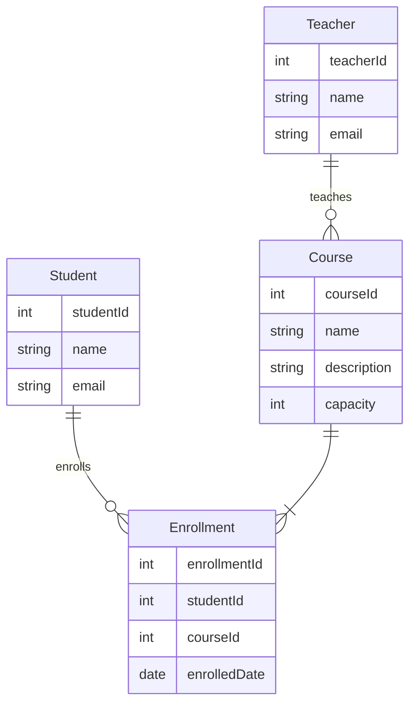

下面是关于"学生在线选课系统详细设计与具体代码实现"的技术博客文章正文内容：

## 1. 背景介绍

随着在线教育的兴起和发展,学生在线选课系统逐渐成为现代教育机构提供优质教学服务的重要组成部分。该系统旨在简化和自动化课程注册流程,为学生和教师提供一个高效、便捷的平台,实现课程管理和选课的无缝衔接。

### 1.1 系统目标

学生在线选课系统的主要目标包括:

1. 提供直观的课程列表,方便学生浏览和选择感兴趣的课程。
2. 自动处理学生的课程注册请求,减轻管理人员的工作量。
3. 实时跟踪课程的剩余名额,防止选课人数超过限制。
4. 为学生和教师提供个性化的账户管理功能。
5. 生成选课报告,方便教学管理人员进行统计和分析。

### 1.2 系统架构概览

学生在线选课系统通常采用基于Web的客户端-服务器架构,其中:

- **客户端**: 通过浏览器访问系统的Web界面,进行课程浏览、选课等操作。
- **服务器端**: 包括Web服务器、应用服务器和数据库服务器,负责处理客户端请求、执行业务逻辑和数据存储。

该系统的核心功能模块包括:课程管理、用户管理、选课管理、报表生成等。下面将对系统的设计和实现进行详细阐述。

## 2. 核心概念与联系

### 2.1 实体关系模型

学生在线选课系统涉及的主要实体及其关系如下:

- 学生(Student) - 可选择并注册课程
- 教师(Teacher) - 负责开设和授课
- 课程(Course) - 由教师开设,供学生选择
- 选课记录(Enrollment) - 记录学生选择的具体课程

它们之间的关系可用实体关系图(ERD)表示如下:



### 2.2 主要用例

系统的主要用例包括:

- 学生用例:
  - 浏览课程列表
  - 选择并注册课程
  - 查看已选课程
  - 退选已选课程

- 教师用例: 
  - 开设新课程
  - 更新课程信息
  - 查看任教课程
  - 查看选课学生名单

- 管理员用例:
  - 管理学生和教师账户
  - 生成选课报表
  - 备份和恢复数据

## 3. 核心算法原理具体操作步骤  

### 3.1 选课算法

当学生尝试选择一门课程时,系统需要执行以下步骤:

1. 检查学生是否已经注册该课程。如果是,返回错误信息。
2. 检查该课程的剩余名额是否大于0。如果小于等于0,返回错误信息。
3. 创建一条新的选课记录(Enrollment),将学生ID和课程ID写入数据库。
4. 更新该课程的剩余名额,将其减1。
5. 返回成功信息。

可以用以下伪代码表示:

```
函数 enroll(学生ID, 课程ID):
    如果 学生已注册该课程:
        返回 "您已经注册该课程"
    
    查询课程剩余名额
    如果 剩余名额 <= 0:
        返回 "该课程已满员"

    在选课记录表中插入新记录(学生ID, 课程ID)
    更新课程表中该课程的剩余名额 = 剩余名额 - 1
    返回 "注册成功"
```

该算法的时间复杂度为O(1),因为只涉及常数次数据库查询和更新操作。

### 3.2 退课算法

当学生尝试退选一门已选课程时,系统执行以下步骤:

1. 检查学生是否已经注册该课程。如果没有,返回错误信息。
2. 从选课记录表中删除该学生对应的记录。
3. 更新该课程的剩余名额,将其加1。 
4. 返回成功信息。

伪代码如下:

```
函数 withdraw(学生ID, 课程ID):
    如果 学生未注册该课程:
        返回 "您没有选择该课程"

    从选课记录表中删除该记录(学生ID, 课程ID)
    更新课程表中该课程的剩余名额 = 剩余名额 + 1
    返回 "退课成功"
```

该算法的时间复杂度也为O(1)。

通过以上两个算法,系统可以高效地处理学生的选课和退课请求,并及时更新相关数据。

## 4. 数学模型和公式详细讲解举例说明

在学生在线选课系统中,我们可以使用集合理论和离散数学模型来描述和分析一些核心概念和约束条件。

### 4.1 课程容量约束

假设有一个课程$c$,其最大容量为$C$,已选学生集合为$S$。我们需要确保:

$$
|S| \leq C
$$

其中$|S|$表示集合$S$的基数(元素个数)。

当一个新的学生$s$尝试选择课程$c$时,我们可以用集合并运算$S'=S\cup\{s\}$表示。只有当$|S'| \leq C$时,选课请求才能被接受,否则会拒绝。

### 4.2 学生课程负载约束

我们可以定义一个学生$s$的已选课程集合为$C_s$。假设系统规定每个学生最多可选$N$门课程,即:

$$
|C_s| \leq N
$$

当学生$s$尝试选择一门新课程$c$时,我们检查$|C_s\cup\{c\}| \leq N$是否成立。如果成立,接受选课请求,否则拒绝。

### 4.3 课程冲突约束

对于每门课程$c$,我们可以用一个时间段集合$T_c$表示其上课时间,例如:

$$
T_c = \{ (日期,开始时间,结束时间) \}
$$

对于一个学生$s$,其所选课程的时间段集合并为:

$$
T_s = \bigcup_{c \in C_s} T_c
$$

为了避免时间冲突,我们需要确保对任意两个时间段$(t_1,t_2) \in T_s$:

$$
t_1.结束时间 \leq t_2.开始时间 \;\;\text{或}\;\; t_2.结束时间 \leq t_1.开始时间
$$

如果新选课程$c'$的时间段$T_{c'}$与$T_s$有重叠,则拒绝选课请求。

通过使用集合理论和离散数学模型,我们可以准确地刻画和验证系统中的各种约束条件,确保数据的完整性和一致性。

## 5. 项目实践:代码实例和详细解释说明

为了更好地理解学生在线选课系统的实现细节,我们将使用Java语言和Spring框架,给出一些核心模块的代码示例。

### 5.1 实体类

首先定义实体类,对应数据库中的表结构:

```java
// 学生实体
@Entity
public class Student {
    @Id
    @GeneratedValue(strategy = GenerationType.IDENTITY)
    private Long id;
    private String name;
    private String email;
    // ...
}

// 教师实体 
@Entity
public class Teacher {
    @Id 
    @GeneratedValue(strategy = GenerationType.IDENTITY)
    private Long id;
    private String name;
    private String email;
    // ...
}

// 课程实体
@Entity
public class Course {
    @Id
    @GeneratedValue(strategy = GenerationType.IDENTITY) 
    private Long id;
    private String name;
    private String description;
    private int capacity;
    
    @ManyToOne
    private Teacher teacher;
    // ...
}

// 选课记录实体
@Entity
public class Enrollment {
    @Id
    @GeneratedValue(strategy = GenerationType.IDENTITY)
    private Long id;
    
    @ManyToOne
    private Student student;
    
    @ManyToOne
    private Course course;
    
    private LocalDate enrolledDate;
    // ...
}
```

### 5.2 存储库接口

定义存储库接口,用于数据访问:

```java
// 学生存储库
@Repository
public interface StudentRepository extends JpaRepository<Student, Long> {
}

// 课程存储库 
@Repository
public interface CourseRepository extends JpaRepository<Course, Long> {
}

// 选课存储库
@Repository 
public interface EnrollmentRepository extends JpaRepository<Enrollment, Long> {
    List<Enrollment> findByStudentAndCourse(Student student, Course course);
}
```

### 5.3 服务层

在服务层实现业务逻辑:

```java
@Service
public class EnrollmentService {

    @Autowired
    private StudentRepository studentRepo;
    
    @Autowired 
    private CourseRepository courseRepo;
    
    @Autowired
    private EnrollmentRepository enrollmentRepo;
    
    public ResponseEntity<?> enroll(Long studentId, Long courseId) {
        Student student = studentRepo.findById(studentId)
                .orElseThrow(() -> new ResourceNotFoundException("Student not found"));
        
        Course course = courseRepo.findById(courseId)
                .orElseThrow(() -> new ResourceNotFoundException("Course not found"));
        
        // 检查是否已选该课程
        List<Enrollment> existingEnrollments = enrollmentRepo.findByStudentAndCourse(student, course);
        if (!existingEnrollments.isEmpty()) {
            return ResponseEntity.badRequest().body("You have already enrolled in this course");
        }
        
        // 检查课程容量
        if (course.getRemainingCapacity() <= 0) {
            return ResponseEntity.badRequest().body("Course is full");
        }
        
        // 创建选课记录
        Enrollment enrollment = new Enrollment();
        enrollment.setStudent(student);
        enrollment.setCourse(course);
        enrollment.setEnrolledDate(LocalDate.now());
        enrollmentRepo.save(enrollment);
        
        // 更新课程剩余容量
        course.setRemainingCapacity(course.getRemainingCapacity() - 1);
        courseRepo.save(course);
        
        return ResponseEntity.ok("Enrollment successful");
    }
    
    // 其他服务方法...
}
```

### 5.4 控制器层

在控制器层处理HTTP请求:

```java
@RestController
@RequestMapping("/api/enrollments")
public class EnrollmentController {

    @Autowired
    private EnrollmentService enrollmentService;
    
    @PostMapping("/{studentId}/courses/{courseId}")
    public ResponseEntity<?> enroll(@PathVariable Long studentId, @PathVariable Long courseId) {
        return enrollmentService.enroll(studentId, courseId);
    }
    
    // 其他控制器方法...
}
```

以上代码展示了选课功能的核心实现。通过服务层的`enroll`方法,我们可以执行选课算法的各个步骤,包括检查是否已选该课程、检查课程容量、创建选课记录以及更新课程剩余容量。控制器层则负责接收HTTP请求,调用服务层方法并返回响应。

其他功能如退课、课程管理、用户管理等,可以通过类似的方式实现。我们还可以添加全局异常处理、数据验证、安全控制等功能,以提高系统的健壮性和可用性。

## 6. 实际应用场景

学生在线选课系统可以广泛应用于各种教育机构,如大学、在线教育平台、培训机构等。以下是一些典型的应用场景:

### 6.1 大学课程管理

在大学中,学生在线选课系统可以取代传统的手工选课方式,极大提高了选课效率。学生可以通过系统浏览所有开设课程的详细信息,并根据自己的兴趣和需求进行选择。系统会自动处理选课请求,避免了手工处理带来的低效和错误。

### 6.2 在线教育平台

对于提供在线课程的教育平台,学生在线选课系统是必不可少的组成部分。学生可以方便地浏览平台上的所有课程目录,选择感兴趣的课程进行学习。系统还可以根据学生的选课记录,为他们推荐相关课程,提高学习体验。

### 6.3 企业内训

许多大型企业都有内部培训部门,负责为员工提供各种培训课程。通过部署学生在线选课系统,员工可以自主选择感兴趣的课程进行学习,而不必依赖人工安排。这种自助式的选课模式可以提高员工的主