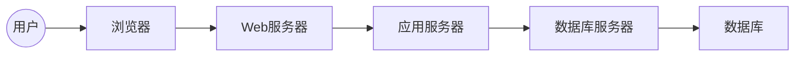

## 学生成绩查询系统详细设计与具体代码实现

作者：禅与计算机程序设计艺术

## 1. 背景介绍

### 1.1. 成绩查询系统的意义

在信息时代，学校的教育管理工作越来越依赖于信息化系统。学生成绩查询系统作为教务管理系统的重要组成部分，能够极大地提高学校的工作效率，减轻教师的工作负担，方便学生及时了解自己的学习情况。

### 1.2. 传统成绩查询方式的弊端

传统的成绩查询方式主要依靠人工操作，例如：

* 学生到教务处查询成绩，需要排队等候，效率低下；
* 教师需要手工录入成绩，容易出错，且工作量大；
* 纸质成绩单容易丢失或损坏。

### 1.3.  学生成绩查询系统的优势

而学生成绩查询系统则可以有效解决以上问题，其优势主要体现在：

* **方便快捷:** 学生可以随时随地通过网络查询自己的成绩，无需排队等候；
* **准确高效:** 系统自动计算和统计成绩，避免了人工操作的错误；
* **安全可靠:** 系统采用安全措施，保证学生信息的安全。

## 2. 核心概念与联系

### 2.1. 系统用户角色

学生成绩查询系统主要涉及以下用户角色:

* **学生:**  可以登录系统查询自己的成绩、查看课程信息、修改个人信息等。
* **教师:**  可以登录系统录入学生成绩、管理课程信息、发布通知等。
* **管理员:**  可以管理系统用户、设置系统参数、维护系统数据等。

### 2.2.  系统功能模块

学生成绩查询系统主要包括以下功能模块:

* **用户登录模块:**  提供用户登录和注册功能。
* **学生模块:**   提供学生查询成绩、查看课程信息、修改个人信息等功能。
* **教师模块:**   提供教师录入成绩、管理课程信息、发布通知等功能。
* **管理员模块:**   提供管理员管理系统用户、设置系统参数、维护系统数据等功能。

### 2.3.  系统数据库设计

系统数据库设计如下：

* **用户表:**  存储用户信息，包括用户ID、用户名、密码、角色等。
* **学生信息表:**  存储学生信息，包括学号、姓名、性别、班级等。
* **课程信息表:**  存储课程信息，包括课程ID、课程名称、学分等。
* **成绩表:**  存储学生成绩信息，包括学生ID、课程ID、成绩等。

### 2.4.  系统架构设计

系统采用B/S架构，即浏览器/服务器架构，用户可以通过浏览器访问系统，服务器负责处理用户的请求并返回相应的结果。系统架构图如下：



## 3. 核心算法原理具体操作步骤

### 3.1. 用户登录模块

用户登录模块主要实现用户登录和注册功能。

#### 3.1.1. 用户登录

1. 用户在登录页面输入用户名和密码。
2. 系统验证用户名和密码是否正确。
3. 如果用户名和密码正确，则跳转到主页面；否则，提示用户重新输入。

#### 3.1.2.  用户注册

1. 用户在注册页面填写注册信息。
2. 系统验证注册信息是否合法。
3. 如果注册信息合法，则将用户信息保存到数据库中，并提示用户注册成功；否则，提示用户重新填写注册信息。

### 3.2. 学生模块

学生模块主要实现学生查询成绩、查看课程信息、修改个人信息等功能。

#### 3.2.1. 查询成绩

1. 学生登录系统后，点击“查询成绩”菜单。
2. 系统根据学生的学号查询该学生的成绩信息。
3. 系统将查询结果以表格的形式展示给学生。

#### 3.2.2. 查看课程信息

1. 学生登录系统后，点击“课程信息”菜单。
2. 系统查询所有课程信息。
3. 系统将查询结果以表格的形式展示给学生。

#### 3.2.3. 修改个人信息

1. 学生登录系统后，点击“个人信息”菜单。
2. 系统显示学生的个人信息。
3. 学生可以修改自己的个人信息，并点击“保存”按钮保存修改后的信息。

### 3.3. 教师模块

教师模块主要实现教师录入成绩、管理课程信息、发布通知等功能。

#### 3.3.1. 录入成绩

1. 教师登录系统后，点击“录入成绩”菜单。
2. 教师选择要录入成绩的课程。
3. 教师输入学生的成绩信息。
4. 系统将成绩信息保存到数据库中。

#### 3.3.2. 管理课程信息

1. 教师登录系统后，点击“课程信息”菜单。
2. 教师可以新增、修改、删除课程信息。
3. 系统将修改后的课程信息保存到数据库中。

#### 3.3.3. 发布通知

1. 教师登录系统后，点击“发布通知”菜单。
2. 教师填写通知内容。
3. 系统将通知内容发布到系统首页。

### 3.4. 管理员模块

管理员模块主要实现管理员管理系统用户、设置系统参数、维护系统数据等功能。

#### 3.4.1. 管理系统用户

1. 管理员登录系统后，点击“用户管理”菜单。
2. 管理员可以新增、修改、删除用户信息。
3. 系统将修改后的用户信息保存到数据库中。

#### 3.4.2. 设置系统参数

1. 管理员登录系统后，点击“系统设置”菜单。
2. 管理员可以设置系统的各项参数。
3. 系统将修改后的系统参数保存到配置文件中。

#### 3.4.3. 维护系统数据

1. 管理员登录系统后，点击“数据维护”菜单。
2. 管理员可以备份、恢复系统数据。
3. 系统将备份数据保存到指定目录下。


## 4. 数学模型和公式详细讲解举例说明

本系统中没有涉及复杂的数学模型和公式。

## 5. 项目实践：代码实例和详细解释说明

### 5.1.  技术选型

本系统采用以下技术栈：

* 后端：Spring Boot
* 数据库：MySQL
* 前端：Thymeleaf

### 5.2.  代码实例

#### 5.2.1. 学生实体类

```java
@Entity
@Table(name = "student")
public class Student {

    @Id
    @GeneratedValue(strategy = GenerationType.IDENTITY)
    private Long id;

    @Column(nullable = false, unique = true)
    private String studentId;

    @Column(nullable = false)
    private String name;

    @Column(nullable = false)
    private String gender;

    @Column(nullable = false)
    private String className;

    // getter and setter
}
```

#### 5.2.2. 学生成绩查询接口

```java
@RestController
@RequestMapping("/api/student")
public class StudentController {

    @Autowired
    private StudentService studentService;

    @GetMapping("/{studentId}/scores")
    public List<Score> getStudentScores(@PathVariable String studentId) {
        return studentService.getStudentScores(studentId);
    }
}
```

#### 5.2.3. 学生成绩查询页面

```html
<!DOCTYPE html>
<html lang="en" xmlns:th="http://www.thymeleaf.org">
<head>
    <meta charset="UTF-8">
    <title>学生成绩查询</title>
</head>
<body>
<h1>学生成绩查询</h1>
<table border="1">
    <thead>
    <tr>
        <th>课程名称</th>
        <th>成绩</th>
    </tr>
    </thead>
    <tbody>
    <tr th:each="score : ${scores}">
        <td th:text="${score.courseName}"></td>
        <td th:text="${score.score}"></td>
    </tr>
    </tbody>
</table>
</body>
</html>
```

### 5.3. 代码解释

* 学生实体类使用JPA注解定义了学生信息表对应的实体类，包括学号、姓名、性别、班级等属性。
* 学生成绩查询接口使用Spring MVC注解定义了一个RESTful API接口，用于查询学生的成绩信息。
* 学生成绩查询页面使用Thymeleaf模板引擎渲染页面，展示学生的成绩信息。


## 6. 实际应用场景

学生成绩查询系统可以应用于各种类型的学校，包括：

* **小学:**  可以方便家长及时了解孩子的学习情况。
* **中学:**  可以帮助学生更好地规划自己的学习目标。
* **大学:**  可以作为教务管理系统的重要组成部分，提高学校的管理效率。

## 7. 工具和资源推荐

### 7.1. 开发工具

* IntelliJ IDEA:  一款功能强大的Java开发工具。
* MySQL Workbench:  一款图形化的MySQL数据库管理工具。
* Postman:  一款API测试工具。

### 7.2. 学习资源

* Spring Boot官方文档:  https://spring.io/projects/spring-boot
* MySQL官方文档:  https://dev.mysql.com/doc/
* Thymeleaf官方文档:  https://www.thymeleaf.org/

## 8. 总结：未来发展趋势与挑战

### 8.1. 未来发展趋势

* **移动化:**  随着移动互联网的普及，学生成绩查询系统将会越来越倾向于移动化，方便学生随时随地查询成绩。
* **智能化:**  随着人工智能技术的不断发展，学生成绩查询系统将会更加智能化，例如：可以根据学生的学习情况，推荐合适的学习资源。
* **个性化:**  学生成绩查询系统将会更加注重个性化，例如：可以根据学生的兴趣爱好，推荐相关的课程信息。

### 8.2. 面临的挑战

* **数据安全:**  学生成绩信息属于个人隐私，需要采取有效的措施保证数据的安全。
* **系统性能:**  随着用户量的增加，系统需要具备更高的性能才能满足用户的需求。
* **用户体验:**  学生成绩查询系统需要不断优化用户体验，才能吸引更多的用户使用。

## 9. 附录：常见问题与解答

### 9.1.  如何修改密码？

学生和教师用户可以在个人信息页面修改自己的密码。管理员用户可以在用户管理页面修改其他用户的密码。

### 9.2.  忘记密码怎么办？

请联系管理员重置密码。

### 9.3.  如何联系管理员？

请联系学校教务处。
