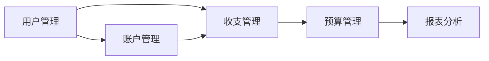

## 1. 背景介绍

### 1.1 家庭理财的重要性

在当今社会，家庭理财已经成为每个家庭不可或缺的一部分。合理有效的家庭理财不仅可以帮助家庭实现财务目标，例如购房、子女教育、退休养老等，还可以提高家庭抗风险能力，保障家庭财务安全。

### 1.2 传统理财方式的弊端

传统的家庭理财方式主要依靠手工记账、Excel表格等方式进行管理，存在以下弊端：

* **效率低下:**  手工记录和计算费时费力，容易出错。
* **数据分散:** 各种财务信息分散在不同的平台和工具中，难以汇总分析。
* **缺乏智能化:** 无法提供个性化的理财建议和风险预警。

### 1.3 家庭理财系统的优势

随着信息技术的快速发展，家庭理财系统应运而生。相比传统理财方式，家庭理财系统具有以下优势：

* **自动化记账:**  通过与银行、支付宝等平台对接，实现自动记账，提高效率和准确性。
* **数据可视化:**  将家庭财务数据进行可视化展示，方便用户直观了解家庭财务状况。
* **智能化分析:**  基于大数据和人工智能技术，提供个性化的理财建议和风险预警。

## 2. 核心概念与联系

### 2.1 用户管理

* **用户注册与登录:**  用户可以通过手机号、邮箱等方式注册账号，并使用账号密码登录系统。
* **用户信息管理:**  用户可以管理个人基本信息，例如姓名、性别、年龄、联系方式等。

### 2.2 账户管理

* **账户添加:**  用户可以添加多个账户，例如银行卡、支付宝、微信钱包等。
* **账户分类:**  用户可以对账户进行分类管理，例如现金、银行存款、投资账户等。
* **账户余额同步:**  系统可以自动同步各个账户的余额信息，方便用户统一管理。

### 2.3 收支管理

* **收入记录:**  用户可以记录各种收入来源，例如工资、奖金、投资收益等。
* **支出记录:**  用户可以记录各种支出项目，例如餐饮、购物、交通、娱乐等。
* **收支分类:**  系统提供预设的收支分类，用户也可以自定义分类，方便统计分析。

### 2.4 预算管理

* **预算设置:**  用户可以设置每月或每年的预算目标，例如总收入、总支出、各个分类的预算等。
* **预算跟踪:**  系统可以实时跟踪预算执行情况，并提供预警提醒。

### 2.5 报表分析

* **收支报表:**  系统可以生成各种类型的收支报表，例如月度报表、年度报表、分类报表等。
* **趋势分析:**  系统可以分析用户的收支趋势，帮助用户了解自己的消费习惯。
* **财务分析:**  系统可以计算用户的财务指标，例如资产负债率、流动比率等。

### 2.6 核心概念关系图



## 3. 核心算法原理具体操作步骤

### 3.1 自动记账功能实现

* **数据获取:**  系统可以通过API接口获取用户在银行、支付宝等平台的交易记录。
* **数据清洗:**  对获取到的交易记录进行清洗和去重，提取关键信息，例如交易时间、交易金额、交易对方等。
* **数据分类:**  根据预设的规则或机器学习模型，对交易记录进行自动分类。
* **数据入库:**  将清洗和分类后的交易记录存储到数据库中。

### 3.2 预算跟踪算法

* **预算分解:**  将用户设置的总预算目标分解到每个月或每一天。
* **实际支出统计:**  统计用户在当月或当日的实际支出情况。
* **预算剩余计算:**  计算预算剩余金额，并与预设的预警阈值进行比较。
* **预警提醒:**  当预算剩余金额低于预警阈值时，系统会通过短信、邮件等方式提醒用户。

## 4. 数学模型和公式详细讲解举例说明

### 4.1 净资产计算公式

$$
\text{净资产} = \text{总资产} - \text{总负债}
$$

**举例说明:**

假设用户的总资产为100万元，总负债为50万元，则用户的净资产为：

$$
\text{净资产} = 100 \text{万元} - 50 \text{万元} = 50 \text{万元}
$$

### 4.2 资产负债率计算公式

$$
\text{资产负债率} = \frac{\text{总负债}}{\text{总资产}} \times 100\%
$$

**举例说明:**

假设用户的总资产为100万元，总负债为50万元，则用户的资产负债率为：

$$
\text{资产负债率} = \frac{50 \text{万元}}{100 \text{万元}} \times 100\% = 50\%
$$

## 5. 项目实践：代码实例和详细解释说明

### 5.1 技术选型

* **后端:**  Spring Boot
* **数据库:**  MySQL
* **前端:**  Vue.js

### 5.2 代码实例

```java
// 账户类
public class Account {

    private Long id;
    private String name;
    private String type;
    private BigDecimal balance;

    // getter & setter
}
```

```sql
-- 创建账户表
CREATE TABLE account (
    id BIGINT PRIMARY KEY AUTO_INCREMENT,
    name VARCHAR(255) NOT NULL,
    type VARCHAR(255) NOT NULL,
    balance DECIMAL(10, 2) NOT NULL
);
```

### 5.3 代码解释

* **账户类:**  定义了账户的基本属性，例如账户ID、账户名称、账户类型、账户余额等。
* **创建账户表:**  使用SQL语句创建账户表，用于存储账户信息。

## 6. 实际应用场景

* **个人及家庭用户:**  可以用于管理个人或家庭的日常收支、预算、投资等。
* **小型企业:**  可以用于管理企业的财务收支、客户管理、库存管理等。
* **公益组织:**  可以用于管理公益项目的资金使用情况、捐赠人信息等。

## 7. 总结：未来发展趋势与挑战

### 7.1 未来发展趋势

* **更加智能化:**  随着人工智能技术的不断发展，家庭理财系统将会更加智能化，例如提供更加精准的理财建议、自动识别和分类交易记录等。
* **更加个性化:**  系统会根据用户的风险偏好、理财目标等提供更加个性化的理财方案。
* **更加便捷化:**  系统会与更多的第三方平台进行对接，例如电商平台、保险平台等，为用户提供更加便捷的理财服务。

### 7.2 面临的挑战

* **数据安全:**  家庭理财系统涉及用户的敏感财务信息，如何保障用户的数据安全是一个重要挑战。
* **用户隐私:**  如何平衡个性化服务和用户隐私保护是一个需要权衡的问题。
* **技术更新迭代:**  随着技术的不断发展，家庭理财系统需要不断更新迭代，以满足用户不断变化的需求。

## 8. 附录：常见问题与解答

### 8.1 问：如何保障我的数据安全？

**答:**  我们采取了多重措施来保障用户的数据安全，例如数据加密存储、多因素身份验证、安全审计等。

### 8.2 问：我可以导出我的数据吗？

**答:**  是的，您可以随时导出您的数据。

### 8.3 问：如何联系客服？

**答:**  您可以在APP内联系在线客服，或者发送邮件至 support@example.com。
