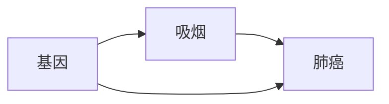

# 异常检测中的因果推理:从相关性到因果性

作者：禅与计算机程序设计艺术

## 1. 背景介绍

### 1.1 异常检测的挑战

在当今数据驱动的世界中，异常检测在各个领域都扮演着至关重要的角色，例如金融欺诈检测、网络安全、工业故障诊断等。然而，传统的异常检测方法主要依赖于数据中的相关性，往往难以区分真正的异常和由其他因素导致的波动，导致误报率高、解释性差等问题。

### 1.2 因果推理的引入

近年来，随着因果推理技术的兴起，人们开始探索如何利用因果关系来提高异常检测的准确性和可解释性。相较于相关性，因果关系能够揭示变量之间的真实影响机制，从而更准确地识别出真正的异常根源。

### 1.3 本文目标

本文旨在深入探讨因果推理在异常检测中的应用，从相关性到因果性的转变，以及如何构建基于因果关系的异常检测系统。

## 2. 核心概念与联系

### 2.1 相关性与因果性的区别

- **相关性:** 指的是两个或多个变量之间存在统计上的关联，例如正相关、负相关或无相关。
- **因果性:** 指的是一个变量的变化会导致另一个变量的变化，存在明确的因果关系。

相关性不等于因果性，两者之间可能存在以下几种关系：

1. **因果关系:** X 导致 Y。
2. **混杂因素:**  Z 同时影响 X 和 Y，导致 X 和 Y 出现虚假相关。
3. **反向因果:** Y 导致 X，而不是 X 导致 Y。
4. **巧合:** X 和 Y 之间的相关性纯属巧合。

### 2.2 因果图模型

因果图模型是一种用图形化方式表示变量之间因果关系的工具，通常由节点和有向边组成，其中节点表示变量，有向边表示因果关系。

### 2.3 因果推断方法

常见的因果推断方法包括：

- **随机对照试验 (RCT):** 通过随机分组的方式，控制混杂因素的影响，从而得出因果关系的结论。
- **准实验方法:** 在无法进行随机对照试验的情况下，利用自然实验或断点回归等方法，尽可能地控制混杂因素的影响。
- **因果中介分析:** 用于识别因果关系的传递路径，以及量化中介变量的作用。

## 3. 核心算法原理具体操作步骤

### 3.1 基于因果图的异常检测

基于因果图的异常检测方法主要分为以下几个步骤：

1. **构建因果图:** 利用专家知识或因果发现算法，构建变量之间的因果关系图。
2. **识别异常根源:** 通过分析因果图，识别出导致异常发生的根源变量。
3. **构建异常检测模型:** 基于根源变量，构建异常检测模型，例如基于阈值的检测、基于机器学习的检测等。
4. **异常解释:** 利用因果图，对检测到的异常进行解释，例如识别出导致异常发生的具体原因。

### 3.2 常用算法

- **PC 算法:** 一种基于约束的因果发现算法，可以从数据中学习变量之间的因果关系。
- **GES 算法:** 一种基于评分搜索的因果发现算法，可以识别出最优的因果图结构。
- **Do-calculus:** 一种用于计算因果效应的数学工具，可以消除混杂因素的影响。

## 4. 数学模型和公式详细讲解举例说明

### 4.1 因果效应

因果效应指的是，当我们改变某个变量 X 的值时，对另一个变量 Y 的影响程度。可以用以下公式表示:

$$
P(Y|do(X=x))
$$

其中，$do(X=x)$ 表示对变量 X 进行干预，将其值设置为 x。

### 4.2 后门准则

后门准则是一种判断是否存在混杂因素的方法，如果存在一条从 X 到 Y 的路径，不经过任何 X 的后代节点，则称这条路径为后门路径。如果所有后门路径都被阻塞，则 X 和 Y 之间的因果关系成立。

### 4.3 实例分析

假设我们想研究吸烟与肺癌之间的因果关系，构建以下因果图:



根据后门准则，基因是吸烟和肺癌之间的混杂因素，因为它存在一条不经过吸烟的后代节点的后门路径。为了消除基因的影响，我们可以使用 Do-calculus 计算吸烟对肺癌的直接因果效应:

$$
P(肺癌|do(吸烟=1)) - P(肺癌|do(吸烟=0))
$$

## 5. 项目实践：代码实例和详细解释说明

```python
import numpy as np
from dowhy import CausalModel

# 生成模拟数据
np.random.seed(0)
N = 1000
gene = np.random.randint(0, 2, size=N)
smoking = np.random.binomial(1, p=0.5 + 0.3 * gene)
lung_cancer = np.random.binomial(1, p=0.1 + 0.5 * smoking + 0.2 * gene)

# 创建因果模型
model = CausalModel(
    data=pd.DataFrame({"gene": gene, "smoking": smoking, "lung_cancer": lung_cancer}),
    treatment="smoking",
    outcome="lung_cancer",
    common_causes=["gene"],
)

# 识别因果效应
identified_estimand = model.identify_effect()
print(identified_estimand)

# 估计因果效应
estimate = model.estimate_effect(
    identified_estimand, method_name="backdoor.linear_regression"
)
print(estimate)
```

**代码解释:**

- 首先，我们使用 `dowhy` 库创建一个因果模型，并指定干预变量、结果变量和混杂因素。
- 然后，我们使用 `identify_effect()` 方法识别因果效应，该方法会根据因果图自动识别出需要控制的混杂因素。
- 最后，我们使用 `estimate_effect()` 方法估计因果效应，这里我们使用线性回归作为估计方法。

## 6. 实际应用场景

因果推断在异常检测中有着广泛的应用，例如：

- **金融欺诈检测:** 识别出导致交易欺诈的真正原因，例如盗用账户、虚假身份等。
- **网络安全:** 识别出网络攻击的根源，例如恶意软件、漏洞利用等。
- **工业故障诊断:** 识别出导致设备故障的根本原因，例如传感器故障、机械磨损等。
- **推荐系统:** 识别出导致用户行为异常的真正原因，例如虚假评论、恶意点击等。

## 7. 总结：未来发展趋势与挑战

### 7.1 未来发展趋势

- **自动化因果发现:** 开发更加高效、准确的因果发现算法，从海量数据中自动学习因果关系。
- **动态因果推断:** 研究如何处理时序数据中的因果关系，以及如何进行实时因果推断。
- **因果表示学习:** 将因果关系融入到深度学习模型中，提高模型的可解释性和鲁棒性。

### 7.2 面临挑战

- **因果关系的识别:**  在实际应用中，往往难以确定变量之间的真实因果关系。
- **数据质量:** 因果推断对数据的质量要求较高，需要处理缺失值、噪声等问题。
- **计算复杂度:** 因果推断算法的计算复杂度较高，尤其是在处理大规模数据时。

## 8. 附录：常见问题与解答

### 8.1 什么是因果效应？

因果效应指的是，当我们改变某个变量 X 的值时，对另一个变量 Y 的影响程度。

### 8.2 如何判断是否存在混杂因素？

可以使用后门准则判断是否存在混杂因素，如果存在一条从 X 到 Y 的路径，不经过任何 X 的后代节点，则称这条路径为后门路径。如果所有后门路径都被阻塞，则 X 和 Y 之间的因果关系成立。

### 8.3 如何消除混杂因素的影响？

可以使用 Do-calculus 计算因果效应，Do-calculus 可以消除混杂因素的影响，得出变量之间的真实因果关系。
