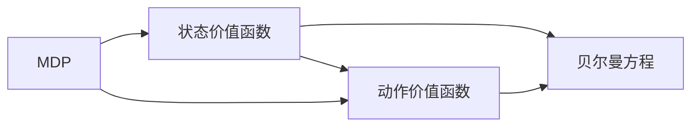

# 强化学习：价值函数的利用与更新

作者：禅与计算机程序设计艺术

## 1. 背景介绍

### 1.1 强化学习的崛起

近年来，强化学习（Reinforcement Learning, RL）作为机器学习的一个重要分支，取得了令人瞩目的成就。从 AlphaGo 击败围棋世界冠军，到 OpenAI Five 在 Dota2 中战胜人类职业战队，强化学习展现出其在解决复杂决策问题上的巨大潜力。其核心思想是让智能体（Agent）通过与环境进行交互，不断试错学习，最终找到最优策略，以最大化累积奖励。

### 1.2 价值函数的重要性

在强化学习中，价值函数扮演着至关重要的角色。它可以被看作是智能体对未来奖励的预测。智能体根据价值函数来评估当前状态的优劣，并选择能够带来最大长期收益的动作。因此，价值函数的准确性和有效性直接影响着强化学习算法的性能。

### 1.3 本文目标

本文旨在深入探讨强化学习中价值函数的利用与更新机制。我们将从基本概念入手，逐步介绍不同类型的价值函数、常用的价值函数更新算法，并结合代码实例和实际应用场景，帮助读者更好地理解和掌握强化学习的核心技术。

## 2. 核心概念与联系

### 2.1 马尔可夫决策过程

强化学习问题通常被建模为马尔可夫决策过程（Markov Decision Process, MDP）。一个 MDP 可以用一个五元组 $<S, A, P, R, \gamma>$ 来表示，其中：

*   $S$ 表示状态空间，包含了智能体可能处于的所有状态。
*   $A$ 表示动作空间，包含了智能体可以采取的所有动作。
*   $P$ 表示状态转移概率矩阵，$P_{ss'}^a$ 表示在状态 $s$ 下采取动作 $a$ 后转移到状态 $s'$ 的概率。
*   $R$ 表示奖励函数，$R_s^a$ 表示在状态 $s$ 下采取动作 $a$ 后获得的奖励。
*   $\gamma$ 表示折扣因子，用于衡量未来奖励对当前决策的影响。

### 2.2 价值函数

价值函数用于评估在某个状态下采取某种策略的长期价值。常用的价值函数有两类：

*   **状态价值函数（State Value Function）**:  $V^{\pi}(s)$ 表示在状态 $s$ 下，遵循策略 $\pi$ 所获得的期望累积奖励。
*   **动作价值函数（Action Value Function）**: $Q^{\pi}(s, a)$ 表示在状态 $s$ 下，采取动作 $a$ 后，遵循策略 $\pi$ 所获得的期望累积奖励。

### 2.3 贝尔曼方程

贝尔曼方程（Bellman Equation）是强化学习中最重要的公式之一，它描述了价值函数之间的迭代关系。

*   状态价值函数的贝尔曼方程：

$$V^{\pi}(s) = \sum_{a \in A} \pi(a|s) \sum_{s' \in S} P_{ss'}^a [R_s^a + \gamma V^{\pi}(s')]$$

*   动作价值函数的贝尔曼方程：

$$Q^{\pi}(s, a) = \sum_{s' \in S} P_{ss'}^a [R_s^a + \gamma \sum_{a' \in A} \pi(a'|s') Q^{\pi}(s', a')]$$

### 2.4 价值函数的联系

状态价值函数和动作价值函数之间存在着密切的联系：

$$V^{\pi}(s) = \sum_{a \in A} \pi(a|s) Q^{\pi}(s, a)$$

$$Q^{\pi}(s, a) = \sum_{s' \in S} P_{ss'}^a [R_s^a + \gamma V^{\pi}(s')]$$

### 2.5 核心概念关系图



## 3. 核心算法原理具体操作步骤

### 3.1 基于表格型方法的价值函数更新

#### 3.1.1 状态价值函数更新

基于表格型方法的价值函数更新算法通常使用动态规划（Dynamic Programming, DP）的思想，通过迭代计算来逼近真实的价值函数。

以状态价值函数更新为例，其具体操作步骤如下：

1.  初始化状态价值函数 $V(s)$，可以设置为任意值，例如全为 0。
2.  **迭代更新**:
    *   对于每个状态 $s \in S$:
        *   计算新的状态价值函数：

        $$V(s) \leftarrow \sum_{a \in A} \pi(a|s) \sum_{s' \in S} P_{ss'}^a [R_s^a + \gamma V(s')]$$

    *   重复上述步骤，直到状态价值函数收敛，即变化量小于预设阈值。

#### 3.1.2 动作价值函数更新

动作价值函数的更新与状态价值函数类似，只是需要遍历所有状态-动作对：

1.  初始化动作价值函数 $Q(s, a)$，可以设置为任意值，例如全为 0。
2.  **迭代更新**:
    *   对于每个状态-动作对 $(s, a) \in S \times A$:
        *   计算新的动作价值函数：

        $$Q(s, a) \leftarrow \sum_{s' \in S} P_{ss'}^a [R_s^a + \gamma \sum_{a' \in A} \pi(a'|s') Q(s', a')]$$

    *   重复上述步骤，直到动作价值函数收敛。

### 3.2 基于蒙特卡洛方法的价值函数更新

蒙特卡洛方法（Monte Carlo Method）是一种基于采样的方法，它通过多次模拟智能体与环境的交互过程，并利用平均回报来估计价值函数。

#### 3.2.1 蒙特卡洛预测

蒙特卡洛预测用于估计状态价值函数 $V(s)$。其具体操作步骤如下：

1.  初始化状态价值函数 $V(s)$，可以设置为任意值，例如全为 0。
2.  **多次模拟**:
    *   从初始状态 $s_0$ 开始，根据策略 $\pi$ 与环境交互，直到 episode 结束，得到一个状态-动作-奖励序列：

    $$s_0, a_0, r_1, s_1, a_1, r_2, ..., s_{T-1}, a_{T-1}, r_T$$

    *   对于 episode 中出现的每个状态 $s$，计算其累积奖励 $G_t$：

    $$G_t = r_{t+1} + \gamma r_{t+2} + ... + \gamma^{T-t-1} r_T$$

    *   更新状态 $s$ 的价值函数：

    $$N(s) \leftarrow N(s) + 1$$

    $$V(s) \leftarrow V(s) + \frac{1}{N(s)} (G_t - V(s))$$

    其中，$N(s)$ 表示状态 $s$ 出现的次数。

3.  重复步骤 2 多次，直到状态价值函数收敛。

#### 3.2.2 蒙特卡洛控制

蒙特卡洛控制用于学习最优策略 $\pi_*$。常用的蒙特卡洛控制算法有：

*   **首次访问蒙特卡洛控制（First-Visit Monte Carlo Control）**：只考虑每个 episode 中第一次访问某个状态时的回报。
*   **每次访问蒙特卡洛控制（Every-Visit Monte Carlo Control）**：考虑每个 episode 中每次访问某个状态时的回报。

### 3.3 基于时间差分方法的价值函数更新

时间差分方法（Temporal Difference, TD）结合了动态规划和蒙特卡洛方法的优点，它利用当前的价值函数估计来更新之前的价值函数估计。

#### 3.3.1 TD(0)

TD(0) 是最简单的 TD 方法，其更新公式如下：

$$V(s_t) \leftarrow V(s_t) + \alpha [r_{t+1} + \gamma V(s_{t+1}) - V(s_t)]$$

其中，$\alpha$ 是学习率，用于控制更新步长。

#### 3.3.2 SARSA

SARSA 是一种 on-policy 的 TD 方法，它使用当前策略 $\pi$ 来选择动作并更新价值函数。其更新公式如下：

$$Q(s_t, a_t) \leftarrow Q(s_t, a_t) + \alpha [r_{t+1} + \gamma Q(s_{t+1}, a_{t+1}) - Q(s_t, a_t)]$$

#### 3.3.3 Q-Learning

Q-Learning 是一种 off-policy 的 TD 方法，它使用贪婪策略来选择动作，并使用当前策略 $\pi$ 来更新价值函数。其更新公式如下：

$$Q(s_t, a_t) \leftarrow Q(s_t, a_t) + \alpha [r_{t+1} + \gamma \max_{a'} Q(s_{t+1}, a') - Q(s_t, a_t)]$$


## 4. 数学模型和公式详细讲解举例说明

### 4.1 贝尔曼方程的推导

以状态价值函数的贝尔曼方程为例，我们来推导其公式：

$$
\begin{aligned}
V^{\pi}(s) &= \mathbb{E}_{\pi}[G_t | S_t = s] \\
&= \mathbb{E}_{\pi}[R_{t+1} + \gamma G_{t+1} | S_t = s] \\
&= \sum_{a \in A} \pi(a|s) \sum_{s' \in S, r \in R} p(s', r | s, a) [r + \gamma \mathbb{E}_{\pi}[G_{t+1} | S_{t+1} = s']] \\
&= \sum_{a \in A} \pi(a|s) \sum_{s' \in S} P_{ss'}^a [R_s^a + \gamma V^{\pi}(s')]
\end{aligned}
$$

其中，

*   $\mathbb{E}_{\pi}[G_t | S_t = s]$ 表示在状态 $s$ 下，遵循策略 $\pi$ 所获得的期望累积奖励。
*   $G_t = R_{t+1} + \gamma G_{t+1}$ 表示累积奖励的递归定义。
*   $p(s', r | s, a)$ 表示在状态 $s$ 下采取动作 $a$ 后，转移到状态 $s'$ 并获得奖励 $r$ 的概率。

### 4.2  Q-Learning 的更新公式解析

Q-Learning 的更新公式为：

$$Q(s_t, a_t) \leftarrow Q(s_t, a_t) + \alpha [r_{t+1} + \gamma \max_{a'} Q(s_{t+1}, a') - Q(s_t, a_t)]$$

其中：

*   $Q(s_t, a_t)$ 表示在状态 $s_t$ 下采取动作 $a_t$ 的价值估计。
*   $\alpha$ 是学习率，用于控制更新步长。
*   $r_{t+1}$ 是在状态 $s_t$ 下采取动作 $a_t$ 后获得的奖励。
*   $\gamma$ 是折扣因子，用于衡量未来奖励对当前决策的影响。
*   $\max_{a'} Q(s_{t+1}, a')$ 表示在状态 $s_{t+1}$ 下，采取所有可能动作中价值最高的动作的价值估计。

Q-Learning 的更新公式可以理解为：利用当前的奖励和下一个状态的价值估计来更新当前状态-动作对的价值估计。其中，$\max_{a'} Q(s_{t+1}, a')$ 表示利用贪婪策略选择下一个动作，即选择价值最高的动作。

### 4.3  举例说明

假设有一个迷宫环境，智能体需要从起点出发，找到迷宫的出口。迷宫中有一些障碍物，智能体每走一步会得到 -1 的奖励，到达出口会得到 100 的奖励。

我们可以使用 Q-Learning 算法来训练智能体学习最优策略。假设学习率 $\alpha = 0.1$，折扣因子 $\gamma = 0.9$。

初始时，所有状态-动作对的价值估计都为 0。假设智能体初始状态为 $s_0$，采取动作 "向右"，到达状态 $s_1$，获得奖励 -1。根据 Q-Learning 的更新公式，我们可以更新状态-动作对 $(s_0, "向右")$ 的价值估计：

$$
\begin{aligned}
Q(s_0, "向右") &\leftarrow Q(s_0, "向右") + \alpha [r_{1} + \gamma \max_{a'} Q(s_{1}, a') - Q(s_0, "向右")] \\
&= 0 + 0.1 \times [-1 + 0.9 \times \max \{Q(s_1, "向上"), Q(s_1, "向下"), Q(s_1, "向左"), Q(s_1, "向右")\} - 0] \\
&= -0.1
\end{aligned}
$$

智能体继续与环境交互，不断更新价值函数，最终学习到最优策略，即找到迷宫出口的最短路径。


## 5. 项目实践：代码实例和详细解释说明

```python
import gym
import numpy as np

# 创建迷宫环境
env = gym.make('FrozenLake-v1')

# 初始化 Q 表
action_size = env.action_space.n
state_size = env.observation_space.n
q_table = np.zeros((state_size, action_size))

# 设置超参数
learning_rate = 0.8
discount_rate = 0.95
exploration_rate = 1.0
max_exploration_rate = 1.0
min_exploration_rate = 0.01
exploration_decay_rate = 0.001

# 训练智能体
num_episodes = 10000
max_steps_per_episode = 100

rewards_all_episodes = []

for episode in range(num_episodes):
    state = env.reset()
    done = False
    rewards_current_episode = 0

    for step in range(max_steps_per_episode):
        # 选择动作
        exploration_rate_threshold = np.random.uniform(0, 1)
        if exploration_rate_threshold > exploration_rate:
            action = np.argmax(q_table[state, :])
        else:
            action = env.action_space.sample()

        # 执行动作
        new_state, reward, done, info = env.step(action)

        # 更新 Q 表
        q_table[state, action] = q_table[state, action] * (1 - learning_rate) + \
            learning_rate * (reward + discount_rate * np.max(q_table[new_state, :]))