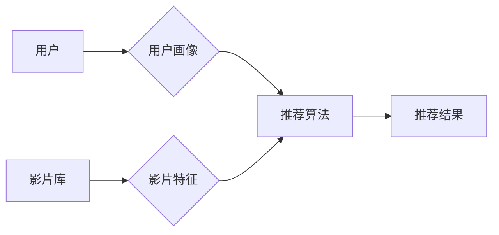

## 1. 背景介绍

### 1.1 影音网站的兴起与挑战

近年来，随着互联网技术的飞速发展和人们对娱乐需求的日益增长，影音网站如雨后春笋般涌现，并迅速成为人们休闲娱乐的重要方式之一。Netflix、YouTube、Bilibili 等平台的成功，都证明了影音网站的巨大市场潜力。然而，随着用户规模的扩大和内容数量的爆炸式增长，影音网站也面临着前所未有的挑战：

- **信息过载：**海量的影视作品让用户难以选择，用户很容易迷失在海量内容中，无法找到自己真正感兴趣的内容。
- **用户粘性低：**缺乏个性化推荐，用户体验单一，难以形成长期使用习惯。
- **运营成本高：**如何高效地推广优质内容，降低内容分发成本，是影音网站运营者需要解决的关键问题。

### 1.2 推荐系统的重要性

为了应对这些挑战，影音网站需要借助强大的推荐系统，为用户提供个性化的内容推荐服务。一个优秀的推荐系统可以：

- **提升用户体验：**帮助用户快速找到感兴趣的内容，提升用户观看时长和平台粘性。
- **提高内容分发效率：**将优质内容精准推荐给目标用户，提升内容曝光率和点击率。
- **降低运营成本：**通过自动化推荐，降低人工运营成本，提高运营效率。

### 1.3 本文目标

本文将深入探讨影音网站推荐与分析系统的设计与实现，涵盖从需求分析、架构设计、算法选择到系统评估等方面，并结合实际案例进行分析，旨在为相关领域的开发者和研究者提供参考。

## 2. 核心概念与联系

### 2.1 推荐系统概述

#### 2.1.1 什么是推荐系统

推荐系统是一种信息过滤系统，它根据用户的历史行为、兴趣偏好等信息，预测用户对特定项目的评分或偏好，并将用户可能感兴趣的项目推荐给用户。

#### 2.1.2  推荐系统的类型

- **基于内容的推荐 (Content-based Filtering)：**根据用户过去喜欢的物品的特征，推荐与之类似的物品。
- **协同过滤推荐 (Collaborative Filtering)：**根据具有相似兴趣的用户对物品的评价，为目标用户推荐物品。
- **混合推荐 (Hybrid Recommender Systems)：**结合多种推荐算法，综合考虑多种因素进行推荐。

### 2.2 影音网站推荐的特点

与其他类型的推荐系统相比，影音网站的推荐系统具有以下特点：

- **数据稀疏性高：**用户观看的影片数量远远小于平台的影片总数，导致用户-影片交互矩阵非常稀疏。
- **冷启动问题：**新用户和新影片缺乏历史数据，难以进行准确推荐。
- **用户兴趣多样性：**用户观看影片的类型和偏好可能非常广泛，难以用单一模型进行刻画。

### 2.3 核心概念联系

下图展示了影音网站推荐系统中各个核心概念之间的联系：



- **用户画像：**描述用户的基本信息、兴趣偏好、行为习惯等。
- **影片特征：**描述影片的类型、导演、演员、剧情简介等。
- **推荐算法：**根据用户画像和影片特征，预测用户对影片的评分或偏好。

## 3. 核心算法原理与操作步骤

### 3.1 基于内容的推荐算法

#### 3.1.1 原理

基于内容的推荐算法的核心思想是：**如果用户喜欢某个物品，那么他也会喜欢与该物品内容相似的其他物品。**

#### 3.1.2 操作步骤

1. **提取物品特征：**对每个影片，提取其类型、导演、演员、剧情简介等特征，构建影片特征向量。
2. **计算物品相似度：**使用余弦相似度等方法，计算两两影片之间的相似度。
3. **生成推荐列表：**根据用户历史观看记录，找到用户喜欢的影片，然后推荐与其相似的影片。

### 3.2 协同过滤推荐算法

#### 3.2.1 原理

协同过滤推荐算法的核心思想是：**利用群体智慧，根据与目标用户兴趣相似的其他用户对物品的评价，为目标用户推荐物品。**

#### 3.2.2 操作步骤

1. **构建用户-影片评分矩阵：**根据用户历史观看记录，构建用户-影片评分矩阵，矩阵元素表示用户对影片的评分。
2. **寻找相似用户：**使用皮尔逊相关系数等方法，计算两两用户之间的相似度，找到与目标用户兴趣相似的用户。
3. **生成推荐列表：**根据相似用户的评分，预测目标用户对未评分影片的评分，并将评分最高的影片推荐给目标用户。

### 3.3 混合推荐算法

#### 3.3.1 原理

混合推荐算法结合了多种推荐算法的优点，可以有效解决单一算法存在的不足，提高推荐系统的准确性和鲁棒性。

#### 3.3.2 常用策略

- **加权混合：**根据不同算法的性能，赋予不同的权重，将多个推荐结果加权平均。
- **切换混合：**根据不同的场景，选择不同的推荐算法进行推荐。
- **级联混合：**先使用一种推荐算法生成候选集，再使用另一种算法对候选集进行排序。

## 4. 数学模型和公式详细讲解举例说明

### 4.1 余弦相似度

余弦相似度是一种常用的计算两个向量之间相似度的方法，其取值范围为 [-1, 1]，值越大表示两个向量越相似。

**公式：**

$$
\operatorname{sim}(A,B) = \cos(\theta) = \frac{A \cdot B}{\|A\| \|B\|}
$$

**其中：**

- $A$ 和 $B$ 分别表示两个向量。
- $\cdot$ 表示向量点积。
- $\|A\|$ 表示向量 $A$ 的模长。

**举例：**

假设有两个影片的特征向量分别为：

```
A = [1, 0, 1, 0, 1]
B = [0, 1, 1, 1, 0]
```

则它们的余弦相似度为：

```
sim(A,B) = (1*0 + 0*1 + 1*1 + 0*1 + 1*0) / (sqrt(1^2 + 0^2 + 1^2 + 0^2 + 1^2) * sqrt(0^2 + 1^2 + 1^2 + 1^2 + 0^2)) = 0.408
```

### 4.2 皮尔逊相关系数

皮尔逊相关系数用于度量两个变量之间的线性相关程度，其取值范围为 [-1, 1]，值越大表示两个变量之间正相关性越强，值越小表示负相关性越强，0 表示不相关。

**公式：**

$$
\rho_{X,Y} = \frac{\operatorname{cov}(X,Y)}{\sigma_X \sigma_Y}
$$

**其中：**

- $\operatorname{cov}(X,Y)$ 表示变量 $X$ 和 $Y$ 的协方差。
- $\sigma_X$ 和 $\sigma_Y$ 分别表示变量 $X$ 和 $Y$ 的标准差。

**举例：**

假设有两个用户的评分向量分别为：

```
X = [1, 2, 3, 4, 5]
Y = [2, 3, 4, 5, 4]
```

则它们的皮尔逊相关系数为：

```
rho(X,Y) = cov(X,Y) / (std(X) * std(Y)) = 0.832
```

## 5. 项目实践：代码实例和详细解释说明

### 5.1 数据集

本项目使用 MovieLens 数据集进行实验，该数据集包含了用户对影片的评分信息。

### 5.2 代码实例

```python
import pandas as pd
from sklearn.metrics.pairwise import cosine_similarity

# 读取数据
ratings = pd.read_csv('ratings.csv')

# 构建用户-影片评分矩阵
ratings_pivot = ratings.pivot_table(index='userId', columns='movieId', values='rating')

# 计算影片相似度矩阵
movie_similarity = cosine_similarity(ratings_pivot.fillna(0))

# 定义推荐函数
def get_recommendations(user_id, movie_similarity, ratings_pivot, n_recommendations=5):
    """
    根据用户 ID 获取影片推荐列表。

    参数：
        user_id：用户 ID。
        movie_similarity：影片相似度矩阵。
        ratings_pivot：用户-影片评分矩阵。
        n_recommendations：推荐影片数量。

    返回值：
        推荐影片列表。
    """

    # 获取用户已评分影片的索引
    user_rated_movies = ratings_pivot.loc[user_id].dropna().index

    # 计算用户对所有影片的预测评分
    movie_predictions = pd.DataFrame(movie_similarity[user_rated_movies].mean(axis=0), index=ratings_pivot.columns, columns=['prediction'])

    # 排序并返回前 n 个推荐影片
    return movie_predictions.sort_values(by='prediction', ascending=False).head(n_recommendations).index.tolist()

# 获取用户 ID 为 1 的推荐列表
recommendations = get_recommendations(1, movie_similarity, ratings_pivot)

# 打印推荐列表
print(recommendations)
```

### 5.3 代码解释

- 首先，我们使用 pandas 读取数据，并构建用户-影片评分矩阵。
- 然后，我们使用 sklearn.metrics.pairwise.cosine_similarity 函数计算影片相似度矩阵。
- 最后，我们定义了一个推荐函数，该函数接受用户 ID、影片相似度矩阵、用户-影片评分矩阵和推荐影片数量作为参数，并返回推荐影片列表。

## 6. 实际应用场景

### 6.1 个性化推荐

影音网站可以使用推荐系统为用户提供个性化的影片推荐服务，例如：

- **首页推荐：**根据用户的历史观看记录和兴趣偏好，在首页推荐用户可能感兴趣的影片。
- **猜你喜欢：**在影片详情页推荐与当前影片内容相似的其他影片。
- **排行榜：**根据影片的播放量、评分等指标，生成不同类型的影片排行榜。

### 6.2 内容分析

影音网站还可以利用推荐系统进行内容分析，例如：

- **用户画像分析：**根据用户的历史观看记录，分析用户的兴趣偏好、观看习惯等，为用户打上标签，构建用户画像。
- **影片趋势分析：**根据影片的播放量、评分、评论等数据，分析影片的流行趋势，为内容运营提供决策依据。

## 7. 工具和资源推荐

### 7.1 Python 库

- **pandas：**数据分析和处理库。
- **numpy：**数值计算库。
- **scikit-learn：**机器学习库。
- **Surprise：**推荐系统库。

### 7.2 数据集

- **MovieLens：**包含了用户对影片的评分信息。
- **Netflix Prize：**Netflix 公司举办的推荐系统竞赛数据集。

### 7.3 学习资源

- **推荐系统实战**：项亮 著。
- **Recommender Systems Handbook**：Francesco Ricci 等著。

## 8. 总结：未来发展趋势与挑战

### 8.1 未来发展趋势

- **深度学习：**将深度学习技术应用于推荐系统，可以更好地捕捉用户和影片的复杂特征，提高推荐系统的准确性和个性化程度。
- **强化学习：**将强化学习技术应用于推荐系统，可以根据用户的实时反馈动态调整推荐策略，提高用户满意度。
- **跨平台推荐：**随着用户使用多个影音平台的趋势越来越明显，跨平台推荐将成为未来发展的重要方向。

### 8.2 面临挑战

- **数据隐私保护：**随着用户隐私保护意识的提高，如何平衡推荐效果和数据隐私保护将成为一个重要挑战。
- **冷启动问题：**新用户和新影片缺乏历史数据，如何解决冷启动问题仍然是一个挑战。
- **可解释性：**深度学习模型的可解释性较差，如何提高推荐结果的可解释性也是一个需要解决的问题。

## 9. 附录：常见问题与解答

### 9.1 如何评估推荐系统的性能？

常用的推荐系统评估指标包括：

- **准确率 (Precision)：**推荐列表中用户真正感兴趣的影片比例。
- **召回率 (Recall)：**用户真正感兴趣的影片中被推荐出来的比例。
- **F1 值 (F1-score)：**准确率和召回率的调和平均数。
- **AUC (Area Under the Curve)：**ROC 曲线下的面积，用于衡量模型的排序能力。

### 9.2 如何解决冷启动问题？

解决冷启动问题的方法包括：

- **基于内容的推荐：**根据新影片的特征，推荐给可能感兴趣的用户。
- **基于规则的推荐：**根据预先定义的规则进行推荐，例如推荐最新上映的影片。
- **利用用户注册信息：**根据用户的性别、年龄、地域等信息进行推荐。

### 9.3 如何提高推荐系统的可解释性？

提高推荐系统可解释性的方法包括：

- **使用可解释性更强的模型：**例如决策树、线性回归等模型。
- **对模型进行解释：**例如使用 LIME、SHAP 等工具对模型的预测结果进行解释。
- **提供推荐理由：**向用户解释推荐某个影片的原因。
