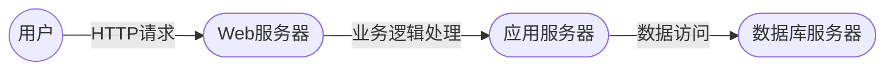
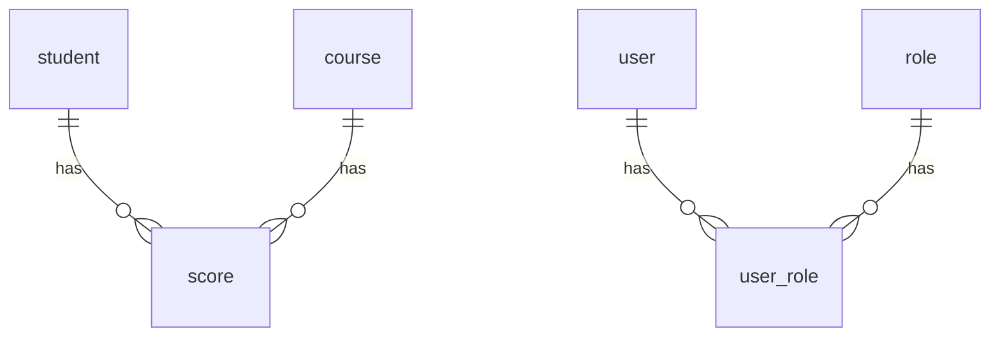

##  成绩管理系统详细设计与具体代码实现

作者：禅与计算机程序设计艺术

## 1. 背景介绍

### 1.1 成绩管理系统概述
随着信息技术的快速发展和教育信息化的不断推进，传统的成绩管理方式已经难以满足现代教育的需求。传统的成绩管理方式主要依赖于人工操作，效率低下且容易出错。为了提高成绩管理的效率和准确性，开发一套功能完善、操作简便、安全可靠的成绩管理系统势在必行。

成绩管理系统是学校教学管理系统的重要组成部分，其主要功能是记录、统计、分析学生的学习成绩，为教师教学评估、学生学习情况分析以及学校教学管理提供数据支持。

### 1.2 系统目标
本成绩管理系统的设计目标是：

* **功能完备:**  系统应包含成绩录入、成绩查询、成绩统计、成绩分析、报表生成等功能，满足学校日常成绩管理的需要。
* **操作简便:** 系统界面友好、操作简单易懂，方便教师、学生和管理员使用。
* **安全可靠:** 系统应具备完善的安全机制，保障数据安全和用户隐私。
* **易于维护:** 系统采用模块化设计，结构清晰，易于维护和扩展。

### 1.3  目标用户
本成绩管理系统的目标用户包括：

* **教师:**  录入、查询、统计和分析学生成绩。
* **学生:** 查询个人成绩，了解学习情况。
* **管理员:**  管理系统用户、权限、数据等。

## 2. 核心概念与联系

### 2.1 核心概念
* **学生:**  指在校学习的学生，具有学号、姓名、班级等属性。
* **课程:**  指学校开设的课程，具有课程号、课程名称、学分等属性。
* **成绩:**  指学生在某门课程的学习成绩，包括平时成绩、期中成绩、期末成绩、总评成绩等。
* **用户:**  指使用成绩管理系统的人员，包括教师、学生和管理员，具有用户名、密码、角色等属性。
* **角色:**  指用户在系统中扮演的角色，不同角色拥有不同的权限，例如教师可以录入和查询成绩，学生只能查询自己的成绩。

### 2.2 概念之间的联系
* 一个学生可以学习多门课程。
* 一门课程可以有多个学生学习。
* 一个学生在一门课程中只有一条成绩记录。
* 一个用户可以拥有多个角色。

## 3. 核心算法原理具体操作步骤

### 3.1  系统架构设计
本系统采用 B/S 架构，即浏览器/服务器架构，用户通过浏览器访问系统，服务器端负责处理业务逻辑和数据存储。

#### 3.1.1 系统架构图


#### 3.1.2 架构说明
* **用户层:** 用户通过浏览器访问系统，进行登录、操作等。
* **Web 服务器层:** 接收用户请求，并将请求转发给应用服务器进行处理。
* **应用服务器层:** 处理业务逻辑，与数据库服务器进行交互，并将处理结果返回给 Web 服务器。
* **数据库服务器层:** 负责数据的存储和管理。

### 3.2 数据库设计
#### 3.2.1 数据库表设计
| 表名 | 字段 | 数据类型 | 说明 |
|---|---|---|---|
| student | id | int | 学生ID，主键 |
|  | name | varchar(255) | 学生姓名 |
|  | class_id | int | 班级ID |
| course | id | int | 课程ID，主键 |
|  | name | varchar(255) | 课程名称 |
|  | credit | int | 学分 |
| score | id | int | 成绩ID，主键 |
|  | student_id | int | 学生ID |
|  | course_id | int | 课程ID |
|  | usual_score | float | 平时成绩 |
|  | midterm_score | float | 期中成绩 |
|  | final_score | float | 期末成绩 |
|  | total_score | float | 总评成绩 |
| user | id | int | 用户ID，主键 |
|  | username | varchar(255) | 用户名 |
|  | password | varchar(255) | 密码 |
| role | id | int | 角色ID，主键 |
|  | name | varchar(255) | 角色名称 |
| user_role | user_id | int | 用户ID |
|  | role_id | int | 角色ID |

#### 3.2.2 表关系图


### 3.3 核心功能实现
#### 3.3.1 成绩录入
1. 教师登录系统，选择需要录入成绩的课程和班级。
2. 系统显示该班级所有学生的名单，教师可以批量录入或者单个录入学生的平时成绩、期中成绩、期末成绩。
3. 系统根据预设的成绩计算规则自动计算学生的总评成绩。
4. 教师确认成绩无误后提交保存。

#### 3.3.2 成绩查询
1. 学生登录系统，可以查询个人所有课程的成绩。
2. 教师登录系统，可以查询所教科目的所有学生成绩。
3. 管理员可以查询所有学生的成绩。

#### 3.3.3  成绩统计
1. 系统可以根据班级、课程、学期等维度统计学生的平均成绩、最高成绩、最低成绩、及格率等信息。
2. 系统可以生成各种统计图表，直观展示学生的成绩分布情况。

## 4. 数学模型和公式详细讲解举例说明

### 4.1  加权平均分计算公式
总评成绩 = 平时成绩 * 平时成绩权重 + 期中成绩 * 期中成绩权重 + 期末成绩 * 期末成绩权重

**举例说明:**

假设某门课程的平时成绩权重为 30%，期中成绩权重为 30%，期末成绩权重为 40%，某个学生的平时成绩为 80 分，期中成绩为 85 分，期末成绩为 90 分，则该学生的总评成绩为：

总评成绩 = 80 * 0.3 + 85 * 0.3 + 90 * 0.4 = 86.5 分

### 4.2  标准差计算公式
标准差  $ \sigma = \sqrt{\frac{\sum_{i=1}^{n}(x_i - \bar{x})^2}{n-1}} $

其中：

*  $ \sigma $ 表示标准差
*  $ x_i $ 表示第 i 个数据
*  $ \bar{x} $ 表示所有数据的平均值
* n 表示数据的个数

**举例说明:**

假设某班级的数学成绩分别为：80, 85, 90, 75, 80, 则该班级数学成绩的标准差为:

1. 计算平均值： $ \bar{x} = (80 + 85 + 90 + 75 + 80) / 5 = 82 $
2. 计算每个数据与平均值的差的平方：
    *  $ (80-82)^2 = 4 $
    *  $ (85-82)^2 = 9 $
    *  $ (90-82)^2 = 64 $
    *  $ (75-82)^2 = 49 $
    *  $ (80-82)^2 = 4 $
3. 计算差的平方的平均值： $ (4 + 9 + 64 + 49 + 4) / (5-1) = 32.5 $
4. 计算标准差： $ \sigma = \sqrt{32.5} \approx 5.7 $

## 5. 项目实践：代码实例和详细解释说明

### 5.1 开发环境搭建
* 操作系统: Windows 10
* 开发语言: Python 3.8
* Web 框架: Django 3.2
* 数据库: MySQL 5.7

### 5.2  代码实例

#### 5.2.1  models.py
```python
from django.db import models

class Student(models.Model):
    name = models.CharField(max_length=255)
    class_id = models.IntegerField()

class Course(models.Model):
    name = models.CharField(max_length=255)
    credit = models.IntegerField()

class Score(models.Model):
    student = models.ForeignKey(Student, on_delete=models.CASCADE)
    course = models.ForeignKey(Course, on_delete=models.CASCADE)
    usual_score = models.FloatField()
    midterm_score = models.FloatField()
    final_score = models.FloatField()
    total_score = models.FloatField()

class User(models.Model):
    username = models.CharField(max_length=255)
    password = models.CharField(max_length=255)

class Role(models.Model):
    name = models.CharField(max_length=255)

class UserRole(models.Model):
    user = models.ForeignKey(User, on_delete=models.CASCADE)
    role = models.ForeignKey(Role, on_delete=models.CASCADE)
```

#### 5.2.2  views.py
```python
from django.shortcuts import render
from .models import Student, Course, Score

def index(request):
    # 获取所有学生信息
    students = Student.objects.all()
    # 获取所有课程信息
    courses = Course.objects.all()
    # 获取所有成绩信息
    scores = Score.objects.all()
    # 将数据传递给模板
    context = {
        'students': students,
        'courses': courses,
        'scores': scores,
    }
    # 渲染模板
    return render(request, 'index.html', context)
```

#### 5.2.3  index.html
```html
<!DOCTYPE html>
<html>
<head>
    <title>成绩管理系统</title>
</head>
<body>
    <h1>学生信息</h1>
    <table>
        <thead>
            <tr>
                <th>姓名</th>
                <th>班级</th>
            </tr>
        </thead>
        <tbody>
            
            <tr>
                <td>{{ student.name }}</td>
                <td>{{ student.class_id }}</td>
            </tr>
            
        </tbody>
    </table>

    <h1>课程信息</h1>
    <table>
        <thead>
            <tr>
                <th>课程名称</th>
                <th>学分</th>
            </tr>
        </thead>
        <tbody>
            
            <tr>
                <td>{{ course.name }}</td>
                <td>{{ course.credit }}</td>
            </tr>
            
        </tbody>
    </table>

    <h1>成绩信息</h1>
    <table>
        <thead>
            <tr>
                <th>学生姓名</th>
                <th>课程名称</th>
                <th>平时成绩</th>
                <th>期中成绩</th>
                <th>期末成绩</th>
                <th>总评成绩</th>
            </tr>
        </thead>
        <tbody>
            
            <tr>
                <td>{{ score.student.name }}</td>
                <td>{{ score.course.name }}</td>
                <td>{{ score.usual_score }}</td>
                <td>{{ score.midterm_score }}</td>
                <td>{{ score.final_score }}</td>
                <td>{{ score.total_score }}</td>
            </tr>
            
        </tbody>
    </table>
</body>
</html>
```

### 5.3 代码解释
* **models.py:** 定义了数据模型，包括学生模型、课程模型、成绩模型、用户模型、角色模型和用户角色模型。
* **views.py:** 定义了视图函数，用于处理用户请求并返回响应。
* **index.html:** 定义了网页模板，用于展示数据。

## 6. 实际应用场景

### 6.1  学校场景
* 教师可以使用该系统录入、查询、统计和分析学生的成绩。
* 学生可以使用该系统查询个人成绩，了解学习情况。
* 管理员可以使用该系统管理系统用户、权限、数据等。

### 6.2  培训机构场景
* 培训机构可以使用该系统记录学员的学习成绩，跟踪学员的学习进度。
* 教师可以使用该系统了解学员的学习情况，调整教学计划。

## 7. 工具和资源推荐

### 7.1  开发工具
* **PyCharm:** 一款功能强大的 Python IDE，可以提高开发效率。
* **Navicat:** 一款数据库管理工具，可以方便地进行数据库操作。

### 7.2 学习资源
* **Django 官方文档:**  https://docs.djangoproject.com/
* **菜鸟教程 Django 教程:**  https://www.runoob.com/django/django-tutorial.html

## 8. 总结：未来发展趋势与挑战

### 8.1 未来发展趋势
* **智能化:**  利用人工智能技术，实现成绩的自动分析和预测，为教师提供更精准的教学建议。
* **个性化:**  根据学生的学习情况，提供个性化的学习建议和辅导。
* **移动化:**  开发移动端应用，方便教师和学生随时随地进行成绩管理和查询。

### 8.2  挑战
* **数据安全:**  随着成绩数据的不断积累，如何保障数据的安全性和隐私性是一个重要挑战。
* **系统性能:**  随着用户数量和数据量的增加，如何保证系统的稳定性和响应速度是一个挑战。
* **技术更新:**  信息技术不断发展，如何保持系统的先进性和适应性是一个挑战。

## 9. 附录：常见问题与解答

### 9.1  如何添加新用户？
1.  以管理员身份登录系统。
2.  进入用户管理页面。
3.  点击“添加用户”按钮，填写用户信息，并选择用户角色。
4.  点击“保存”按钮。

### 9.2  如何修改密码？
1.  登录系统。
2.  点击右上角的用户名，选择“修改密码”。
3.  输入旧密码、新密码和确认密码。
4.  点击“保存”按钮。
