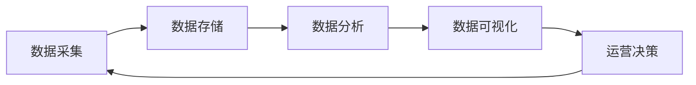

## 1. 背景介绍

### 1.1  数据洪流时代的运营挑战

随着互联网和移动互联网的迅猛发展，我们正身处一个前所未有的数据洪流时代。海量的用户行为数据、市场交易数据、产品运营数据等，如同奔腾的江河，蕴藏着巨大的价值。然而，如何从这些数据中挖掘出有价值的信息，并将其转化为可执行的运营策略，成为了企业面临的一大挑战。

传统的运营模式往往依赖于经验和直觉，缺乏数据支撑，难以适应快速变化的市场环境。而数据驱动运营则应运而生，它强调以数据为核心，通过数据分析和挖掘，洞察用户需求、优化运营策略，从而提升运营效率和效果。

### 1.2 数据驱动运营的优势

相比于传统的运营模式，数据驱动运营具有以下显著优势：

* **精准定位目标用户:** 通过对用户数据的分析，可以精准地识别出目标用户群体，了解他们的需求和行为特征，从而制定更有针对性的运营策略。
* **优化产品和服务:** 通过对产品使用数据的分析，可以发现产品设计和功能上的不足，并进行优化改进，提升用户体验。
* **提高运营效率:** 通过对运营数据的分析，可以识别出运营过程中的瓶颈和问题，并进行优化改进，提升运营效率。
* **提升营销效果:** 通过对营销数据的分析，可以评估不同营销渠道的效果，优化营销策略，提升营销ROI。

## 2. 核心概念与联系

### 2.1 数据驱动运营的核心概念

数据驱动运营涉及到一系列核心概念，包括：

* **数据采集:**  从各种来源收集和整合相关数据，例如网站流量、用户行为、市场趋势等。
* **数据存储:**  将采集到的数据进行清洗、转换和存储，以便于后续的分析和挖掘。
* **数据分析:**  运用统计学、机器学习等方法，对数据进行分析和挖掘，发现数据背后的规律和趋势。
* **数据可视化:**  将分析结果以图表、报表等形式进行可视化展示，以便于理解和应用。
* **运营决策:**  根据数据分析的结果，制定和调整运营策略，并进行效果评估和迭代优化。

### 2.2 核心概念之间的联系

这五个核心概念之间相互联系，形成一个闭环的流程，如下图所示：



首先，需要从各种来源采集相关数据，并将其存储到数据库或数据仓库中。然后，利用数据分析工具和方法，对数据进行清洗、转换、分析和挖掘，发现数据背后的规律和趋势。接着，将分析结果以图表、报表等形式进行可视化展示，以便于理解和应用。最后，根据数据分析的结果，制定和调整运营策略，并进行效果评估和迭代优化。

## 3. 核心算法原理具体操作步骤

### 3.1 用户行为分析

用户行为分析是数据驱动运营的核心环节之一，其目的是通过对用户行为数据的分析，洞察用户需求、行为模式和偏好，为运营决策提供依据。常用的用户行为分析方法包括：

#### 3.1.1  用户分群

用户分群是将用户按照不同的特征和行为划分为不同的群体，以便于进行针对性的运营。常用的用户分群方法包括：

* **基于规则的分群:**  根据预先设定的规则，将用户划分为不同的群体，例如根据用户的年龄、性别、地域等进行分群。
* **基于统计模型的分群:**  利用聚类、分类等统计模型，根据用户的行为特征进行自动分群。

#### 3.1.2 用户行为路径分析

用户行为路径分析是指追踪用户在网站或 APP 上的访问路径，分析用户行为模式，例如用户从哪个页面进入，访问了哪些页面，最终从哪个页面离开等。常用的用户行为路径分析方法包括：

* **漏斗分析:**  将用户行为路径抽象成一个漏斗模型，分析用户在每个环节的转化率，识别出用户流失的关键环节。
* **路径分析:**  利用图形化的方式，展示用户在网站或 APP 上的访问路径，分析用户行为模式。

### 3.2  A/B测试

A/B测试是一种常用的数据驱动运营方法，其目的是通过对比不同版本的运营策略的效果，选择效果最佳的方案。A/B测试的基本步骤如下：

1. **确定目标:**  明确A/B测试的目标，例如提升用户注册率、点击率、转化率等。
2. **设计方案:**  设计两个或多个版本的运营方案，例如不同的页面设计、不同的文案、不同的推荐算法等。
3. **流量分配:** 将用户随机分配到不同的方案组中，确保每个方案组的用户特征和行为尽可能相似。
4. **数据收集:**  收集用户在不同方案组中的行为数据，例如点击率、转化率等。
5. **数据分析:**  利用统计学方法，分析不同方案组之间的数据差异，判断方案之间是否存在显著性差异。
6. **结论得出:**  根据数据分析的结果，得出结论，选择效果最佳的方案。

## 4. 数学模型和公式详细讲解举例说明

### 4.1  回归分析

回归分析是一种常用的数据分析方法，用于探究自变量和因变量之间的关系。在数据驱动运营中，回归分析可以用于预测用户行为、评估运营效果等。

#### 4.1.1  线性回归

线性回归是最简单的一种回归分析方法，其假设自变量和因变量之间存在线性关系。线性回归模型的公式如下：

$$
y = \beta_0 + \beta_1 x_1 + \beta_2 x_2 + ... + \beta_n x_n + \epsilon
$$

其中，

* $y$ 是因变量
* $x_1, x_2, ..., x_n$ 是自变量
* $\beta_0, \beta_1, \beta_2, ..., \beta_n$ 是回归系数
* $\epsilon$ 是误差项

**举例说明:**

假设我们想要预测用户的购买金额，我们可以收集用户的历史购买数据，例如用户的年龄、性别、收入、购买频率等，然后利用线性回归模型，建立购买金额与这些因素之间的关系。

#### 4.1.2  逻辑回归

逻辑回归是一种用于预测二分类变量的回归分析方法，例如预测用户是否会点击广告、是否会购买产品等。逻辑回归模型的公式如下：

$$
P(y=1) = \frac{1}{1 + e^{-(\beta_0 + \beta_1 x_1 + \beta_2 x_2 + ... + \beta_n x_n)}}
$$

其中，

* $P(y=1)$ 是预测为正类的概率
* $x_1, x_2, ..., x_n$ 是自变量
* $\beta_0, \beta_1, \beta_2, ..., \beta_n$ 是回归系数

**举例说明:**

假设我们想要预测用户是否会点击广告，我们可以收集用户的历史点击数据，例如用户的年龄、性别、兴趣爱好、浏览历史等，然后利用逻辑回归模型，建立用户点击广告的概率与这些因素之间的关系。

### 4.2  聚类分析

聚类分析是一种常用的数据分析方法，用于将数据对象分组到不同的簇中，使得同一个簇中的对象之间具有较高的相似度，而不同簇中的对象之间具有较低的相似度。在数据驱动运营中，聚类分析可以用于用户分群、产品推荐等。

#### 4.2.1  K-Means聚类

K-Means聚类是一种常用的聚类分析方法，其基本思想是将数据对象分配到 K 个簇中，使得每个对象与其所属簇的质心的距离之和最小。K-Means聚类的算法步骤如下：

1. 随机选择 K 个对象作为初始质心。
2. 计算每个对象到 K 个质心的距离，并将对象分配到距离最近的质心所属的簇中。
3. 重新计算每个簇的质心。
4. 重复步骤 2 和步骤 3，直到质心不再发生变化或者达到最大迭代次数。

**举例说明:**

假设我们想要将用户分成不同的群体，我们可以收集用户的行为数据，例如用户的浏览历史、购买记录、评价记录等，然后利用 K-Means 聚类算法，将用户分成 K 个不同的群体。

## 5. 项目实践：代码实例和详细解释说明

### 5.1  Python 代码实例

```python
import pandas as pd
from sklearn.model_selection import train_test_split
from sklearn.linear_model import LogisticRegression
from sklearn.metrics import accuracy_score

# 读取数据
data = pd.read_csv('user_data.csv')

# 数据预处理
# ...

# 划分训练集和测试集
X_train, X_test, y_train, y_test = train_test_split(
    data.drop('target', axis=1), data['target'], test_size=0.2
)

# 创建逻辑回归模型
model = LogisticRegression()

# 训练模型
model.fit(X_train, y_train)

# 预测测试集
y_pred = model.predict(X_test)

# 评估模型性能
accuracy = accuracy_score(y_test, y_pred)
print('Accuracy:', accuracy)
```

### 5.2  代码解释

* 首先，我们使用 `pandas` 库读取数据。
* 然后，我们对数据进行预处理，例如处理缺失值、转换数据类型等。
* 接着，我们使用 `train_test_split` 函数将数据划分为训练集和测试集。
* 然后，我们创建逻辑回归模型，并使用训练集数据训练模型。
* 训练完成后，我们使用测试集数据评估模型性能，例如计算模型的准确率。

## 6. 实际应用场景

### 6.1  电商平台

* **个性化推荐:**  根据用户的浏览历史、购买记录、评价记录等，利用推荐算法，向用户推荐他们可能感兴趣的产品。
* **精准营销:**  根据用户的行为特征和偏好，制定更有针对性的营销策略，例如向用户发送个性化的优惠券、促销信息等。
* **库存管理:**  根据历史销售数据和市场趋势，预测未来的产品需求，优化库存管理，减少库存积压和缺货。

### 6.2  社交媒体

* **内容推荐:**  根据用户的兴趣爱好、关注对象、互动行为等，向用户推荐他们可能感兴趣的内容。
* **用户增长:**  根据用户的行为特征和社交关系，制定用户增长策略，例如向用户推荐好友、引导用户分享内容等。
* **广告投放:**  根据用户的行为特征和偏好，精准地投放广告，提升广告效果。

### 6.3  金融行业

* **风险控制:**  根据用户的信用记录、交易记录、行为特征等，评估用户的风险等级，制定相应的风险控制策略。
* **精准营销:**  根据用户的投资偏好、风险承受能力等，向用户推荐合适的理财产品。
* **反欺诈:**  利用机器学习等技术，分析用户的交易行为，识别和防范欺诈行为。

## 7. 总结：未来发展趋势与挑战

### 7.1  未来发展趋势

* **人工智能技术的应用:**  随着人工智能技术的不断发展，数据驱动运营将更加智能化，例如利用机器学习算法进行用户画像、预测用户行为、优化运营策略等。
* **数据安全和隐私保护:**  随着数据量的不断增加，数据安全和隐私保护问题日益突出，数据驱动运营需要更加注重数据安全和隐私保护。
* **跨平台数据整合:**  用户的行为数据分散在不同的平台，如何整合不同平台的数据，形成完整的用户画像，是数据驱动运营面临的一大挑战。

### 7.2  挑战

* **数据质量:**  数据质量是数据驱动运营的基础，如何保证数据的准确性、完整性和一致性，是数据驱动运营面临的一大挑战。
* **人才队伍建设:**  数据驱动运营需要具备数据分析、机器学习等专业技能的人才，如何培养和引进数据人才，是数据驱动运营面临的一大挑战。
* **企业文化建设:**  数据驱动运营需要企业上下形成数据驱动的文化氛围，如何推动企业文化转型，是数据驱动运营面临的一大挑战。

## 8. 附录：常见问题与解答

### 8.1  什么是数据驱动运营？

数据驱动运营是一种以数据为核心的运营模式，通过数据分析和挖掘，洞察用户需求、优化运营策略，从而提升运营效率和效果。

### 8.2  数据驱动运营的优势有哪些？

数据驱动运营的优势包括：精准定位目标用户、优化产品和服务、提高运营效率、提升营销效果等。

### 8.3  数据驱动运营的核心环节有哪些？

数据驱动运营的核心环节包括：数据采集、数据存储、数据分析、数据可视化、运营决策等。

### 8.4  数据驱动运营的应用场景有哪些？

数据驱动运营的应用场景非常广泛，例如电商平台、社交媒体、金融行业等。
