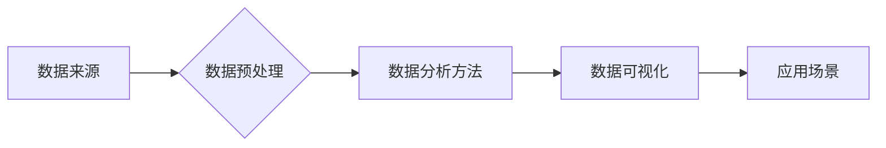

# 数智教育学生课程数据分析与可视化应用研究

作者：禅与计算机程序设计艺术

## 1. 背景介绍

### 1.1 教育信息化发展现状

近年来，随着信息技术的飞速发展和教育理念的不断更新，教育信息化已经成为全球教育改革与发展的重要趋势。从最初的“计算机辅助教学”（CAI）到如今的“智慧教育”，教育信息化经历了从数字化、网络化到智能化的演变过程。

### 1.2 数智教育的兴起与意义

“数智教育”是近年来教育信息化发展的新阶段，其核心是利用大数据、人工智能等新一代信息技术，对教育教学过程进行全方位的数据采集、分析和应用，实现精准化教学、个性化学习和科学化管理。数智教育的兴起，为解决传统教育模式下存在的诸多问题提供了新的思路和方法，同时也为教育的高质量发展注入了新的活力。

### 1.3 学生课程数据分析与可视化的重要性

学生课程数据是数智教育的核心要素之一，蕴含着丰富的教育教学规律和学生学习行为特征。对学生课程数据进行深入分析和可视化展示，可以帮助教育管理者、教师和学生更好地了解教学效果、掌握学生学习情况，进而改进教学方法、优化课程设置，最终提升教育教学质量。

## 2. 核心概念与联系

### 2.1 数据来源

* **学生基本信息数据：** 包括学生的姓名、性别、年龄、年级、班级等基本信息。
* **课程基本信息数据：** 包括课程名称、课程类型、授课教师、上课时间、学分等信息。
* **学生学习行为数据：** 包括学生的课堂考勤、作业完成情况、在线学习时长、平台访问记录、学习资源使用情况等数据。
* **学生成绩数据：** 包括学生的平时成绩、期中成绩、期末成绩、考试排名等数据。

### 2.2 数据预处理

* **数据清洗：** 对原始数据进行缺失值处理、异常值检测和数据去重等操作，保证数据的准确性和完整性。
* **数据转换：** 将不同格式、不同量纲的数据进行统一转换，方便后续分析和建模。
* **特征提取：** 从原始数据中提取出对分析目标有意义的特征，例如学生的学习积极性、学习习惯、知识掌握程度等。

### 2.3 数据分析方法

* **描述性统计分析：** 通过计算数据的均值、方差、标准差、频率分布等统计指标，对数据的基本特征进行描述和概括。
* **探索性数据分析：** 利用图表和可视化工具，对数据进行多维度、多角度的探索，发现数据中隐藏的规律和模式。
* **关联规则挖掘：** 发现数据项之间的关联关系，例如学生学习成绩与学习时间、学习资源使用情况之间的关系。
* **聚类分析：** 将具有相似特征的学生或课程进行分组，以便进行针对性的教学和管理。
* **预测性分析：** 利用机器学习算法，构建预测模型，对学生的学习成绩、学习行为等进行预测，为个性化学习和精准化教学提供支持。

### 2.4 数据可视化

* **图表可视化：** 利用柱状图、折线图、饼图、散点图等图表，对数据进行直观的展示，方便用户快速理解数据。
* **地图可视化：** 将数据与地理位置信息相结合，在地图上进行展示，例如学生生源地分布、学校教学资源分布等。
* **关系图可视化：** 利用节点和边表示数据之间的关系，例如学生-课程关系图、知识点-试题关系图等。
* **动态可视化：** 利用动画、视频等形式，对数据的变化趋势进行动态展示，例如学生学习成绩变化趋势、课程学习进度等。

### 2.5 核心概念联系图



## 3. 核心算法原理具体操作步骤

### 3.1 数据预处理

#### 3.1.1 缺失值处理

* **删除法：** 对于缺失值较少的样本或特征，可以直接删除。
* **均值/中位数/众数填充：** 对于数值型特征，可以使用均值、中位数或众数进行填充。
* **插值法：** 利用已知数据点，通过插值方法对缺失值进行估计。

#### 3.1.2 异常值检测

* **基于统计的方法：** 例如3σ原则，将距离均值超过3倍标准差的数据视为异常值。
* **基于距离的方法：** 例如KNN算法，将距离最近的k个样本的平均距离作为阈值，超过阈值的数据视为异常值。
* **基于聚类的方法：** 将数据进行聚类，孤立的点或与其他点距离较远的点视为异常值。

#### 3.1.3 数据去重

* **精确去重：** 比较数据记录的每个字段，完全相同的记录视为重复记录。
* **模糊去重：** 允许字段之间存在一定的差异，例如可以使用编辑距离算法计算两个字符串之间的相似度，超过一定阈值的记录视为重复记录。

### 3.2 数据分析方法

#### 3.2.1 关联规则挖掘

* **Apriori算法：** 一种经典的关联规则挖掘算法，通过迭代的方式生成频繁项集，并根据支持度和置信度筛选关联规则。
* **FP-Growth算法：** 一种更高效的关联规则挖掘算法，通过构建FP树来存储频繁项集，避免了Apriori算法中需要多次扫描数据库的问题。

#### 3.2.2 聚类分析

* **K-Means算法：** 一种基于距离的聚类算法，将数据点划分到距离最近的聚类中心所属的簇中。
* **层次聚类：** 一种基于树状结构的聚类算法，将数据点逐步合并成更大的簇，直到所有数据点都在同一个簇中。
* **DBSCAN算法：** 一种基于密度的聚类算法，将密度相连的点划分到同一个簇中。

#### 3.2.3 预测性分析

* **线性回归：** 一种常用的线性模型，用于预测连续型变量。
* **逻辑回归：** 一种用于预测离散型变量的模型，常用于分类问题。
* **决策树：** 一种树形结构的模型，通过递归的方式将数据划分到不同的叶子节点，每个叶子节点代表一个预测结果。
* **支持向量机：** 一种基于统计学习理论的模型，通过寻找最优的超平面将数据划分到不同的类别中。

## 4. 数学模型和公式详细讲解举例说明

### 4.1 关联规则挖掘

#### 4.1.1 支持度

支持度表示同时包含项集X和Y的交易数占总交易数的比例，计算公式如下：

$$
Support(X, Y) = \frac{Count(X \cup Y)}{N}
$$

其中，$Count(X \cup Y)$ 表示同时包含项集X和Y的交易数，N表示总交易数。

#### 4.1.2 置信度

置信度表示在包含项集X的交易中，也包含项集Y的交易数所占的比例，计算公式如下：

$$
Confidence(X \rightarrow Y) = \frac{Support(X, Y)}{Support(X)}
$$

**举例说明：**

假设有如下交易数据集：

| 交易ID | 商品 |
|---|---|
| 1 | 牛奶，面包，鸡蛋 |
| 2 | 牛奶，面包 |
| 3 | 面包，鸡蛋 |
| 4 | 牛奶，鸡蛋 |
| 5 | 面包 |

则关联规则 {牛奶，面包} -> {鸡蛋} 的支持度和置信度分别为：

* 支持度：$Support({牛奶，面包} \rightarrow {鸡蛋}) = \frac{2}{5} = 0.4$
* 置信度：$Confidence({牛奶，面包} \rightarrow {鸡蛋}) = \frac{0.4}{0.6} = 0.67$

### 4.2 聚类分析

#### 4.2.1 K-Means算法

K-Means算法的目标是最小化所有数据点到其所属簇中心的距离平方和，即：

$$
J = \sum_{i=1}^{k} \sum_{x \in C_i} ||x - \mu_i||^2
$$

其中，k表示簇的数量，$C_i$ 表示第i个簇，$x$ 表示数据点，$\mu_i$ 表示第i个簇的中心。

**算法步骤：**

1. 随机选择k个数据点作为初始簇中心。
2. 将每个数据点分配到距离其最近的簇中心所属的簇中。
3. 重新计算每个簇的中心，即计算簇中所有数据点的平均值。
4. 重复步骤2和步骤3，直到簇中心不再发生变化或达到最大迭代次数。

#### 4.2.2 层次聚类

层次聚类算法的基本思想是将数据点逐步合并成更大的簇，直到所有数据点都在同一个簇中。常用的层次聚类算法有：

* **单链接聚类：** 定义两个簇之间的距离为两个簇中距离最近的两个数据点之间的距离。
* **全链接聚类：** 定义两个簇之间的距离为两个簇中距离最远的两个数据点之间的距离。
* **平均链接聚类：** 定义两个簇之间的距离为两个簇中所有数据点之间距离的平均值。

## 5. 项目实践：代码实例和详细解释说明

### 5.1 数据集介绍

本项目使用的数据集是某高校的学生课程数据，包含以下字段：

* student_id：学生ID
* course_id：课程ID
* course_name：课程名称
* teacher_id：教师ID
* semester：学期
* attendance：考勤率
* homework：作业完成率
* exam_score：考试成绩

### 5.2 数据预处理

```python
import pandas as pd

# 读取数据
data = pd.read_csv('student_course_data.csv')

# 缺失值处理：使用均值填充
data.fillna(data.mean(), inplace=True)

# 异常值处理：使用3σ原则
for col in ['attendance', 'homework', 'exam_score']:
    data = data[(data[col] >= data[col].mean() - 3 * data[col].std()) & (data[col] <= data[col].mean() + 3 * data[col].std())]

# 数据去重
data.drop_duplicates(inplace=True)
```

### 5.3 数据分析与可视化

#### 5.3.1 学生成绩分析

```python
import matplotlib.pyplot as plt

# 计算各科平均成绩
course_mean_score = data.groupby('course_name')['exam_score'].mean().sort_values(ascending=False)

# 绘制柱状图
plt.figure(figsize=(12, 6))
plt.bar(course_mean_score.index, course_mean_score.values)
plt.title('各科平均成绩')
plt.xlabel('课程名称')
plt.ylabel('平均成绩')
plt.xticks(rotation=45)
plt.show()
```

#### 5.3.2 学生学习行为分析

```python
import seaborn as sns

# 绘制散点图矩阵
sns.pairplot(data[['attendance', 'homework', 'exam_score']], kind='scatter')
plt.show()
```

## 6. 实际应用场景

### 6.1 精准化教学

* **根据学生的学习情况，为学生推荐个性化的学习资源和学习路径。**
* **对学习困难的学生进行 targeted support，例如提供额外的辅导或调整教学进度。**
* **根据学生的学习兴趣和职业规划，为学生推荐合适的课程和专业。**

### 6.2 个性化学习

* **学生可以根据自己的学习进度和学习风格，选择合适的学习内容和学习方式。**
* **学生可以利用平台提供的学习资源，进行自主学习和探究式学习。**
* **学生可以与教师和其他学生进行在线互动，获得及时的反馈和帮助。**

### 6.3 科学化管理

* **教育管理者可以实时掌握学生的学习情况和教学效果，为教育决策提供数据支持。**
* **教师可以根据学生的学习数据，调整教学计划和教学方法。**
* **家长可以及时了解孩子的学习情况，配合学校和教师做好孩子的教育工作。**

## 7. 工具和资源推荐

### 7.1 数据分析工具

* **Python：** 一种功能强大的编程语言，拥有丰富的数据分析库，例如Pandas、NumPy、Scikit-learn等。
* **R：** 一种专门用于统计计算和数据可视化的编程语言，拥有完善的统计分析函数和绘图功能。
* **Excel：** 一款常用的电子表格软件，可以进行简单的数据分析和可视化。

### 7.2 数据可视化工具

* **Tableau：** 一款功能强大的数据可视化工具，可以创建各种类型的图表和仪表盘。
* **Power BI：** 微软推出的一款商业智能工具，可以连接各种数据源，并创建交互式的报表和仪表盘。
* **Matplotlib：** Python语言的一个绘图库，可以创建各种类型的图表。

## 8. 总结：未来发展趋势与挑战

### 8.1 未来发展趋势

* **数据驱动的教育决策：** 随着教育数据的不断积累和分析技术的不断发展，数据将越来越多地应用于教育决策，例如课程设置、资源配置、教师评价等。
* **个性化学习的普及：** 个性化学习将成为未来教育的重要发展方向，学生可以根据自己的兴趣、特长和学习目标，选择合适的学习内容和学习方式。
* **人工智能技术的应用：** 人工智能技术将在教育领域得到越来越广泛的应用，例如智能辅导系统、智能评分系统、智能排课系统等。

### 8.2 面临的挑战

* **数据安全与隐私保护：** 教育数据涉及学生的个人隐私，如何确保数据的安全性和隐私保护是一个重要的问题。
* **数据分析人才的培养：** 教育数据分析需要具备专业的数据分析技能和教育教学知识，需要加强数据分析人才的培养。
* **技术与教育的深度融合：** 如何将信息技术与教育教学深度融合，实现技术的真正价值，是未来教育信息化发展的重要课题。


## 9. 附录：常见问题与解答

### 9.1 如何选择合适的关联规则挖掘算法？

选择关联规则挖掘算法需要考虑以下因素：

* **数据集的大小：** 对于大型数据集，可以选择FP-Growth算法，因为它比Apriori算法更高效。
* **最小支持度和最小置信度的设置：** 最小支持度和最小置信度的设置会影响到挖掘出的关联规则的数量和质量。
* **算法的复杂度：** 不同的算法具有不同的时间复杂度和空间复杂度。

### 9.2 如何评估聚类结果的好坏？

常用的聚类结果评估指标有：

* **轮廓系数：** 衡量数据点与其所属簇的相似度，以及与其他簇的不相似度。
* **Calinski-Harabasz指数：** 衡量簇间距离与簇内距离的比值，比值越大，聚类效果越好。
* **Davies-Bouldin指数：** 衡量簇之间的重叠程度，重叠程度越低，聚类效果越好。
