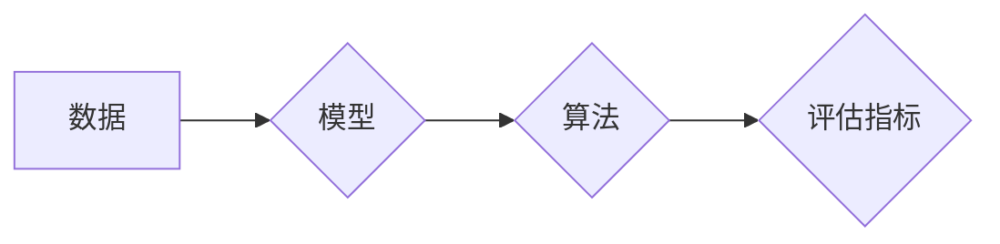

## 1. 背景介绍

### 1.1. 智能学习系统的兴起与发展

近年来，随着人工智能技术的快速发展，智能学习系统逐渐走进了人们的视野。从最初的基于规则的专家系统，到如今的深度学习、强化学习等技术，智能学习系统已经取得了长足的进步，并在教育、医疗、金融等领域展现出巨大的应用潜力。

### 1.2. 学习功能的重要性

学习功能是智能学习系统的核心，它使得系统能够从数据中学习、积累经验，并不断提升自身的性能。一个高效的学习功能可以帮助系统更好地理解用户需求，提供更精准的服务，从而提升用户体验。

### 1.3. 本文的写作目的

本文旨在探讨智能学习系统学习功能的设计与实现，涵盖了学习功能的核心概念、算法原理、代码实例、应用场景等方面，旨在为开发者提供一个全面、深入的指南。

## 2. 核心概念与联系

### 2.1. 机器学习

机器学习是人工智能的一个分支，其核心思想是让计算机系统能够从数据中学习，并自动构建模型来解决问题。常见的机器学习算法包括：

* 监督学习：通过已知输入和输出数据训练模型，例如图像分类、语音识别等。
* 无监督学习：从无标签数据中发现模式，例如聚类、降维等。
* 强化学习：通过与环境交互学习策略，例如游戏AI、机器人控制等。

### 2.2. 深度学习

深度学习是机器学习的一个子领域，其特点是使用多层神经网络来学习数据的复杂特征。深度学习在图像识别、自然语言处理等领域取得了突破性进展。

### 2.3. 学习功能的核心要素

智能学习系统的学习功能包含以下核心要素：

* 数据：学习功能的输入，可以是文本、图像、音频等多种形式。
* 模型：用于表示学习到的知识，例如神经网络、决策树等。
* 算法：用于训练模型，例如梯度下降、反向传播等。
* 评估指标：用于衡量学习效果，例如准确率、召回率等。

### 2.4. 核心概念之间的联系

机器学习是智能学习系统的基础，深度学习是机器学习的一个重要分支，学习功能的核心要素共同构成了智能学习系统的学习能力。

## 3. 核心算法原理具体操作步骤

### 3.1. 监督学习算法

#### 3.1.1. 线性回归

线性回归是一种用于预测连续目标变量的监督学习算法。它假设目标变量与输入变量之间存在线性关系。

* **操作步骤:**
    1. 收集数据并进行预处理，例如数据清洗、特征缩放等。
    2. 将数据分为训练集和测试集。
    3. 使用训练集训练线性回归模型，找到最佳拟合线。
    4. 使用测试集评估模型性能，例如计算均方误差。

#### 3.1.2. 逻辑回归

逻辑回归是一种用于预测二元分类问题的监督学习算法。它使用sigmoid函数将线性回归的输出转换为概率值。

* **操作步骤:**
    1. 收集数据并进行预处理，例如数据清洗、特征缩放等。
    2. 将数据分为训练集和测试集。
    3. 使用训练集训练逻辑回归模型，找到最佳决策边界。
    4. 使用测试集评估模型性能，例如计算准确率、召回率等。

### 3.2. 无监督学习算法

#### 3.2.1. K均值聚类

K均值聚类是一种将数据点分组到K个簇中的无监督学习算法。它通过迭代地更新簇中心来最小化簇内距离。

* **操作步骤:**
    1. 收集数据并进行预处理，例如数据清洗、特征缩放等。
    2. 随机初始化K个簇中心。
    3. 将每个数据点分配到距离最近的簇中心。
    4. 更新每个簇的中心为簇内所有数据点的平均值。
    5. 重复步骤3和4，直到簇中心不再变化或达到最大迭代次数。

#### 3.2.2. 主成分分析（PCA）

PCA是一种用于降维的无监督学习算法。它通过找到数据集中方差最大的方向来减少数据的维度。

* **操作步骤:**
    1. 收集数据并进行预处理，例如数据清洗、特征缩放等。
    2. 计算数据的协方差矩阵。
    3. 对协方差矩阵进行特征值分解，找到特征向量和特征值。
    4. 选择前K个特征向量，将数据投影到这些特征向量上。

### 3.3. 强化学习算法

#### 3.3.1. Q学习

Q学习是一种基于值的强化学习算法。它通过学习一个Q函数来估计在特定状态下采取特定动作的价值。

* **操作步骤:**
    1. 初始化Q函数。
    2. 在每个时间步，选择一个动作并观察环境的奖励和下一个状态。
    3. 更新Q函数，使用贝尔曼方程来估计当前状态-动作对的价值。
    4. 重复步骤2和3，直到Q函数收敛。

## 4. 数学模型和公式详细讲解举例说明

### 4.1. 线性回归

线性回归模型可以用以下公式表示：

$$
y = w_0 + w_1x_1 + w_2x_2 + ... + w_nx_n
$$

其中：

* $y$ 是目标变量
* $x_1, x_2, ..., x_n$ 是输入变量
* $w_0, w_1, w_2, ..., w_n$ 是模型参数

线性回归的目标是找到最佳的模型参数，使得模型预测值与实际值之间的误差最小。

**举例说明:**

假设我们想要预测房价，输入变量包括房屋面积、卧室数量、浴室数量等。我们可以使用线性回归模型来预测房价，模型参数可以通过最小二乘法来估计。

### 4.2. 逻辑回归

逻辑回归模型使用sigmoid函数将线性回归的输出转换为概率值：

$$
p = \frac{1}{1 + e^{-(w_0 + w_1x_1 + w_2x_2 + ... + w_nx_n)}}
$$

其中：

* $p$ 是目标变量的概率
* $x_1, x_2, ..., x_n$ 是输入变量
* $w_0, w_1, w_2, ..., w_n$ 是模型参数

逻辑回归的目标是找到最佳的模型参数，使得模型预测的概率值与实际值之间的误差最小。

**举例说明:**

假设我们想要预测用户是否会点击广告，输入变量包括用户年龄、性别、浏览历史等。我们可以使用逻辑回归模型来预测用户点击广告的概率，模型参数可以通过最大似然估计来估计。

## 5. 项目实践：代码实例和详细解释说明

### 5.1. Python代码实例：使用Scikit-learn实现线性回归

```python
from sklearn.linear_model import LinearRegression
from sklearn.model_selection import train_test_split
from sklearn.metrics import mean_squared_error

# 加载数据
X, y = load_data()

# 将数据分为训练集和测试集
X_train, X_test, y_train, y_test = train_test_split(X, y, test_size=0.2)

# 创建线性回归模型
model = LinearRegression()

# 训练模型
model.fit(X_train, y_train)

# 预测测试集
y_pred = model.predict(X_test)

# 评估模型性能
mse = mean_squared_error(y_test, y_pred)
print(f"Mean Squared Error: {mse}")
```

**代码解释:**

* `sklearn.linear_model.LinearRegression` 类用于创建线性回归模型。
* `sklearn.model_selection.train_test_split` 函数用于将数据分为训练集和测试集。
* `sklearn.metrics.mean_squared_error` 函数用于计算均方误差。

### 5.2. Python代码实例：使用TensorFlow实现逻辑回归

```python
import tensorflow as tf

# 创建模型
model = tf.keras.models.Sequential([
  tf.keras.layers.Dense(1, activation='sigmoid')
])

# 编译模型
model.compile(optimizer='adam',
              loss='binary_crossentropy',
              metrics=['accuracy'])

# 训练模型
model.fit(X_train, y_train, epochs=10)

# 评估模型性能
loss, accuracy = model.evaluate(X_test, y_test)
print(f"Loss: {loss}")
print(f"Accuracy: {accuracy}")
```

**代码解释:**

* `tf.keras.models.Sequential` 类用于创建顺序模型。
* `tf.keras.layers.Dense` 类用于创建全连接层。
* `'sigmoid'` 激活函数用于将线性回归的输出转换为概率值。
* `'adam'` 优化器用于更新模型参数。
* `'binary_crossentropy'` 损失函数用于衡量模型预测的概率值与实际值之间的误差。
* `'accuracy'` 指标用于衡量模型的准确率。

## 6. 实际应用场景

### 6.1. 教育领域

* **个性化学习:** 智能学习系统可以根据学生的学习情况和能力，推荐个性化的学习内容和路径，帮助学生更高效地学习。
* **自动批改:** 智能学习系统可以自动批改学生的作业，并提供反馈，节省教师时间，提高教学效率。

### 6.2. 医疗领域

* **辅助诊断:** 智能学习系统可以分析患者的医疗数据，辅助医生进行诊断，提高诊断准确率。
* **药物研发:** 智能学习系统可以分析大量的生物数据，加速药物研发过程。

### 6.3. 金融领域

* **风险控制:** 智能学习系统可以分析用户的交易数据，识别风险，防止欺诈行为。
* **投资建议:** 智能学习系统可以分析市场数据，为投资者提供投资建议。

## 7. 工具和资源推荐

### 7.1. 机器学习库

* **Scikit-learn:** Python机器学习库，提供了各种机器学习算法的实现。
* **TensorFlow:** Google开源的机器学习框架，支持深度学习模型的构建和训练。
* **PyTorch:** Facebook开源的机器学习框架，也支持深度学习模型的构建和训练。

### 7.2. 在线学习平台

* **Coursera:** 提供各种机器学习课程，涵盖了机器学习的基础知识和高级应用。
* **Udacity:** 提供各种人工智能课程，包括机器学习、深度学习等。

## 8. 总结：未来发展趋势与挑战

### 8.1. 未来发展趋势

* **更强大的学习能力:** 随着深度学习技术的不断发展，智能学习系统将拥有更强大的学习能力，能够处理更复杂的数据，解决更 challenging 的问题。
* **更广泛的应用场景:** 智能学习系统将应用于更多的领域，例如自动驾驶、智能家居、智慧城市等。
* **更人性化的交互体验:** 智能学习系统将更加注重用户体验，提供更人性化的交互方式。

### 8.2. 面临的挑战

* **数据隐私和安全:** 随着智能学习系统收集和处理的数据越来越多，数据隐私和安全问题变得越来越重要。
* **算法的解释性和可解释性:** 深度学习模型 often 被认为是黑盒模型，其决策过程难以解释，这限制了其在某些领域的应用。
* **人才缺口:** 智能学习系统的开发和应用需要大量的专业人才，目前人才缺口仍然很大。

## 9. 附录：常见问题与解答

### 9.1. 如何选择合适的机器学习算法？

选择合适的机器学习算法取决于具体的问题和数据。需要考虑以下因素：

* **问题的类型:** 是分类问题、回归问题还是聚类问题？
* **数据的规模和特征:** 数据集的大小、特征的数量和类型。
* **模型的复杂度:** 模型的复杂度越高，学习能力越强，但也更容易过拟合。

### 9.2. 如何评估模型性能？

评估模型性能可以使用各种指标，例如准确率、召回率、F1 score、AUC 等。需要根据具体的问题选择合适的指标。

### 9.3. 如何解决过拟合问题？

过拟合是指模型在训练集上表现很好，但在测试集上表现很差。解决过拟合问题的方法包括：

* **增加训练数据:** 更多的训练数据可以减少过拟合的风险。
* **正则化:** 正则化可以限制模型参数的复杂度，防止过拟合。
* **Dropout:** Dropout 是一种正则化技术，可以随机丢弃神经网络中的神经元，防止过拟合。

### 9.4. 如何提高模型的泛化能力？

泛化能力是指模型在未见过的数据上的表现能力。提高模型泛化能力的方法包括：

* **使用更多的数据进行训练:** 更多的训练数据可以提高模型的泛化能力。
* **使用更复杂的模型:** 更复杂的模型可以学习更复杂的特征，提高泛化能力。
* **使用正则化技术:** 正则化可以防止过拟合，提高泛化能力。

## 10. Mermaid流程图


