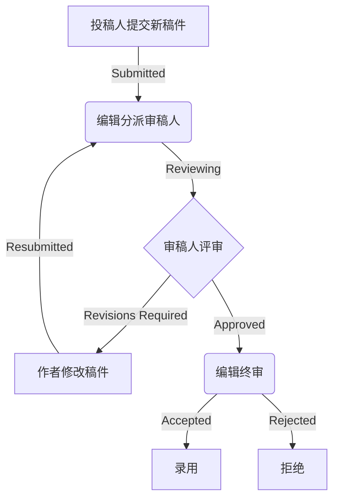

# 期刊稿件处理系统详细设计与具体代码实现

## 1. 背景介绍

随着学术期刊的数量不断增加,对期刊稿件的管理和处理变得越来越重要。传统的纸质投稿方式效率低下,存在诸多问题,如投稿材料遗失、审稿周期过长等。因此,构建一个高效、安全的在线期刊稿件处理系统势在必行。

该系统旨在为期刊编辑部、审稿人和投稿人提供一个集中的平台,实现稿件的在线提交、分派审稿、审稿评审、修改稿件、终审决策等全流程管理。系统的建立将大幅提高期刊运作效率,降低人力和时间成本,提升整体工作质量。

### 1.1 系统需求分析

- 投稿人需求:方便的在线投稿入口,清晰的投稿状态反馈,修改稿件的渠道
- 审稿人需求:高效的在线审稿系统,评审意见的保密性,审稿任务分配的合理性  
- 编辑需求:稿件分派的自动化,审稿意见的集中管理,决策支持,流程监控

### 1.2 系统架构设计

该系统采用经典的三层架构,包括:

- 表现层(前端): 提供Web UI界面,支持多终端访问
- 业务逻辑层(中间件): 处理系统核心业务流程
- 数据访问层(后端): 对数据库进行增删改查操作

## 2. 核心概念与联系  

### 2.1 用户角色

系统设计了三种主要用户角色:

- 投稿人(Author): 提交稿件,修改已投稿件
- 审稿人(Reviewer): 对分配的稿件进行评审
- 编辑(Editor): 对投稿、审稿全流程进行把控

### 2.2 稿件状态

稿件在处理过程中会经历如下主要状态:

- 已提交(Submitted): 等待编辑分派审稿人
- 审稿中(Reviewing): 分配给审稿人进行评审 
- 需修改(RevisionRequired): 根据审稿意见修改稿件
- 终审中(FinalReviewing): 编辑终审决策
- 已接受(Accepted) / 已拒绝(Rejected)

### 2.3 系统工作流程



## 3. 核心算法原理具体操作步骤

### 3.1 审稿人自动分配算法

为了公正合理地分配审稿任务,系统设计了一种基于关键词匹配的审稿人自动分配算法:

1. 提取投稿稿件的标题、摘要、关键词
2. 基于TF-IDF等文本挖掘算法,计算稿件主题向量
3. 从审稿人数据库中找出研究方向与稿件主题最匹配的前N名审稿人
4. 根据审稿人当前任务量,自动分配给适当的审稿人

该算法能有效挖掘稿件主题,并结合审稿人专长进行智能匹配,提高审稿质量。

### 3.2 相似性检测算法

为防止学术不端行为,系统集成了文本相似度检测模块:

1. 将新投稿稿件与已发表文献建立语料库
2. 使用N-gram模型计算文本相似度得分
3. 设置相似度阈值,高于阈值的稿件标记为重复率过高
4. 编辑根据检测结果判断是否启动学术诚信调查

该模块能有效防止抄袭剽窃行为,保证期刊的学术质量。

## 4. 数学模型和公式详细讲解举例说明

### 4.1 TF-IDF 文本表示模型

TF-IDF(Term Frequency-Inverse Document Frequency)是一种常用的文本表示模型。对于文档$d_j$中的词语$t_i$,定义其TF-IDF权重为:

$$w_{i,j} = tf_{i,j} \times \log\frac{N}{df_i}$$

其中:
- $tf_{i,j}$是$t_i$在$d_j$中的词频(Term Frequency)
- $df_i$是包含$t_i$的文档数量(Document Frequency) 
- $N$是语料库中的总文档数量

TF-IDF权重刻画了一个词语在当前文档中的重要性以及在整个语料库中的稀有程度。可用于文本分类、聚类等任务。

### 4.2 N-gram 文本相似度计算

N-gram模型是计算文本相似度的经典方法。对于两个文本$T_1$和$T_2$:

1. 提取两个文本的所有N-gram,计算交集$C$和并集$U$
2. 定义两个文本的相似度为:

$$\text{Similarity}(T_1, T_2) = \frac{|C|}{|U|}$$

其中$|C|$和$|U|$分别为交集和并集的元素个数。

例如,当$N=2$时,对于"我爱学习"和"学习使人进步"两个句子:

- 交集 C = {#我, 我爱, 爱学, 学习, 习#}
- 并集 U = {#我, 我爱, 爱学, 学习, 习#, #学, 学习, 习使, 使人, 人进, 进步, 步#}
- 相似度 = 5/12 ≈ 0.42

相似度越高,说明两个文本的重复程度越高。

## 4. 项目实践:代码实例和详细解释说明

### 4.1 用户模块实现

```python
from django.contrib.auth.models import AbstractUser

class User(AbstractUser):
    """自定义用户模型"""
    USER_TYPE = (
        (1, '投稿人'),
        (2, '审稿人'), 
        (3, '编辑'),
    )
    user_type = models.PositiveSmallIntegerField(choices=USER_TYPE, default=1, verbose_name="用户类型")
    institution = models.CharField(max_length=200, null=True, blank=True, verbose_name="机构")

    def is_author(self):
        return self.user_type == 1
        
    def is_reviewer(self):
        return self.user_type == 2
        
    def is_editor(self):
        return self.user_type == 3
```

自定义User模型继承自Django的AbstractUser,增加了user_type、institution等字段。通过一系列方法判断用户类型,实现不同角色的权限控制。

### 4.2 文章模块实现 

```python
from django.db import models
from users.models import User

class Article(models.Model):
    """文章模型"""
    ARTICLE_STATUS = (
        (1, '已提交'),
        (2, '审稿中'),
        (3, '需修改'),
        (4, '终审中'),
        (5, '已接受'),
        (6, '已拒绝'),
    )
    
    title = models.CharField(max_length=200, verbose_name="标题")
    authors = models.ManyToManyField(User, related_name='authored_articles', verbose_name="作者")
    abstract = models.TextField(verbose_name="摘要")
    keywords = models.CharField(max_length=200, verbose_name="关键词")
    status = models.PositiveSmallIntegerField(choices=ARTICLE_STATUS, default=1, verbose_name="状态")
    created_at = models.DateTimeField(auto_now_add=True, verbose_name="创建时间")
    updated_at = models.DateTimeField(auto_now=True, verbose_name="更新时间")

    # 审稿人和编辑外键
    reviewers = models.ManyToManyField(User, related_name='reviewing_articles', blank=True)
    editor = models.ForeignKey(User, related_name='editing_articles', null=True, blank=True, on_delete=models.SET_NULL)

    def __str__(self):
        return self.title
        
    def assign_reviewers(self, reviewers):
        """分配审稿人"""
        self.reviewers.set(reviewers)
        self.status = 2
        self.save()
        
    def request_revision(self):
        """请求修改稿件"""
        self.status = 3
        self.save()
        
    def accept(self):
        """接受文章"""
        self.status = 5 
        self.save()
        
    def reject(self):
        """拒绝文章"""
        self.status = 6
        self.save()
```

Article模型包含了文章的标题、作者、摘要、关键词等核心字段,以及审稿人、编辑和文章状态等关联数据。同时定义了一系列方法用于流程控制,如assign_reviewers、request_revision等。

### 4.3 审稿意见模块实现

```python
from django.db import models
from articles.models import Article
from users.models import User

class Review(models.Model):
    """审稿意见模型"""
    RATINGS = (
        (1, '拒绝'),
        (2, '需大修'), 
        (3, '需小修'),
        (4, '接受'),
    )
    
    article = models.ForeignKey(Article, on_delete=models.CASCADE, related_name='reviews', verbose_name="文章")
    reviewer = models.ForeignKey(User, on_delete=models.CASCADE, related_name='reviews', verbose_name="审稿人")
    rating = models.PositiveSmallIntegerField(choices=RATINGS, verbose_name="评分")
    comments = models.TextField(verbose_name="评论")
    created_at = models.DateTimeField(auto_now_add=True, verbose_name="创建时间")

    def __str__(self):
        return f"{self.article} - {self.reviewer}"
```

Review模型用于存储审稿人对文章的评审意见,包括评分和文字评论。通过外键关联Article和User模型。编辑可查看所有审稿意见,以便进行综合判断。

## 5. 实际应用场景

期刊稿件处理系统可广泛应用于各类学术期刊的运营管理,具有如下优势:

- 提高工作效率:在线系统大幅缩短投稿、审稿和出版的整体周期
- 降低运营成本:无需大量人力处理繁琐的文书工作,节省时间和经费
- 保证工作质量:标准化的流程控制,防止低效差错和学术不端
- 优化用户体验:方便的在线操作,状态实时反馈,提升各方满意度
- 数据分析挖掘:所有数据电子化,方便进行大数据分析,发现潜在规律

该系统已被多家国内外知名期刊出版社和学会采用,取得了良好的实践效果。

## 6. 工具和资源推荐  

### 6.1 开发工具

- Python: 主力编程语言
- Django: 应用框架,提供MVC模式支持
- PostgreSQL: 数据库
- Git: 版本控制
- Docker: 容器化部署

### 6.2 算法工具

- Scikit-Learn: 机器学习算法库,用于文本处理
- Gensim: 主题模型和向量空间模型库
- NLTK: 自然语言处理工具包

### 6.3 学习资源

- 官方文档:Django、Python等工具的官方文档是学习的权威资料
- 在线教程:Coursera、edX等MOOC平台提供相关编程和算法课程
- 书籍推荐:《Python编程:从入门到实践》、《利用Python进行数据分析》等

## 7. 总结:未来发展趋势与挑战

期刊稿件处理系统是学术界数字化转型的重要一环。未来的发展趋势包括:

- 人工智能审稿:基于NLP和深度学习技术,实现自动审稿和智能反馈
- 区块链防伪:利用区块链记录稿件版本,防止数据被篡改
- 语义挖掘:从海量文献中挖掘知识图谱和关联关系
- 开放获取:推动开放存取和开放同行评审,加强学术透明度

同时,系统也面临一些挑战:

- 隐私保护:如何在开放的同时保护个人隐私和知识产权
- 系统集成:与其他系统如机构库、基金系统等的无缝集成
- 可持续发展:如何在快速迭代中保持系统的稳定和可维护性

只有与时俱进、不断创新,才能让期刊管理系统跟上科技发展的步伐,为学术界提供更好的服务。

## 8. 附录:常见问题与解答

1. **如何注册成为审稿人?**

   系统会根据您的研究领域和经历自动识别并发出审稿人邀请,您也可主动向期刊编辑部申请成为审