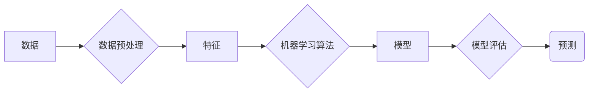

##  机器学习原理与代码实例讲解

作者：禅与计算机程序设计艺术

## 1. 背景介绍

### 1.1 人工智能的崛起

近年来，人工智能 (AI) 发展迅猛，其应用已渗透到各个领域，从自动驾驶汽车到医疗诊断，从金融预测到个性化推荐，AI 正以前所未有的速度改变着我们的生活。而机器学习作为人工智能的核心技术之一，其重要性不言而喻。

### 1.2 机器学习：让机器像人一样学习

简单来说，机器学习就是让机器像人一样从数据中学习规律，并利用学到的规律对未知数据进行预测。与传统的编程方式不同，机器学习不需要人工编写复杂的规则，而是通过算法自动从数据中提取特征，并建立模型来进行预测。

### 1.3 机器学习的应用领域

机器学习的应用领域非常广泛，例如：

* **图像识别**: 人脸识别、物体检测、图像分类等。
* **自然语言处理**:  机器翻译、文本摘要、情感分析等。
* **语音识别**: 语音助手、语音搜索、语音输入法等。
* **推荐系统**:  电商推荐、音乐推荐、新闻推荐等。
* **金融风控**:  反欺诈、信用评估、风险预测等。

## 2. 核心概念与联系

### 2.1 数据：机器学习的燃料

数据是机器学习的基石，机器学习算法需要大量的数据来进行训练和学习。数据的质量和数量直接影响机器学习模型的性能。

#### 2.1.1 数据类型

* **结构化数据**:  可以用表格形式表示的数据，例如 Excel 表格、数据库中的数据等。
* **非结构化数据**:  不能用表格形式表示的数据，例如图片、音频、视频、文本等。

#### 2.1.2 数据预处理

在将数据输入机器学习算法之前，通常需要对数据进行预处理，例如：

* **数据清洗**:  处理缺失值、异常值等。
* **特征提取**:  从原始数据中提取有用的特征。
* **数据标准化**:  将数据缩放到相同的范围。

### 2.2 模型：机器学习的核心

机器学习模型是机器学习算法的输出，它代表了从数据中学习到的规律。模型可以用于对未知数据进行预测。

#### 2.2.1 模型类型

* **监督学习**:  训练数据包含输入和输出，模型学习输入到输出的映射关系。例如线性回归、逻辑回归、支持向量机等。
* **无监督学习**:  训练数据只包含输入，模型学习数据的内在结构和规律。例如聚类算法、降维算法等。
* **强化学习**:  智能体通过与环境交互学习最佳行为策略。例如 AlphaGo、DQN 等。

#### 2.2.2 模型评估

模型训练完成后，需要对模型进行评估，以衡量模型的性能。常用的评估指标包括：

* **准确率**:  预测正确的样本数占总样本数的比例。
* **精确率**:  预测为正例的样本中真正例的比例。
* **召回率**:  所有正例样本中被预测为正例的比例。
* **F1 值**:  精确率和召回率的调和平均。

### 2.3 算法：机器学习的引擎

机器学习算法是机器学习的核心，它定义了如何从数据中学习模型。不同的算法适用于不同的任务和数据类型。

#### 2.3.1 常用算法

* **线性回归**:  用于预测连续值。
* **逻辑回归**:  用于预测二分类问题。
* **决策树**:  用于分类和回归问题。
* **支持向量机**:  用于分类和回归问题。
* **朴素贝叶斯**:  用于分类问题。
* **K 近邻**:  用于分类和回归问题。
* **K 均值**:  用于聚类问题。

#### 2.3.2 算法选择

选择合适的算法取决于多个因素，例如：

* 数据集的大小和维度
* 数据的类型和分布
* 任务的类型和要求

### 2.4 核心概念联系图



## 3. 核心算法原理具体操作步骤

### 3.1 线性回归

#### 3.1.1 原理

线性回归假设目标变量与特征之间存在线性关系，并试图找到一条直线或超平面来拟合数据。

#### 3.1.2 操作步骤

1. **准备数据**:  收集并预处理数据。
2. **选择模型**:  选择线性回归模型。
3. **训练模型**:  使用训练数据拟合模型参数。
4. **评估模型**:  使用测试数据评估模型性能。
5. **预测**:  使用训练好的模型对未知数据进行预测。

#### 3.1.3 代码实例

```python
import numpy as np
from sklearn.linear_model import LinearRegression
from sklearn.model_selection import train_test_split
from sklearn.metrics import mean_squared_error

# 1. 准备数据
X = np.array([[1, 2], [3, 4], [5, 6], [7, 8]])
y = np.array([3, 5, 7, 9])

# 2. 选择模型
model = LinearRegression()

# 3. 训练模型
model.fit(X, y)

# 4. 评估模型
y_pred = model.predict(X)
mse = mean_squared_error(y, y_pred)
print("均方误差:", mse)

# 5. 预测
new_X = np.array([[9, 10]])
new_y = model.predict(new_X)
print("预测值:", new_y)
```

### 3.2 逻辑回归

#### 3.2.1 原理

逻辑回归用于解决二分类问题，它使用 sigmoid 函数将线性回归的输出映射到 0 到 1 之间，表示样本属于正例的概率。

#### 3.2.2 操作步骤

1. **准备数据**:  收集并预处理数据。
2. **选择模型**:  选择逻辑回归模型。
3. **训练模型**:  使用训练数据拟合模型参数。
4. **评估模型**:  使用测试数据评估模型性能。
5. **预测**:  使用训练好的模型对未知数据进行预测。

#### 3.2.3 代码实例

```python
import numpy as np
from sklearn.linear_model import LogisticRegression
from sklearn.model_selection import train_test_split
from sklearn.metrics import accuracy_score

# 1. 准备数据
X = np.array([[1, 2], [3, 4], [5, 6], [7, 8]])
y = np.array([0, 0, 1, 1])

# 2. 选择模型
model = LogisticRegression()

# 3. 训练模型
model.fit(X, y)

# 4. 评估模型
y_pred = model.predict(X)
accuracy = accuracy_score(y, y_pred)
print("准确率:", accuracy)

# 5. 预测
new_X = np.array([[9, 10]])
new_y = model.predict(new_X)
print("预测值:", new_y)
```

## 4. 数学模型和公式详细讲解举例说明

### 4.1 线性回归

#### 4.1.1 模型公式

线性回归模型的公式如下：

$$ y = w_0 + w_1 x_1 + w_2 x_2 + ... + w_n x_n $$

其中：

* $y$ 是目标变量
* $x_1, x_2, ..., x_n$ 是特征
* $w_0, w_1, w_2, ..., w_n$ 是模型参数

#### 4.1.2 损失函数

线性回归的损失函数通常使用均方误差 (MSE):

$$ MSE = \frac{1}{m} \sum_{i=1}^{m} (y_i - \hat{y_i})^2 $$

其中：

* $m$ 是样本数量
* $y_i$ 是第 $i$ 个样本的真实值
* $\hat{y_i}$ 是第 $i$ 个样本的预测值

#### 4.1.3 梯度下降

线性回归模型的参数可以使用梯度下降算法进行优化。梯度下降算法的迭代公式如下：

$$ w_j = w_j - \alpha \frac{\partial MSE}{\partial w_j} $$

其中：

* $\alpha$ 是学习率
* $\frac{\partial MSE}{\partial w_j}$ 是损失函数对参数 $w_j$ 的偏导数

### 4.2 逻辑回归

#### 4.2.1 模型公式

逻辑回归模型的公式如下：

$$ P(y=1|x) = \frac{1}{1 + e^{-(w_0 + w_1 x_1 + w_2 x_2 + ... + w_n x_n)}} $$

其中：

* $P(y=1|x)$ 是样本 $x$ 属于正例的概率
* $w_0, w_1, w_2, ..., w_n$ 是模型参数

#### 4.2.2 损失函数

逻辑回归的损失函数通常使用交叉熵损失函数：

$$ J(\theta) = -\frac{1}{m} \sum_{i=1}^{m} [y^{(i)} log(h_\theta(x^{(i)})) + (1-y^{(i)}) log(1-h_\theta(x^{(i)}))] $$

其中：

* $m$ 是样本数量
* $y^{(i)}$ 是第 $i$ 个样本的真实标签
* $h_\theta(x^{(i)})$ 是模型对第 $i$ 个样本的预测概率

#### 4.2.3 梯度下降

逻辑回归模型的参数可以使用梯度下降算法进行优化。

## 5. 项目实践：代码实例和详细解释说明

### 5.1 项目背景

本项目将使用机器学习算法来预测房价。

### 5.2 数据集

本项目使用加州房价数据集，该数据集包含加州不同地区的房价和其他相关信息，例如房屋年龄、房间数量、地理位置等。

### 5.3 代码实例

```python
import pandas as pd
from sklearn.model_selection import train_test_split
from sklearn.linear_model import LinearRegression
from sklearn.metrics import mean_squared_error

# 1. 加载数据
data = pd.read_csv('housing.csv')

# 2. 数据预处理
# ...

# 3. 划分训练集和测试集
X_train, X_test, y_train, y_test = train_test_split(X, y, test_size=0.2)

# 4. 选择模型
model = LinearRegression()

# 5. 训练模型
model.fit(X_train, y_train)

# 6. 评估模型
y_pred = model.predict(X_test)
mse = mean_squared_error(y_test, y_pred)
print("均方误差:", mse)

# 7. 预测
# ...
```

### 5.4 代码解释

* **加载数据**:  使用 pandas 库加载 CSV 格式的数据集。
* **数据预处理**:  对数据进行清洗、特征提取、数据标准化等操作。
* **划分训练集和测试集**:  将数据集划分为训练集和测试集，用于模型训练和评估。
* **选择模型**:  选择线性回归模型。
* **训练模型**:  使用训练数据拟合模型参数。
* **评估模型**:  使用测试数据评估模型性能，例如计算均方误差。
* **预测**:  使用训练好的模型对未知数据进行预测。

## 6. 实际应用场景

### 6.1 图像识别

* **人脸识别**:  用于身份验证、安防监控等。
* **物体检测**:  用于自动驾驶、智能安防等。
* **图像分类**:  用于图片搜索、内容审核等。

### 6.2 自然语言处理

* **机器翻译**:  用于跨语言交流、文本翻译等。
* **文本摘要**:  用于信息提取、文档概括等。
* **情感分析**:  用于舆情监控、用户画像等。

### 6.3 语音识别

* **语音助手**:  用于智能家居、语音控制等。
* **语音搜索**:  用于语音输入、语音搜索引擎等。
* **语音输入法**:  用于语音输入、文字录入等。

### 6.4 推荐系统

* **电商推荐**:  用于商品推荐、个性化推荐等。
* **音乐推荐**:  用于音乐推荐、歌单推荐等。
* **新闻推荐**:  用于新闻推荐、个性化新闻等。

### 6.5 金融风控

* **反欺诈**:  用于检测和预防欺诈行为。
* **信用评估**:  用于评估借款人的信用风险。
* **风险预测**:  用于预测市场风险、信用风险等。

## 7. 总结：未来发展趋势与挑战

### 7.1 未来发展趋势

* **深度学习**:  深度学习是机器学习的一个分支，它使用多层神经网络来学习数据的表示，并在图像识别、自然语言处理等领域取得了突破性进展。
* **强化学习**:  强化学习是一种通过与环境交互学习最佳行为策略的机器学习方法，它在游戏 AI、机器人控制等领域具有广泛的应用前景。
* **机器学习平台**:  随着机器学习技术的普及，越来越多的机器学习平台涌现出来，例如 TensorFlow、PyTorch、Scikit-learn 等，这些平台提供了丰富的机器学习算法和工具，降低了机器学习的门槛。

### 7.2 面临的挑战

* **数据隐私**:  机器学习算法需要大量的训练数据，而这些数据往往包含用户的隐私信息，如何保护用户隐私是机器学习面临的一大挑战。
* **模型可解释性**:  许多机器学习模型都是黑盒模型，难以理解模型的决策过程，如何提高模型的可解释性是机器学习面临的另一大挑战。
* **算法公平性**:  机器学习算法可能会放大数据中的偏见，导致算法决策不公平，如何保证算法的公平性是机器学习面临的又一大挑战。

## 8. 附录：常见问题与解答

### 8.1 什么是机器学习？

机器学习是人工智能的一个分支，它使计算机能够在没有明确编程的情况下从数据中学习。

### 8.2 机器学习有哪些类型？

* 监督学习
* 无监督学习
* 强化学习

### 8.3 机器学习有哪些应用？

* 图像识别
* 自然语言处理
* 语音识别
* 推荐系统
* 金融风控

### 8.4 机器学习面临哪些挑战？

* 数据隐私
* 模型可解释性
* 算法公平性 
