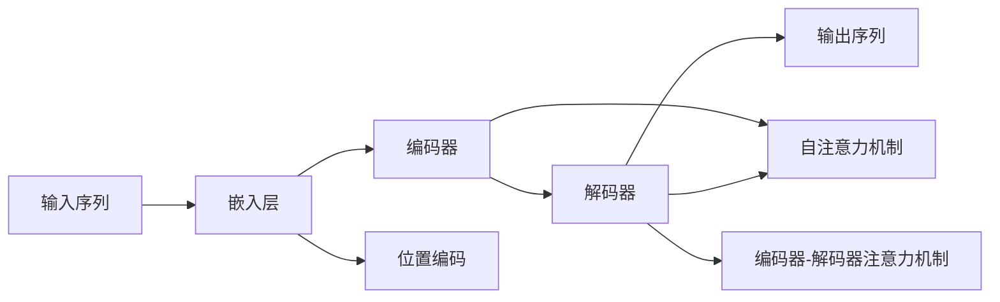
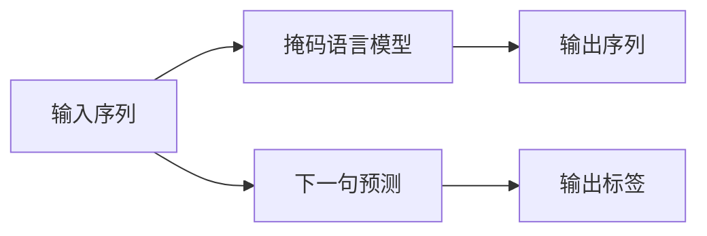

##  案例研究：使用大语言模型进行医疗诊断辅助与决策

作者：禅与计算机程序设计艺术

## 1. 背景介绍

### 1.1 医疗诊断的挑战与机遇

医疗诊断是医疗保健的核心环节，也是最复杂和最具挑战性的任务之一。近年来，随着人口老龄化、慢性病患病率上升以及医疗信息爆炸式增长，医疗系统面临着前所未有的压力。传统的医疗诊断主要依赖医生的经验和知识，但这种方式存在着一些固有的局限性：

* **主观性:** 不同的医生对相同的症状和检查结果可能会有不同的解读。
* **信息过载:** 医生需要处理海量的医学文献、患者病历和影像数据。
* **地域差异:** 不同地区医疗资源和水平存在差异，导致诊断准确率参差不齐。

人工智能 (AI) 的快速发展为解决这些挑战带来了新的机遇。特别是大语言模型 (LLM) ，如 GPT-4 和 BERT，在自然语言处理 (NLP) 领域取得了突破性进展，展现出在医疗诊断辅助与决策方面的巨大潜力。

### 1.2  大语言模型 (LLM) 简介

大语言模型 (LLM) 是一种基于深度学习的 AI 模型，能够理解和生成人类语言。它们在海量文本数据上进行训练，学习语言的复杂模式和语义关系。与传统的 NLP 模型相比，LLM 具有以下优势：

* **更强的语言理解能力:**  LLM 能够理解复杂的句子结构、语义关系和上下文信息。
* **更高的生成质量:**  LLM 生成的文本更加流畅、自然，更接近人类语言。
* **更强的泛化能力:**  LLM 可以应用于各种 NLP 任务，而无需针对特定任务进行训练。

### 1.3  LLM 在医疗诊断中的应用

LLM 在医疗诊断中的应用主要包括以下几个方面：

* **症状检查与初步诊断:**  LLM 可以根据患者描述的症状，结合医学知识库，提供初步的诊断建议。
* **辅助诊断:**  LLM 可以分析患者的病历、影像数据和实验室检查结果，为医生提供辅助诊断建议。
* **治疗方案推荐:**  LLM 可以根据患者的病情和诊疗指南，推荐合适的治疗方案。
* **预后预测:**  LLM 可以根据患者的病史、治疗方案和遗传信息，预测疾病的进展和预后。

## 2. 核心概念与联系

### 2.1  自然语言处理 (NLP)

自然语言处理 (NLP) 是人工智能的一个分支，致力于使计算机能够理解、解释和生成人类语言。NLP 的核心任务包括：

* **文本分类:**  将文本归类到预定义的类别中。
* **情感分析:**  识别文本中表达的情感倾向。
* **命名实体识别:**  识别文本中的人名、地名、机构名等实体。
* **机器翻译:**  将一种语言的文本翻译成另一种语言。
* **问答系统:**  根据用户提出的问题，从文本中找到答案。

### 2.2  大语言模型 (LLM)

大语言模型 (LLM) 是一种基于深度学习的 NLP 模型，能够理解和生成人类语言。LLM 的核心架构是 Transformer，它是一种基于自注意力机制的神经网络模型。Transformer 模型的优势在于：

* **并行计算:**  Transformer 模型可以并行处理序列数据，提高训练效率。
* **长距离依赖关系建模:**  Transformer 模型的自注意力机制可以捕捉长距离的依赖关系，提高模型的理解能力。

### 2.3  医疗实体识别

医疗实体识别是 NLP 在医疗领域的一个重要应用，旨在从非结构化的医疗文本中识别出与疾病、症状、检查、治疗等相关的实体。常见的医疗实体类型包括：

* **疾病:**  例如，肺炎、糖尿病、高血压。
* **症状:**  例如，发热、咳嗽、腹泻。
* **检查:**  例如，血常规、X 光、CT。
* **治疗:**  例如，药物治疗、手术治疗、放射治疗。

### 2.4  关系抽取

关系抽取是 NLP 的另一个重要任务，旨在识别文本中实体之间的语义关系。在医疗领域，关系抽取可以用于构建医疗知识图谱，例如：

* **疾病-症状关系:**  例如，肺炎的症状包括发热、咳嗽、咳痰。
* **疾病-治疗关系:**  例如，肺炎的治疗方法包括抗生素治疗、氧疗。

## 3. 核心算法原理具体操作步骤

### 3.1 使用 LLM 进行医疗诊断辅助与决策的一般流程

使用 LLM 进行医疗诊断辅助与决策的一般流程如下：

1. **数据收集与预处理:**  收集患者的病历、影像数据、实验室检查结果等数据，并进行预处理，例如数据清洗、格式转换等。

2. **特征工程:**  从预处理后的数据中提取特征，例如患者的年龄、性别、症状、检查结果等。

3. **模型训练:**  使用预处理后的数据和提取的特征训练 LLM 模型，例如 GPT-4 或 BERT。

4. **模型评估:**  使用测试集评估训练好的模型的性能，例如准确率、召回率、F1 值等。

5. **模型部署:**  将训练好的模型部署到实际应用环境中，例如医院的 HIS 系统或医生的移动设备上。

6. **模型监控与更新:**  定期监控模型的性能，并根据实际情况更新模型。

### 3.2  LLM 在医疗诊断中的具体应用案例

#### 3.2.1  症状检查与初步诊断

**案例描述:**  开发一个基于 LLM 的智能问诊系统，根据患者描述的症状，提供初步的诊断建议。

**操作步骤:**

1. **数据收集:**  收集大量的患者问诊记录，包括患者描述的症状、医生的诊断结果等。

2. **数据预处理:**  对收集到的问诊记录进行清洗、分词、去除停用词等预处理操作。

3. **模型训练:**  使用预处理后的问诊记录训练 LLM 模型，例如 GPT-4。训练过程中，可以使用症状作为输入，医生的诊断结果作为输出。

4. **模型评估:**  使用测试集评估训练好的模型的性能，例如准确率、召回率、F1 值等。

5. **模型部署:**  将训练好的模型部署到智能问诊系统中。

6. **用户输入症状:**  用户在智能问诊系统中输入自己的症状。

7. **模型预测:**  智能问诊系统调用训练好的 LLM 模型，根据用户输入的症状预测可能的疾病。

8. **结果展示:**  智能问诊系统将预测的疾病结果展示给用户，并给出相应的建议。

#### 3.2.2  辅助诊断

**案例描述:**  开发一个基于 LLM 的辅助诊断系统，帮助医生分析患者的病历、影像数据和实验室检查结果，提供辅助诊断建议。

**操作步骤:**

1. **数据收集:**  收集大量的患者病历、影像数据和实验室检查结果等数据。

2. **数据预处理:**  对收集到的数据进行清洗、格式转换、特征提取等预处理操作。

3. **模型训练:**  使用预处理后的数据训练 LLM 模型，例如 BERT。训练过程中，可以使用患者的病历、影像数据和实验室检查结果作为输入，医生的诊断结果作为输出。

4. **模型评估:**  使用测试集评估训练好的模型的性能，例如准确率、召回率、F1 值等。

5. **模型部署:**  将训练好的模型部署到辅助诊断系统中。

6. **用户输入数据:**  医生在辅助诊断系统中输入患者的病历、影像数据和实验室检查结果等数据。

7. **模型预测:**  辅助诊断系统调用训练好的 LLM 模型，根据医生输入的数据预测可能的疾病。

8. **结果展示:**  辅助诊断系统将预测的疾病结果展示给医生，并给出相应的建议。

## 4. 数学模型和公式详细讲解举例说明

### 4.1 Transformer 模型

Transformer 模型是 LLM 的核心架构，它是一种基于自注意力机制的神经网络模型。Transformer 模型的结构如下图所示：



#### 4.1.1  自注意力机制

自注意力机制是 Transformer 模型的核心，它允许模型关注输入序列中不同位置的信息，从而捕捉长距离的依赖关系。自注意力机制的计算过程如下：

1. **计算查询向量、键向量和值向量:**  对于输入序列中的每个词，分别计算其查询向量 $Q$、键向量 $K$ 和值向量 $V$。

    $$
    \begin{aligned}
    Q &= XW^Q \\
    K &= XW^K \\
    V &= XW^V
    \end{aligned}
    $$

    其中，$X$ 是输入序列的词嵌入矩阵，$W^Q$、$W^K$ 和 $W^V$ 是可学习的参数矩阵。

2. **计算注意力得分:**  计算查询向量和每个键向量之间的点积，得到注意力得分。

    $$
    \text{Attention Scores} = QK^T
    $$

3. **缩放注意力得分:**  将注意力得分除以 $\sqrt{d_k}$，其中 $d_k$ 是键向量的维度。

    $$
    \text{Scaled Attention Scores} = \frac{QK^T}{\sqrt{d_k}}
    $$

4. **应用 Softmax 函数:**  对缩放后的注意力得分应用 Softmax 函数，得到注意力权重。

    $$
    \text{Attention Weights} = \text{Softmax}(\text{Scaled Attention Scores})
    $$

5. **计算加权和:**  将值向量乘以对应的注意力权重，并求和，得到最终的输出向量。

    $$
    \text{Output} = \text{Attention Weights}V
    $$

#### 4.1.2  多头注意力机制

多头注意力机制是 Transformer 模型的另一个重要组成部分，它允许模型从多个角度关注输入序列的信息。多头注意力机制的计算过程如下：

1. **将查询向量、键向量和值向量分别映射到多个子空间:**  将查询向量 $Q$、键向量 $K$ 和值向量 $V$ 分别映射到 $h$ 个子空间，其中 $h$ 是注意力头的数量。

    $$
    \begin{aligned}
    Q_i &= QW_i^Q \\
    K_i &= KW_i^K \\
    V_i &= VW_i^V
    \end{aligned}
    $$

    其中，$i = 1, 2, ..., h$，$W_i^Q$、$W_i^K$ 和 $W_i^V$ 是可学习的参数矩阵。

2. **对每个子空间计算自注意力:**  对每个子空间 $(Q_i, K_i, V_i)$ 计算自注意力，得到 $h$ 个输出向量。

    $$
    \text{Head}_i = \text{Attention}(Q_i, K_i, V_i)
    $$

3. **拼接输出向量:**  将 $h$ 个输出向量拼接起来，得到最终的输出向量。

    $$
    \text{MultiHead} = [\text{Head}_1; \text{Head}_2; ...; \text{Head}_h]
    $$

#### 4.1.3  位置编码

由于 Transformer 模型没有循环结构，无法捕捉输入序列的顺序信息，因此需要引入位置编码来表示词在序列中的位置信息。位置编码的计算公式如下：

$$
PE_{(pos, 2i)} = \sin(\frac{pos}{10000^{2i/d_{model}}})
$$

$$
PE_{(pos, 2i+1)} = \cos(\frac{pos}{10000^{2i/d_{model}}})
$$

其中，$pos$ 是词在序列中的位置，$i$ 是位置编码向量的维度，$d_{model}$ 是词嵌入向量的维度。

### 4.2  BERT 模型

BERT (Bidirectional Encoder Representations from Transformers) 模型是一种基于 Transformer 的预训练语言模型。BERT 模型在海量文本数据上进行预训练，学习语言的复杂模式和语义关系。BERT 模型的预训练任务包括：

* **掩码语言模型 (Masked Language Model, MLM):**  随机掩盖输入序列中的一些词，然后预测被掩盖的词。
* **下一句预测 (Next Sentence Prediction, NSP):**  判断两个句子是否是连续的。

BERT 模型的预训练过程如下图所示：



BERT 模型的预训练过程可以帮助模型学习到丰富的语言知识，从而提高模型在下游 NLP 任务上的性能。

## 5. 项目实践：代码实例和详细解释说明

### 5.1  使用 Python 和 Hugging Face Transformers 库实现医疗诊断辅助系统

```python
# 导入必要的库
from transformers import AutoModelForSequenceClassification, AutoTokenizer

# 加载预训练的 BERT 模型和分词器
model_name = "bert-base-uncased"
model = AutoModelForSequenceClassification.from_pretrained(model_name, num_labels=2)
tokenizer = AutoTokenizer.from_pretrained(model_name)

# 定义输入文本
text = "I have a fever, cough, and headache."

# 对输入文本进行预处理
inputs = tokenizer(text, return_tensors="pt")

# 使用模型进行预测
outputs = model(**inputs)

# 获取预测结果
predicted_class = outputs.logits.argmax().item()

# 打印预测结果
print(f"Predicted class: {predicted_class}")
```

**代码解释:**

* 首先，导入必要的库，包括 `transformers` 库中的 `AutoModelForSequenceClassification` 和 `AutoTokenizer` 类。
* 然后，加载预训练的 BERT 模型和分词器。
* 接着，定义输入文本，并使用分词器对其进行预处理。
* 然后，使用模型对预处理后的输入文本进行预测。
* 最后，获取预测结果，并打印出来。

### 5.2  使用 TensorFlow 和 Keras 库实现医疗实体识别模型

```python
# 导入必要的库
import tensorflow as tf
from tensorflow.keras import layers

# 定义模型参数
vocab_size = 10000
embedding_dim = 128
hidden_dim = 256
num_classes = 5

# 创建模型
model = tf.keras.Sequential([
    layers.Embedding(vocab_size, embedding_dim),
    layers.Bidirectional(layers.LSTM(hidden_dim)),
    layers.Dense(num_classes, activation="softmax"),
])

# 编译模型
model.compile(
    optimizer="adam",
    loss="sparse_categorical_crossentropy",
    metrics=["accuracy"],
)

# 训练模型
model.fit(train_data, train_labels, epochs=10)
```

**代码解释:**

* 首先，导入必要的库，包括 `tensorflow` 和 `tensorflow.keras` 库。
* 然后，定义模型参数，包括词汇表大小、嵌入维度、隐藏层维度和类别数量。
* 接着，创建模型，使用嵌入层、双向 LSTM 层和全连接层构建模型。
* 然后，编译模型，指定优化器、损失函数和评估指标。
* 最后，使用训练数据和标签训练模型。

## 6. 实际应用场景

### 6.1  智能问诊

* **应用场景:**  为用户提供在线问诊服务，根据用户描述的症状，提供初步的诊断建议。
* **优势:**  方便快捷、节省时间、降低就医成本。
* **案例:**  阿里健康的“医鹿”、平安好医生的“问问医生”。

### 6.2  辅助诊断

* **应用场景:**  帮助医生分析患者的病历、影像数据和实验室检查结果，提供辅助诊断建议。
* **优势:**  提高诊断效率和准确率，减少误诊漏诊。
* **案例:**  IBM Watson Health、谷歌 DeepMind Health。

### 6.3  治疗方案推荐

* **应用场景:**  根据患者的病情和诊疗指南，推荐合适的治疗方案。
* **优势:**  个性化治疗、提高治疗效果、降低治疗成本。
* **案例:**  IBM Watson for Oncology、谷歌 DeepMind Streams。

### 6.4  预后预测

* **应用场景:**  根据患者的病史、治疗方案和遗传信息，预测疾病的进展和预后。
* **优势:**  早期预警、及时干预、改善预后。
* **案例:**  Flatiron Health、Tempus。

## 7. 工具和资源推荐

### 7.1  大语言模型

* **GPT-4:**  由 OpenAI 开发的大型语言模型，具有强大的语言理解和生成能力。
* **BERT:**  由 Google 开发的预训练语言模型，在各种 NLP 任务上取得了 state-of-the-art 的结果。

### 7.2  深度学习框架

* **TensorFlow:**  由 Google 开发的开源深度学习框架，广泛应用于 NLP 和其他机器学习领域。
* **PyTorch:**  由 Facebook 开发的开源深度学习框架，以其灵活性和易用性而著称。

### 7.3  NLP 工具包

* **Hugging Face Transformers:**  一个提供了预训练的 LLM 模型和分词器的 Python 库。
* **SpaCy:**  一个快速高效的 NLP 工具包，提供了各种 NLP 功能，包括分词、词性标注、命名实体识别等。

## 8. 总结：未来发展趋势与挑战

### 8.1  未来发展趋势

