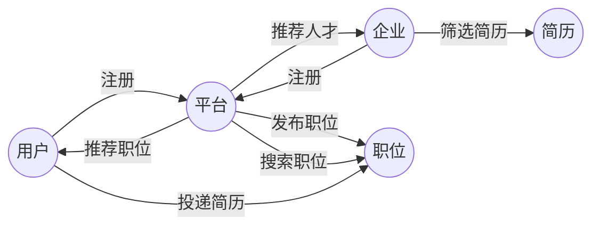

##  求职与招聘系统详细设计与具体代码实现

**作者：禅与计算机程序设计艺术**

## 1. 背景介绍

### 1.1.  求职招聘市场的现状与挑战

随着互联网的快速发展，传统的求职招聘模式已经无法满足日益增长的需求。信息不对称、招聘效率低下、求职成本高等问题日益突出。同时，人工智能、大数据等新兴技术的兴起，也为求职招聘行业带来了新的机遇和挑战。

### 1.2.  在线求职招聘平台的优势

在线求职招聘平台作为一种新型的招聘模式，具有以下优势：

* **信息透明化:**  平台汇集了大量的企业和求职者信息，打破了传统招聘模式的信息壁垒，提高了招聘效率。
* **精准匹配:**  平台可以根据用户的技能、经验、期望等信息，利用算法进行精准匹配，推荐合适的职位和人才。
* **降低成本:**  平台可以帮助企业降低招聘成本，提高招聘效率，同时也可以帮助求职者降低求职成本，提高求职成功率。
* **提升用户体验:**  平台可以为用户提供更加便捷、高效、个性化的求职招聘服务。

### 1.3.  系统设计目标

本系统旨在设计和实现一个功能完善、性能优越、用户体验良好的在线求职招聘平台，为企业和求职者提供更加便捷、高效、精准的求职招聘服务。

## 2.  核心概念与联系

### 2.1.  用户

* **求职者:**  注册平台，填写个人信息、求职意向、技能特长等，搜索职位、投递简历、查看面试邀请等。
* **招聘者:**  注册平台，发布职位信息、筛选简历、发送面试邀请、管理招聘流程等。
* **管理员:**  管理平台系统、审核企业和用户信息、处理用户反馈等。

### 2.2.  职位

* **职位信息:**  职位名称、所属公司、工作地点、薪资范围、职位描述、任职要求等。
* **职位分类:**  根据行业、职能、职位等级等对职位进行分类，方便用户查找。
* **职位推荐:**  根据用户的求职意向、技能特长等信息，推荐合适的职位。

### 2.3.  简历

* **个人信息:**  姓名、性别、年龄、学历、工作经验、联系方式等。
* **求职意向:**  期望职位、期望薪资、工作地点等。
* **技能特长:**  专业技能、语言能力、证书等。
* **项目经验:**  项目描述、项目职责、项目成果等。
* **简历解析:**  利用自然语言处理技术，从简历中提取关键信息，方便企业筛选。

### 2.4.  匹配

* **基于规则的匹配:**  根据预先设定的规则，对职位和简历进行匹配，例如：职位要求的技能与求职者掌握的技能相匹配。
* **基于内容的匹配:**  根据职位描述和简历内容，利用文本相似度算法进行匹配。
* **基于协同过滤的匹配:**  根据用户的历史行为数据，推荐可能感兴趣的职位或人才。

### 2.5.  关系图



## 3. 核心算法原理具体操作步骤

### 3.1.  基于Lucene的全文检索

#### 3.1.1.  原理

Lucene是一个开源的全文检索库，可以用于构建高性能、可扩展的搜索引擎。其核心原理是倒排索引，即将文档集转换为一系列关键词和包含该关键词的文档列表。

#### 3.1.2.  操作步骤

1.  **创建索引:**  将职位信息和简历信息进行分词、去停用词、构建倒排索引等操作，生成索引文件。
2.  **搜索索引:**  用户输入关键词后，系统根据关键词查询倒排索引，返回包含该关键词的文档列表。
3.  **排序:**  根据相关性、时间等因素对搜索结果进行排序，将最符合用户需求的结果展示在前面。

### 3.2.  基于协同过滤的推荐算法

#### 3.2.1.  原理

协同过滤是一种常用的推荐算法，其基本思想是“物以类聚，人以群分”，即根据用户的历史行为数据，找到与目标用户兴趣相似的用户群体，然后将该群体喜欢的物品推荐给目标用户。

#### 3.2.2.  操作步骤

1.  **收集用户行为数据:**  收集用户的浏览记录、搜索记录、投递记录等行为数据。
2.  **计算用户相似度:**  利用皮尔逊相关系数、余弦相似度等算法，计算用户之间的相似度。
3.  **生成推荐列表:**  根据目标用户的相似用户群体，推荐该群体喜欢的职位或人才。

## 4. 数学模型和公式详细讲解举例说明

### 4.1.  TF-IDF算法

#### 4.1.1.  公式

$$
\text{TF-IDF}(t, d, D) = \text{TF}(t, d) \times \text{IDF}(t, D)
$$

其中：

*   $t$:  关键词
*   $d$:  文档
*   $D$:  文档集
*   $\text{TF}(t, d)$:  关键词 $t$ 在文档 $d$ 中出现的频率
*   $\text{IDF}(t, D)$:  反文档频率，表示关键词 $t$ 在文档集 $D$ 中的重要性，计算公式如下：

$$
\text{IDF}(t, D) = \log \frac{|D|}{|\{d \in D : t \in d\}|}
$$

#### 4.1.2.  举例说明

假设有以下三个文档：

*   文档1:  人工智能、机器学习、深度学习
*   文档2:  机器学习、数据挖掘
*   文档3:  人工智能、自然语言处理

现在要计算关键词“机器学习”在每个文档中的 TF-IDF 值。

首先计算 IDF 值：

$$
\text{IDF}(\text{机器学习}, D) = \log \frac{3}{2} \approx 0.405
$$

然后计算每个文档的 TF 值：

*   文档1:  $\text{TF}(\text{机器学习}, \text{文档1}) = 1/3$
*   文档2:  $\text{TF}(\text{机器学习}, \text{文档2}) = 1/2$
*   文档3:  $\text{TF}(\text{机器学习}, \text{文档3}) = 0$

最后计算每个文档的 TF-IDF 值：

*   文档1:  $\text{TF-IDF}(\text{机器学习}, \text{文档1}, D) \approx 0.135$
*   文档2:  $\text{TF-IDF}(\text{机器学习}, \text{文档2}, D) \approx 0.203$
*   文档3:  $\text{TF-IDF}(\text{机器学习}, \text{文档3}, D) = 0$

可以看出，关键词“机器学习”在文档2中的 TF-IDF 值最高，说明该关键词在文档2中更重要。

### 4.2.  余弦相似度

#### 4.2.1.  公式

$$
\text{similarity}(A, B) = \cos(\theta) = \frac{A \cdot B}{||A|| \times ||B||} = \frac{\sum_{i=1}^{n} A_i \times B_i}{\sqrt{\sum_{i=1}^{n} A_i^2} \times \sqrt{\sum_{i=1}^{n} B_i^2}}
$$

其中：

*   $A$、$B$:  两个向量
*   $A_i$、$B_i$:  向量 $A$、$B$ 的第 $i$ 个元素
*   $n$:  向量的维度

#### 4.2.2.  举例说明

假设有两个用户 A 和 B，他们对以下五个项目的评分如下：

| 项目 | 用户 A | 用户 B |
|---|---|---|
| 项目1 | 5 | 4 |
| 项目2 | 3 | 2 |
| 项目3 | 4 | 5 |
| 项目4 | 2 | 3 |
| 项目5 | 1 | 1 |

则用户 A 和用户 B 的评分向量分别为：

*   $A = (5, 3, 4, 2, 1)$
*   $B = (4, 2, 5, 3, 1)$

计算用户 A 和用户 B 的余弦相似度：

$$
\begin{aligned}
\text{similarity}(A, B) &= \frac{5 \times 4 + 3 \times 2 + 4 \times 5 + 2 \times 3 + 1 \times 1}{\sqrt{5^2 + 3^2 + 4^2 + 2^2 + 1^2} \times \sqrt{4^2 + 2^2 + 5^2 + 3^2 + 1^2}} \\
&\approx 0.943
\end{aligned}
$$

可以看出，用户 A 和用户 B 的余弦相似度很高，说明他们的兴趣爱好比较相似。

## 5. 项目实践：代码实例和详细解释说明

### 5.1.  技术架构

本系统采用前后端分离的架构，前端使用 Vue.js 框架，后端使用 Spring Boot 框架，数据库使用 MySQL。

### 5.2.  代码实例

#### 5.2.1.  用户注册

```java
@RestController
@RequestMapping("/users")
public class UserController {

    @Autowired
    private UserService userService;

    @PostMapping("/register")
    public Result register(@RequestBody User user) {
        userService.register(user);
        return Result.success();
    }
}
```

#### 5.2.2.  职位搜索

```java
@RestController
@RequestMapping("/jobs")
public class JobController {

    @Autowired
    private JobService jobService;

    @GetMapping("/search")
    public Result search(@RequestParam String keyword) {
        List<Job> jobs = jobService.search(keyword);
        return Result.success(jobs);
    }
}
```

#### 5.2.3.  简历解析

```java
public class ResumeParser {

    public Resume parse(String resumeText) {
        // 使用 HanLP 进行分词和词性标注
        List<Term> terms = HanLP.segment(resumeText);

        // 提取关键信息
        String name = extractName(terms);
        String phone = extractPhone(terms);
        // ...

        return new Resume(name, phone, ...);
    }

    private String extractName(List<Term> terms) {
        // ...
    }

    private String extractPhone(List<Term> terms) {
        // ...
    }
}
```

### 5.3.  详细解释说明

*   用户注册接口使用 `@PostMapping` 注解，表示这是一个 POST 请求，请求路径为 `/users/register`。
*   职位搜索接口使用 `@GetMapping` 注解，表示这是一个 GET 请求，请求路径为 `/jobs/search`，请求参数 `keyword` 表示搜索关键词。
*   简历解析类使用 HanLP 进行分词和词性标注，然后根据词性和上下文信息提取关键信息。

## 6. 实际应用场景

*   **大型企业招聘:**  大型企业招聘需求量大，招聘流程复杂，本系统可以帮助企业提高招聘效率，降低招聘成本。
*   **猎头公司:**  猎头公司需要快速、精准地找到符合客户需求的人才，本系统可以帮助猎头公司提高工作效率，提升服务质量。
*   **人才市场:**  人才市场可以利用本系统为求职者提供更加便捷、高效的求职服务。
*   **高校就业指导中心:**  高校就业指导中心可以利用本系统为毕业生提供就业信息和指导服务。

## 7. 工具和资源推荐

*   **Lucene:**  开源的全文检索库，可以用于构建高性能、可扩展的搜索引擎。
*   **Elasticsearch:**  基于 Lucene 的分布式搜索引擎，提供更加强大的搜索功能和更方便的管理界面。
*   **HanLP:**  开源的中文自然语言处理工具包，提供分词、词性标注、命名实体识别等功能。
*   **Vue.js:**  渐进式 JavaScript 框架，可以用于构建用户界面。
*   **Spring Boot:**  简化 Spring 应用开发的框架，提供自动配置、快速开发等功能。
*   **MySQL:**  开源的关系型数据库管理系统。

## 8. 总结：未来发展趋势与挑战

### 8.1.  未来发展趋势

*   **智能化:**  随着人工智能技术的不断发展，求职招聘平台将更加智能化，例如：智能简历解析、智能职位推荐、智能面试评估等。
*   **个性化:**  求职招聘平台将更加注重用户体验，为用户提供更加个性化的服务，例如：个性化职位推荐、个性化职业规划等。
*   **社交化:**  求职招聘平台将更加注重社交功能，为用户提供更加便捷的沟通交流平台，例如：企业与求职者之间的在线沟通、求职者之间的经验分享等。

### 8.2.  挑战

*   **数据安全:**  求职招聘平台存储了大量的用户隐私信息，如何保障数据安全是一个重要的挑战。
*   **算法公平性:**  求职招聘平台的算法可能会存在偏见，如何保障算法的公平性是一个重要的挑战。
*   **用户体验:**  如何提升用户体验，让用户更加便捷、高效地使用平台，是一个持续的挑战。

## 9. 附录：常见问题与解答

### 9.1.  如何注册账号？

用户可以点击首页的“注册”按钮，填写相关信息后即可注册账号。

### 9.2.  如何发布职位？

企业用户登录系统后，点击“发布职位”按钮，填写职位信息后即可发布职位。

### 9.3.  如何搜索职位？

用户可以在首页的搜索框中输入关键词，系统会根据关键词搜索相关的职位信息。

### 9.4.  如何投递简历？

用户登录系统后，找到感兴趣的职位，点击“投递简历”按钮，上传简历即可。


##  
