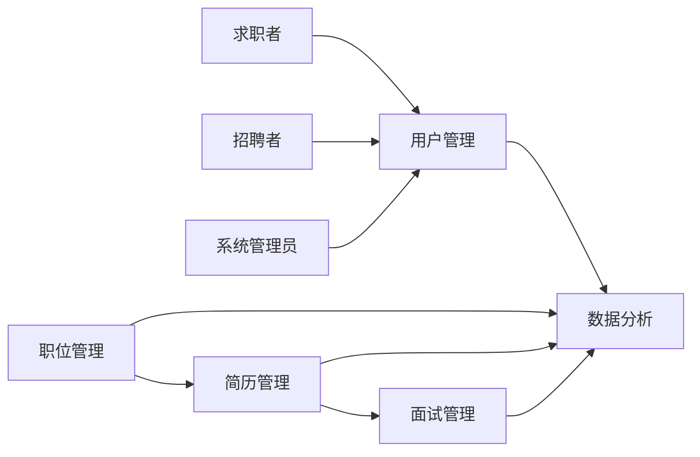

## 1. 背景介绍

### 1.1.  互联网+时代下的招聘求职市场

随着互联网技术的飞速发展，传统的招聘求职模式已经逐渐无法满足现代社会的需求。互联网+时代的到来，为招聘求职市场带来了新的机遇和挑战。网络招聘平台的出现，打破了时间和地域的限制，为求职者提供了更广阔的求职空间，同时也为企业提供了更便捷高效的招聘渠道。

### 1.2.  传统招聘模式的痛点

传统招聘模式存在着诸多痛点，例如：

* 信息不对称：求职者难以获取全面的企业信息，企业也难以找到合适的求职者。
* 效率低下：招聘流程繁琐，耗费大量时间和精力。
* 成本高昂：发布招聘信息、组织面试等环节都需要投入大量成本。

### 1.3.  智能化求职招聘系统的优势

智能化求职招聘系统利用人工智能、大数据等技术，可以有效解决传统招聘模式的痛点，为求职者和企业带来更优质的体验。其优势主要体现在以下几个方面：

* 精准匹配：通过分析求职者和企业的画像，实现精准匹配，提高招聘效率。
* 个性化推荐：根据求职者的偏好，推荐合适的职位，提升求职成功率。
* 流程自动化：简化招聘流程，降低招聘成本。
* 数据分析：提供数据分析功能，帮助企业了解招聘市场趋势，优化招聘策略。

## 2. 核心概念与联系

### 2.1. 用户角色

求职与招聘系统主要涉及以下用户角色：

* **求职者:**  寻找工作机会的个人。
* **招聘者:**  发布职位信息的企业或组织。
* **系统管理员:**  负责系统的维护和管理。

### 2.2. 核心功能模块

求职与招聘系统的核心功能模块包括：

* **用户管理:**  包括用户注册、登录、信息管理等功能。
* **职位管理:**  包括职位发布、职位搜索、职位推荐等功能。
* **简历管理:**  包括简历创建、简历投递、简历筛选等功能。
* **面试管理:**  包括面试邀请、面试安排、面试结果反馈等功能。
* **数据分析:**  提供数据分析功能，帮助企业了解招聘市场趋势，优化招聘策略。

### 2.3. 核心概念联系

下图展示了求职与招聘系统核心概念之间的联系：



## 3. 核心算法原理具体操作步骤

### 3.1.  职位与人才的精准匹配算法

#### 3.1.1 基于内容的推荐算法

基于内容的推荐算法，主要根据职位描述和求职者简历中的关键词进行匹配。

1. **文本预处理:** 对职位描述和求职者简历进行分词、去除停用词等操作。
2. **关键词提取:**  利用TF-IDF算法提取职位描述和求职者简历中的关键词。
3. **相似度计算:**  计算职位描述和求职者简历的关键词向量之间的相似度，例如余弦相似度。
4. **排序推荐:**  根据相似度得分对职位进行排序，推荐给求职者。

#### 3.1.2. 基于协同过滤的推荐算法

基于协同过滤的推荐算法，主要根据求职者的历史行为和偏好进行推荐。

1. **用户行为数据收集:**  收集求职者的浏览记录、简历投递记录、职位收藏记录等行为数据。
2. **用户相似度计算:**  计算用户之间的相似度，例如皮尔逊相关系数。
3. **职位推荐:**  根据用户相似度，推荐其他用户感兴趣的职位。

### 3.2.  简历质量评估算法

#### 3.2.1. 基于规则的评估算法

基于规则的评估算法，根据预先设定的规则对简历进行评分。

1. **规则定义:**  定义一系列评估规则，例如工作经验、教育背景、技能证书等。
2. **规则匹配:**  根据规则对简历进行匹配，计算得分。
3. **综合评分:**  根据各项规则的得分，计算简历的综合评分。

#### 3.2.2.  基于机器学习的评估算法

基于机器学习的评估算法，利用机器学习模型对简历进行评分。

1. **数据准备:**  收集大量的简历数据，并进行标注，例如优秀、良好、一般、差等。
2. **模型训练:**  利用机器学习算法，例如支持向量机、随机森林等，训练简历评估模型。
3. **模型预测:**  利用训练好的模型，对新的简历进行评分。

## 4. 数学模型和公式详细讲解举例说明

### 4.1. TF-IDF算法

TF-IDF（Term Frequency-Inverse Document Frequency）是一种用于信息检索与数据挖掘的常用加权技术。它是一种统计方法，用以评估一字词对于一个文件集或一个语料库中的其中一份文件的重要程度。字词的重要性随着它在文件中出现的次数成正比增加，但同时会随着它在语料库中出现的频率成反比下降。

**TF:** 词频 (Term Frequency)，是指词语在文档中出现的频率。

**IDF:** 逆文档频率 (Inverse Document Frequency)，是指一个词语在文档集中出现的频率的倒数。

**TF-IDF:**  TF-IDF = TF * IDF

**公式：**
$$
TF-IDF(t,d) = TF(t,d) * IDF(t)
$$

**其中：**

*  $t$ 表示词语
*  $d$ 表示文档
*  $TF(t,d)$ 表示词语 $t$ 在文档 $d$ 中出现的频率
*  $IDF(t)$ 表示词语 $t$ 的逆文档频率，计算公式如下：

$$
IDF(t) = \log{\frac{N}{df(t)}}
$$

**其中：**

*  $N$ 表示文档集中的文档总数
*  $df(t)$ 表示包含词语 $t$ 的文档数量

**举例说明：**

假设有一个文档集，包含以下三个文档：

* 文档1: "我喜欢苹果"
* 文档2: "我喜欢香蕉"
* 文档3: "我讨厌苹果"

现在要计算词语 "苹果" 在文档1中的 TF-IDF 值。

**计算步骤：**

1. 计算词语 "苹果" 在文档1中的词频 TF：
   ```
   TF("苹果", 文档1) = 1/3
   ```

2. 计算词语 "苹果" 的逆文档频率 IDF：
   ```
   IDF("苹果") = log(3/2)
   ```

3. 计算词语 "苹果" 在文档1中的 TF-IDF 值：
   ```
   TF-IDF("苹果", 文档1) = TF("苹果", 文档1) * IDF("苹果") = (1/3) * log(3/2)
   ```

### 4.2.  余弦相似度

余弦相似度是通过计算两个向量的夹角余弦值来评估他们的相似度。余弦值的范围在 -1 到 1 之间，值越接近 1，说明两个向量越相似，值越接近 -1，说明两个向量越不相似。

**公式：**
$$
similarity = cos(\theta) = \frac{\overrightarrow{A} \cdot \overrightarrow{B}}{||\overrightarrow{A}|| \times ||\overrightarrow{B}||}
$$

**其中：**

*  $\overrightarrow{A}$ 和 $\overrightarrow{B}$ 表示两个向量
*  $\cdot$ 表示向量的点积
*  $||\overrightarrow{A}||$ 和 $||\overrightarrow{B}||$ 表示向量的模

**举例说明：**

假设有两个向量：

* 向量 A: [1, 2, 3]
* 向量 B: [4, 5, 6]

计算向量 A 和向量 B 的余弦相似度。

**计算步骤：**

1. 计算向量 A 和向量 B 的点积：
   ```
   A · B = 1 * 4 + 2 * 5 + 3 * 6 = 32
   ```

2. 计算向量 A 的模：
   ```
   ||A|| = sqrt(1^2 + 2^2 + 3^2) = sqrt(14)
   ```

3. 计算向量 B 的模：
   ```
   ||B|| = sqrt(4^2 + 5^2 + 6^2) = sqrt(77)
   ```

4. 计算向量 A 和向量 B 的余弦相似度：
   ```
   similarity = cos(theta) = 32 / (sqrt(14) * sqrt(77)) ≈ 0.97
   ```

## 5. 项目实践：代码实例和详细解释说明

### 5.1.  技术选型

* **后端:** Python + Django
* **数据库:** MySQL
* **前端:** HTML + CSS + JavaScript
* **搜索引擎:** Elasticsearch

### 5.2.  数据库设计

#### 5.2.1.  用户表

| 字段名 | 数据类型 | 说明 |
|---|---|---|
| id | int | 用户ID，主键 |
| username | varchar(255) | 用户名 |
| password | varchar(255) | 密码 |
| email | varchar(255) | 邮箱 |
| role | int | 角色，0：求职者，1：招聘者，2：管理员 |

#### 5.2.2.  职位表

| 字段名 | 数据类型 | 说明 |
|---|---|---|
| id | int | 职位ID，主键 |
| title | varchar(255) | 职位名称 |
| company | varchar(255) | 公司名称 |
| location | varchar(255) | 工作地点 |
| salary | varchar(255) | 薪资范围 |
| description | text | 职位描述 |

#### 5.2.3.  简历表

| 字段名 | 数据类型 | 说明 |
|---|---|---|
| id | int | 简历ID，主键 |
| user_id | int | 用户ID，外键 |
| name | varchar(255) | 姓名 |
| email | varchar(255) | 邮箱 |
| phone | varchar(255) | 电话 |
| experience | text | 工作经验 |
| education | text | 教育背景 |
| skills | text | 技能 |

### 5.3.  核心代码实现

#### 5.3.1.  用户注册

```python
def register(request):
    if request.method == 'POST':
        form = UserRegistrationForm(request.POST)
        if form.is_valid():
            form.save()
            return redirect('login')
    else:
        form = UserRegistrationForm()
    return render(request, 'register.html', {'form': form})
```

#### 5.3.2.  职位发布

```python
def post_job(request):
    if request.method == 'POST':
        form = JobPostingForm(request.POST)
        if form.is_valid():
            form.save()
            return redirect('jobs')
    else:
        form = JobPostingForm()
    return render(request, 'post_job.html', {'form': form})
```

#### 5.3.3.  职位搜索

```python
def search_jobs(request):
    query = request.GET.get('q')
    if query:
        results = Elasticsearch().search(
            index='jobs',
            body={
                'query': {
                    'multi_match': {
                        'query': query,
                        'fields': ['title', 'company', 'location', 'description']
                    }
                }
            }
        )
        jobs = [hit['_source'] for hit in results['hits']['hits']]
    else:
        jobs = Job.objects.all()
    return render(request, 'jobs.html', {'jobs': jobs})
```

## 6. 实际应用场景

* **大型企业招聘:**  帮助大型企业快速筛选简历，提高招聘效率。
* **猎头公司:**  帮助猎头公司精准匹配人才，提高推荐成功率。
* **人才市场:**  为人才市场提供在线招聘服务，扩大服务范围。
* **高校毕业生招聘:**  帮助高校毕业生快速找到合适的工作。

## 7. 总结：未来发展趋势与挑战

### 7.1.  未来发展趋势

* **更加智能化:**  利用人工智能技术，实现更加精准的职位匹配、简历评估和面试安排。
* **更加个性化:**  根据求职者的偏好，提供更加个性化的求职服务。
* **更加数据化:**  利用大数据技术，分析招聘市场趋势，提供更加科学的招聘决策支持。

### 7.2.  挑战

* **数据安全:**  保护用户隐私数据安全。
* **算法公平性:**  确保算法的公平性，避免歧视。
* **用户体验:**  不断提升用户体验，提高用户满意度。

## 8. 附录：常见问题与解答

### 8.1.  如何注册账号？

点击网站首页的 "注册" 按钮，填写注册表单即可。

### 8.2.  如何发布职位？

登录账号后，点击 "发布职位" 按钮，填写职位信息即可。

### 8.3.  如何搜索职位？

在网站首页的搜索框中输入关键词，点击 "搜索" 按钮即可。

### 8.4.  如何修改简历？

登录账号后，点击 "我的简历"，进入简历编辑页面即可修改简历。
