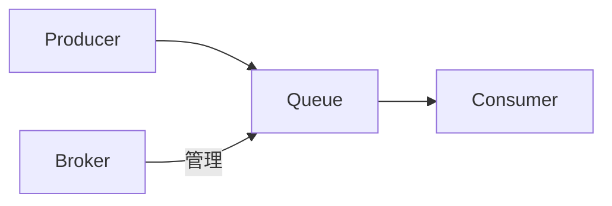

## 1. 背景介绍

### 1.1  分布式系统带来的挑战

随着互联网的快速发展，软件系统越来越复杂，单体架构已经无法满足日益增长的业务需求。分布式系统应运而生，它将复杂的业务拆分成多个独立的服务，各个服务之间通过网络进行通信，协同完成整体功能。

然而，分布式系统也带来了新的挑战，例如：

* **服务间通信的可靠性：** 网络波动、服务宕机等问题都可能导致消息丢失或延迟。
* **服务间耦合度高：** 服务之间直接调用，任何一方的变更都可能影响其他服务，降低系统稳定性。
* **数据一致性问题：** 分布式系统中，数据分散在不同的服务节点上，保证数据一致性是一个难题。

### 1.2 消息队列的引入

为了解决上述问题，消息队列（Message Queue）应运而生。消息队列是一种异步通信机制，它允许不同的服务之间通过发送和接收消息进行通信，而无需直接调用彼此。

消息队列的引入带来了以下优势：

* **解耦：**  消息队列将发送方和接收方解耦，发送方无需关心接收方的状态，接收方也无需等待发送方完成操作。
* **可靠性：** 消息队列可以持久化消息，保证消息不会丢失，即使接收方暂时不可用，消息也会被保存，直到被接收。
* **异步通信：** 发送方无需等待接收方处理完消息，可以继续执行其他操作，提高系统吞吐量。

### 1.3 消息队列的应用场景

消息队列广泛应用于各种分布式系统中，例如：

* **电商平台：** 订单处理、库存更新、物流跟踪等。
* **社交平台：** 消息通知、好友动态、点赞评论等。
* **金融系统：** 交易处理、支付结算、风险控制等。
* **物联网平台：** 数据采集、设备控制、实时监控等。

## 2. 核心概念与联系

### 2.1 消息（Message）

消息是消息队列中最基本的概念，它包含了需要传递的信息。消息可以是任何格式的数据，例如文本、JSON、XML等。

### 2.2 队列（Queue）

队列是一种先进先出（FIFO）的数据结构，用于存储消息。发送方将消息发送到队列中，接收方从队列中获取消息。

### 2.3 生产者（Producer）

生产者是消息的发送方，它负责创建消息并将消息发送到队列中。

### 2.4 消费者（Consumer）

消费者是消息的接收方，它负责从队列中获取消息并进行处理。

### 2.5 消息代理（Broker）

消息代理是消息队列的核心组件，它负责管理队列、存储消息、路由消息等。常见的开源消息代理有RabbitMQ、Kafka、RocketMQ等。

### 2.6 核心概念关系图



## 3. 核心算法原理具体操作步骤

### 3.1 消息发送

1. 生产者创建消息。
2. 生产者将消息发送到消息代理。
3. 消息代理将消息存储到指定的队列中。

### 3.2 消息接收

1. 消费者连接到消息代理。
2. 消费者订阅指定的队列。
3. 消息代理将队列中的消息推送给消费者。
4. 消费者接收消息并进行处理。

### 3.3 消息确认

1. 消费者处理完消息后，向消息代理发送确认消息。
2. 消息代理收到确认消息后，将消息从队列中删除。

## 4. 数学模型和公式详细讲解举例说明

消息队列的性能指标可以用一些数学模型和公式来描述，例如：

* **吞吐量（Throughput）：** 单位时间内处理的消息数量。
* **延迟（Latency）：** 消息从发送到被接收并处理完成的时间间隔。
* **可用性（Availability）：** 消息队列正常工作的时间比例。

### 4.1 吞吐量计算

假设消息队列的吞吐量为 $T$，消息平均大小为 $S$，消息发送频率为 $F$，则：

$$T = F \times S$$

### 4.2 延迟计算

消息队列的延迟通常由以下几个部分组成：

* **网络传输时间：** 消息在网络中传输的时间。
* **消息入队时间：** 消息代理将消息存储到队列中的时间。
* **消息出队时间：** 消费者从队列中获取消息的时间。
* **消息处理时间：** 消费者处理消息的时间。

总延迟为以上各个部分之和。

### 4.3 可用性计算

假设消息队列的正常运行时间为 $U$，故障时间为 $D$，则：

$$A = \frac{U}{U + D}$$

## 5. 项目实践：代码实例和详细解释说明

### 5.1 RabbitMQ 代码实例

```python
import pika

# 连接到 RabbitMQ 服务器
connection = pika.BlockingConnection(pika.ConnectionParameters('localhost'))
channel = connection.channel()

# 声明队列
channel.queue_declare(queue='hello')

# 发送消息
channel.basic_publish(exchange='',
                      routing_key='hello',
                      body='Hello World!')
print(" [x] Sent 'Hello World!'")

# 关闭连接
connection.close()
```

**代码解释：**

1.  使用 `pika` 库连接到 RabbitMQ 服务器。
2.  声明一个名为 `hello` 的队列。
3.  使用 `basic_publish` 方法发送消息到 `hello` 队列。
4.  关闭连接。

### 5.2 Kafka 代码实例

```java
import org.apache.kafka.clients.producer.KafkaProducer;
import org.apache.kafka.clients.producer.ProducerRecord;

import java.util.Properties;

public class KafkaProducerExample {

    public static void main(String[] args) {
        // 设置 Kafka 生产者配置
        Properties props = new Properties();
        props.put("bootstrap.servers", "localhost:9092");
        props.put("key.serializer", "org.apache.kafka.common.serialization.StringSerializer");
        props.put("value.serializer", "org.apache.kafka.common.serialization.StringSerializer");

        // 创建 Kafka 生产者
        KafkaProducer<String, String> producer = new KafkaProducer<>(props);

        // 发送消息
        producer.send(new ProducerRecord<>("my-topic", "Hello, Kafka!"));

        // 关闭生产者
        producer.close();
    }
}
```

**代码解释：**

1.  设置 Kafka 生产者配置，包括服务器地址、序列化器等。
2.  创建 Kafka 生产者对象。
3.  使用 `send` 方法发送消息到 `my-topic` 主题。
4.  关闭生产者。

## 6. 实际应用场景

### 6.1 电商平台

在电商平台中，消息队列可以用于处理订单、更新库存、跟踪物流等。

* **订单处理：** 用户下单后，订单信息可以发送到消息队列，由订单处理服务异步处理，避免阻塞用户操作。
* **库存更新：** 当商品售出或退货时，库存信息可以发送到消息队列，由库存管理服务异步更新库存数据，保证数据一致性。
* **物流跟踪：** 物流信息可以发送到消息队列，由物流跟踪服务异步更新物流状态，方便用户实时查看物流信息。

### 6.2 社交平台

在社交平台中，消息队列可以用于发送通知、更新好友动态、处理点赞评论等。

* **消息通知：** 当用户收到新消息、评论或点赞时，通知信息可以发送到消息队列，由通知服务异步推送给用户。
* **好友动态：** 用户发布新的动态时，动态信息可以发送到消息队列，由好友动态服务异步更新好友的时间线。
* **点赞评论：** 用户点赞或评论时，操作信息可以发送到消息队列，由点赞评论服务异步处理，避免阻塞用户操作。

### 6.3 金融系统

在金融系统中，消息队列可以用于处理交易、结算支付、控制风险等。

* **交易处理：** 交易信息可以发送到消息队列，由交易处理服务异步处理，提高交易效率。
* **支付结算：** 支付信息可以发送到消息队列，由支付结算服务异步处理，保证支付安全。
* **风险控制：** 风险事件可以发送到消息队列，由风险控制服务异步处理，及时采取措施控制风险。

## 7. 工具和资源推荐

### 7.1 RabbitMQ

* 官网：https://www.rabbitmq.com/
* 优点：功能强大、易于使用、社区活跃。
* 缺点：性能相对较低。

### 7.2 Kafka

* 官网：https://kafka.apache.org/
* 优点：高吞吐量、低延迟、可扩展性强。
* 缺点：学习曲线较陡峭。

### 7.3 RocketMQ

* 官网：https://rocketmq.apache.org/
* 优点：高性能、高可靠性、支持分布式事务。
* 缺点：社区相对较小。

## 8. 总结：未来发展趋势与挑战

### 8.1 云原生消息队列

随着云计算的普及，云原生消息队列逐渐成为主流。云原生消息队列提供更便捷的部署、更高的可扩展性和更低的成本。

### 8.2 Serverless 消息队列

Serverless 消息队列无需用户管理服务器，可以根据需求自动扩展，进一步降低成本和运维负担。

### 8.3 流处理与消息队列融合

流处理平台可以与消息队列集成，实现实时数据分析和处理，为企业提供更强大的数据处理能力。

### 8.4 人工智能与消息队列结合

人工智能技术可以应用于消息队列，例如智能路由、异常检测等，提高消息队列的效率和可靠性。

## 9. 附录：常见问题与解答

### 9.1 如何选择合适的消息队列？

选择消息队列需要考虑以下因素：

* **性能需求：** 不同的消息队列性能差异很大，需要根据实际需求选择合适的队列。
* **功能需求：** 不同的消息队列提供不同的功能，例如消息持久化、事务支持等，需要根据实际需求选择合适的队列。
* **成本：** 不同的消息队列成本差异很大，需要根据预算选择合适的队列。

### 9.2 如何保证消息的可靠性？

可以通过以下措施提高消息的可靠性：

* **消息持久化：** 将消息存储到磁盘，即使消息代理宕机，消息也不会丢失。
* **消息确认机制：** 消费者处理完消息后，向消息代理发送确认消息，消息代理收到确认消息后，才将消息从队列中删除。
* **消息重试机制：** 如果消费者处理消息失败，消息队列可以将消息重新发送给消费者，直到消息被成功处理。

### 9.3 如何提高消息队列的性能？

可以通过以下措施提高消息队列的性能：

* **优化消息大小：** 尽量减少消息的大小，可以降低网络传输时间和消息入队时间。
* **增加消费者数量：** 增加消费者数量可以提高消息的并行处理能力，提高吞吐量。
* **优化消息代理配置：** 调整消息代理的配置参数，例如内存大小、队列数量等，可以优化消息队列的性能。
