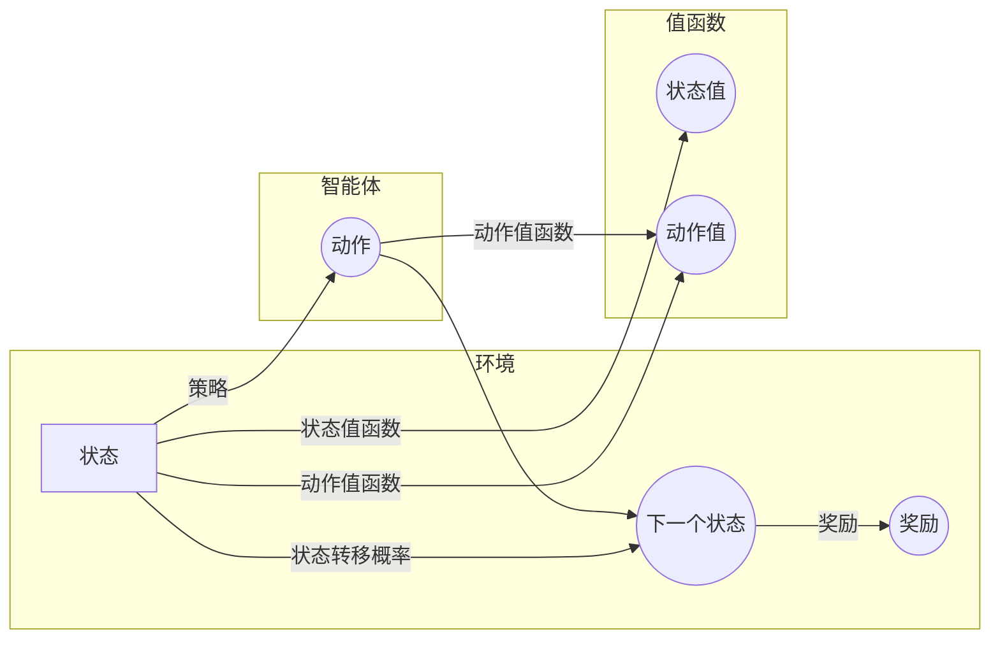

##  深入探讨强化学习中的马尔可夫决策过程

作者：禅与计算机程序设计艺术

## 1. 背景介绍

### 1.1 强化学习的崛起

近年来，人工智能领域取得了令人瞩目的进步，其中强化学习（Reinforcement Learning, RL）作为一种重要的机器学习方法，在游戏、机器人控制、推荐系统等领域展现出巨大潜力。不同于传统的监督学习需要大量标注数据，强化学习通过智能体与环境的交互，从试错中学习最优策略，更接近人类学习方式。

### 1.2 马尔可夫决策过程：强化学习的基石

马尔可夫决策过程（Markov Decision Process, MDP）为强化学习提供了简洁而强大的数学框架，用于描述智能体在环境中进行决策的过程。理解 MDP 是掌握强化学习算法的关键。

### 1.3 本文目标

本文旨在深入浅出地介绍强化学习中的马尔可夫决策过程，涵盖其核心概念、算法原理、代码实例以及实际应用场景，帮助读者建立对 MDP 的全面认识。

## 2. 核心概念与联系

### 2.1 状态 (State)

状态是描述环境在某一时刻的完整信息，例如在 Atari 游戏中，状态可以是当前游戏画面像素值的集合。

### 2.2 动作 (Action)

动作是智能体在某个状态下可以采取的操作，例如在 Atari 游戏中，动作可以是上下左右移动或开火等。

### 2.3 状态转移概率 (State Transition Probability)

状态转移概率表示在当前状态下采取某个动作后，环境转移到下一个状态的概率。

### 2.4 奖励 (Reward)

奖励是环境对智能体在某个状态下采取某个动作的即时反馈，例如在 Atari 游戏中，吃到豆子会获得正奖励，撞到鬼魂会获得负奖励。

### 2.5 策略 (Policy)

策略是智能体根据当前状态选择动作的函数，通常用 $\pi$ 表示。

### 2.6 值函数 (Value Function)

值函数用于评估在某个状态下采取某种策略的长期收益，包括状态值函数 $V^\pi(s)$ 和动作值函数 $Q^\pi(s, a)$。

### 2.7 关系图

下面使用 Mermaid 流程图展示 MDP 中各核心概念之间的联系：



## 3. 核心算法原理具体操作步骤

### 3.1 贝尔曼方程 (Bellman Equation)

贝尔曼方程是 MDP 理论的核心，它将当前状态的值函数与其后续状态的值函数联系起来，为求解最优策略提供了基础。

#### 3.1.1 状态值函数的贝尔曼方程

$$
V^\pi(s) = \sum_{a \in A} \pi(a|s) \sum_{s' \in S} P(s'|s, a) [R(s, a, s') + \gamma V^\pi(s')]
$$

其中：

* $V^\pi(s)$ 表示在状态 $s$ 下遵循策略 $\pi$ 的状态值函数。
* $\pi(a|s)$ 表示在状态 $s$ 下选择动作 $a$ 的概率。
* $P(s'|s, a)$ 表示在状态 $s$ 下采取动作 $a$ 后转移到状态 $s'$ 的概率。
* $R(s, a, s')$ 表示在状态 $s$ 下采取动作 $a$ 后转移到状态 $s'$ 所获得的奖励。
* $\gamma$ 是折扣因子，用于平衡当前奖励和未来奖励的重要性。

#### 3.1.2 动作值函数的贝尔曼方程

$$
Q^\pi(s, a) = \sum_{s' \in S} P(s'|s, a) [R(s, a, s') + \gamma \sum_{a' \in A} \pi(a'|s') Q^\pi(s', a')]
$$

其中：

* $Q^\pi(s, a)$ 表示在状态 $s$ 下采取动作 $a$ 遵循策略 $\pi$ 的动作值函数。

### 3.2 值迭代 (Value Iteration)

值迭代是一种基于动态规划的算法，用于求解 MDP 的最优策略。

#### 3.2.1 算法流程

1. 初始化所有状态的值函数为 0。
2. 迭代更新所有状态的值函数，直到值函数收敛：
   $$
   V_{k+1}(s) = \max_{a \in A} \sum_{s' \in S} P(s'|s, a) [R(s, a, s') + \gamma V_k(s')]
   $$
3. 根据收敛后的值函数，提取出最优策略：
   $$
   \pi^*(s) = \arg\max_{a \in A} \sum_{s' \in S} P(s'|s, a) [R(s, a, s') + \gamma V^*(s')]
   $$

### 3.3 策略迭代 (Policy Iteration)

策略迭代是另一种求解 MDP 最优策略的算法，它交替进行策略评估和策略改进。

#### 3.3.1 算法流程

1. 初始化一个策略 $\pi$。
2. 迭代进行以下两步操作，直到策略收敛：
   * **策略评估**:  使用当前策略 $\pi$ 计算状态值函数 $V^\pi$。
   * **策略改进**:  根据当前状态值函数 $V^\pi$ 更新策略：
     $$
     \pi'(s) = \arg\max_{a \in A} \sum_{s' \in S} P(s'|s, a) [R(s, a, s') + \gamma V^\pi(s')]
     $$

## 4. 数学模型和公式详细讲解举例说明

### 4.1 学生学习的例子

假设一个学生可以选择 "学习" 或 "玩游戏" 两种动作，其目标是在考试中取得好成绩。我们可以用 MDP 对该问题进行建模：

* **状态**: 学生的知识水平，可以用分数表示，例如 0 分、60 分、80 分、100 分。
* **动作**: "学习" 或 "玩游戏"。
* **状态转移概率**: 
    * 如果选择 "学习"，则学生知识水平有较高概率提升，例如从 60 分提升到 80 分的概率为 0.8，从 80 分提升到 100 分的概率为 0.6。
    * 如果选择 "玩游戏"，则学生知识水平有较低概率提升，例如从 60 分提升到 80 分的概率为 0.2，从 80 分提升到 100 分的概率为 0.1。
* **奖励**: 
    * 如果考试成绩达到 90 分以上，则获得 100 分的奖励。
    * 如果考试成绩在 60 分到 90 分之间，则获得 50 分的奖励。
    * 如果考试成绩低于 60 分，则获得 -50 分的奖励。

### 4.2 贝尔曼方程的应用

假设当前学生的知识水平为 60 分，我们使用贝尔曼方程计算选择 "学习" 的动作值函数：

$$
\begin{aligned}
Q(60, \text{"学习"}) &= 0.8 \times [0 + 0.9 \times V(80)] + 0.2 \times [-50 + 0.9 \times V(60)] \\
&= 0.72 \times V(80) - 10 + 0.18 \times V(60)
\end{aligned}
$$

其中：

* $0.8$ 和 $0.2$ 分别表示选择 "学习" 后学生知识水平提升和保持不变的概率。
* $0$ 和 $-50$ 分别表示选择 "学习" 后学生考试成绩达到 90 分以上和低于 60 分的奖励。
* $0.9$ 是折扣因子。

## 5. 项目实践：代码实例和详细解释说明

### 5.1 使用 Python 实现值迭代算法

```python
import numpy as np

def value_iteration(P, R, gamma=0.9, theta=1e-6):
    """
    值迭代算法

    Args:
        P: 状态转移概率矩阵
        R: 奖励矩阵
        gamma: 折扣因子
        theta: 收敛阈值

    Returns:
        V: 状态值函数
        policy: 最优策略
    """
    num_states = len(P)
    num_actions = len(P[0])
    V = np.zeros(num_states)
    policy = np.zeros(num_states, dtype=int)

    while True:
        delta = 0
        for s in range(num_states):
            v = V[s]
            Q = np.zeros(num_actions)
            for a in range(num_actions):
                for s_prime in range(num_states):
                    Q[a] += P[s, a, s_prime] * (R[s, a, s_prime] + gamma * V[s_prime])
            V[s] = np.max(Q)
            delta = max(delta, abs(v - V[s]))
        if delta < theta:
            break

    for s in range(num_states):
        Q = np.zeros(num_actions)
        for a in range(num_actions):
            for s_prime in range(num_states):
                Q[a] += P[s, a, s_prime] * (R[s, a, s_prime] + gamma * V[s_prime])
        policy[s] = np.argmax(Q)

    return V, policy

# 定义状态转移概率矩阵和奖励矩阵
P = np.array([
    [[0.8, 0.2], [0.1, 0.9]],  # 状态 0 下选择动作 0 和 1 的状态转移概率
    [[0.6, 0.4], [0.2, 0.8]]   # 状态 1 下选择动作 0 和 1 的状态转移概率
])
R = np.array([
    [[0, -50], [0, -50]],  # 状态 0 下选择动作 0 和 1 的奖励
    [[50, 0], [100, 0]]   # 状态 1 下选择动作 0 和 1 的奖励
])

# 使用值迭代算法求解最优策略
V, policy = value_iteration(P, R)

# 打印状态值函数和最优策略
print("状态值函数：", V)
print("最优策略：", policy)
```

### 5.2 代码解释

* `value_iteration` 函数实现了值迭代算法，输入为状态转移概率矩阵 `P`、奖励矩阵 `R`、折扣因子 `gamma` 和收敛阈值 `theta`，输出为状态值函数 `V` 和最优策略 `policy`。
* 代码中首先初始化所有状态的值函数为 0，然后迭代更新所有状态的值函数，直到值函数收敛。
* 在每次迭代中，代码遍历所有状态和动作，计算每个动作的价值，并选择价值最大的动作更新当前状态的值函数。
* 当值函数收敛后，代码根据收敛后的值函数，提取出最优策略。

## 6. 实际应用场景

MDP 在现实世界中有广泛的应用，例如：

* **游戏**:  AlphaGo、AlphaZero 等人工智能程序利用强化学习在围棋、国际象棋等游戏中取得了超越人类水平的成绩。
* **机器人控制**:  强化学习可以用于训练机器人在复杂环境中完成各种任务，例如抓取物体、导航等。
* **推荐系统**:  强化学习可以根据用户的历史行为和偏好，推荐更符合用户兴趣的商品或内容。
* **金融交易**:  强化学习可以用于开发自动交易系统，根据市场行情进行股票、期货等交易。

## 7. 总结：未来发展趋势与挑战

### 7.1 未来发展趋势

* **深度强化学习**:  将深度学习与强化学习相结合，可以处理更高维的状态和动作空间，解决更复杂的任务。
* **多智能体强化学习**:  研究多个智能体在共享环境中协同学习和决策的方法。
* **逆强化学习**:  从专家演示中学习奖励函数，从而推断出专家的目标和意图。

### 7.2 挑战

* **样本效率**:  强化学习通常需要大量的交互数据才能学习到有效的策略，如何提高样本效率是一个重要挑战。
* **泛化能力**:  强化学习模型在训练环境中学习到的策略，在面对新环境时可能无法很好地泛化。
* **安全性**:  强化学习模型的决策过程缺乏透明度，如何保证其安全性是一个重要问题。

## 8. 附录：常见问题与解答

### 8.1 什么是马尔可夫性？

马尔可夫性是指系统的下一个状态只与当前状态有关，而与之前的状态无关。

### 8.2 值迭代和策略迭代有什么区别？

值迭代是直接迭代更新状态值函数，而策略迭代是交替进行策略评估和策略改进。

### 8.3 强化学习有哪些局限性？

强化学习需要大量的交互数据，训练过程耗时，且模型的可解释性较差。
