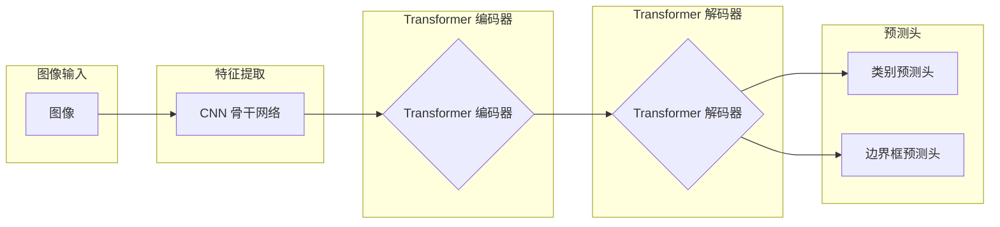

# 深度解析：DETR的目标检测机制

## 1. 背景介绍

### 1.1 目标检测的挑战

目标检测是计算机视觉领域的核心任务之一，其目标是从图像或视频中识别和定位出特定类别的物体。传统的目标检测方法通常依赖于手工设计的特征和复杂的流程，例如滑动窗口、区域建议和非极大值抑制等，这些方法存在以下挑战：

* **手工设计特征的局限性:**  手工设计的特征难以适应目标的多样性和复杂背景。
* **计算复杂度高:** 区域建议和滑动窗口等操作计算量大，难以满足实时性要求。
* **非极大值抑制的后处理步骤:**  非极大值抑制步骤容易引入误检和漏检。

### 1.2  DETR的突破

为了解决上述挑战，Facebook AI Research 在 2020 年提出了 DETR (**DE**tection **TR**ansformer) 模型。DETR 是一种全新的目标检测方法，它将目标检测任务视为一个**集合预测**问题，并利用 Transformer 的强大能力直接预测图像中所有目标的类别和边界框。

DETR 的主要突破在于：

* **摆脱了手工设计的特征和复杂的后处理步骤:** DETR 使用 CNN 提取图像特征，并利用 Transformer 进行全局建模，无需区域建议和非极大值抑制等操作。
* **端到端训练:** DETR 可以进行端到端训练，简化了模型的训练和优化过程。
* **具有竞争力的性能:** DETR 在 COCO 数据集上取得了与 Faster R-CNN 等传统方法相当的性能。

## 2. 核心概念与联系

### 2.1 Transformer

Transformer 是一种基于自注意力机制的深度学习模型，最初应用于自然语言处理领域。与传统的循环神经网络 (RNN) 不同，Transformer 不需要按顺序处理序列数据，而是可以并行处理所有输入，因此具有更高的计算效率。

Transformer 的核心组件是**自注意力机制** (self-attention mechanism)，它可以学习序列数据中不同位置之间的依赖关系。自注意力机制的输入是一个序列，输出是相同长度的序列，其中每个元素都包含了对整个输入序列的加权求和。

### 2.2 集合预测

集合预测是指预测一组无序元素的任务。在目标检测中，图像中目标的数量是不确定的，因此可以将目标检测视为一个集合预测问题。

DETR 使用**二分图匹配** (bipartite matching) 来解决集合预测问题。二分图匹配是指在一个二分图中，找到一个最大的匹配边集，使得匹配的边没有公共顶点。在 DETR 中，二分图的一侧是预测的目标集合，另一侧是 ground-truth 目标集合，通过二分图匹配可以找到预测目标和 ground-truth 目标之间的一一对应关系。

## 3. 核心算法原理具体操作步骤

### 3.1 DETR 模型结构

DETR 模型的结构如下图所示：



DETR 模型主要包含以下几个部分：

* **CNN 骨干网络:** 用于提取图像的特征。
* **Transformer 编码器:**  用于对图像特征进行全局建模。
* **Transformer 解码器:** 用于解码目标的类别和边界框。
* **预测头:** 用于预测目标的类别和边界框。

### 3.2 DETR 工作流程

DETR 的工作流程如下：

1. **特征提取:**  使用 CNN 骨干网络提取输入图像的特征。
2. **Transformer 编码:** 将提取的图像特征输入到 Transformer 编码器中，进行全局建模。
3. **目标查询:** Transformer 解码器接收一组可学习的**目标查询**(object queries) 作为输入。目标查询可以理解为对图像中潜在目标的抽象表示。
4. **Transformer 解码:** Transformer 解码器根据目标查询和编码后的图像特征，预测每个目标的类别和边界框。
5. **二分图匹配:** 使用二分图匹配算法将预测的目标集合与 ground-truth 目标集合进行匹配。
6. **损失计算:** 根据匹配结果计算模型的损失函数，并进行反向传播更新模型参数。

## 4. 数学模型和公式详细讲解举例说明

### 4.1  二分图匹配

DETR 使用匈牙利算法 (Hungarian algorithm) 进行二分图匹配。匈牙利算法是一种组合优化算法，可以在多项式时间内找到二分图的最大匹配。

假设预测的目标集合为 $Y = \{y_1, y_2, ..., y_N\}$，ground-truth 目标集合为 $\hat{Y} = \{\hat{y}_1, \hat{y}_2, ..., \hat{y}_M\}$，其中 $N$ 和 $M$ 分别表示预测目标和 ground-truth 目标的数量。二分图匹配的目标是找到一个排列 $\sigma$，使得预测目标和 ground-truth 目标之间的代价最小：

$$
\hat{\sigma} = \arg\min_{\sigma \in \mathfrak{S}_N} \sum_{i=1}^N \mathcal{L}_{match}(y_i, \hat{y}_{\sigma(i)})
$$

其中 $\mathfrak{S}_N$ 表示所有长度为 $N$ 的排列的集合，$\mathcal{L}_{match}$ 表示预测目标和 ground-truth 目标之间的匹配代价。

### 4.2  损失函数

DETR 的损失函数包含两部分：

* **类别损失:**  使用交叉熵损失函数计算预测类别和 ground-truth 类别之间的差异。
* **边界框损失:** 使用 L1 损失函数计算预测边界框和 ground-truth 边界框之间的差异。

总的损失函数为：

$$
\mathcal{L} = \lambda_{cls} \mathcal{L}_{cls} + \lambda_{box} \mathcal{L}_{box}
$$

其中 $\lambda_{cls}$ 和 $\lambda_{box}$ 分别表示类别损失和边界框损失的权重。

## 5. 项目实践：代码实例和详细解释说明

### 5.1  使用 PyTorch 实现 DETR

以下代码展示了如何使用 PyTorch 实现 DETR 模型：

```python
import torch
from torch import nn
from torchvision.models import resnet50

class DETR(nn.Module):
    def __init__(self, num_classes, hidden_dim=256, nheads=8, num_encoder_layers=6, num_decoder_layers=6):
        super().__init__()

        # CNN 骨干网络
        self.backbone = nn.Sequential(*list(resnet50(pretrained=True).children())[:-2])

        # Transformer 编码器
        encoder_layer = nn.TransformerEncoderLayer(hidden_dim, nheads, hidden_dim * 4, dropout=0.1)
        self.transformer_encoder = nn.TransformerEncoder(encoder_layer, num_encoder_layers)

        # Transformer 解码器
        decoder_layer = nn.TransformerDecoderLayer(hidden_dim, nheads, hidden_dim * 4, dropout=0.1)
        self.transformer_decoder = nn.TransformerDecoder(decoder_layer, num_decoder_layers)

        # 目标查询
        self.query_embed = nn.Embedding(100, hidden_dim)

        # 预测头
        self.class_embed = nn.Linear(hidden_dim, num_classes + 1)
        self.bbox_embed = nn.Linear(hidden_dim, 4)

    def forward(self, x):
        # 特征提取
        features = self.backbone(x)

        # Transformer 编码
        bs, c, h, w = features.shape
        features = features.flatten(2).permute(2, 0, 1)
        memory = self.transformer_encoder(features)

        # 目标查询
        query_input = self.query_embed.weight.unsqueeze(1).repeat(1, bs, 1)

        # Transformer 解码
        hs = self.transformer_decoder(query_input, memory).transpose(0, 1)

        # 预测
        outputs_class = self.class_embed(hs)
        outputs_coord = self.bbox_embed(hs).sigmoid()

        return outputs_class, outputs_coord
```

### 5.2 代码解释

* `__init__` 方法初始化 DETR 模型的各个组件，包括 CNN 骨干网络、Transformer 编码器、Transformer 解码器、目标查询和预测头。
* `forward` 方法定义了 DETR 模型的前向传播过程，包括特征提取、Transformer 编码、目标查询、Transformer 解码和预测。
* `backbone` 属性是一个 `nn.Sequential` 模块，包含了 ResNet-50 模型的前面的所有层，用于提取图像特征。
* `transformer_encoder` 和 `transformer_decoder` 属性分别是 Transformer 编码器和 Transformer 解码器。
* `query_embed` 属性是一个 `nn.Embedding` 模块，用于生成目标查询。
* `class_embed` 和 `bbox_embed` 属性分别是类别预测头和边界框预测头。

## 6. 实际应用场景

DETR 在目标检测领域有着广泛的应用，例如：

* **自动驾驶:**  DETR 可以用于检测道路上的车辆、行人、交通信号灯等目标，为自动驾驶系统提供环境感知能力。
* **机器人视觉:** DETR 可以用于机器人抓取、物体识别等任务，帮助机器人更好地理解和操作周围环境。
* **医学影像分析:**  DETR 可以用于医学影像中的肿瘤检测、病灶分割等任务，辅助医生进行诊断和治疗。
* **安防监控:** DETR 可以用于人脸识别、目标跟踪等任务，提高安防监控系统的智能化水平。

## 7. 工具和资源推荐

以下是一些学习 DETR 的工具和资源：

* **DETR 官方代码库:**  https://github.com/facebookresearch/detr
* **PyTorch 官方文档:**  https://pytorch.org/docs/stable/index.html
* **Transformer 论文:**  https://arxiv.org/abs/1706.03762

## 8. 总结：未来发展趋势与挑战

### 8.1 未来发展趋势

DETR 的出现为目标检测领域带来了新的思路，未来 DETR 的发展趋势包括：

* **模型压缩和加速:**  DETR 模型的计算量较大，未来需要研究如何压缩和加速 DETR 模型，使其能够更好地应用于资源受限的设备。
* **多模态目标检测:**  DETR 可以扩展到多模态目标检测任务，例如结合图像和文本信息进行目标检测。
* **小目标检测:**  DETR 在小目标检测任务上的性能还有待提升，未来需要研究如何改进 DETR 模型以更好地检测小目标。

### 8.2 挑战

DETR 也面临着一些挑战：

* **训练效率:**  DETR 模型的训练效率较低，需要大量的训练数据和计算资源。
* **泛化能力:**  DETR 模型的泛化能力还有待提升，需要进一步提高模型对不同场景和数据的适应能力。

## 9. 附录：常见问题与解答

### 9.1  DETR 与传统目标检测方法相比有哪些优势？

DETR 的优势在于：

* **摆脱了手工设计的特征和复杂的后处理步骤:**  DETR 使用 CNN 提取图像特征，并利用 Transformer 进行全局建模，无需区域建议和非极大值抑制等操作。
* **端到端训练:** DETR 可以进行端到端训练，简化了模型的训练和优化过程。
* **具有竞争力的性能:** DETR 在 COCO 数据集上取得了与 Faster R-CNN 等传统方法相当的性能。

### 9.2  DETR 如何解决目标检测中的集合预测问题？

DETR 使用二分图匹配来解决集合预测问题。二分图匹配是指在一个二分图中，找到一个最大的匹配边集，使得匹配的边没有公共顶点。在 DETR 中，二分图的一侧是预测的目标集合，另一侧是 ground-truth 目标集合，通过二分图匹配可以找到预测目标和 ground-truth 目标之间的一一对应关系。

### 9.3  DETR 的损失函数是什么？

DETR 的损失函数包含两部分：类别损失和边界框损失。类别损失使用交叉熵损失函数计算预测类别和 ground-truth 类别之间的差异。边界框损失使用 L1 损失函数计算预测边界框和 ground-truth 边界框之间的差异。