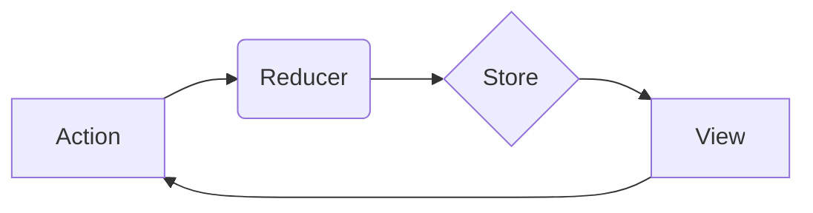

## 1. 背景介绍

### 1.1  从混乱到秩序: 状态管理的必要性

在软件开发，特别是前端开发领域，应用的复杂度不断攀升。用户界面交互越来越丰富，数据流动也日益复杂。如果没有一套有效的机制来管理应用的状态，就会陷入混乱的泥潭：

* **数据一致性难以保障:**  各个组件各自为政，数据散落在各处，难以保证一致性，导致界面显示错误或逻辑混乱。
* **代码难以维护:**  随着应用规模的扩大，状态相关的代码会变得越来越难以维护，牵一发而动全身，修改一个地方可能会引起其他地方的错误。
* **性能问题:**  缺乏高效的状态管理机制，容易导致不必要的渲染和计算，影响应用性能。

为了解决这些问题，状态管理应运而生。它就像一位优秀的管家，将应用的状态井然有序地管理起来，确保应用的稳定性、可维护性和性能。

### 1.2  状态管理的演进: 从全局变量到专用框架

状态管理的发展经历了从简单到复杂的过程：

* **全局变量:**  早期，开发者常常使用全局变量来存储应用的状态。这种方式简单直接，但缺点也很明显，难以维护，容易引发命名冲突，不利于模块化开发。
* **事件总线:**  为了解决全局变量的问题，开发者开始使用事件总线来传递状态变化。这种方式一定程度上提高了代码的可维护性，但仍然不够灵活，难以应对复杂的状态逻辑。
* **专用状态管理框架:**  随着前端应用复杂度的提升，涌现了一批专门的状态管理框架，例如Redux、MobX、Vuex等。这些框架提供了更加完善的状态管理机制，包括状态的存储、更新、监听等，极大地提升了应用的可维护性和性能。

### 1.3  状态管理的核心价值: 可预测性、可维护性和性能

状态管理的核心价值在于：

* **可预测性:**  状态管理框架提供了一套明确的规则来管理状态，使得状态变化变得可预测，更容易理解和调试。
* **可维护性:**  状态管理框架将状态相关的逻辑集中起来，提高了代码的可读性和可维护性，降低了修改代码的风险。
* **性能:**  状态管理框架可以优化状态更新的流程，避免不必要的渲染和计算，提升应用的性能。

## 2. 核心概念与联系

### 2.1  状态: 应用数据的核心

状态是指应用中所有可变的数据，它代表了应用在某个时刻的快照。状态可以是简单的数字、字符串，也可以是复杂的数组、对象，甚至是函数。

### 2.2  动作: 触发状态变化的指令

动作是指用户在应用中执行的操作，例如点击按钮、输入文本、提交表单等。每个动作都会触发一个对应的函数，这个函数负责更新应用的状态。

### 2.3  状态更新函数: 状态变化的执行者

状态更新函数接收当前状态和动作作为参数，根据动作的类型，更新状态并返回新的状态。状态更新函数必须是纯函数，即相同的输入必须产生相同的输出，不能产生副作用。

### 2.4  视图: 状态的可视化呈现

视图是用户界面的可视化呈现，它根据当前状态渲染界面。视图可以是简单的文本、图片，也可以是复杂的表单、图表等。

### 2.5  状态管理框架: 连接各个环节的桥梁

状态管理框架连接了状态、动作、状态更新函数和视图，形成了一个完整的闭环，确保状态的变化能够及时反映到用户界面上。

## 3. 核心算法原理具体操作步骤

### 3.1  Redux: 单一数据源、单向数据流

Redux 是最流行的状态管理框架之一，它遵循以下核心原则：

* **单一数据源:**  整个应用的状态存储在一个 JavaScript 对象中，称为 store。
* **单向数据流:**  状态的变化只能通过 dispatch action 来触发，状态更新函数根据 action 更新状态，并将新的状态返回给 store，store 再通知视图更新。

#### 3.1.1  Redux 工作流程



1. 用户在视图中执行操作，例如点击按钮。
2. 视图触发一个 action，例如 `INCREMENT_COUNTER`。
3. action 被 dispatch 到 store。
4. store 将 action 和当前状态传递给 reducer。
5. reducer 根据 action 的类型更新状态，并返回新的状态。
6. store 用新的状态替换旧的状态。
7. store 通知视图更新。
8. 视图根据新的状态重新渲染界面。

#### 3.1.2  Redux 核心概念

* **Action:**  描述状态变化的对象，包含 type 属性和可选的 payload 属性。
* **Reducer:**  纯函数，接收当前状态和 action 作为参数，根据 action 的类型更新状态，并返回新的状态。
* **Store:**  存储整个应用状态的对象，提供 dispatch、getState、subscribe 等方法。

### 3.2 MobX:  响应式编程、透明的细粒度更新

MobX 是另一个流行的状态管理框架，它采用响应式编程的思想，通过观察者模式实现状态的自动更新。

#### 3.2.1  MobX 工作流程

1. 使用 `observable` 将状态变成可观察的。
2. 使用 `computed` 定义派生状态，派生状态会根据可观察状态的变化自动更新。
3. 使用 `autorun` 或 `reaction` 监听状态的变化，并在状态变化时执行回调函数。

#### 3.2.2  MobX 核心概念

* **Observable:**  使状态变成可观察的，任何对可观察状态的修改都会触发监听器的回调函数。
* **Computed:**  定义派生状态，派生状态的值会根据可观察状态的变化自动更新。
* **Reaction:**  监听状态的变化，并在状态变化时执行回调函数。


## 4. 数学模型和公式详细讲解举例说明

状态管理框架通常不涉及复杂的数学模型和公式，但理解一些基本的数据结构和算法有助于更好地理解状态管理的原理。

### 4.1  状态树:  树形结构组织状态

状态通常以树形结构进行组织，例如：

```
{
  user: {
    name: 'John Doe',
    age: 30,
    address: {
      street: '123 Main Street',
      city: 'Anytown',
      state: 'CA',
      zip: '90210'
    }
  },
  products: [
    {
      id: 1,
      name: 'Product 1',
      price: 10
    },
    {
      id: 2,
      name: 'Product 2',
      price: 20
    }
  ]
}
```

### 4.2  不可变数据结构:  提升性能和可预测性

为了提高性能和可预测性，状态管理框架通常使用不可变数据结构。不可变数据结构是指一旦创建就不能修改的数据结构，任何修改都会返回一个新的数据结构。

例如，使用 immutable.js 库可以创建不可变的 JavaScript 对象和数组：

```
const { Map } = require('immutable');

const state = Map({
  user: Map({
    name: 'John Doe',
    age: 30
  })
});

const newState = state.setIn(['user', 'age'], 31);
```

### 4.3  深拷贝:  避免意外修改状态

在更新状态时，需要进行深拷贝，避免意外修改原始状态。深拷贝是指创建一个新的对象或数组，并将原始对象或数组的所有属性和值复制到新的对象或数组中。

例如，使用 lodash 库可以进行深拷贝：

```
const _ = require('lodash');

const state = {
  user: {
    name: 'John Doe',
    age: 30
  }
};

const newState = _.cloneDeep(state);
newState.user.age = 31;
```

## 5. 项目实践：代码实例和详细解释说明

### 5.1  使用 Redux 实现计数器

```
// src/store.js
import { createStore } from 'redux';

const initialState = {
  count: 0
};

const reducer = (state = initialState, action) => {
  switch (action.type) {
    case 'INCREMENT':
      return { ...state, count: state.count + 1 };
    case 'DECREMENT':
      return { ...state, count: state.count - 1 };
    default:
      return state;
  }
};

const store = createStore(reducer);

export default store;

// src/App.js
import React from 'react';
import { useSelector, useDispatch } from 'react-redux';

const App = () => {
  const count = useSelector(state => state.count);
  const dispatch = useDispatch();

  return (
    <div>
      <h1>Counter: {count}</h1>
      <button onClick={() => dispatch({ type: 'INCREMENT' })}>Increment</button>
      <button onClick={() => dispatch({ type: 'DECREMENT' })}>Decrement</button>
    </div>
  );
};

export default App;
```

### 5.2  使用 MobX 实现购物车

```
// src/store.js
import { makeAutoObservable } from 'mobx';

class CartStore {
  items = [];

  constructor() {
    makeAutoObservable(this);
  }

  addItem(item) {
    this.items.push(item);
  }

  removeItem(id) {
    this.items = this.items.filter(item => item.id !== id);
  }

  get total() {
    return this.items.reduce((sum, item) => sum + item.price, 0);
  }
}

const cartStore = new CartStore();

export default cartStore;

// src/App.js
import React from 'react';
import { observer } from 'mobx-react-lite';
import cartStore from './store';

const App = observer(() => {
  return (
    <div>
      <h1>Shopping Cart</h1>
      <ul>
        {cartStore.items.map(item => (
          <li key={item.id}>
            {item.name} - ${item.price}
            <button onClick={() => cartStore.removeItem(item.id)}>Remove</button>
          </li>
        ))}
      </ul>
      <p>Total: ${cartStore.total}</p>
      <button onClick={() => cartStore.addItem({ id: Date.now(), name: 'New Item', price: 10 })}>
        Add Item
      </button>
    </div>
  );
});

export default App;
```

## 6. 实际应用场景

### 6.1  用户界面交互

状态管理框架可以用于管理用户界面交互，例如：

* 表单输入
* 动画
* 用户认证

### 6.2  数据获取和缓存

状态管理框架可以用于管理数据获取和缓存，例如：

* 从服务器获取数据
* 缓存数据以提高性能

### 6.3  实时数据同步

状态管理框架可以用于管理实时数据同步，例如：

* 聊天应用
* 协作工具

## 7. 工具和资源推荐

### 7.1  Redux

* 文档: https://redux.js.org/
* 工具:
    * Redux DevTools:  浏览器扩展，用于调试 Redux 应用。
    * Redux Toolkit:  官方推荐的 Redux 工具集，简化 Redux 的使用。

### 7.2  MobX

* 文档: https://mobx.js.org/
* 工具:
    * MobX DevTools:  浏览器扩展，用于调试 MobX 应用。

## 8. 总结：未来发展趋势与挑战

### 8.1  更轻量级的状态管理方案

随着前端应用的复杂度不断提升，开发者对更轻量级的状态管理方案的需求越来越强烈。一些新的状态管理框架，例如 Zustand、Recoil 等，应运而生，它们提供了更简洁的 API 和更小的体积，更适合小型项目或特定场景。

### 8.2  更强大的类型安全

随着 TypeScript 的普及，开发者对状态管理框架的类型安全要求越来越高。一些状态管理框架，例如 NgRx、Vuex 等，提供了完善的 TypeScript 支持，可以帮助开发者编写更健壮的代码。

### 8.3  更灵活的状态管理模式

传统的状态管理框架，例如 Redux，遵循单一数据源和单向数据流的原则，这在一些场景下可能会显得过于死板。一些新的状态管理模式，例如原子状态管理、代理状态管理等，提供了更灵活的状态管理方式，可以更好地适应不同的应用场景。

### 8.4  与其他技术的融合

状态管理框架可以与其他技术，例如 GraphQL、WebSockets 等，进行融合，以构建更强大、更灵活的应用。

## 9. 附录：常见问题与解答

### 9.1  状态管理框架的选择

选择状态管理框架需要考虑以下因素：

* 项目规模
* 团队技术栈
* 个人偏好

### 9.2  状态管理的最佳实践

* 保持状态的扁平化
* 使用不可变数据结构
* 编写纯函数的 reducer
* 避免在 action 中执行异步操作

### 9.3  常见错误和解决方案

* 意外修改状态
* 循环依赖
* 性能问题
