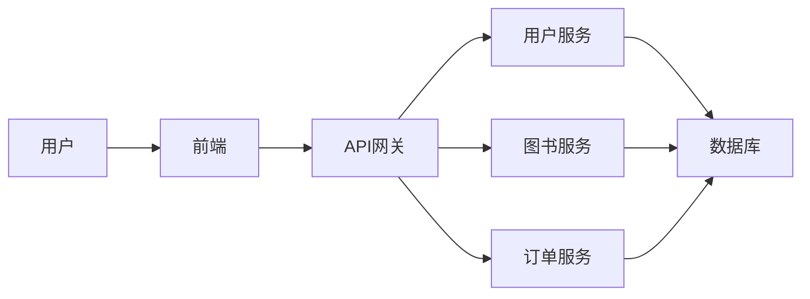

## 1. 背景介绍

### 1.1 电子商务的兴起与发展

近年来，随着互联网技术的飞速发展和普及，电子商务已经成为人们生活中不可或缺的一部分。电子商务打破了传统商业模式的时空限制，为消费者提供了更加便捷、高效的购物体验，同时也为企业带来了更广阔的市场空间和发展机遇。

### 1.2 电子书店行业的现状与挑战

作为电子商务的重要分支，电子书店行业近年来也取得了长足的进步。电子书以其便携性、易存储性、价格优势等特点，越来越受到广大读者的青睐。然而，电子书店行业也面临着一些挑战，例如：

* **版权保护问题:** 电子书易于复制和传播，版权保护成为行业发展的重要难题。
* **用户体验问题:** 电子书阅读体验与纸质书籍存在一定差距，如何提升用户阅读体验是电子书店需要解决的问题。
* **市场竞争激烈:** 随着越来越多的企业进入电子书店市场，行业竞争日益激烈，电子书店需要不断创新才能保持竞争优势。

### 1.3 电子书店管理系统的意义

为了应对上述挑战，提高运营效率和用户满意度，开发一套功能完善、性能稳定、安全可靠的电子书店管理系统显得尤为重要。电子书店管理系统可以帮助电子书店实现以下目标：

* **提高管理效率:** 自动化处理订单、库存、支付等业务流程，降低人工成本，提高管理效率。
* **提升用户体验:** 提供便捷的图书搜索、在线阅读、个性化推荐等功能，提升用户阅读体验。
* **加强版权保护:**  采用数字版权管理技术，有效保护电子书版权。
* **增强数据分析能力:** 收集和分析用户数据，为经营决策提供数据支持。


## 2. 核心概念与联系

### 2.1 系统架构设计

本电子书店管理系统采用前后端分离的架构设计，前端负责用户界面展示和交互逻辑，后端负责业务逻辑处理和数据存储。前后端通过 API 进行数据交互。



### 2.2 功能模块划分

本系统主要包括以下功能模块：

* **用户模块:**  用户注册、登录、个人信息管理、图书收藏、阅读历史等功能。
* **图书模块:**  图书信息管理、分类管理、标签管理、搜索功能、评论功能等。
* **订单模块:**  购物车功能、下单功能、支付功能、订单查询、退款功能等。
* **后台管理模块:**  用户管理、图书管理、订单管理、数据统计等功能。

### 2.3 数据库设计

本系统采用关系型数据库 MySQL 存储数据，主要数据表包括：

* **用户表:** 存储用户信息，包括用户名、密码、邮箱、昵称、头像等。
* **图书表:** 存储图书信息，包括书名、作者、出版社、出版日期、价格、简介、封面图片等。
* **订单表:** 存储订单信息，包括订单编号、用户 ID、图书 ID、购买数量、订单状态、支付方式、支付金额等。
* **评论表:** 存储用户对图书的评论信息，包括评论内容、评分、评论时间等。


## 3. 核心算法原理具体操作步骤

### 3.1 图书推荐算法

本系统采用基于用户协同过滤的图书推荐算法，具体操作步骤如下：

1. **收集用户数据:**  收集用户的图书浏览历史、购买记录、评分记录等数据。
2. **构建用户-图书评分矩阵:**  将用户和图书作为矩阵的行和列，矩阵中的元素表示用户对图书的评分。
3. **计算用户相似度:**  使用余弦相似度等算法计算用户之间的相似度。
4. **生成推荐列表:**  根据目标用户的评分记录和与其他用户的相似度，预测目标用户对未评分图书的评分，并推荐评分最高的图书。

### 3.2 搜索引擎

本系统采用 Elasticsearch 作为搜索引擎，实现图书的快速检索。具体操作步骤如下：

1. **数据导入:**  将图书数据导入 Elasticsearch 索引库。
2. **分词处理:**  对图书标题、作者、出版社等字段进行分词处理，提高搜索精度。
3. **搜索查询:**  用户输入搜索关键词后，Elasticsearch 根据分词结果进行匹配，返回相关图书列表。

### 3.3 支付系统

本系统接入支付宝和微信支付，用户可以选择自己喜欢的支付方式进行支付。具体操作步骤如下：

1. **生成订单:**  用户选择图书并下单后，系统生成订单信息。
2. **调用支付接口:**  系统根据用户选择的支付方式，调用支付宝或微信支付接口，跳转到支付页面。
3. **支付成功:**  用户完成支付后，支付平台会通知系统支付结果。
4. **更新订单状态:**  系统根据支付结果更新订单状态，并通知用户支付结果。


## 4. 数学模型和公式详细讲解举例说明

### 4.1 余弦相似度

余弦相似度是一种常用的计算两个向量之间相似度的算法，其计算公式如下：

$$
similarity(A,B) = \frac{A \cdot B}{||A|| \times ||B||} = \frac{\sum_{i=1}^{n}A_i \times B_i}{\sqrt{\sum_{i=1}^{n}A_i^2} \times \sqrt{\sum_{i=1}^{n}B_i^2}}
$$

其中，$A$ 和 $B$ 表示两个向量，$n$ 表示向量的维度，$A_i$ 和 $B_i$ 表示向量 $A$ 和 $B$ 在第 $i$ 维的值。

**举例说明:**

假设有两个用户 A 和 B，他们对三本书的评分如下：

| 用户 | 图书 1 | 图书 2 | 图书 3 |
|---|---|---|---|
| A | 5 | 3 | 4 |
| B | 4 | 2 | 3 |

则用户 A 和 B 的评分向量分别为：

$$
A = (5, 3, 4)
$$

$$
B = (4, 2, 3)
$$

根据余弦相似度公式，可以计算用户 A 和 B 的相似度：

$$
similarity(A,B) = \frac{5 \times 4 + 3 \times 2 + 4 \times 3}{\sqrt{5^2 + 3^2 + 4^2} \times \sqrt{4^2 + 2^2 + 3^2}} \approx 0.98
$$

### 4.2 TF-IDF 算法

TF-IDF 算法是一种常用的文本关键词提取算法，其计算公式如下：

$$
TF-IDF(t,d) = TF(t,d) \times IDF(t)
$$

其中，$t$ 表示关键词，$d$ 表示文档，$TF(t,d)$ 表示关键词 $t$ 在文档 $d$ 中出现的频率，$IDF(t)$ 表示关键词 $t$ 的逆文档频率，计算公式如下：

$$
IDF(t) = log\frac{N}{df(t)}
$$

其中，$N$ 表示文档总数，$df(t)$ 表示包含关键词 $t$ 的文档数。

**举例说明:**

假设有一个文档集合，包含以下三个文档：

* 文档 1: 电子书店管理系统设计
* 文档 2: 电子书店系统开发
* 文档 3: 图书推荐算法研究

现在要提取文档 1 的关键词，可以先计算每个词的 TF-IDF 值：

| 词语 | TF | DF | IDF | TF-IDF |
|---|---|---|---|---|
| 电子书店 | 1/4 | 2 | 0.405 | 0.101 |
| 管理 | 1/4 | 1 | 1.099 | 0.275 |
| 系统 | 1/4 | 2 | 0.405 | 0.101 |
| 设计 | 1/4 | 1 | 1.099 | 0.275 |
| 开发 | 0 | 1 | 1.099 | 0 |
| 算法 | 0 | 1 | 1.099 | 0 |
| 研究 | 0 | 1 | 1.099 | 0 |

根据 TF-IDF 值，可以提取文档 1 的关键词为：管理、设计。


## 5. 项目实践：代码实例和详细解释说明

### 5.1 用户注册功能

**代码实例:**

```python
from flask import Blueprint, request, jsonify
from werkzeug.security import generate_password_hash

from app import db
from app.models import User

user_bp = Blueprint('user', __name__)

@user_bp.route('/register', methods=['POST'])
def register():
    """用户注册"""
    data = request.get_json()
    username = data.get('username')
    password = data.get('password')
    email = data.get('email')

    if not all([username, password, email]):
        return jsonify({'code': 400, 'msg': '参数不完整'})

    if User.query.filter_by(username=username).first():
        return jsonify({'code': 400, 'msg': '用户名已存在'})

    if User.query.filter_by(email=email).first():
        return jsonify({'code': 400, 'msg': '邮箱已注册'})

    user = User(
        username=username,
        password=generate_password_hash(password),
        email=email
    )
    db.session.add(user)
    db.session.commit()

    return jsonify({'code': 200, 'msg': '注册成功'})
```

**代码解释:**

* 使用 Flask 框架创建用户蓝图。
* 使用 `@user_bp.route('/register', methods=['POST'])` 装饰器定义用户注册路由。
* 使用 `request.get_json()` 获取请求参数。
* 验证参数是否完整。
* 判断用户名和邮箱是否已存在。
* 使用 `generate_password_hash()` 函数对密码进行加密。
* 创建用户对象，并将其添加到数据库中。
* 返回注册成功信息。

### 5.2 图书搜索功能

**代码实例:**

```python
from flask import Blueprint, request, jsonify

from app import es
from app.models import Book

book_bp = Blueprint('book', __name__)

@book_bp.route('/search', methods=['GET'])
def search():
    """图书搜索"""
    keyword = request.args.get('keyword')

    if not keyword:
        return jsonify({'code': 400, 'msg': '请输入搜索关键词'})

    body = {
        "query": {
            "multi_match": {
                "query": keyword,
                "fields": ["title", "author", "publisher"]
            }
        }
    }
    res = es.search(index="books", body=body)
    hits = res['hits']['hits']
    books = []
    for hit in hits:
        book = Book.query.get(hit['_id'])
        books.append({
            'id': book.id,
            'title': book.title,
            'author': book.author,
            'publisher': book.publisher,
            'cover_img': book.cover_img
        })

    return jsonify({'code': 200, 'msg': '搜索成功', 'data': books})
```

**代码解释:**

* 使用 Flask 框架创建图书蓝图。
* 使用 `@book_bp.route('/search', methods=['GET'])` 装饰器定义图书搜索路由。
* 使用 `request.args.get('keyword')` 获取搜索关键词。
* 构造 Elasticsearch 搜索请求体。
* 使用 `es.search()` 方法执行搜索请求。
* 遍历搜索结果，获取图书信息。
* 返回搜索结果。


## 6. 实际应用场景

### 6.1 在线教育平台

在线教育平台可以利用电子书店管理系统，为学生提供在线教材、课外读物等学习资源，方便学生在线学习。

### 6.2 企业内部知识库

企业可以利用电子书店管理系统，构建企业内部知识库，方便员工查阅相关资料，提高工作效率。

### 6.3 个人博客

个人博客可以利用电子书店管理系统，搭建个人电子书销售平台，实现知识变现。


## 7. 总结：未来发展趋势与挑战

### 7.1 未来发展趋势

* **个性化推荐:**  随着人工智能技术的不断发展，电子书店管理系统将更加智能化，可以根据用户的阅读习惯和兴趣爱好，推荐更加精准的图书。
* **社交化阅读:**  电子书店管理系统将融入更多社交元素，用户可以在线交流读书心得，分享阅读体验。
* **版权保护技术:**  随着区块链等新技术的应用，电子书版权保护技术将更加完善，有效打击盗版行为。

### 7.2 面临的挑战

* **技术更新迭代快:**  电子商务技术发展迅速，电子书店管理系统需要不断更新迭代才能保持竞争力。
* **用户需求多样化:**  不同用户的阅读需求和习惯差异较大，电子书店管理系统需要满足不同用户的个性化需求。
* **市场竞争激烈:**  电子书店行业竞争激烈，电子书店管理系统需要不断创新才能脱颖而出。


## 8. 附录：常见问题与解答

### 8.1 如何解决电子书版权保护问题？

**答:** 可以采用数字版权管理技术（DRM），对电子书进行加密保护，限制用户的复制和传播行为。

### 8.2 如何提高电子书阅读体验？

**答:** 可以提供多种阅读模式、字体大小调整、夜间模式等功能，优化电子书阅读界面，提升用户阅读体验。

### 8.3 如何选择合适的电子书店管理系统？

**答:** 需要根据自身需求和预算，选择功能完善、性能稳定、安全可靠的电子书店管理系统。
