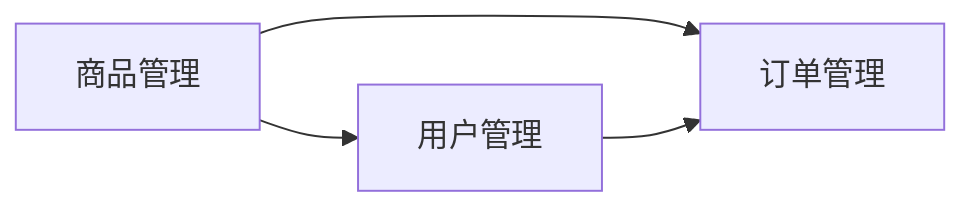

# 电子商务网站设计系统详细设计与具体代码实现

作者：禅与计算机程序设计艺术

## 1. 背景介绍

### 1.1 电子商务的兴起与发展

近年来，随着互联网技术的飞速发展和普及，电子商务已经成为人们生活中不可或缺的一部分。从最初的简单的在线购物平台，到如今涵盖了商品展示、在线交易、物流配送、售后服务等各个环节的完整生态系统，电子商务正以前所未有的速度改变着人们的消费习惯和生活方式。

### 1.2 电子商务网站设计的重要性

在电子商务蓬勃发展的背景下，一个设计精良、功能完善的电子商务网站对于企业的成功至关重要。它不仅是企业展示产品和服务的窗口，更是连接企业与消费者之间的桥梁。一个优秀的电子商务网站设计，应该具备以下特点：

* **用户体验友好:** 网站界面简洁清晰，操作流程简单流畅，用户可以轻松找到所需信息并完成购物流程。
* **功能完善:** 网站应提供商品浏览、搜索、购物车、在线支付、订单查询、物流跟踪、售后服务等基本功能，满足用户的多样化需求。
* **安全可靠:** 网站应采取有效的安全措施，保障用户信息和交易安全，提升用户信任度。
* **易于维护:** 网站架构设计合理，代码规范易懂，便于后期维护和更新。

### 1.3 本文的目标与结构

本文旨在介绍如何设计和实现一个功能完善的电子商务网站系统，并提供详细的代码示例和解释说明。文章将按照以下结构进行组织：

* **背景介绍:** 介绍电子商务的背景和电子商务网站设计的重要性。
* **核心概念与联系:** 介绍电子商务网站设计中涉及的核心概念，如商品管理、订单管理、用户管理等，并阐述它们之间的联系。
* **核心算法原理具体操作步骤:** 详细讲解电子商务网站设计中涉及的核心算法原理，如推荐算法、搜索算法等，并提供具体的操作步骤。
* **数学模型和公式详细讲解举例说明:**  对于一些涉及复杂数学模型和公式的算法，提供详细的讲解和举例说明，帮助读者更好地理解。
* **项目实践：代码实例和详细解释说明:** 提供一个完整的电子商务网站设计项目实例，包括数据库设计、后端代码实现、前端页面开发等，并提供详细的代码解释说明。
* **实际应用场景:** 介绍电子商务网站设计在不同行业和领域的应用场景，如服装、电子产品、餐饮等。
* **工具和资源推荐:**  推荐一些常用的电子商务网站设计工具和资源，帮助读者更高效地进行网站开发。
* **总结：未来发展趋势与挑战:** 总结电子商务网站设计的未来发展趋势和挑战，并展望其发展前景。
* **附录：常见问题与解答:**  解答一些读者在学习和实践过程中可能遇到的常见问题。

## 2. 核心概念与联系

### 2.1 商品管理

* **商品分类:**  将商品按照一定的规则进行分类，方便用户浏览和查找。
* **商品属性:**  描述商品特征的信息，如颜色、尺寸、材质等。
* **商品库存:**  记录商品的库存数量，防止超卖。
* **商品价格:**  商品的销售价格，可以设置不同的价格策略，如会员价、促销价等。
* **商品图片:**  商品的图片展示，可以上传多张图片，提供360度全方位展示。

### 2.2 订单管理

* **订单生成:**  用户下单后，系统自动生成订单。
* **订单支付:**  用户可以选择不同的支付方式进行支付，如支付宝、微信支付等。
* **订单发货:**  商家确认订单后，进行商品打包发货。
* **订单跟踪:**  用户可以实时跟踪订单的物流信息。
* **订单售后:**  用户收到商品后，可以申请退换货、退款等售后服务。

### 2.3 用户管理

* **用户注册:**  用户可以通过手机号、邮箱等方式进行注册。
* **用户登录:**  用户可以使用注册的账号密码进行登录。
* **用户信息管理:**  用户可以管理个人信息，如收货地址、支付密码等。
* **用户等级:**  根据用户的消费金额或积分，设置不同的用户等级，享受不同的优惠政策。
* **用户行为分析:**  收集用户的浏览、搜索、购买等行为数据，进行分析，为用户推荐更精准的商品和服务。

### 2.4 核心概念之间的联系



## 3. 核心算法原理具体操作步骤

### 3.1 推荐算法

#### 3.1.1 协同过滤算法

* **原理:**  根据用户的历史行为数据，找到与目标用户兴趣相似的其他用户，然后将这些用户购买过的商品推荐给目标用户。
* **操作步骤:**
    1. 收集用户的历史行为数据，如浏览记录、购买记录等。
    2. 计算用户之间的相似度，可以使用余弦相似度、皮尔逊相关系数等方法。
    3. 找到与目标用户兴趣相似的其他用户。
    4. 将这些用户购买过的商品推荐给目标用户。

#### 3.1.2  基于内容的推荐算法

* **原理:**  根据用户的历史行为数据，分析用户的兴趣偏好，然后将与用户兴趣偏好相似的商品推荐给用户。
* **操作步骤:**
    1. 收集用户的历史行为数据，如浏览记录、购买记录等。
    2. 分析用户的兴趣偏好，可以使用关键词提取、主题模型等方法。
    3. 找到与用户兴趣偏好相似的商品。
    4. 将这些商品推荐给用户。

### 3.2 搜索算法

#### 3.2.1 倒排索引

* **原理:**  建立关键词到文档的映射关系，方便快速检索包含指定关键词的文档。
* **操作步骤:**
    1. 对所有文档进行分词，提取关键词。
    2. 建立关键词到文档的倒排索引，记录每个关键词出现在哪些文档中。
    3. 用户输入关键词进行搜索时，直接从倒排索引中查找包含该关键词的文档。

#### 3.2.2  PageRank算法

* **原理:**  根据网页之间的链接关系，计算网页的重要性，将重要性高的网页排在搜索结果的前面。
* **操作步骤:**
    1. 将所有网页看作节点，网页之间的链接关系看作边，构建网页链接图。
    2. 根据网页链接图，计算每个网页的PageRank值，表示网页的重要性。
    3. 用户输入关键词进行搜索时，将PageRank值高的网页排在搜索结果的前面。

## 4. 数学模型和公式详细讲解举例说明

### 4.1 余弦相似度

* **公式:**
 $$
 sim(u,v) = \frac{\vec{u} \cdot \vec{v}}{||\vec{u}|| \times ||\vec{v}||}
 $$
* **解释:**  计算两个向量之间的夹角余弦值，值越大表示两个向量越相似。
* **举例说明:**
    * 用户A购买了商品1、商品2、商品3。
    * 用户B购买了商品2、商品3、商品4。
    * 将用户A和用户B的购买记录表示成向量：
        * $\vec{u} = (1, 1, 1, 0)$
        * $\vec{v} = (0, 1, 1, 1)$
    * 计算用户A和用户B的余弦相似度：
       $$
       sim(u,v) = \frac{1 \times 0 + 1 \times 1 + 1 \times 1 + 0 \times 1}{\sqrt{1^2 + 1^2 + 1^2 + 0^2} \times \sqrt{0^2 + 1^2 + 1^2 + 1^2}} = \frac{2}{\sqrt{3} \times \sqrt{3}} = \frac{2}{3}
       $$
    * 余弦相似度为 2/3，表示用户A和用户B的兴趣比较相似。

### 4.2 PageRank算法

* **公式:**
 $$
 PR(p_i) = \alpha + (1 - \alpha) \sum_{p_j \in M(p_i)} \frac{PR(p_j)}{L(p_j)}
 $$
* **解释:**
    * $PR(p_i)$ 表示网页 $p_i$ 的 PageRank 值。
    * $\alpha$  是阻尼系数，通常设置为 0.85。
    * $M(p_i)$  表示链接到网页  $p_i$ 的所有网页集合。
    * $L(p_j)$  表示网页  $p_j$  链接到的网页数量。
* **举例说明:**

    假设有四个网页 A、B、C、D，它们的链接关系如下图所示：

    ```mermaid
    graph LR
        A --> B
        A --> C
        B --> C
        C --> A
        D --> C
    ```

    计算每个网页的 PageRank 值：

    * 初始化所有网页的 PageRank 值为 1/4。
    * 迭代计算每个网页的 PageRank 值，直到收敛：
      $$
      PR(A) = 0.85 + 0.15 \times (\frac{PR(C)}{1}) = 0.975
      $$
      $$
      PR(B) = 0.85 + 0.15 \times (\frac{PR(A)}{2}) = 0.9125
      $$
      $$
      PR(C) = 0.85 + 0.15 \times (\frac{PR(A)}{2} + \frac{PR(B)}{1} + \frac{PR(D)}{1}) = 1.28125
      $$
      $$
      PR(D) = 0.85 + 0.15 \times (\frac{PR(C)}{1}) = 1.0375
      $$
    * 最终计算结果：
        *  $PR(A) = 0.975$
        *  $PR(B) = 0.9125$
        *  $PR(C) = 1.28125$
        *  $PR(D) = 1.0375$
    * 从计算结果可以看出，网页 C 的 PageRank 值最高，表示其重要性最高。

## 5. 项目实践：代码实例和详细解释说明

### 5.1 技术选型

* **后端:**  Spring Boot
* **数据库:**  MySQL
* **前端:**  React
* **缓存:**  Redis

### 5.2 数据库设计

```sql
-- 商品表
CREATE TABLE `product` (
  `id` int(11) NOT NULL AUTO_INCREMENT COMMENT '商品ID',
  `name` varchar(255) NOT NULL COMMENT '商品名称',
  `category_id` int(11) NOT NULL COMMENT '商品分类ID',
  `price` decimal(10,2) NOT NULL COMMENT '商品价格',
  `stock` int(11) NOT NULL COMMENT '商品库存',
  `description` text COMMENT '商品描述',
  `image_url` varchar(255) COMMENT '商品图片URL',
  `create_time` timestamp NOT NULL DEFAULT CURRENT_TIMESTAMP COMMENT '创建时间',
  `update_time` timestamp NOT NULL DEFAULT CURRENT_TIMESTAMP ON UPDATE CURRENT_TIMESTAMP COMMENT '更新时间',
  PRIMARY KEY (`id`)
) ENGINE=InnoDB DEFAULT CHARSET=utf8mb4 COMMENT='商品表';

-- 订单表
CREATE TABLE `order` (
  `id` int(11) NOT NULL AUTO_INCREMENT COMMENT '订单ID',
  `user_id` int(11) NOT NULL COMMENT '用户ID',
  `product_id` int(11) NOT NULL COMMENT '商品ID',
  `quantity` int(11) NOT NULL COMMENT '商品数量',
  `total_price` decimal(10,2) NOT NULL COMMENT '订单总价',
  `status` int(11) NOT NULL COMMENT '订单状态',
  `create_time` timestamp NOT NULL DEFAULT CURRENT_TIMESTAMP COMMENT '创建时间',
  `update_time` timestamp NOT NULL DEFAULT CURRENT_TIMESTAMP ON UPDATE CURRENT_TIMESTAMP COMMENT '更新时间',
  PRIMARY KEY (`id`)
) ENGINE=InnoDB DEFAULT CHARSET=utf8mb4 COMMENT='订单表';

-- 用户表
CREATE TABLE `user` (
  `id` int(11) NOT NULL AUTO_INCREMENT COMMENT '用户ID',
  `username` varchar(255) NOT NULL COMMENT '用户名',
  `password` varchar(255) NOT NULL COMMENT '密码',
  `email` varchar(255) COMMENT '邮箱',
  `phone` varchar(255) COMMENT '手机号',
  `create_time` timestamp NOT NULL DEFAULT CURRENT_TIMESTAMP COMMENT '创建时间',
  `update_time` timestamp NOT NULL DEFAULT CURRENT_TIMESTAMP ON UPDATE CURRENT_TIMESTAMP COMMENT '更新时间',
  PRIMARY KEY (`id`)
) ENGINE=InnoDB DEFAULT CHARSET=utf8mb4 COMMENT='用户表';
```

### 5.3 后端代码实现

#### 5.3.1 商品服务

```java
@Service
public class ProductService {

    @Autowired
    private ProductRepository productRepository;

    public Page<Product> findAll(Pageable pageable) {
        return productRepository.findAll(pageable);
    }

    public Product findById(Long id) {
        return productRepository.findById(id).orElseThrow(() -> new ResourceNotFoundException("Product not found"));
    }

    public Product save(Product product) {
        return productRepository.save(product);
    }

    public void deleteById(Long id) {
        productRepository.deleteById(id);
    }
}
```

#### 5.3.2 订单服务

```java
@Service
public class OrderService {

    @Autowired
    private OrderRepository orderRepository;

    @Autowired
    private ProductService productService;

    @Transactional
    public Order createOrder(Long userId, Long productId, Integer quantity) {
        Product product = productService.findById(productId);
        if (product.getStock() < quantity) {
            throw new IllegalArgumentException("Insufficient stock");
        }

        Order order = new Order();
        order.setUserId(userId);
        order.setProductId(productId);
        order.setQuantity(quantity);
        order.setTotalPrice(product.getPrice().multiply(new BigDecimal(quantity)));
        order.setStatus(OrderStatus.CREATED);
        orderRepository.save(order);

        // 更新商品库存
        product.setStock(product.getStock() - quantity);
        productService.save(product);

        return order;
    }

    public Page<Order> findAllByUserId(Long userId, Pageable pageable) {
        return orderRepository.findAllByUserId(userId, pageable);
    }
}
```

#### 5.3.3 用户服务

```java
@Service
public class UserService {

    @Autowired
    private UserRepository userRepository;

    public User findByUsername(String username) {
        return userRepository.findByUsername(username).orElseThrow(() -> new UsernameNotFoundException("User not found"));
    }

    public User save(User user) {
        return userRepository.save(user);
    }
}
```

### 5.4 前端页面开发

#### 5.4.1 商品列表页

```javascript
import React, { useState, useEffect } from 'react';
import { Link } from 'react-router-dom';

const ProductList = () => {
  const [products, setProducts] = useState([]);

  useEffect(() => {
    fetchProducts();
  }, []);

  const fetchProducts = async () => {
    const response = await fetch('/api/products');
    const data = await response.json();
    setProducts(data.content);
  };

  return (
    <div>
      <h1>商品列表</h1>
      <ul>
        {products.map((product) => (
          <li key={product.id}>
            <Link to={`/products/${product.id}`}>{product.name}</Link>
          </li>
        ))}
      </ul>
    </div>
  );
};

export default ProductList;
```

#### 5.4.2 商品详情页

```javascript
import React, { useState, useEffect } from 'react';
import { useParams, Link } from 'react-router-dom';

const ProductDetail = () => {
  const { id } = useParams();
  const [product, setProduct] = useState({});

  useEffect(() => {
    fetchProduct();
  }, []);

  const fetchProduct = async () => {
    const response = await fetch(`/api/products/${id}`);
    const data = await response.json();
    setProduct(data);
  };

  return (
    <div>
      <h1>{product.name}</h1>
      
      <p>{product.description}</p>
      <p>价格：{product.price}</p>
      <p>库存：{product.stock}</p>
      <Link to="/">返回商品列表</Link>
    </div>
  );
};

export default ProductDetail;
```

## 6. 实际应用场景

* **服装电商:**  商品分类、尺码推荐、搭配推荐等。
* **电子产品电商:**  产品参数对比、用户评价、售后服务等。
* **餐饮电商:**  菜品推荐、在线点餐、外卖配送等。
* **在线教育:**  课程推荐、在线学习、考试评估等。

## 7. 工具和资源推荐

* **后端框架:**  Spring Boot、Django、Flask
* **数据库:**