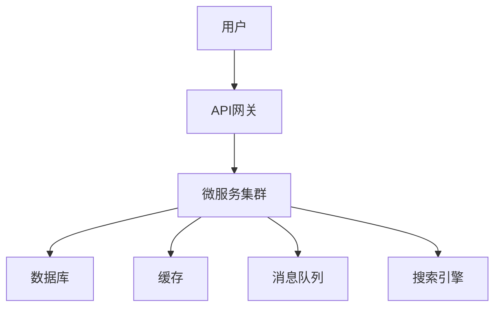

## 1. 背景介绍

### 1.1 电影网站的兴起与发展

互联网的普及和流媒体技术的进步，推动了电影网站的兴起和蓬勃发展。从早期的盗版下载网站，到如今正规的在线流媒体平台，电影网站已经成为人们观看电影的重要途径。

### 1.2 电影网站的功能需求

现代电影网站需要满足用户多样化的需求，包括：

* **海量电影资源:** 提供丰富的电影库，涵盖各种类型、年代和地区的影片。
* **便捷的搜索和筛选:** 允许用户根据关键词、演员、导演、类型等条件快速找到目标影片。
* **高质量的播放体验:** 提供流畅、高清的视频播放，支持多种清晰度选择和字幕功能。
* **个性化推荐:** 根据用户的观影历史和偏好，推荐可能感兴趣的影片。
* **用户互动:** 支持用户评分、评论、收藏等功能，增强用户参与感。

### 1.3 技术挑战

构建一个功能完善、性能优越的电影网站面临着诸多技术挑战：

* **海量数据存储和管理:**  如何高效存储和管理庞大的电影数据，包括影片信息、海报、剧照、预告片等。
* **高并发访问:** 如何应对大量用户同时访问网站，保证系统稳定性和响应速度。
* **内容安全和版权保护:** 如何有效防止盗版和非法内容传播，保护版权方的合法权益。
* **个性化推荐算法:** 如何根据用户行为数据，精准推荐用户感兴趣的影片。
* **用户体验优化:** 如何提升网站易用性和用户体验，吸引用户持续访问。

## 2. 核心概念与联系

### 2.1 系统架构设计

为了应对上述技术挑战，电影网站通常采用多层架构设计，将系统划分为不同的模块，各模块之间相互协作，共同完成网站的各项功能。



* **用户:** 网站的最终使用者。
* **API网关:** 负责接收用户请求，进行身份验证、流量控制、路由转发等操作。
* **微服务集群:**  将网站的各项功能拆分为多个独立的服务，例如用户服务、影片服务、推荐服务等，每个服务负责处理特定的业务逻辑。
* **数据库:** 存储网站的核心数据，例如用户信息、影片信息、评分数据等。
* **缓存:**  将 frequently accessed data 存储在内存中，加速数据读取速度，减轻数据库压力。
* **消息队列:**  用于异步处理任务，例如发送邮件、更新搜索索引等，提高系统响应速度。
* **搜索引擎:**  提供影片搜索功能，根据用户关键词快速检索相关影片。

### 2.2 核心技术组件

* **Web框架:**  用于构建网站前端页面和后端API接口，例如 Django、Flask、Spring Boot 等。
* **数据库:**  用于存储网站数据，例如 MySQL、PostgreSQL、MongoDB 等。
* **缓存:**  用于缓存 frequently accessed data，例如 Redis、Memcached 等。
* **消息队列:**  用于异步处理任务，例如 RabbitMQ、Kafka 等。
* **搜索引擎:**  用于提供影片搜索功能，例如 Elasticsearch、Solr 等。
* **云计算平台:**  提供服务器、存储、网络等基础设施，例如 AWS、Azure、阿里云 等。
* **CDN:**  加速网站静态资源的加载速度，例如 Cloudflare、七牛云 等。

## 3. 核心算法原理具体操作步骤

### 3.1 电影推荐算法

电影推荐算法是电影网站的核心功能之一，其目标是根据用户的观影历史和偏好，精准推荐用户感兴趣的影片。常用的电影推荐算法包括：

* **协同过滤算法:**  根据用户对影片的评分数据，计算用户之间的相似度，然后将相似用户喜欢的影片推荐给目标用户。
* **基于内容的推荐算法:**  根据影片的特征信息，例如类型、演员、导演等，计算影片之间的相似度，然后将与用户已观看影片相似的影片推荐给用户。
* **混合推荐算法:**  结合协同过滤算法和基于内容的推荐算法，提高推荐精度。

#### 3.1.1 协同过滤算法

1. **构建用户-影片评分矩阵:**  将用户对影片的评分数据整理成一个矩阵，其中行代表用户，列代表影片，矩阵元素表示用户对影片的评分。
2. **计算用户相似度:**  使用余弦相似度、皮尔逊相关系数等方法计算用户之间的相似度。
3. **找到相似用户:**  根据用户相似度，找到与目标用户最相似的 k 个用户。
4. **生成推荐列表:**  将相似用户喜欢的且目标用户未观看的影片推荐给目标用户。

#### 3.1.2 基于内容的推荐算法

1. **提取影片特征:**  从影片信息中提取特征，例如类型、演员、导演、关键词等。
2. **计算影片相似度:**  使用余弦相似度、Jaccard 相似度等方法计算影片之间的相似度。
3. **找到相似影片:**  根据影片相似度，找到与用户已观看影片最相似的 k 个影片。
4. **生成推荐列表:**  将相似影片推荐给用户。

### 3.2 搜索引擎工作原理

搜索引擎是电影网站的另一个重要功能，其目标是根据用户关键词快速检索相关影片。搜索引擎的工作原理如下：

1. **爬取网页:**  搜索引擎会定期爬取互联网上的网页，收集网页内容。
2. **建立索引:**  将爬取到的网页内容进行分析，提取关键词，建立索引数据库。
3. **处理查询:**  当用户输入关键词进行搜索时，搜索引擎会根据索引数据库快速检索相关网页。
4. **排序结果:**  根据网页的相关性、权威性等因素对检索结果进行排序，将最符合用户需求的网页排在前面。

## 4. 数学模型和公式详细讲解举例说明

### 4.1 余弦相似度

余弦相似度是一种常用的计算两个向量之间相似度的方法，其公式如下：

$$
similarity(A,B) = \frac{A \cdot B}{||A|| ||B||} = \frac{\sum_{i=1}^{n} A_i B_i}{\sqrt{\sum_{i=1}^{n} A_i^2} \sqrt{\sum_{i=1}^{n} B_i^2}}
$$

其中：

* A 和 B 分别表示两个向量。
* $A_i$ 和 $B_i$ 分别表示向量 A 和 B 的第 i 个元素。
* n 表示向量的维度。

**举例说明:**

假设有两个用户 A 和 B，他们对三部电影的评分如下：

| 用户 | 电影 1 | 电影 2 | 电影 3 |
|---|---|---|---|
| A | 5 | 3 | 4 |
| B | 4 | 5 | 3 |

则用户 A 和 B 的评分向量分别为：

$$
A = [5, 3, 4]
$$

$$
B = [4, 5, 3]
$$

计算用户 A 和 B 之间的余弦相似度：

$$
similarity(A,B) = \frac{5 \times 4 + 3 \times 5 + 4 \times 3}{\sqrt{5^2 + 3^2 + 4^2} \sqrt{4^2 + 5^2 + 3^2}} \approx 0.866
$$

余弦相似度的取值范围为 [-1, 1]，值越大表示两个向量越相似。

### 4.2 TF-IDF 算法

TF-IDF 算法是一种常用的文本信息检索算法，其目标是评估一个词对于一个文档集或语料库中的重要程度。TF-IDF 值越高，表示该词在文档中的重要程度越高。

TF-IDF 算法的公式如下：

$$
TF-IDF(t, d, D) = TF(t,d) \times IDF(t,D)
$$

其中：

* t 表示目标词。
* d 表示目标文档。
* D 表示文档集。
* TF(t,d) 表示词 t 在文档 d 中的词频。
* IDF(t,D) 表示词 t 的逆文档频率，其计算公式如下：

$$
IDF(t,D) = log \frac{|D|}{1 + |\{d \in D: t \in d\}|}
$$

其中：

* |D| 表示文档集 D 中的文档总数。
* |{d ∈ D: t ∈ d}| 表示包含词 t 的文档数量。

**举例说明:**

假设有一个文档集 D，包含三个文档：

* 文档 1: "我喜欢看电影"
* 文档 2: "我喜欢看电视剧"
* 文档 3: "我喜欢看动画片"

目标词为 "电影"，目标文档为文档 1，则：

* TF("电影", 文档 1) = 1/5 = 0.2
* IDF("电影", D) = log(3/(1+1)) = log(1.5) ≈ 0.176

因此，"电影" 在文档 1 中的 TF-IDF 值为：

$$
TF-IDF("电影", 文档 1, D) = 0.2 \times 0.176 ≈ 0.0352
$$

## 5. 项目实践：代码实例和详细解释说明

### 5.1 Python Flask 后端API开发

```python
from flask import Flask, jsonify

app = Flask(__name__)

# 定义电影数据
movies = [
    {'id': 1, 'title': '肖申克的救赎', 'genre': '剧情', 'rating': 9.3},
    {'id': 2, 'title': '霸王别姬', 'genre': '剧情', 'rating': 9.6},
    {'id': 3, 'title': '阿甘正传', 'genre': '剧情', 'rating': 9.5},
]

# 获取所有电影
@app.route('/movies', methods=['GET'])
def get_movies():
    return jsonify(movies)

# 获取指定id的电影
@app.route('/movies/<int:movie_id>', methods=['GET'])
def get_movie(movie_id):
    movie = next((m for m in movies if m['id'] == movie_id), None)
    if movie:
        return jsonify(movie)
    else:
        return jsonify({'error': 'Movie not found'}), 404

if __name__ == '__main__':
    app.run(debug=True)
```

**代码解释:**

* 使用 Flask 框架创建 Web 应用。
* 定义电影数据列表，包含电影的 id、标题、类型和评分。
* 创建两个 API 接口：
    * `/movies`：获取所有电影数据。
    * `/movies/<int:movie_id>`：获取指定 id 的电影数据。
* 使用 `jsonify()` 函数将数据转换为 JSON 格式返回给客户端。

### 5.2 React 前端页面开发

```javascript
import React, { useState, useEffect } from 'react';

function App() {
  const [movies, setMovies] = useState([]);

  useEffect(() => {
    fetch('/movies')
      .then(res => res.json())
      .then(data => setMovies(data));
  }, []);

  return (
    <div>
      <h1>电影列表</h1>
      <ul>
        {movies.map(movie => (
          <li key={movie.id}>
            {movie.title} ({movie.genre}) - {movie.rating}
          </li>
        ))}
      </ul>
    </div>
  );
}

export default App;
```

**代码解释:**

* 使用 React 框架创建前端页面。
* 使用 `useState()` 钩子定义组件状态，存储电影数据。
* 使用 `useEffect()` 钩子在组件加载时获取电影数据。
* 使用 `fetch()` 函数发送 HTTP 请求获取电影数据。
* 使用 `map()` 方法遍历电影数据，渲染电影列表。

## 6. 实际应用场景

### 6.1 在线电影租赁平台

Netflix、Amazon Prime Video 等在线电影租赁平台是电影网站的典型应用场景。这些平台提供海量的电影资源，用户可以付费订阅观看电影。

### 6.2 电影资讯网站

豆瓣电影、时光网等电影资讯网站提供最新的电影资讯、影评、评分等信息，帮助用户了解电影动态。

### 6.3 影视制作公司网站

华谊兄弟、光线传媒等影视制作公司网站展示公司出品的电影作品，宣传公司形象。

## 7. 总结：未来发展趋势与挑战

### 7.1 未来发展趋势

* **个性化推荐:**  随着人工智能技术的不断发展，电影推荐算法将会更加智能化，能够更加精准地预测用户的观影偏好。
* **VR/AR体验:**  VR/AR技术将为用户带来更加 immersive 的观影体验，例如虚拟影院、360 度全景电影等。
* **区块链技术:**  区块链技术可以用于保护电影版权，防止盗版，并建立更加透明的电影发行和收益分配机制。

### 7.2 面临的挑战

* **内容安全:**  如何有效防止盗版和非法内容传播，保护版权方的合法权益，仍然是电影网站面临的重要挑战。
* **数据隐私:**  随着用户数据越来越重要，如何保护用户数据隐私，防止数据泄露，也是电影网站需要重视的问题。
* **技术竞争:**  随着互联网技术的不断发展，电影网站需要不断提升技术水平，才能在激烈的市场竞争中立于不败之地。

## 8. 附录：常见问题与解答

### 8.1 如何提高电影推荐的精度？

提高电影推荐精度的方法包括：

* **收集更多用户数据:**  更多用户数据可以帮助算法更好地学习用户偏好。
* **使用更 sophisticated 的推荐算法:**  例如深度学习、强化学习等算法可以提高推荐精度。
* **结合多种推荐算法:**  将不同类型的推荐算法结合起来，可以提高推荐的全面性和准确性。

### 8.2 如何防止电影网站被攻击？

防止电影网站被攻击的方法包括：

* **使用安全的 Web 框架:**  选择安全可靠的 Web 框架，例如 Django、Flask、Spring Boot 等。
* **定期更新软件版本:**  及时更新软件版本，修复安全漏洞。
* **使用防火墙:**  使用防火墙拦截恶意攻击。
* **进行安全测试:**  定期进行安全测试，发现并修复安全漏洞。

### 8.3 如何提高电影网站的加载速度？

提高电影网站加载速度的方法包括：

* **使用 CDN:**  CDN 可以加速网站静态资源的加载速度。
* **优化图片尺寸:**  优化图片尺寸可以减少图片加载时间。
* **压缩代码:**  压缩代码可以减少网页大小，提高加载速度。
* **使用缓存:**  缓存可以将 frequently accessed data 存储在内存中，加速数据读取速度。
