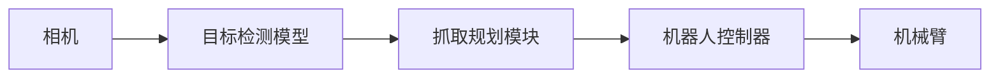

## 1. 背景介绍

### 1.1 机器人视觉：赋予机器感知世界的能力

机器人视觉作为机器人感知环境、理解环境的重要手段，近年来随着深度学习技术的蓬勃发展取得了显著的进展。它利用计算机视觉技术，从图像和视频数据中提取有价值的信息，为机器人在复杂环境中的自主导航、目标识别、抓取操作等提供了关键的技术支撑。

### 1.2 目标检测：机器人视觉的核心任务之一

目标检测作为计算机视觉领域的核心任务之一，旨在从图像或视频中识别出特定类别的物体，并确定其位置和大小。在机器人视觉中，目标检测技术扮演着至关重要的角色，其应用场景包括但不限于：

* **物体识别与定位：** 机器人可以通过目标检测识别环境中的物体，例如识别工具、零件、障碍物等，并确定其在三维空间中的位置，为后续的抓取、避障等操作提供依据。
* **场景理解：** 通过识别场景中的不同物体及其之间的关系，机器人可以更全面地理解周围环境，例如判断当前房间的功能、识别潜在的危险区域等。
* **人机交互：** 目标检测可以帮助机器人识别和跟踪人，理解人的行为和意图，从而实现更自然、更智能的人机交互。

### 1.3 本文目标：深度解析目标检测在机器人视觉中的应用与实现

本文将深入探讨目标检测技术在机器人视觉中的应用与实现，从目标检测的基本概念、算法原理、代码实例到实际应用场景，为读者呈现一个全面而深入的解读。

## 2. 核心概念与联系

### 2.1 目标检测的基本概念

* **目标：** 指的是图像或视频中需要被识别和定位的物体，例如人、车辆、交通标志等。
* **类别：** 指的是目标所属的预定义类别，例如人、狗、猫等。
* **边界框：** 指的是一个矩形框，用于框选出目标在图像中的位置，通常由左上角坐标和右下角坐标来表示。
* **置信度：** 指的是模型对检测结果的自信程度，通常是一个介于0到1之间的数值，数值越大表示模型对结果越自信。

### 2.2 常见的目标检测算法

目标检测算法可以大致分为两类：

* **基于传统图像处理的方法：**  这类方法通常依赖于手工设计的特征，例如 HOG、SIFT 等，并结合机器学习算法，例如 SVM、Adaboost 等进行分类和定位。这类方法在计算效率上有一定优势，但在处理复杂场景和遮挡问题时效果有限。
* **基于深度学习的方法：**  这类方法利用深度神经网络自动学习图像特征，并直接输出目标的类别和位置信息。近年来，基于深度学习的目标检测算法取得了突破性的进展，涌现出许多优秀的算法，例如 R-CNN 系列、YOLO 系列、SSD 等。

### 2.3 目标检测与其他计算机视觉任务的联系

目标检测与其他计算机视觉任务，例如图像分类、目标跟踪、语义分割等有着密切的联系：

* **图像分类：** 可以看作是目标检测的特例，即只识别图像中是否存在目标，而不关心其位置和大小。
* **目标跟踪：**  是在视频序列中跟踪目标的运动轨迹，通常需要先进行目标检测，然后根据目标的运动状态进行预测和更新。
* **语义分割：**  是对图像中的每个像素进行分类，例如将道路、车辆、行人等不同类别区分开来，目标检测可以为语义分割提供更精细的物体边界信息。

## 3. 核心算法原理与操作步骤

### 3.1  基于深度学习的目标检测算法

近年来，基于深度学习的目标检测算法取得了显著的成果，其主要优势在于能够自动学习图像特征，并端到端地输出目标的类别和位置信息。下面以 YOLOv3 算法为例，介绍基于深度学习的目标检测算法的原理和操作步骤。

#### 3.1.1 YOLOv3 算法概述

YOLOv3 是一种快速、准确的目标检测算法，其核心思想是将目标检测问题转化为一个回归问题，直接预测目标的边界框和类别概率。

#### 3.1.2 YOLOv3 算法网络结构

YOLOv3 采用 Darknet-53 网络作为特征提取网络，该网络由一系列卷积层、残差块和上采样层组成，能够提取图像的多尺度特征。在特征提取网络之后，连接三个不同尺度的预测分支，分别负责预测不同大小的目标。

#### 3.1.3 YOLOv3 算法操作步骤

YOLOv3 算法的操作步骤如下：

1. **图像预处理：** 将输入图像 resize 到固定大小，并进行归一化处理。
2. **特征提取：** 将预处理后的图像输入 Darknet-53 网络，提取多尺度特征。
3. **目标预测：** 将提取到的特征送入三个预测分支，分别预测不同大小的目标的边界框、置信度和类别概率。
4. **非极大值抑制：** 对预测结果进行非极大值抑制 (NMS) 处理，去除冗余的边界框。
5. **输出结果：** 输出最终的目标检测结果，包括目标的类别、边界框和置信度。

### 3.2 代码实例

下面以 PyTorch 框架为例，展示如何使用 YOLOv3 模型进行目标检测。

```python
import torch
import torchvision

# 加载预训练的 YOLOv3 模型
model = torchvision.models.detection.yolov3(pretrained=True)

# 设置模型为评估模式
model.eval()

# 加载测试图像
image = Image.open('test.jpg')

# 将图像转换为模型输入格式
input_tensor = torchvision.transforms.ToTensor()(image)
input_tensor = input_tensor.unsqueeze(0)

# 模型推理
with torch.no_grad():
    output = model(input_tensor)

# 解析模型输出结果
boxes = output[0]['boxes']
labels = output[0]['labels']
scores = output[0]['scores']

# 打印检测结果
for i in range(len(boxes)):
    if scores[i] > 0.5:
        print(f"类别: {labels[i]}, 置信度: {scores[i]}, 边界框: {boxes[i]}")
```

### 3.3  目标检测算法的评价指标

目标检测算法的评价指标主要包括：

* **精确率 (Precision)：**  表示预测为正例的样本中真正例的比例。
* **召回率 (Recall)：** 表示所有正例样本中被正确预测为正例的比例。
* **平均精度均值 (mAP)：**  是目标检测算法最常用的评价指标，它综合考虑了模型的精确率和召回率，能够更全面地反映模型的性能。

## 4. 数学模型和公式详细讲解举例说明

### 4.1  边界框回归

目标检测算法需要预测目标的边界框，通常使用四个参数来表示边界框：

* $x$:  边界框中心点的 x 坐标
* $y$:  边界框中心点的 y 坐标
* $w$:  边界框的宽度
* $h$:  边界框的高度

在训练过程中，通常使用预测框与真实框之间的 IoU (Intersection over Union) 损失函数来监督模型学习边界框的回归。

**IoU 损失函数:**

$$
IoU = \frac{预测框与真实框的交集面积}{预测框与真实框的并集面积}
$$

### 4.2  非极大值抑制 (NMS)

非极大值抑制 (NMS) 是一种常用的后处理方法，用于去除目标检测结果中冗余的边界框。其基本思想是：对于同一个目标，只保留置信度最高的边界框，而抑制其他与其重叠度较高的边界框。

**NMS 算法步骤:**

1. 按照置信度得分对所有边界框进行降序排序。
2. 选择置信度最高的边界框，并将其添加到最终结果集中。
3. 计算该边界框与剩余所有边界框的 IoU 值。
4. 删除 IoU 值大于设定阈值的边界框。
5. 重复步骤 2-4，直到所有边界框都被处理完毕。

## 5. 项目实践：代码实例和详细解释说明

### 5.1 基于目标检测的机器人抓取

本节将介绍如何使用目标检测技术实现机器人抓取。

#### 5.1.1 系统架构

系统架构如下图所示：



#### 5.1.2 代码实现

```python
# 导入必要的库
import cv2
import numpy as np
from robotiq_gripper import RobotiqGripper

# 初始化机械臂和夹爪
robot = YourRobotArm()
gripper = RobotiqGripper()

# 加载目标检测模型
model = torch.hub.load('ultralytics/yolov5', 'yolov5s')

# 打开摄像头
cap = cv2.VideoCapture(0)

while True:
    # 读取摄像头画面
    ret, frame = cap.read()

    # 进行目标检测
    results = model(frame)

    # 获取检测结果
    detections = results.pandas().xyxy[0]

    # 找到置信度最高的物体
    target = detections[detections['confidence'] == detections['confidence'].max()]

    if not target.empty:
        # 获取目标物体的边界框
        xmin, ymin, xmax, ymax = target[['xmin', 'ymin', 'xmax', 'ymax']].values[0]

        # 计算目标物体中心点坐标
        x_center = int((xmin + xmax) / 2)
        y_center = int((ymin + ymax) / 2)

        # 控制机械臂移动到目标物体上方
        robot.move_to(x_center, y_center, z_offset)

        # 控制夹爪抓取目标物体
        gripper.activate_grip()

        # 将目标物体移动到指定位置
        robot.move_to(target_x, target_y, target_z)

        # 控制夹爪松开目标物体
        gripper.deactivate_grip()

    # 显示画面
    cv2.imshow('Object Detection and Grasping', frame)

    # 按下 'q' 键退出程序
    if cv2.waitKey(1) & 0xFF == ord('q'):
        break

# 释放资源
cap.release()
cv2.destroyAllWindows()
```

## 6. 实际应用场景

### 6.1 工业自动化

* **缺陷检测：**  利用目标检测技术，可以自动识别产品表面的缺陷，例如划痕、污渍、裂纹等，提高产品质量检测效率。
* **零件分拣：**  机器人可以根据目标检测结果，识别不同类型的零件，并将其分拣到指定的容器中，实现自动化生产线。
* **码垛搬运：**  机器人可以识别不同形状、大小的货物，并将其按照预定顺序进行码垛或搬运，提高物流效率。

### 6.2  服务机器人

* **物体识别与抓取：**  服务机器人可以识别日常生活中的各种物体，例如水杯、手机、遥控器等，并将其抓取递给用户，提供更便捷的生活服务。
* **环境感知与导航：**  服务机器人可以通过目标检测识别环境中的障碍物、道路等，实现自主导航和避障。
* **人机交互：**  服务机器人可以识别用户的人脸、手势等，实现更自然、更智能的人机交互。

### 6.3  自动驾驶

* **车辆检测：**  自动驾驶系统需要实时检测周围的车辆，例如轿车、卡车、摩托车等，并预测其运动轨迹，以做出安全的驾驶决策。
* **行人检测：**  自动驾驶系统需要识别道路上的行人，并预测其运动轨迹，以避免交通事故的发生。
* **交通标志识别：**  自动驾驶系统需要识别道路上的交通标志，例如限速标志、停车标志等，并遵守交通规则。


## 7. 工具和资源推荐

### 7.1  深度学习框架

* **TensorFlow:**  由 Google 开发的开源机器学习平台，提供了丰富的 API 和工具，方便开发者构建和部署机器学习模型。
* **PyTorch:**  由 Facebook 开发的开源机器学习框架，以其灵活性和易用性著称，被广泛应用于学术界和工业界。

### 7.2  目标检测数据集

* **COCO (Common Objects in Context):**  一个大型的图像识别、分割和目标检测数据集，包含超过 33 万张图像和 150 万个物体实例。
* **PASCAL VOC (Visual Object Classes):**  一个经典的目标检测数据集，包含 20 个类别的物体，被广泛用于目标检测算法的评估。

### 7.3  目标检测模型库

* **Detectron2:**  由 Facebook AI Research 开发的目标检测平台，提供了各种最先进的目标检测算法的实现，例如 Mask R-CNN、Faster R-CNN 等。
* **MMDetection:**  由 OpenMMLab 开发的目标检测工具箱，提供了丰富的目标检测算法和模型，并支持多种深度学习框架。


## 8. 总结：未来发展趋势与挑战

### 8.1 未来发展趋势

* **更高效的模型架构：**  随着移动设备和嵌入式系统的普及，对目标检测模型的效率提出了更高的要求，未来将涌现更多轻量级的、高效的目标检测模型。
* **更鲁棒的算法：**  现实世界中的场景复杂多变，例如光照变化、遮挡、视角变化等，未来目标检测算法需要具备更强的鲁棒性，以应对各种挑战。
* **多模态融合：**  将视觉信息与其他传感器数据，例如激光雷达、毫米波雷达等进行融合，可以提供更全面、更准确的环境感知能力，未来多模态目标检测将成为一个重要的发展方向。

### 8.2 面临的挑战

* **数据标注成本高：**  训练高性能的目标检测模型需要大量的标注数据，而数据标注成本高昂，制约了目标检测技术的应用。
* **模型泛化能力有限：**  当前的目标检测模型在训练数据集上表现良好，但在面对新的场景和新的物体类别时，泛化能力有限。
* **实时性要求高：**  在自动驾驶、机器人等应用场景中，目标检测需要实时进行，这对算法的效率提出了很高的要求。

## 9. 附录：常见问题与解答

### 9.1  如何选择合适的目标检测算法？

选择目标检测算法需要考虑多个因素，例如：

* **准确率：**  不同的算法在不同的数据集上表现不同，需要根据具体的应用场景选择准确率较高的算法。
* **速度：**  不同的算法具有不同的计算复杂度，需要根据应用场景的实时性要求选择速度较快的算法。
* **模型大小：**  不同的算法具有不同的模型大小，需要根据部署平台的资源限制选择模型大小合适的算法。

### 9.2  如何提高目标检测模型的准确率？

提高目标检测模型的准确率可以从以下几个方面入手：

* **使用更多的数据：**  训练数据越多，模型的泛化能力越强，准确率越高。
* **使用更强大的模型：**  更深的网络结构、更复杂的模型通常能够学习到更丰富的特征，提高模型的准确率。
* **优化模型参数：**  通过调整学习率、优化器等参数，可以找到模型的最优解，提高模型的准确率。
* **数据增强：**  通过对训练数据进行随机旋转、缩放、裁剪等操作，可以扩充训练数据集，提高模型的泛化能力。

### 9.3  如何将目标检测模型部署到嵌入式设备？

将目标检测模型部署到嵌入式设备需要考虑以下几个方面：

* **模型压缩：**  嵌入式设备的计算资源有限，需要对模型进行压缩，例如剪枝、量化等，以减少模型的大小和计算量。
* **模型加速：**  可以使用硬件加速器，例如 GPU、NPU 等，来加速模型的推理速度。
* **软件优化：**  可以使用更高效的代码实现、优化内存访问等方式，来提高模型的运行效率。
