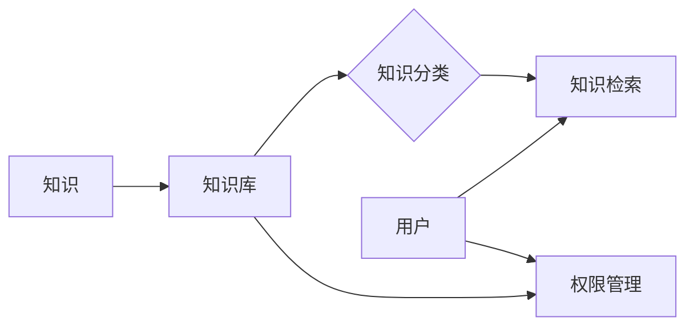

## 1. 背景介绍

### 1.1 知识管理与知识库的兴起

随着信息技术的飞速发展和互联网的普及，我们正处于一个信息爆炸的时代。海量的信息充斥着我们的生活，如何有效地管理和利用这些信息成为了一个亟待解决的问题。知识管理应运而生，其目的是将企业内部的隐性知识转化为显性知识，并将其存储、共享和应用，以提高企业的竞争力。

知识库作为知识管理的核心工具，近年来得到了越来越广泛的应用。它可以帮助企业：

* **提高知识的获取效率：**  员工可以通过知识库快速找到所需的信息，无需花费大量时间在搜索和咨询上。
* **促进知识的共享和传承：** 知识库可以将企业的经验和教训沉淀下来，避免知识的流失，并方便新员工学习。
* **提升企业的创新能力：**  知识库可以为员工提供丰富的知识资源，激发他们的创新思维。

### 1.2 知识库管理系统的需求分析

为了满足企业对知识管理的日益增长的需求，开发一个功能完善、易于使用、安全可靠的知识库管理系统至关重要。一个优秀的知识库管理系统应该具备以下特点：

* **强大的知识存储和管理能力：**  能够存储和管理各种类型的知识，包括文本、图片、视频、音频等。
* **灵活的知识分类和检索功能：**  支持多种分类方式和检索方式，方便用户快速找到所需的信息。
* **完善的权限管理机制：**  确保知识的安全性，防止未经授权的访问和修改。
* **友好的用户界面：**  操作简单易懂，即使是非专业人士也能轻松使用。
* **良好的扩展性和可维护性：**  能够随着企业的发展不断扩展功能，并易于维护和升级。

## 2. 核心概念与联系

### 2.1 知识库管理系统的核心概念

* **知识：**  指经过加工、整理和提炼后的信息，具有可重用性和可共享性。
* **知识库：**  用于存储和管理知识的数据库。
* **知识分类：**  将知识按照一定的规则进行分类，方便用户查找和管理。
* **知识检索：**  根据用户的需求，从知识库中查找相关知识。
* **权限管理：**  控制用户对知识的访问和操作权限。
* **用户：**  使用知识库管理系统的个人或组织。

### 2.2 核心概念之间的联系

下图展示了知识库管理系统中各个核心概念之间的联系：



## 3. 核心算法原理具体操作步骤

### 3.1 知识检索算法

知识检索是知识库管理系统的核心功能之一，其目的是根据用户的查询条件，从知识库中快速准确地找到相关知识。常用的知识检索算法包括：

* **全文检索：**  将知识库中的所有文本内容进行索引，用户输入关键词后，系统会返回包含该关键词的所有文档。
* **语义检索：**  分析用户查询语句的语义，并将其与知识库中的知识进行匹配，返回语义相关的知识。
* **基于机器学习的检索：**  利用机器学习算法，根据用户的历史查询记录和反馈，不断优化检索结果。

### 3.2 知识分类算法

知识分类是将知识按照一定的规则进行分类，方便用户查找和管理。常用的知识分类算法包括：

* **基于规则的分类：**  根据预先定义的规则，将知识划分到不同的类别中。
* **基于统计的分类：**  根据知识的统计特征，将知识划分到不同的类别中。
* **基于机器学习的分类：**  利用机器学习算法，根据知识的内容和特征，自动将知识划分到不同的类别中。

### 3.3 权限管理机制

权限管理机制是确保知识安全的重要手段，它可以控制用户对知识的访问和操作权限。常用的权限管理模型包括：

* **RBAC（Role-Based Access Control）：**  基于角色的访问控制，根据用户的角色分配不同的权限。
* **ABAC（Attribute-Based Access Control）：**  基于属性的访问控制，根据用户的属性（例如部门、职位等）分配不同的权限。

## 4. 数学模型和公式详细讲解举例说明

### 4.1 TF-IDF算法

TF-IDF（Term Frequency-Inverse Document Frequency）是一种常用的文本挖掘算法，用于评估一个词语对于一个文档集或语料库中的其中一份文档的重要程度。字词的重要性随着它在文件中出现的次数成正比增加，但同时会随着它在语料库中出现的频率成反比下降。

TF-IDF算法的公式如下：

$$
TF-IDF(t, d, D) = TF(t, d) \times IDF(t, D)
$$

其中：

* $TF(t, d)$ 表示词语 $t$ 在文档 $d$ 中出现的频率。
* $IDF(t, D)$ 表示词语 $t$ 在文档集 $D$ 中的逆文档频率，计算公式如下：

$$
IDF(t, D) = \log \frac{|D|}{|\{d \in D : t \in d\}|}
$$

其中：

* $|D|$ 表示文档集 $D$ 中的文档总数。
* $|\{d \in D : t \in d\}|$ 表示包含词语 $t$ 的文档数量。

**举例说明：**

假设我们有一个包含以下三个文档的文档集：

* 文档1：我喜欢吃苹果。
* 文档2：我喜欢吃香蕉。
* 文档3：我喜欢吃苹果和香蕉。

现在我们要计算词语“苹果”在文档1中的TF-IDF值。

首先计算词语“苹果”在文档1中的词频：

$$
TF("苹果", 文档1) = 1 / 4 = 0.25
$$

然后计算词语“苹果”在文档集中的逆文档频率：

$$
IDF("苹果", 文档集) = \log \frac{3}{2} \approx 0.405
$$

最后计算词语“苹果”在文档1中的TF-IDF值：

$$
TF-IDF("苹果", 文档1, 文档集) = 0.25 \times 0.405 \approx 0.101
$$

### 4.2 余弦相似度

余弦相似度是一种常用的文本相似度计算方法，它将两段文本表示成向量，并计算这两个向量之间的夹角余弦值。余弦值越大，表示两段文本越相似。

余弦相似度的计算公式如下：

$$
similarity(A, B) = \cos(\theta) = \frac{A \cdot B}{||A|| ||B||} = \frac{\sum_{i=1}^{n} A_i \times B_i}{\sqrt{\sum_{i=1}^{n} A_i^2} \times \sqrt{\sum_{i=1}^{n} B_i^2}}
$$

其中：

* $A$ 和 $B$ 分别表示两段文本的向量表示。
* $A_i$ 和 $B_i$ 分别表示向量 $A$ 和 $B$ 中的第 $i$ 个元素。
* $n$ 表示向量的维度。

**举例说明：**

假设我们有两段文本：

* 文本1：我喜欢吃苹果。
* 文本2：我喜欢吃香蕉。

我们可以将这两段文本表示成如下向量：

```
文本1 = [1, 1, 0]
文本2 = [1, 0, 1]
```

其中，向量的每个元素表示一个词语，元素的值表示该词语在文本中出现的次数。

计算这两段文本的余弦相似度：

$$
similarity(文本1, 文本2) = \frac{1 \times 1 + 1 \times 0 + 0 \times 1}{\sqrt{1^2 + 1^2 + 0^2} \times \sqrt{1^2 + 0^2 + 1^2}} = \frac{1}{\sqrt{2} \times \sqrt{2}} = 0.5
$$

## 5. 项目实践：代码实例和详细解释说明

### 5.1 Python Flask框架搭建知识库管理系统后端API

```python
from flask import Flask, request, jsonify
from flask_cors import CORS

app = Flask(__name__)
CORS(app)

# 模拟知识库数据
knowledge_base = [
    {"id": 1, "title": "Python基础教程", "content": "Python是一种解释型、面向对象、动态数据类型的高级程序设计语言。"},
    {"id": 2, "title": "Java基础教程", "content": "Java是一门面向对象的编程语言，不仅吸收了C++语言的各种优点，还摒弃了C++里难以理解的多继承、指针等概念，因此Java语言具有功能强大和简单易用两个特征。"},
    {"id": 3, "title": "机器学习入门", "content": "机器学习是一门多领域交叉学科，涉及概率论、统计学、逼近论、凸分析、算法复杂度理论等多门学科。"},
]

@app.route('/api/knowledge', methods=['GET'])
def get_knowledge():
    """获取知识列表"""
    return jsonify(knowledge_base)

@app.route('/api/knowledge/<int:knowledge_id>', methods=['GET'])
def get_knowledge_by_id(knowledge_id):
    """根据ID获取知识详情"""
    knowledge = next((item for item in knowledge_base if item["id"] == knowledge_id), None)
    if knowledge:
        return jsonify(knowledge)
    else:
        return jsonify({"message": "知识不存在"}), 404

if __name__ == '__main__':
    app.run(debug=True)
```

**代码解释：**

* 使用Flask框架创建了一个Web应用。
* 使用CORS扩展处理跨域请求。
* 创建了两个API接口：
    * `/api/knowledge`：获取知识列表。
    * `/api/knowledge/<int:knowledge_id>`：根据ID获取知识详情。
* 使用模拟数据模拟知识库。

### 5.2  React框架实现知识库管理系统前端页面

```jsx
import React, { useState, useEffect } from 'react';

function App() {
  const [knowledgeList, setKnowledgeList] = useState([]);

  useEffect(() => {
    fetch('/api/knowledge')
      .then(response => response.json())
      .then(data => setKnowledgeList(data));
  }, []);

  return (
    <div>
      <h1>知识库</h1>
      <ul>
        {knowledgeList.map(knowledge => (
          <li key={knowledge.id}>
            <h2>{knowledge.title}</h2>
            <p>{knowledge.content}</p>
          </li>
        ))}
      </ul>
    </div>
  );
}

export default App;
```

**代码解释：**

* 使用React框架创建了一个组件。
* 使用`useEffect`钩子函数在组件加载完成后获取知识列表数据。
* 使用`fetch` API发送网络请求。
* 将获取到的知识列表数据渲染到页面上。

## 6. 实际应用场景

知识库管理系统可以应用于各种场景，例如：

* **企业内部知识管理：**  将企业的规章制度、产品资料、技术文档等存储到知识库中，方便员工查阅和学习。
* **客户服务支持：**  将常见问题解答、产品使用指南等存储到知识库中，提高客服人员的效率。
* **在线教育平台：**  将课程资料、学习资源等存储到知识库中，方便学生学习和复习。
* **电子商务平台：**  将商品信息、购物指南等存储到知识库中，方便用户了解商品和购物流程。

## 7. 总结：未来发展趋势与挑战

### 7.1 未来发展趋势

* **智能化：**  利用人工智能技术，实现知识的自动分类、检索和推荐。
* **个性化：**  根据用户的兴趣和需求，提供个性化的知识服务。
* **社交化：**  将知识库与社交网络结合起来，促进知识的分享和交流。
* **移动化：**  开发移动端的知识库管理系统，方便用户随时随地访问知识。

### 7.2 面临的挑战

* **知识的质量控制：**  如何保证知识库中知识的准确性和可靠性。
* **知识的更新维护：**  如何及时更新和维护知识库中的知识。
* **用户的参与度：**  如何提高用户参与知识贡献和分享的积极性。
* **技术的快速发展：**  如何应对新技术带来的挑战，不断提升知识库管理系统的性能和功能。


## 8. 附录：常见问题与解答

### 8.1 如何选择合适的知识库管理系统？

选择合适的知识库管理系统需要考虑以下因素：

* **功能需求：**  不同的知识库管理系统提供的功能有所差异，需要根据企业的实际需求进行选择。
* **易用性：**  知识库管理系统应该易于使用，方便员工快速上手。
* **安全性：**  知识库管理系统应该具备完善的权限管理机制，确保知识的安全性。
* **成本：**  不同的知识库管理系统的价格差异较大，需要根据企业的预算进行选择。

### 8.2  如何提高知识库的利用率？

* **加强宣传推广：**  让员工了解知识库的作用和使用方法。
* **制定激励机制：**  鼓励员工积极贡献和分享知识。
* **优化用户体验：**  不断优化知识库的界面和功能，提高用户的使用体验。
* **定期更新维护：**  及时更新和维护知识库中的知识，确保知识的准确性和时效性。
