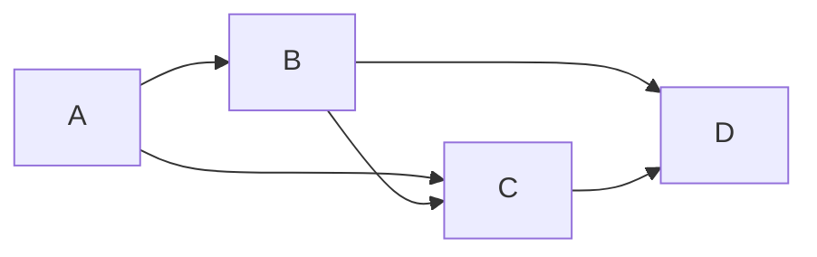

## 1. 背景介绍

### 1.1 社交网络的兴起与社区发现

近年来，随着互联网技术的飞速发展，社交网络已经成为人们日常生活中不可或缺的一部分。Facebook、Twitter、微信等社交平台连接了数十亿用户，形成了庞大的社交网络。在这些社交网络中，用户之间通过各种关系相互连接，形成了不同的社区结构。社区发现就是指在社交网络中识别这些社区结构的过程。

### 1.2 社区发现的意义

社区发现具有重要的意义，它可以帮助我们：

* 理解社交网络的结构和功能
* 发现潜在的用户群体和兴趣爱好
* 进行精准的广告投放和信息推荐
* 预测用户行为和趋势

### 1.3 社区发现的算法

社区发现的算法有很多种，包括：

* 基于图分割的算法
* 基于层次聚类的算法
* 基于模块度的算法
* 基于标签传播的算法

## 2. 核心概念与联系

### 2.1 社区

社区是指在社交网络中一群相互连接的用户，他们之间具有较高的相似性或联系紧密程度。

### 2.2 标签

标签是指用于标识社区的符号或标识符。

### 2.3 标签传播

标签传播是指将社区标签在网络中传播的过程，使得相似的用户拥有相同的标签。

### 2.4 标签传播算法

标签传播算法是一种基于标签传播的社区发现算法，它通过迭代的方式将标签在网络中传播，最终将网络中的用户划分到不同的社区中。

## 3. 核心算法原理具体操作步骤

### 3.1 初始化

在算法开始之前，需要对网络中的每个节点初始化一个唯一的标签。

### 3.2 标签传播

在每一轮迭代中，每个节点都会根据其邻居节点的标签更新自己的标签。具体来说，每个节点会统计其邻居节点中出现次数最多的标签，并将该标签作为自己的新标签。

### 3.3 终止条件

当网络中所有节点的标签不再发生变化时，算法终止。

### 3.4 社区划分

算法终止后，所有拥有相同标签的节点被划分到同一个社区中。

## 4. 数学模型和公式详细讲解举例说明

### 4.1 网络表示

社交网络可以用图 $G = (V, E)$ 来表示，其中 $V$ 表示节点集合，$E$ 表示边集合。

### 4.2 标签表示

每个节点 $v \in V$ 都有一个标签 $l(v)$。

### 4.3 标签更新公式

在每一轮迭代中，节点 $v$ 的标签更新公式为：

$$l(v) = \arg\max_{l} \sum_{u \in N(v)} \mathbb{I}(l(u) = l)$$

其中 $N(v)$ 表示节点 $v$ 的邻居节点集合，$\mathbb{I}(x)$ 是指示函数，当 $x$ 为真时，其值为 1，否则为 0。

### 4.4 举例说明

假设有一个社交网络，如下图所示：



初始时，每个节点的标签分别为 A、B、C、D。

在第一轮迭代中，节点 A 的邻居节点 B 和 C 的标签分别为 B 和 C，因此节点 A 的新标签为 B。

在第二轮迭代中，节点 B 的邻居节点 A、C 和 D 的标签分别为 B、C 和 D，因此节点 B 的新标签为 B。

以此类推，最终所有节点的标签都为 B，因此整个网络被划分到同一个社区中。

## 5. 项目实践：代码实例和详细解释说明

### 5.1 Python 代码实现

```python
import networkx as nx

def label_propagation(graph):
  """
  标签传播算法实现

  参数：
    graph: networkx 图对象

  返回值：
    communities: 社区划分结果，字典类型，键为社区标签，值为节点列表
  """

  # 初始化标签
  labels = {node: node for node in graph.nodes()}

  # 迭代传播标签
  while True:
    changed = False
    for node in graph.nodes():
      neighbor_labels = [labels[neighbor] for neighbor in graph.neighbors(node)]
      most_common_label = max(set(neighbor_labels), key=neighbor_labels.count)
      if labels[node] != most_common_label:
        labels[node] = most_common_label
        changed = True
    if not changed:
      break

  # 划分社区
  communities = {}
  for node, label in labels.items():
    if label not in communities:
      communities[label] = []
    communities[label].append(node)

  return communities


# 创建图对象
graph = nx.Graph()
graph.add_edges_from([(1, 2), (1, 3), (2, 3), (2, 4), (3, 4)])

# 执行标签传播算法
communities = label_propagation(graph)

# 打印社区划分结果
print(communities)
```

### 5.2 代码解释

* `networkx` 是一个用于创建、操作和研究复杂网络的 Python 包。
* `label_propagation` 函数实现了标签传播算法。
* `communities` 字典存储了社区划分结果，键为社区标签，值为节点列表。

## 6. 实际应用场景

### 6.1 社交网络分析

标签传播算法可以用于分析社交网络中的社区结构，例如：

* 识别社交网络中的用户群体
* 分析用户之间的关系和互动模式
* 预测用户行为和趋势

### 6.2 推荐系统

标签传播算法可以用于构建推荐系统，例如：

* 将用户划分到不同的兴趣社区
* 根据用户的社区标签推荐相关内容
* 提高推荐系统的精度和个性化程度

### 6.3 生物信息学

标签传播算法可以用于分析生物网络，例如：

* 识别蛋白质之间的相互作用关系
* 预测基因功能
* 发现疾病相关基因

## 7. 总结：未来发展趋势与挑战

### 7.1 未来发展趋势

* 发展更有效的标签传播算法，提高算法的效率和精度。
* 将标签传播算法应用到更广泛的领域，例如生物信息学、金融分析等。
* 结合其他算法和技术，例如深度学习、强化学习等，提高社区发现的性能。

### 7.2 挑战

* 处理大规模社交网络数据，提高算法的可扩展性。
* 应对社交网络的动态变化，提高算法的鲁棒性。
* 评估社区发现结果的质量，建立有效的评价指标。

## 8. 附录：常见问题与解答

### 8.1 标签传播算法的优缺点

**优点：**

* 简单易懂，易于实现。
* 效率高，适用于大规模网络。
* 对初始标签不敏感。

**缺点：**

* 可能陷入局部最优解。
* 对网络结构敏感。
* 难以处理重叠社区。

### 8.2 如何选择合适的标签传播算法

选择合适的标签传播算法需要考虑以下因素：

* 网络规模
* 网络结构
* 社区类型
* 算法效率
* 算法精度

### 8.3 如何评估社区发现结果

评估社区发现结果可以使用以下指标：

* 模块度
* 标准化互信息
* 调整兰德系数
