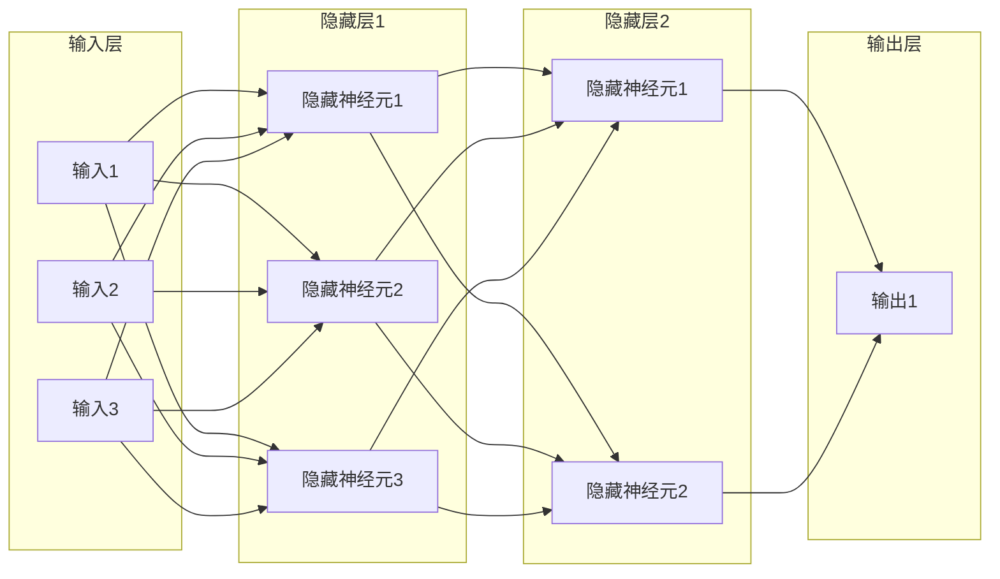

# 神经网络 (Neural Network)

作者：禅与计算机程序设计艺术

## 1. 背景介绍

### 1.1 人工智能与机器学习

人工智能 (Artificial Intelligence, AI) 的目标是使机器能够像人类一样思考和行动。机器学习 (Machine Learning, ML) 是实现人工智能的一种途径，它利用算法和统计模型使计算机系统能够从数据中学习，而无需进行明确的编程。

### 1.2  生物神经元与人工神经网络

神经网络 (Neural Network, NN) 是一种受生物神经系统启发而发展起来的机器学习模型。它由大量的人工神经元 (Artificial Neuron) 相互连接组成，这些神经元模拟了生物神经元的结构和功能。

### 1.3 神经网络发展历程

神经网络的发展经历了多个阶段，从早期的感知机 (Perceptron) 到多层感知机 (Multilayer Perceptron, MLP)，再到如今的深度学习 (Deep Learning) 模型，如卷积神经网络 (Convolutional Neural Network, CNN) 和循环神经网络 (Recurrent Neural Network, RNN)。

## 2. 核心概念与联系

### 2.1 人工神经元

人工神经元是神经网络的基本单元，它接收多个输入信号，对这些信号进行加权求和，并通过激活函数 (Activation Function) 进行非线性变换，最终产生一个输出信号。

#### 2.1.1 输入信号

输入信号可以是来自其他神经元的输出，也可以是来自外部环境的原始数据。

#### 2.1.2 权重

每个输入信号都与一个权重相关联，权重表示该输入信号对神经元输出的影响程度。

#### 2.1.3 加权求和

神经元将所有输入信号与其对应的权重相乘并求和，得到一个中间结果。

#### 2.1.4 激活函数

激活函数对中间结果进行非线性变换，引入非线性因素，增强神经网络的表达能力。常用的激活函数包括 Sigmoid 函数、ReLU 函数和 Tanh 函数等。

#### 2.1.5 输出信号

输出信号是经过激活函数处理后的结果，它可以作为其他神经元的输入，也可以作为整个神经网络的输出。

### 2.2 神经网络结构

神经网络通常由多个层级的神经元组成，包括输入层、隐藏层和输出层。

#### 2.2.1 输入层

输入层接收来自外部环境的原始数据，并将数据传递给下一层。

#### 2.2.2 隐藏层

隐藏层对输入数据进行非线性变换，提取数据的特征表示。

#### 2.2.3 输出层

输出层根据隐藏层的输出结果，产生最终的预测结果。

### 2.3 前向传播与反向传播

#### 2.3.1 前向传播

前向传播 (Forward Propagation) 是指信息从输入层传递到输出层的过程。

#### 2.3.2 反向传播

反向传播 (Backpropagation) 是指误差信号从输出层反向传递到输入层的过程，用于更新神经网络的权重参数。

## 3. 核心算法原理具体操作步骤

### 3.1 前向传播算法

1. 初始化输入层神经元的输出值为输入数据。
2. 对于每个隐藏层和输出层神经元，计算其加权求和结果。
3. 对加权求和结果应用激活函数，得到神经元的输出值。
4. 将输出层神经元的输出值作为神经网络的预测结果。

### 3.2 反向传播算法

1. 计算输出层神经元的误差信号。
2. 根据误差信号和激活函数的导数，计算隐藏层神经元的误差信号。
3. 根据误差信号和学习率，更新神经网络的权重参数。

## 4. 数学模型和公式详细讲解举例说明

### 4.1 神经元模型

单个神经元的数学模型可以表示为：

$$
y = f(\sum_{i=1}^{n} w_i x_i + b)
$$

其中：

* $y$ 表示神经元的输出值。
* $f(\cdot)$ 表示激活函数。
* $n$ 表示输入信号的数量。
* $x_i$ 表示第 $i$ 个输入信号。
* $w_i$ 表示第 $i$ 个输入信号对应的权重。
* $b$ 表示偏置项。

### 4.2 激活函数

#### 4.2.1 Sigmoid 函数

$$
\sigma(x) = \frac{1}{1 + e^{-x}}
$$

#### 4.2.2 ReLU 函数

$$
ReLU(x) = max(0, x)
$$

#### 4.2.3 Tanh 函数

$$
tanh(x) = \frac{e^x - e^{-x}}{e^x + e^{-x}}
$$

### 4.3 损失函数

损失函数 (Loss Function) 用于衡量神经网络的预测结果与真实值之间的差异。常用的损失函数包括均方误差 (Mean Squared Error, MSE) 和交叉熵 (Cross Entropy)。

#### 4.3.1 均方误差

$$
MSE = \frac{1}{N} \sum_{i=1}^{N} (y_i - \hat{y_i})^2
$$

#### 4.3.2 交叉熵

$$
CE = -\frac{1}{N} \sum_{i=1}^{N} [y_i \log(\hat{y_i}) + (1 - y_i) \log(1 - \hat{y_i})]
$$

### 4.4 梯度下降算法

梯度下降算法 (Gradient Descent) 用于寻找损失函数的最小值，从而更新神经网络的权重参数。

$$
w_i = w_i - \alpha \frac{\partial L}{\partial w_i}
$$

其中：

* $\alpha$ 表示学习率。
* $\frac{\partial L}{\partial w_i}$ 表示损失函数 $L$ 关于权重 $w_i$ 的偏导数。

## 5. 项目实践：代码实例和详细解释说明

### 5.1 使用 Python 实现简单神经网络

```python
import numpy as np

# 定义 sigmoid 函数
def sigmoid(x):
  return 1 / (1 + np.exp(-x))

# 定义神经网络类
class NeuralNetwork:
  def __init__(self, input_size, hidden_size, output_size):
    # 初始化权重和偏置
    self.W1 = np.random.randn(input_size, hidden_size)
    self.b1 = np.zeros((1, hidden_size))
    self.W2 = np.random.randn(hidden_size, output_size)
    self.b2 = np.zeros((1, output_size))

  def forward(self, X):
    # 前向传播
    self.z1 = np.dot(X, self.W1) + self.b1
    self.a1 = sigmoid(self.z1)
    self.z2 = np.dot(self.a1, self.W2) + self.b2
    self.a2 = sigmoid(self.z2)
    return self.a2

  def backward(self, X, y, learning_rate):
    # 反向传播
    output_error = y - self.a2
    output_delta = output_error * sigmoid(self.z2) * (1 - sigmoid(self.z2))

    hidden_error = np.dot(output_delta, self.W2.T)
    hidden_delta = hidden_error * sigmoid(self.z1) * (1 - sigmoid(self.z1))

    self.W2 += learning_rate * np.dot(self.a1.T, output_delta)
    self.b2 += learning_rate * np.sum(output_delta, axis=0, keepdims=True)
    self.W1 += learning_rate * np.dot(X.T, hidden_delta)
    self.b1 += learning_rate * np.sum(hidden_delta, axis=0)

# 创建神经网络实例
nn = NeuralNetwork(input_size=2, hidden_size=3, output_size=1)

# 生成训练数据
X = np.array([[0, 0], [0, 1], [1, 0], [1, 1]])
y = np.array([[0], [1], [1], [0]])

# 训练神经网络
epochs = 10000
learning_rate = 0.1
for i in range(epochs):
  nn.forward(X)
  nn.backward(X, y, learning_rate)

# 测试神经网络
print(nn.forward(X))
```

### 5.2 代码解释

* `sigmoid(x)` 函数实现了 sigmoid 激活函数。
* `NeuralNetwork` 类定义了神经网络的结构和功能。
  * `__init__` 方法初始化神经网络的权重和偏置。
  * `forward` 方法实现了前向传播算法。
  * `backward` 方法实现了反向传播算法。
* `nn = NeuralNetwork(input_size=2, hidden_size=3, output_size=1)` 创建了一个输入层大小为 2，隐藏层大小为 3，输出层大小为 1 的神经网络实例。
* `X` 和 `y` 分别表示训练数据和标签。
* `epochs`、`learning_rate` 分别表示训练轮数和学习率。
* `for i in range(epochs):...` 循环训练神经网络。
* `print(nn.forward(X))` 使用训练好的神经网络对训练数据进行预测，并打印预测结果。

## 6. 实际应用场景

神经网络在各个领域都有广泛的应用，包括：

* **图像识别**:  例如人脸识别、物体检测、图像分类等。
* **自然语言处理**: 例如机器翻译、文本生成、情感分析等。
* **语音识别**: 例如语音助手、语音搜索、语音输入法等。
* **推荐系统**: 例如电商网站的商品推荐、视频网站的电影推荐等。
* **金融**: 例如风险评估、欺诈检测、股票预测等。
* **医疗**: 例如疾病诊断、药物研发、基因分析等。

## 7. 工具和资源推荐

* **TensorFlow**: 由 Google 开发的开源机器学习平台，支持多种神经网络模型的构建和训练。
* **PyTorch**: 由 Facebook 开发的开源机器学习平台，以其灵活性和易用性著称。
* **Keras**: 构建在 TensorFlow 和 Theano 之上的高级神经网络 API，简化了神经网络模型的构建过程。
* **Scikit-learn**: Python 中常用的机器学习库，包含了多种机器学习算法的实现，也支持神经网络模型的构建和训练。

## 8. 总结：未来发展趋势与挑战

### 8.1 未来发展趋势

* **更深、更复杂的神经网络模型**:  随着计算能力的提升和数据的增多，神经网络模型的规模和复杂度将会不断提高。
* **神经网络的可解释性**:  目前神经网络模型的可解释性较差，未来需要发展新的技术来解释神经网络模型的决策过程。
* **神经网络的安全性**:  神经网络模型容易受到对抗样本的攻击，未来需要发展更安全的防御机制。
* **神经网络与其他技术的结合**:  例如神经网络与强化学习、迁移学习等技术的结合，将会推动人工智能技术的进一步发展。

### 8.2 面临的挑战

* **数据**:  训练大型神经网络模型需要大量的标注数据，数据的获取和标注成本高昂。
* **计算能力**:  训练大型神经网络模型需要强大的计算能力，这对硬件设备提出了很高的要求。
* **算法**:  神经网络模型的训练过程复杂，需要不断优化算法以提高效率和精度。
* **应用**:  将神经网络模型应用到实际场景中还需要解决很多工程化问题。

## 9. 附录：常见问题与解答

### 9.1 什么是激活函数？

激活函数是神经网络中非常重要的组成部分，它对神经元的加权求和结果进行非线性变换，引入非线性因素，增强神经网络的表达能力。

### 9.2 常见的激活函数有哪些？

常见的激活函数包括 Sigmoid 函数、ReLU 函数和 Tanh 函数等。

### 9.3 什么是损失函数？

损失函数用于衡量神经网络的预测结果与真实值之间的差异。

### 9.4 常见的损失函数有哪些？

常见的损失函数包括均方误差 (Mean Squared Error, MSE) 和交叉熵 (Cross Entropy)。

### 9.5 什么是梯度下降算法？

梯度下降算法用于寻找损失函数的最小值，从而更新神经网络的权重参数。

## 10.  神经网络架构图




